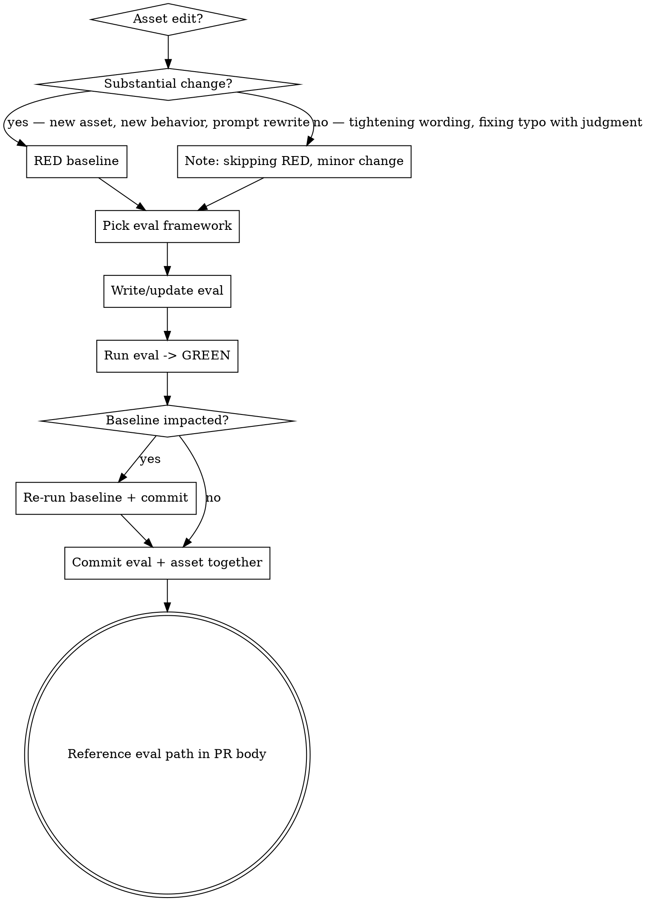

# Updating plugin assets

## Overview

Every plugin-asset change in `tesseract/` must ship with an executable eval that exercises the new or changed behavior. In-conversation GREEN dispatches are necessary but **not sufficient** — they don't survive into the repo and can't regression-test future changes. This skill is the procedural companion to the `Eval coverage — MANDATORY` policy in `CLAUDE.md`.

Authoritative reference: `shield/evals/README.md`.

## Related skills

**REQUIRED SUB-SKILL when editing a `SKILL.md`:** Use `superpowers:writing-skills` for skill-content quality (CSO, frontmatter, structure, pressure-test methodology). This skill and `writing-skills` are complementary, not alternatives — `writing-skills` covers *how to write a good skill*; this skill covers *how to ship the change in this repo*. Load both.

## When to use

Trigger this skill whenever you are about to write or edit:

- `**/skills/**/SKILL.md`
- `**/agents/*.md`
- `**/commands/*.md`
- `**/.mcp.json` or MCP server prompts under `*/server/`
- `**/hooks/*` and `**/scripts/*` that hooks invoke
- Skill-orchestrator wiring (the prompts a skill uses to dispatch subagents)
- Anything under `shield/evals/` (the eval system itself)

## When NOT to use

- Pure doc edits (README typo, comment rewording, link fix)
- Renames with no behavior change
- Dependency bumps with no prompt/behavior change

For these, state "no eval-shaped surface" in the PR body and proceed.

## Workflow

**Before step 1**: verify the asset actually exists at the path the user named and the section/symbol you intend to change is real. If the path or section name is wrong, surface the mismatch and ask — do not silently re-target. Following procedure on the wrong file is worse than not following procedure at all.

## Pick the eval framework

| Change shape | Framework | Where it lives |
|---|---|---|
| Focused agent/subagent/prompt with a captureable, gradeable output | **Snapshot** | `shield/evals/expected/<name>.yaml` + `shield/evals/results/<name>.txt`; run via `./shield/evals/run-evals.sh` |
| Skill orchestration where the signal is *what the subagent does*, not a static output | **End-to-end** | `shield/evals/<skill>/<NN>-<scenario>.md`; run via `./shield/evals/run-eval.sh <skill>` |
| Aggregate behavior across many dispatchers (distributions, counts) | **Custom merge-gate script** | `shield/evals/run-<area>-merge-gate.sh` writing JSON to `shield/evals/baselines/` |

If unsure, default to **end-to-end** for skills and **snapshot** for agents/specialists.

## RED → GREEN (pragmatic)

**RED is required** for:
- New skill, agent, command, or MCP prompt
- Substantive prompt or instruction rewrites (anything that changes what a subagent would do)
- Restructuring an existing skill's flow

**RED may be skipped** for:
- Tightening wording without changing semantics
- Adding/removing list items where the change is self-evident
- Renames, formatting, link fixes

When skipping RED, write one sentence in the commit body: `RED skipped: <why this can't change subagent behavior>`. If you cannot complete that sentence, RED is not actually skippable.

**GREEN is always required.** The committed eval must pass on the change.

## Definition of done

A plugin-change PR is done when **all** of these hold:

1. The eval file(s) exist and are committed in the same PR as the asset change.
2. The relevant eval(s) PASS locally (`./shield/evals/run-evals.sh` and/or `./shield/evals/run-eval.sh <folder>`).
3. If a baseline JSON in `shield/evals/baselines/` covers the affected area, the change does not regress it — re-run the producing script and commit the updated JSON, or note the intentional baseline update in the commit message.
4. The PR description references the eval(s) by path and links to the PASS output.
5. Version bumps in `.claude-plugin/marketplace.json` (and `pyproject.toml` if applicable) are in the same commit. **Do not** put a version in `plugin.json` for relative-path plugins.

## Common rationalizations

| Excuse | Reality |
|---|---|
| "I already GREEN-dispatched it in this conversation" | Not committed → not a regression check. Write the eval. |
| "The change is tiny" | If it changes a prompt or instruction, it can change subagent behavior. RED still helps; the eval is non-negotiable. |
| "I'll add the eval in a follow-up PR" | Follow-ups slip. Same PR or the change doesn't ship. |
| "Existing evals cover this area" | Only true if you can name one that *would catch a regression of this exact change*. If not, add one. |
| "It's just a wording tweak" | Then say so in the PR body and skip RED. The eval-required default still holds unless the change has no eval-shaped surface. |

## Red flags — STOP

- About to commit a change to `skills/`, `agents/`, `commands/`, `hooks/`, or `scripts/` with no touched file under `shield/evals/`.
- About to open a PR whose body doesn't reference an eval path.
- "I'll just iterate on it post-merge" — the merge gate that caught the 2026-05 `pm-restructure-v0` regression was 36 in-conversation dispatches that did not survive. Don't recreate that gap.
