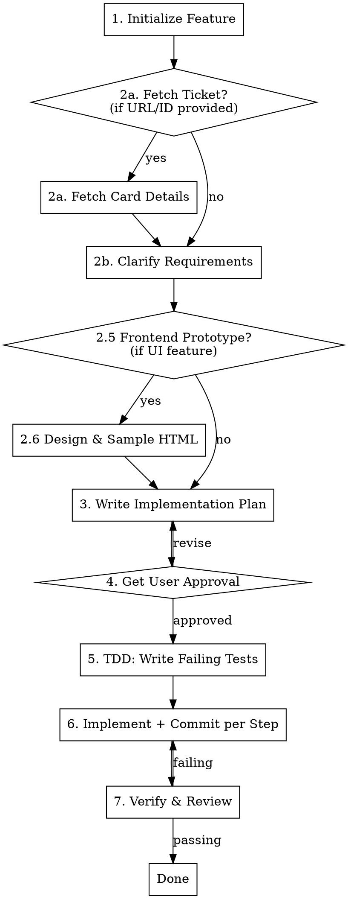

# Implement Feature

## Overview

Structured feature implementation workflow: optionally fetch context from a Jira/ClickUp ticket, gather requirements, optionally prototype frontend design, plan, write tests first, implement with parallel sub-agents committing after each step, and verify. All artifacts are tracked in a `feature/<name>/` directory.

## Input

The user provides one or more of:
- A description of the feature to build
- A Jira ticket URL or ID (e.g., `PROJ-123`, `https://team.atlassian.net/browse/PROJ-123`)
- A ClickUp task URL or ID (e.g., `https://app.clickup.com/t/abc123`)
- Context about their project, constraints, or where to save output

## When to Use

- User says "implement", "add", "build", or "create" a feature
- User provides a Jira or ClickUp ticket URL/ID to implement
- New functionality that needs requirements clarification
- Multi-step implementation that benefits from planning before coding
- Any work where TDD and sub-agents would improve quality and speed

**When NOT to use:**
- Bug fixes (use systematic-debugging instead)
- Single-line changes or trivial edits
- Pure research or exploration tasks
- Refactoring with no new behavior

## Workflow



## Phase 1: Initialize Feature

**Always checkout a new branch from main before starting work:**

```bash
git checkout main && git pull && git checkout -b feat/<feature-name>
```

Create the feature tracking directory:

```
feature/<feature-name>/
  requirements.md      # Captured from user Q&A
  plan.md              # Implementation steps
  sample.html          # Frontend prototype (UI features only)
```

Derive `<feature-name>` from the user's description. Use kebab-case (e.g., `per-component-versioning`, `auto-tag-releases`).

## Phase 2: Clarify Requirements

### Step A — Fetch ticket context (if provided)

If the user provided a Jira or ClickUp ticket URL or ID:

1. **Detect the platform** from the URL pattern:
   - Jira: `*.atlassian.net/browse/PROJ-123` or `PROJ-123`
   - ClickUp: `app.clickup.com/t/TASK_ID` or a ClickUp task ID
2. **Fetch card details** using the appropriate MCP tool or WebFetch:
   - **Jira:** Use `mcp__atlassian__jira_get_issue` if available, otherwise `WebFetch` the Jira REST API (`/rest/api/3/issue/PROJ-123`)
   - **ClickUp:** Use ClickUp MCP tools if available (e.g., `sprint_status`), otherwise `WebFetch` the ClickUp API (`/api/v2/task/TASK_ID`)
3. **Extract from the card:**
   - Title and description
   - Acceptance criteria (if present)
   - Priority and assignee
   - Subtasks or checklist items
   - Links to related cards, epics, or PRs
   - Comments with implementation hints
4. **Pre-populate `requirements.md`** with the extracted details — use the card content as the starting point, not a replacement for clarification

**If no ticket is provided, skip to Step B.**

### Step B — Ask clarifying questions

**ALWAYS ask questions before writing code**, even when a ticket was provided — tickets often have gaps. Use AskUserQuestion with 2-4 focused questions grouped by:

| Category | Example Questions |
|----------|-------------------|
| **Scope** | What exactly should this feature do? What's out of scope? |
| **Behavior** | What inputs/outputs? What happens on error? Edge cases? |
| **Integration** | What existing code/systems does this touch? |
| **Acceptance** | How do we know this is done? What does success look like? |

When a ticket was provided, **skip questions already answered by the card** and focus on:
- Ambiguities or gaps in the card description
- Technical decisions not covered (data model, API shape, error handling)
- Anything the codebase exploration reveals that contradicts the card

**Rules:**
- Ask only questions you can't answer by reading the codebase or the ticket
- Read relevant code BEFORE asking — don't ask what you can grep
- 2-4 questions max per round, 2 rounds max
- If the ticket + codebase provide enough detail, skip to Phase 3

### Step C — Write requirements

Write to `feature/<feature-name>/requirements.md`:

```markdown
# Feature: <Name>

## Source
[Ticket URL if provided, otherwise "User request"]

## Description
[What this feature does — 1-2 sentences]

## Requirements
- [Bullet list of specific requirements from ticket + user answers]

## Out of Scope
- [What this feature does NOT do]

## Acceptance Criteria
- [ ] [Testable criteria — from ticket if available, refined with user input]
- [ ] [Testable criteria]
```

## Phase 2.5: Frontend Design Prototype (UI features only)

**Skip this phase if the feature has no user-facing UI.**

If the feature involves any frontend work (new pages, layouts, components, or visual redesign):

### Step A — Explore design direction

Use `superpowers:brainstorming` to ask ONE question at a time:
1. **What page / component** is being designed?
2. **Audience** — who is the primary user and what is the #1 action?
3. **Tone** — bold & modern / warm & professional / minimal / etc.

If a tone is uncertain, **generate 2-3 sample HTML variants** (one per option) so the user can compare visually before deciding. Save each as `sample-<option-name>.html` in the feature folder.

### Step B — Create `sample.html`

Use `frontend-design` skill to produce `feature/<feature-name>/sample.html`.

**The sample must:**
- Load the same CDN assets the real implementation will use (same CSS/JS versions)
- Reference the project's existing CSS variables and design tokens
- Mock all dynamic/server data with realistic dummy values
- Include HTML comments annotating every dynamic section:
  ```html
  <!-- MOODLE NOTE: {{#courses}} loop — data from layout/frontpage.php -->
  ```
- Include a **prototype toggle** (floating button) for any state variation (logged-in/out, empty state, role-based content) so the user can switch states without editing the file
- Be openable directly in a browser — no server, no build step needed
- Match the structure (sections, component order) of the real implementation plan

### Step C — Get design approval before planning

Show the user the sample. **Do not write `plan.md` until the design direction is approved.** If the user wants changes, iterate on `sample.html` first, then update `requirements.md` with the confirmed design tokens, fonts, and palette before moving to Phase 3.

## Phase 3: Write Implementation Plan

Explore the codebase to understand existing patterns, then write `feature/<feature-name>/plan.md`:

```markdown
# Implementation Plan: <Name>

## Files to Create/Modify
- `path/to/file.ts` — [what changes and why]

## Steps

### Step 1: [Title]
**Test:** [What test to write first]
**Implementation:** [What code to write]
**Files:** [Which files]
**Commit:** feat(<feature-name>): step 1 — [one-line description]

### Step 2: [Title]
...

## Parallel Work
[Which steps are independent and can use sub-agents]

## Risks
- [Anything that might go wrong]
```

**Use Task agents (type: Explore) to investigate the codebase in parallel** when you need to understand multiple areas simultaneously.

## Phase 4: Get User Approval

Show the user a summary of the plan. Use AskUserQuestion:

> "I've written the requirements and plan to `feature/<name>/`. The plan has N steps. Would you like to proceed, revise, or stop here?"

**NEVER proceed to implementation without explicit approval.**

## Phase 5: TDD — Write Failing Tests First

**REQUIRED: Write tests BEFORE implementation code.**

For each step in the plan:
1. Write a test that captures the expected behavior
2. Run the test — confirm it FAILS (RED)
3. Only then move to implementation

If the project has no test framework:
- Ask the user which framework to use
- Set it up as Step 0

**Red flags — STOP if you catch yourself:**
- Writing implementation before tests
- "This is too simple to test"
- "I'll add tests after"
- "The test framework isn't set up yet" (set it up first)

## Phase 6: Implement with Parallel Agents

**Use Task agents (type: general-purpose) for independent steps.**

For each implementation step:
1. Check if it depends on a previous step
2. If independent — launch as a parallel sub-agent
3. If dependent — wait for the dependency to complete first

**Sub-agent prompt template:**
```
Implement [step description].

Context:
- Feature requirements: [path to requirements.md]
- Implementation plan: [path to plan.md]
- Relevant files: [list]

Write the implementation code to make the failing test pass.
Follow existing code patterns in the project.
Do not modify files outside the listed scope.
```

**Rules for sub-agents:**
- Each agent gets a focused, single-step task
- Provide full context (requirements, plan, relevant file paths)
- Never let agents modify files outside their scope
- Review agent output before accepting

### Commit after every completed step

After each step passes its test and you have verified the output, **commit immediately** before starting the next step:

```bash
# Stage only the files changed in this step — never git add -A or git add .
git add path/to/changed/file1 path/to/changed/file2

git commit -m "$(cat <<'EOF'
feat(<feature-name>): step N — <one-line description>

Co-Authored-By: Claude Sonnet 4.6 <noreply@anthropic.com>
EOF
)"
```

**Commit message rules:**
- Format: `feat(<feature-name>): step N — <description>` (e.g. `feat(homepage-redesign): step 2 — add frontpage layout PHP`)
- Scope is the kebab-case feature name
- Description is imperative, present tense ("add", "create", "update" — not "added")
- Stage specific files only — never use `git add -A` or `git add .`
- Do NOT push after each step unless the user explicitly asks
- If a step touches frontend files, note which `sample.html` section it implements

**After the final step**, do a single `git status` to confirm nothing uncommitted remains.

## Phase 7: Verify & Review

After implementation:

1. **Run all tests** — every test must pass
2. **Run linters/formatters** — code must be clean
3. **Update plan.md** — mark completed steps
4. **Review against requirements** — check every acceptance criterion

```markdown
## Verification
- [ ] All tests pass
- [ ] Linter/formatter clean
- [ ] Each acceptance criterion met
- [ ] No unintended side effects
- [ ] Every step has a commit
- [ ] sample.html matches the shipped implementation
```

If anything fails, go back to Phase 6 for the failing step.

**Use the code-reviewer agent** (superpowers:requesting-code-review) for a final review before declaring done.

## Common Mistakes

| Mistake | Fix |
|---------|-----|
| Treating ticket as complete spec | Tickets have gaps — always clarify with the user |
| Skipping requirements gathering | Always ask at least 1 round of questions |
| Skipping the design prototype for UI features | Create sample.html before plan.md — saves rework |
| Implementing before tests | Delete code, write test first, start over |
| Monolithic sub-agent tasks | Break into focused, single-step agents |
| Not reading existing code first | Explore before planning — match existing patterns |
| Over-engineering the feature | Implement exactly what was asked, nothing more |
| Forgetting to verify | Run tests and review BEFORE claiming done |
| Giant end-of-feature commit | Commit after each step — keeps history readable and rollback safe |
| `git add -A` or `git add .` | Stage specific files only to avoid committing secrets or binaries |
