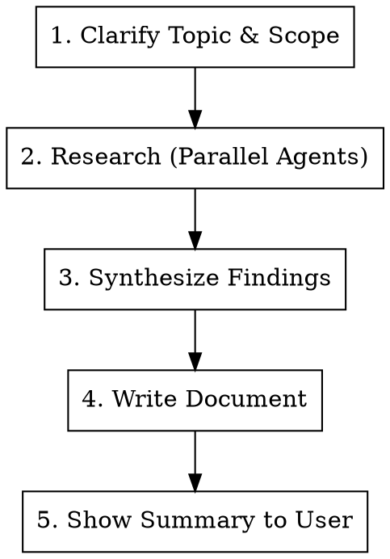

# Research Skill

## Overview

Research a technical topic and produce a well-sourced document with direct quotes, industry references, and a clear recommendation.

## When to Use

- Comparing architectural approaches (monorepo vs multi-repo, REST vs gRPC, etc.)
- Evaluating tools or technologies for adoption
- Building evidence-based ADRs or decision documents
- Answering "what do experts recommend for X?" questions
- Any time the user needs citations and industry backing for a decision

## Input

The user provides a topic or question, optionally with:
- Context about their team/project
- Specific concerns to address
- Where to save the output

If not specified, save to `docs/` in the current repo.

## Workflow



## Phase 1: Clarify Topic & Scope

Ask the user (if not already clear):
- What decision or question are they trying to answer?
- Who is the audience? (teammates, leadership, future self)
- Any constraints or preferences to bias toward?
- Where should the doc be saved?

**Skip if the user already provided enough context.**

## Phase 2: Research (Use Parallel Agents)

Launch **parallel Task agents** to maximize coverage:

- **Agent 1: Official sources** — Documentation from the primary tools/frameworks involved (e.g., Terraform docs, Atmos docs, AWS docs)
- **Agent 2: Industry voices** — Blog posts, conference talks, and recommendations from recognized companies and engineers
- **Agent 3: Community experience** — GitHub discussions, Stack Overflow, Reddit, real-world case studies and post-mortems

Each agent should return:
- Direct quotes with attribution
- Source URLs
- Key data points (scale thresholds, timelines, costs)

## Phase 3: Synthesize Findings

Combine research into a coherent narrative:
- Identify consensus across sources
- Note disagreements and what drives them (scale, team size, use case)
- Map findings to the user's specific context
- Form a clear recommendation with reasoning

## Phase 4: Write Document

Use this structure:

```markdown
# [Decision Title]

**Status:** Proposed
**Date:** [date]
**Context:** [1-2 sentences on what prompted this]

## Decision

[Clear statement of the recommended approach]

## Why Not [Alternative]?

[Side-by-side comparison table if applicable]

## What the Industry Recommends

### [Source 1 Name] ([Role/Context])
> *"Direct quote"*
> — [Source with link]

### [Source 2 Name] ([Role/Context])
> *"Direct quote"*
> — [Source with link]

[Repeat for 4-8 authoritative sources]

## How This Works in Practice

[Concrete examples, config snippets, or workflow descriptions relevant to the user's setup]

## Migration Path / Reversibility

[How to change course if the decision turns out wrong]

## When to Reconsider

| Signal | Threshold |
|--------|-----------|
| [trigger] | [specific number or condition] |

## Summary

[2-3 sentence wrap-up tying recommendation to evidence]

## References

- [All source URLs as clickable links]
```

## Rules

1. **Every claim needs a source** — No unsourced opinions. If you can't find a source, say "based on general industry practice" rather than presenting it as cited fact.
2. **Use direct quotes** — Don't paraphrase when the original wording is impactful. Quote then explain.
3. **Bias toward the user's context** — A recommendation for a Fortune 500 is different from one for a 5-person startup. Always frame advice relative to the user's scale and situation.
4. **Include dissenting views** — If credible sources disagree, present both sides and explain what factors drive the disagreement.
5. **Make it actionable** — End with concrete next steps, not just "it depends."
6. **Keep it skimmable** — Use tables, headers, and bullet points. Teammates should get the gist in 2 minutes.
