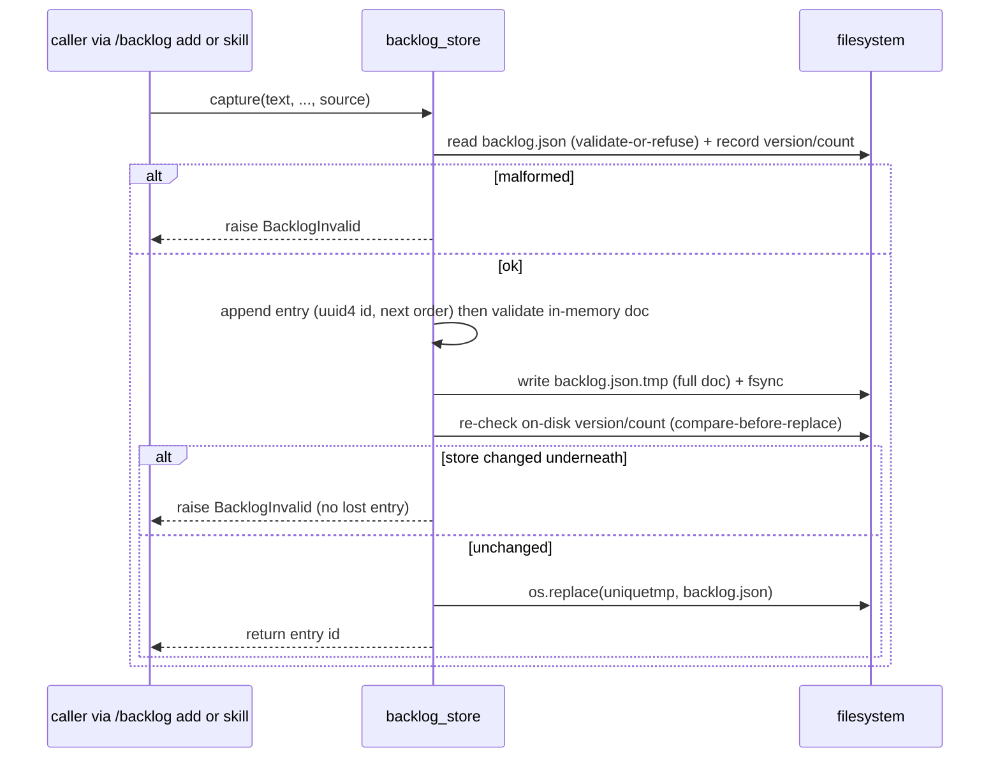

# LLD — backlog-store

<!-- generated by /lld v2.21.0 on 2026-05-29; promoted to canonical from docs/shield/backlog-20260527/ on 2026-05-29 -->

**Feature:** `backlog-20260527`
**Owner:** `ashwini.manoj@aspora.com`
**Status:** `promoted`
**Linked PRD:** [`prd.md`](../shield/backlog-20260527/prd.md)
**Linked plans:** [`plan.md`](../shield/backlog-20260527/plan.md)
**Version:** `0.1.0`
**Last updated:** `2026-05-29`

## §1 Overview {#overview}

`backlog-store` is the only writer of `docs/shield/backlog.json`. It is a small Python
library module (`shield/scripts/backlog_store.py`) plus its JSON Schema
(`shield/schema/backlog.schema.json`) and validator (`shield/scripts/validate_backlog.py`).
It serves PRD milestone **M1** and TRD [§5 F1–F5](../shield/backlog-20260527/trd.md#functional-requirements): it owns
the entry shape, the atomic write, and the validate-or-refuse read. Stories EPIC-1-S1
(schema+validator), EPIC-1-S2 (capture), and EPIC-1-S4 (remove) touch this component.

## §2 Scope & non-goals {#scope-and-non-goals}

**In scope:** the `backlog.json` schema; `capture()`, `read()`, `remove()`; atomic write
(temp→rename); validate-or-refuse; `schema_version` + documented migration policy.

**Out of scope:** reconciliation/removal-decision logic (owned by `reconciler` — this module
only does an unconditional remove-by-id); feature/epic suggestion (owned by `epic-suggester`);
multi-writer locking (single-actor assumption, TRD §6 N5); any live `migrate()` code (doc-only
until `schema_version` 2).

## §3 Module layout {#module-layout}

```
shield/
├── schema/
│   └── backlog.schema.json          new   (draft 2020-12; schema_version + entries[])
├── scripts/
│   ├── backlog_store.py             new   (capture / read / remove / atomic write)
│   ├── validate_backlog.py          new   (pydantic + jsonschema; named errors incl. duplicate_entry_id)
│   └── pyproject.toml               new   (packages backlog_store as an importable module)
└── skills/general/backlog/
    └── SKILL.md                     new   (entry shape, id contract, migration policy, name==slug invariant)
docs/shield/
└── backlog.json                     new (runtime data)  the store itself
```

`backlog_store` is **packaged** (its own `pyproject.toml`), not a bare `uv run` script — F3
requires capturing skills to `import` `capture()`, so it must be an importable module. The
`validate_backlog.py` validator (pydantic + jsonschema) owns the `duplicate_entry_id` uniqueness
check, since JSON Schema cannot express property-level array uniqueness.

## §4 Data model {#data-model}

`backlog.json` (single document, git-tracked):

| Field | Type | Nullable | Default | Notes |
|---|---|---|---|---|
| `schema_version` | integer | no | `1` | top-level; gates read-old/write-new migration |
| `entries` | array | no | `[]` | ordered list of entries |

Per entry:

| Field | Type | Nullable | Default | Notes |
|---|---|---|---|---|
| `id` | string (`uuid4`) | no | generated | **unique across `entries[]`** (schema-enforced; error `duplicate_entry_id`) |
| `order` | integer | no | next max+1 | ascending = view order |
| `kind` | enum | no | `task` | `epic` \| `story` \| `task` |
| `source` | enum | no | — | `user` \| `agent` |
| `feature` | string | no | — | feature-folder slug (proposed-new allowed) |
| `epic` | string | no | — | epic id (existing) or name (proposed-new) |
| `text` | string | no | — | the captured idea |

No cache namespaces — the store is a single small JSON file read in full per operation.

**Migration policy:** `schema_version` is read on load; an unknown-newer version is refused
(`schema_version_too_new`). v1 ships no `migrate()` code — the read-old/write-new policy is
documented only and becomes live at `schema_version` 2.

## §5 API contracts {#api-contracts}

#### capture() {#api-capture}

`capture(text: str, *, kind: str = "task", feature: str | None = None, epic: str | None = None, source: str) -> str`
(LOCKED — plan-review 2026-05-27). Appends one entry; assigns a fresh `uuid4` id and the next
integer `order`; returns the id. Raises `BacklogInvalid` if the existing store is
malformed/partial. Keyword-only `source` is required.

#### read() {#api-read}

`read() -> dict` — loads + validates `backlog.json`. Raises `BacklogInvalid` (named error) on a
malformed/partial document; never returns a partially-parsed doc.

#### remove() {#api-remove}

`remove(entry_id: str) -> bool` — unconditional remove-by-id (idempotent remove-if-present);
returns `True` if an entry was removed, `False` if the id was absent. Reconciliation decisions
live in `reconciler`; this is the mechanical delete it calls.

## §6 Sequence flows {#sequence-flows}

#### Atomic capture {#flow-capture}



The temp file uses a unique suffix (pid/uuid) and is `fsync`'d before the rename; the
compare-before-replace step (re-read the on-disk `schema_version`+entry-count, or mtime/hash,
captured at read time) turns a silent lost-update into a loud `BacklogInvalid` without a lock.

## §7 Error handling {#error-handling}

| Error | Raised when | Behavior |
|---|---|---|
| `BacklogInvalid` | read of a malformed/partial `backlog.json` | surface to caller; never silently read/truncate |
| `duplicate_entry_id` | validation finds two entries with the same `id` | validator exits non-zero, names the error |
| `unknown_kind_enum` / `unknown_source_enum` | enum constraint violated | validator exits non-zero, names the error |
| `schema_version_too_new` | `schema_version` exceeds supported | refuse; do not attempt to read |
| write IO error mid-`.tmp` | disk/permission failure | remove `.tmp`; raise; never leave partial `backlog.json` |

## §8 Concurrency & state {#concurrency-and-state}

Single-writer assumption (TRD §6 N1/N5): no lock. Correctness rests on full-doc → unique `.tmp`
→ `fsync` → `os.replace()` (atomic rename), validate-or-refuse reads, **and a compare-before-replace
check**: the on-disk `schema_version`+entry-count (or mtime/hash) is captured at read time and the
`os.replace()` is refused (raising `BacklogInvalid`) if the file changed underneath. This means a
*capture racing a reconciliation remove* — the real lost-update threat if the single-writer
assumption is silently violated — fails **loudly** rather than dropping the loser's entry. The
EPIC-4-S1 concurrency eval asserts this refusal fires (no lost entry, no corruption). Revisit with
a lockfile only if Shield becomes multi-actor.

<details>
<summary>§9 Configuration {#configuration}</summary>

n/a — `backlog-store` has no tunable configuration of its own. The reconciliation kill switch
(`.shield.json` `backlog.auto_reconcile`) is owned by `reconciler`.

</details>

## §10 Observability {#observability}

- **Logs:** capture and remove emit a debug line `{op, entry_id, order}`. A `BacklogInvalid`
  refusal logs `{path, reason}` at warning.
- **Metrics:** none in v1 (no telemetry — PRD §7). Entry count is derivable from the store.
- **Traces:** n/a — single-process CLI/library calls.

<details>
<summary>§11 Security & privacy {#security-and-privacy}</summary>

n/a — the store holds developer-authored idea text only (no PII, no auth surface). It is a
plaintext, git-tracked JSON file with the same trust boundary as the rest of `docs/shield/`.

</details>

## §12 Performance & scaling {#performance-and-scaling}

#### §12.1 Load {#load}
A few capture/remove ops per session; backlog expected ≤ ~200 entries.

#### §12.2 SLO {#slo}
Capture and read complete in ≪ 100ms for a ≤200-entry store; contributes to the TRD §6 N2 ~1s view budget.

#### §12.3 Bottleneck {#bottleneck}
IO-bound (a single full-file read + write per op); never CPU-bound at this scale.

#### §12.4 Latency breakdown {#latency-breakdown}
Dominated by one file read + one `os.replace()`; parse/validate is microseconds at ≤200 entries. `n/a — finer numbers measured post-ship`.

#### §12.5 Capacity {#capacity}
A ≤200-entry JSON doc is a few tens of KB — trivial memory; no connection pool.

#### §12.6 Scale-out lever {#scale-out-lever}
n/a — single local file, single actor; no horizontal scaling dimension.

#### §12.7 Caches {#caches}
None — every op reads the file fresh (validate-or-refuse). No invalidation problem.

#### §12.8 Degradation {#degradation}
On a malformed store, `read()`/`capture()` refuse with `BacklogInvalid` rather than degrade — the user fixes/reverts the file. No partial-write state is ever observable.

## §13 Open questions {#open-questions}

| Q# | Question | Options | Owner | Resolve-by |
|---|---|---|---|---|
| Q1 | Need an explicit "dropped" terminal state vs. plain delete? | plain delete (v1) / add state | @ashwinimanoj | post-v1 (PRD §11) |

## §14 Changelog {#changelog}

| Touch | Date | Summary | Story IDs |
|---|---|---|---|
| M1 | 2026-05-29 | Initial draft via /plan | EPIC-1-S1 EPIC-1-S2 EPIC-1-S4 |
| promoted | 2026-05-29 | Promoted to canonical `docs/lld/` at milestone close | EPIC-1-S1 EPIC-1-S2 EPIC-1-S4 |
