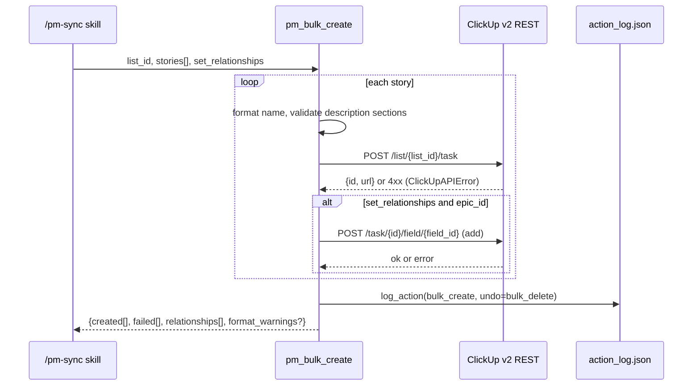
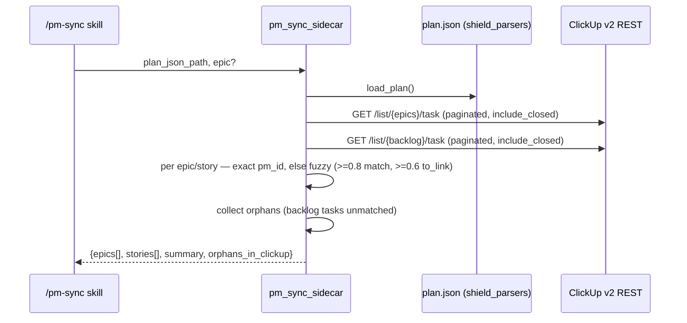
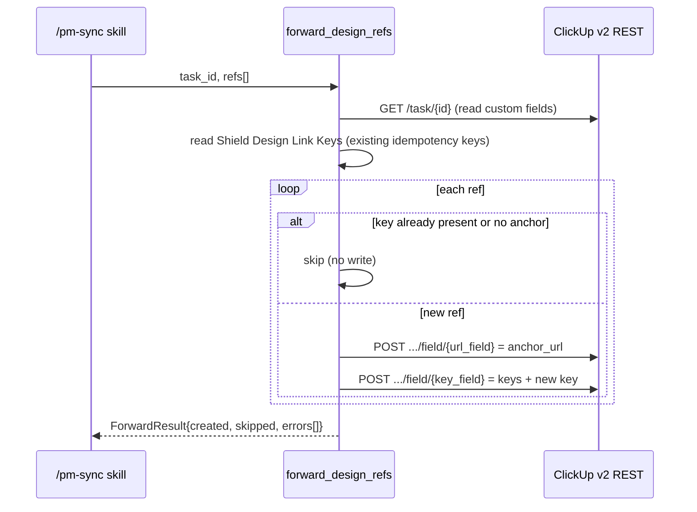

<!-- generated by /lld v2.27.0 on 2026-06-15 -->

**Feature:** `manual`
**Owner:** `ashwinimanoj@gmail.com`
**Status:** `draft`
**Linked PRD:** `n/a`
**Linked plans:** `[]`
**Version:** `0.1.0`
**Last updated:** `2026-06-15`

## §1 Overview {#overview}

The `clickup` adapter is the Shield PM-adapter that maps Shield's abstract `pm_*`
operations onto the ClickUp v2 REST API. It ships as the `shield-pm-adapter`
FastMCP server (stdio transport) defined in `shield/adapters/clickup/server/`.

Runtime shape: a single-process MCP server. `server/main.py` builds one
`FastMCP("shield-pm-adapter")` instance and registers nine `pm_*` tools. Config
and the ClickUp HTTP client load lazily on first tool call (via `_DepsLoader` +
`_LazyProxy`), so the server starts without a project context.

Callers are Shield skills — `/pm-sync`, `/pm-status`, and the `/plan` →
`/implement` flow. The adapter does the ClickUp-specific work: name formatting,
relationship-field wiring, fuzzy sidecar diffing, and an append-only action log.
It depends on `shield/adapters/_common` for the shared `design_refs` forwarding
types and on `shield/parsers` for plan.json (`shield_parsers.sidecar`).

Canonical directory: `shield/adapters/clickup/`.

## §2 Scope & non-goals {#scope-and-non-goals}

**In scope**

- The nine `pm_*` MCP tools registered by `server/main.py`: `pm_get_capabilities`,
  `pm_link_story_to_epic`, `pm_bulk_create`, `pm_sync_sidecar`, `pm_get_status`,
  `pm_bulk_update`, `pm_bulk_rename`, `pm_backfill_ids`, `pm_action_log`.
- The ClickUp v2 REST client (`server/clickup_client.py`) and its
  task / custom-field calls.
- Config resolution: Shield-native (`.shield.json` → `~/.shield/`) and the legacy
  file-based (`sprint-planner.json`) path.
- The append-only JSON action log (`server/action_log.py`).
- `design_refs[]` forwarding to ClickUp URL custom fields
  (`server/tools/forward_design_refs.py`).

**Out of scope**

- ClickUp workspace bootstrap (creating spaces, folders, lists, the relationship
  custom field) — operator setup task, not an adapter operation.
- Time tracking, comments, chat, documents — the public ClickUp MCP surface
  (`mcp.clickup.com`) covers those; this adapter is sprint-planning-only.
- Other PM backends (Jira, Confluence, Notion) — separate adapters sharing only
  `_common`.
- Webhooks / push from ClickUp — the adapter is pull-only.

## §3 Module layout {#module-layout}

```text
shield/adapters/clickup/
├── pyproject.toml                       unchanged  shield-clickup-adapter v2.1.0
├── .mcp.json                            unchanged  registers clickup + shield-pm-adapter servers
└── server/
    ├── main.py                          unchanged  FastMCP entry; lazy deps; tool registration
    ├── config.py                        unchanged  Shield-native + legacy config loaders
    ├── clickup_client.py                unchanged  httpx v2 REST wrapper + ClickUpAPIError
    ├── action_log.py                    unchanged  append-only JSON audit log
    ├── naming.py                        unchanged  shared story/epic name formatter
    └── tools/
        ├── _helpers.py                  unchanged  relationship-field + milestone-tag helpers
        ├── capabilities.py              unchanged  pm_get_capabilities
        ├── relationships.py             unchanged  pm_link_story_to_epic
        ├── bulk_create.py               unchanged  pm_bulk_create
        ├── sync.py                      unchanged  pm_sync_sidecar
        ├── status.py                    unchanged  pm_get_status
        ├── bulk_update.py               unchanged  pm_bulk_update
        ├── rename.py                    unchanged  pm_bulk_rename
        ├── backfill.py                  unchanged  pm_backfill_ids
        ├── action_log_tool.py           unchanged  pm_action_log
        └── forward_design_refs.py       unchanged  design_refs[] → ClickUp URL custom field
```

**Dependencies (not owned by this component):**

- `shield/adapters/_common/shield_adapters_common/design_refs.py` — `DesignRef`,
  `ForwardError`, `ForwardResult`, and the `idempotency_key` function.
- `shield/parsers` (`shield_parsers.sidecar`) — `load_plan`, `save_plan`, `Plan`,
  `CURRENT_SCHEMA_VERSION`.

This is a reverse-doc of an existing component; every file above already exists.

## §4 Data model {#data-model}

The adapter owns no database. ClickUp is the system of record for tasks; the
plan.json sidecar (owned by `shield/parsers`) holds plan↔PM id correlation. The
adapter owns one persistent artifact: the action log.

**Action log** — `server/action_log.py`, default path `./clickup_actions.json`
(from `ActionLogConfig.path`). A single JSON object, append-only:

| Key | Type | Notes |
|---|---|---|
| `metadata` | object | reserved; written empty on file create |
| `actions[]` | array | one entry per logged mutation |

Each `actions[]` entry:

| Field | Type | Nullable | Default | Notes |
|---|---|---|---|---|
| `seq` | int | no | `max(seq)+1`, starts at 1 | monotonic per file |
| `action` | string | no | — | e.g. `bulk_create`, `bulk_update`, `bulk_rename`, `set_relationship_add` |
| `timestamp` | string | no | `datetime.now(UTC).isoformat()` | UTC ISO-8601 |
| `status` | string | no | — | `success` \| `partial` |
| `summary` | string | no | — | human-readable line |
| `results` | array | yes | — | per-item success/failure records |
| `undo` | object | yes | — | rollback descriptor (e.g. `bulk_delete`, `bulk_rename` with `rollback[]`) |
| `epic` | string | yes | — | extra field; queryable filter |

ClickUp-side fields the adapter reads/writes (no schema ownership):

- Relationship custom field (`relationship_field.id`, type `list_relationship`):
  links a story task to its epic task. Read via `_get_linked_epic_ids`.
- `Shield Design Links` (URL-list custom field) + `Shield Design Link Keys`
  (text companion, comma-separated idempotency keys) — used by
  `forward_design_refs`. Created at workspace-init time, not by this adapter.

No cache namespaces. No Redis.

## §5 API contracts {#api-contracts}

The adapter's "API" is its set of MCP tools (FastMCP over stdio). Each tool takes
a JSON object and returns a JSON object. ClickUp REST errors surface as
`ClickUpAPIError` and are captured into per-item `failed[]` / `error` fields
rather than raised across the tool boundary (see §7).

#### pm_get_capabilities {#api-pm-get-capabilities}

Discovery. No args.

Response:
```json
{
  "adapter": "clickup",
  "adapter_mode": "hybrid",
  "capabilities": ["pm_sync_sidecar", "pm_backfill_ids", "pm_bulk_create",
    "pm_bulk_update", "pm_get_status", "pm_link_story_to_epic",
    "pm_bulk_rename", "pm_action_log", "pm_get_capabilities"]
}
```
Errors: none — static payload.

#### pm_bulk_create {#api-pm-bulk-create}

Create many tasks in one list, optionally linking each to its epic via the
relationship field.

Request:
```json
{
  "list_id": "string",
  "stories": [{
    "name": "string (required)",
    "description": "string",
    "assignee": "user-id string",
    "priority": "urgent|high|normal|low",
    "orderindex": "string",
    "epic_id": "epic task id (needs set_relationships=true)",
    "epic_label": "human epic id for name formatting",
    "index": "story index for {index} format",
    "milestone_id": "M1 — tagged as shield:ms:m1"
  }],
  "set_relationships": false
}
```
Response:
```json
{
  "created": [{"task_id": "...", "task_url": "...", "name": "...", "status": "success"}],
  "failed":  [{"name": "...", "status": "failed", "error": "ClickUp API 4xx: ..."}],
  "relationships": [{"task_id": "...", "epic_id": "...", "status": "success|failed"}],
  "format_warnings": [{"name": "...", "missing_sections": ["Tasks", "Context", "Acceptance Criteria"]}],
  "log_warning": "Action logging failed: ..."
}
```
`format_warnings` / `log_warning` are present only when non-empty. Priority maps
`urgent|high|normal|low` → `1|2|3|4`. Per-task ClickUp failures land in `failed[]`;
the call never raises.

#### pm_bulk_update {#api-pm-bulk-update}

Batch-update status / assignee / priority / description / orderindex.

Request:
```json
{"updates": [{"task_id": "string (required)", "status": "string",
  "assignee": "user-id string", "priority": "urgent|high|normal|low|null",
  "description": "markdown", "orderindex": "string"}]}
```
Response:
```json
{
  "updated": [{"task_id": "...", "status": "success", "changes": ["status", "priority"]}],
  "failed":  [{"task_id": "...", "status": "failed", "error": "..."}],
  "log_warning": "..."
}
```
Errors: missing `task_id` → `failed[]` with `"Missing task_id"`; no updatable
fields → `failed[]` with `"No fields to update"`. `priority: null` clears priority.

#### pm_link_story_to_epic {#api-pm-link-story-to-epic}

Set a `list_relationship` custom field via `POST /task/{id}/field/{field_id}` —
the endpoint that actually persists relationships (`update_task` silently drops
them).

Request:
```json
{"task_id": "string", "field_id": "uuid", "linked_task_ids": ["..."], "action": "add|remove"}
```
Response:
```json
{
  "results": [{"task_id": "...", "linked_to": "...", "action": "add", "status": "success|failed", "error": "..."}],
  "log_warning": "..."
}
```
Errors: `action` not in `{add, remove}` → `{"error": "Invalid action: ..."}`.

#### pm_sync_sidecar {#api-pm-sync-sidecar}

Pure read. Diff a plan.json sidecar against ClickUp epic + backlog lists.

Request:
```json
{"plan_json_path": "string", "epic": "EPIC-1 (optional scope)"}
```
Response:
```json
{
  "epics":   [{"id": "EPIC-1", "name": "...", "pm_id": "...|null", "diff": "match|to_update|to_create|to_link", "candidate": null}],
  "stories": [{"id": "EPIC-1-S0", "epic_id": "EPIC-1", "name": "...", "pm_id": "...|null", "diff": "...", "candidate": null}],
  "summary": {"epics": {"match": 0, "to_create": 0, "to_update": 0, "to_link": 0, "orphan": 0},
              "stories": {"...": 0}},
  "orphans_in_clickup": [{"id": "...", "name": "..."}]
}
```
Errors: unknown `epic` → `{"error": "Epic '...' not in plan.json. Available: [...]"}`;
ClickUp fetch failure → `{"error": "Failed to fetch ClickUp tasks: ..."}`.
Matching: exact `pm_id` first, then `difflib` fuzzy — `>= 0.8` match, `>= 0.6`
`to_link`.

#### pm_get_status {#api-pm-get-status}

Read. Aggregate backlog task states per epic / status / assignee.

Request:
```json
{"plan_json_path": "string", "epic": "EPIC-1 (optional)", "group_by": "epic|status|assignee"}
```
Response (`group_by=epic`):
```json
{"epics": [{"id": "EPIC-1", "name": "...", "epic_id": "<pm_id>",
  "stats": {"total": 0, "done": 0, "in_progress": 0, "ready": 0, "blocked": 0},
  "stories": [{"task_id": "...", "name": "...", "status": "...", "assignee": "...", "url": "..."}]}]}
```
Errors: unknown `epic` → `{"error": "Epic '...' not found. Available: [...]"}`;
invalid `group_by` → `{"error": "Invalid group_by: ..."}`; fetch failure →
`{"error": "Failed to fetch tasks: ..."}`.

#### pm_bulk_rename {#api-pm-bulk-rename}

Preview or apply name normalization on epic cards and linked story tasks.

Request:
```json
{"plan_json_path": "string", "epic": "EPIC-1 (optional)", "apply": false,
  "strip_prefix": "regex", "story_format": "...", "epic_format": "..."}
```
Response (preview, `apply=false`):
```json
{"message": "Found N tasks to rename (...). Set apply=True to execute.",
  "mode": "preview",
  "renames": [{"task_id": "...", "epic": "EPIC-1", "type": "epic|story",
    "current_name": "...", "new_name": "..."}]}
```
Response (`apply=true`): `{"message": "...", "mode": "applied", "renamed": [...], "failed": [...], "log_warning": "..."}`.
All-compliant → `{"message": "All task names are compliant.", "renames": []}`.
Errors: unknown `epic` → `{"error": "Epic '...' not found. ..."}`; fetch failure
→ `{"error": "Failed to fetch ... tasks: ..."}`.

#### pm_backfill_ids {#api-pm-backfill-ids}

Pure filesystem write — no ClickUp client. Write created task ids/urls back into
plan.json from an explicit caller-supplied mapping. Atomic save; stamps schema
`CURRENT_SCHEMA_VERSION` (1.4).

Request:
```json
{"plan_json_path": "string",
  "epics":   [{"id": "EPIC-1", "pm_id": "...", "pm_url": "..."}],
  "stories": [{"id": "EPIC-1-S0", "pm_id": "...", "pm_url": "..."}]}
```
Response:
```json
{"updated_epics": ["EPIC-1"], "updated_stories": ["EPIC-1-S0"],
  "not_found": [{"id": "...", "type": "epic|story"}], "version": "1.4"}
```
Ids matching no plan entry surface in `not_found`, never silently dropped.

#### pm_action_log {#api-pm-action-log}

Query the action log.

Request: `{"epic": "...", "action": "...", "since": "ISO date", "last_n": 10}` (all optional).
Response: `{"actions": [...], "total": 0}`. Filters apply in order; `last_n` slices last.

#### forward_design_refs {#api-forward-design-refs}

Not an MCP tool — an in-process function called by the `/pm-sync` skill flow
(`server/tools/forward_design_refs.py`). Writes `design_refs[]` to a task's
`Shield Design Links` URL field with idempotent dedup against the
`Shield Design Link Keys` companion.

Signature: `forward_design_refs(task_id, refs, *, client=None, base_url="https://api.clickup.com") -> ForwardResult`.
`ForwardResult{created, skipped, errors[ForwardError]}`. Refs whose
`idempotency_key` already appears in the companion field are skipped without an
HTTP write. Missing custom fields → all refs `skipped` (no-op, not an error).

## §6 Sequence flows {#sequence-flows}

#### bulk-create {#flow-bulk-create}



#### sidecar-sync {#flow-sidecar-sync}



#### backfill-after-create {#flow-backfill-after-create}

```mermaid
sequenceDiagram
    participant Skill as /pm-sync skill
    participant Create as pm_bulk_create
    participant Backfill as pm_backfill_ids
    participant Plan as plan.json
    Skill->>Create: stories[]
    Create-->>Skill: created[] (task_id, task_url)
    Skill->>Skill: build {id, pm_id, pm_url} mapping
    Skill->>Backfill: plan_json_path, epics[], stories[]
    Backfill->>Plan: load_plan, mutate, save_plan (atomic, schema 1.4)
    Backfill-->>Skill: {updated_*, not_found, version}
```

#### forward-design-refs {#flow-forward-design-refs}



## §7 Error handling {#error-handling}

| Identifier | Source | HTTP | Behavior |
|---|---|---|---|
| `ClickUpAPIError` | `clickup_client._request` on non-2xx | carries ClickUp status + `ECODE` | Caught per-item; recorded in `failed[]`/`error`; tool returns normally. Never crosses the tool boundary. |
| `error: Epic '...' not found/not in plan.json` | sync, status, rename | n/a | Returned as `{"error": ...}` with available ids listed. |
| `error: Failed to fetch ... tasks` | sync, status, rename | n/a | ClickUp fetch failure wrapped into `{"error": ...}`; no partial mutation. |
| `error: Invalid action` | link_story_to_epic | n/a | Returned before any HTTP call. |
| `error: Invalid group_by` | status | n/a | Returned before aggregation. |
| `Missing task_id` / `No fields to update` | bulk_update | n/a | Per-item `failed[]` entry; other updates proceed. |
| `log_warning` | every mutating tool | n/a | Action-log write failure is non-fatal; the operation result is still returned with `log_warning`. |
| `not_found[]` | backfill | n/a | Mapping ids matching no plan entry returned, not dropped. |
| `ForwardError` | forward_design_refs | carries `http_status` | Collected in `ForwardResult.errors[]`; logged at WARNING; loop continues. |
| `ValueError` (config) | config loaders | n/a | Missing API token / malformed credentials — raised at first tool call (fail-fast on misconfiguration). |

Design stance: mutating tools degrade per-item — one task's ClickUp failure
never aborts the batch. Whole-operation precondition failures (bad epic, fetch
failure) short-circuit with a single `{"error": ...}` before mutating anything.

## §8 Concurrency & state {#concurrency-and-state}

The server is single-process, stdio-serial — FastMCP processes one tool call at
a time, so there is no in-process tool-to-tool race. Within a tool, ClickUp
calls run sequentially via one `httpx.AsyncClient`.

Externalised state and its races:

| Concern | Resolution |
|---|---|
| Action log concurrent writers | `ActionLog` is read-modify-write on a single JSON file with no lock. Safe under the single-process serial model; concurrent server instances pointed at the same log file could lose an entry. Not a deployment shape Shield uses. |
| Sidecar (plan.json) writes | `pm_backfill_ids` delegates to `shield_parsers.save_plan`, which writes atomically. |
| Idempotency on re-sync | `pm_backfill_ids` stamps `pm_id`/`pm_url` so a re-run sees `match`. `forward_design_refs` dedups on `idempotency_key`; the one race window is a URL-write succeeding then the key-companion write failing — treated as an error so the caller can retry. |
| ClickUp relationship add | `set_relationship_field` uses `{"add": [...]}`/`{"rem": [...]}` deltas, not full replacement, so concurrent links from other clients are not clobbered. |

No adapter-owned state machine; ClickUp owns task status. `pm_get_status`
normalizes ClickUp statuses to `done | in_progress | ready | blocked`.

## §9 Configuration {#configuration}

<details open>
<summary>§9 Configuration</summary>

Config resolves in two modes (`server/config.py`). Shield-native first: walk up
from cwd for `.shield.json`, read `~/.shield/projects/<project>/pm.json` and
`~/.shield/credentials.json`. If no `.shield.json`, fall back to the legacy
`sprint-planner.json` file (path from `$SPRINT_PLANNER_CONFIG`, default
`./sprint-planner.json`).

| Name | Type | Default | Secret | Hot-reload | Notes |
|---|---|---|---|---|---|
| `clickup.api_token_env` | string | `CLICKUP_API_TOKEN` | no | no | env var name for legacy-mode token |
| `clickup.api_token` | string | none | **yes** | no | resolved token carried in-process only; `exclude=True`, never serialized |
| `clickup.workspace_id` | string | `auto` | no | no | |
| `clickup.space` / `clickup.folder` | `{name, id}` | required | no | no | |
| `clickup.lists.epics` / `clickup.lists.backlog` | `{name, id}` | required | no | no | the two lists the adapter reads/writes |
| `clickup.relationship_field.id` | string | required | no | no | `list_relationship` custom-field UUID |
| `clickup.relationship_field.type` | string | `list_relationship` | no | no | |
| `naming.project_prefix` | string | `""` | no | no | |
| `naming.story_format` | string | `[{epic_id}] {name}` | no | no | placeholders: prefix, epic_id, index, name |
| `naming.epic_format` | string | `[EPIC] {name} \| [{epic_id}]` | no | no | placeholders: prefix, epic_id, name, epic_name |
| `action_log.path` | string | `./clickup_actions.json` | no | no | resolved relative to the config file dir |
| `team[]` | `[{name, id}]` | `[]` | no | no | id→name lookup for status views |

Config loads lazily (`_DepsLoader.ensure_loaded`) and is cached for the process
lifetime — no hot reload. Example: `shield/config-examples/pm-clickup.example.json`.

</details>

## §10 Observability {#observability}

**Logs** — `forward_design_refs` emits structured records via the stdlib
`logging` module under logger `server.tools.forward_design_refs`:

| Event | Level | Fields |
|---|---|---|
| `forward_design_ref` | INFO | `story_id`, `adapter`, `anchor_url`, `outcome` (`created`/`idempotent_skip`/`skipped_no_anchor`/`skipped_no_custom_field`), `idempotency_key` |
| `forward_design_ref_failed` | WARNING | `story_id`, `adapter`, `error_class`, `http_status`, `idempotency_key` |

The mutating tools have no log emission; their audit trail is the action log
(`clickup_actions.json`), which records `action`, `status`, `summary`,
per-item `results[]`, and an `undo` descriptor with a monotonic `seq` and UTC
timestamp. `pm_action_log` is the query surface.

**Metrics** — `n/a — no metrics instrumentation; the adapter is a short-lived
stdio MCP server, not a long-running scraped service. Per-call counts surface in
tool return payloads (`created`/`failed`/`updated`) and the action log.`

**Traces** — `n/a — no tracing instrumentation. FastMCP stdio calls are not
span-wrapped; the action-log seq + timestamp serve as the correlation trail.`

## §11 Security & privacy {#security-and-privacy}

<details open>
<summary>§11 Security &amp; privacy</summary>

This component holds a ClickUp personal API token and acts on a user's ClickUp
workspace, so §11 is lifted.

**AuthN — token source.** The ClickUp token resolves in this order:
`~/.shield/credentials.json` → `creds[<adapter>].api_token`, else the
`CLICKUP_API_TOKEN` env var. Missing token raises `ValueError` at first tool
call. The token is carried on `ClickUpConfig.api_token` (Pydantic
`repr=False, exclude=True`) so it never serializes into config dumps, logs, or
crash output — and deliberately is **not** written into `os.environ`, to keep it
out of subprocess env and crash dumps. The HTTP client sends it as the
`Authorization` header to `https://api.clickup.com/api/v2` over TLS.

**AuthZ.** The adapter has exactly the permissions of the supplied token —
ClickUp enforces workspace/space/list access server-side. The adapter adds no
authorization layer of its own. Scope is bounded by config: it reads/writes only
the configured epics and backlog lists.

**Data classification.**

| Data | Class | Handling |
|---|---|---|
| ClickUp API token | secret | in-process only, excluded from serialization, never in env |
| Task names / descriptions / ACs | internal project data | sent to ClickUp; logged in `summary`/`results` of the action log |
| Assignee user ids / names | internal PII-adjacent | id→name map from config `team[]`; appears in status output |
| `design_refs[]` anchor URLs | internal | written to a ClickUp URL custom field |

**Threat model.** Primary risk is token leakage; mitigated by the no-env /
no-serialize handling above. The action log (`clickup_actions.json`) contains
task names and ids but no token — treat it as internal project data, not a
secret. Malformed `~/.shield/credentials.json` raises a clear `ValueError`
rather than silently proceeding tokenless.

</details>

## §12 Performance & scaling {#performance-and-scaling}

#### §12.1 Load {#load}

Interactive, low-volume, operator-triggered. A `/pm-sync` run typically touches
one plan's worth of epics + stories — tens to low-hundreds of tasks. Bursty, not
steady: a sync fires a batch of sequential ClickUp calls, then idles. The hard
external limit is the **ClickUp API rate limit** (100 requests/minute per token
on the standard plan); `pm_bulk_create` issues 1–2 calls per story (create, plus
an optional relationship set), so a ~50-story create approaches that ceiling.

#### §12.2 SLO {#slo}

`n/a — measured post-ship; no formal SLO. The adapter is an interactive CLI-side
MCP server, not a hosted service with an availability target. Practical
expectation: a single tool call returns within the httpx 30s timeout per ClickUp
request.`

#### §12.3 Bottleneck {#bottleneck}

Network/IO-bound on the ClickUp REST API, and ultimately throttled by ClickUp's
100 req/min rate limit. Local CPU work (name formatting, `difflib` fuzzy
matching, JSON I/O) is negligible against round-trip latency. `pm_sync_sidecar`
fuzzy matching is O(stories × backlog tasks) but on the small task counts in
scope it stays well under the network cost.

#### §12.4 Latency breakdown {#latency-breakdown}

Per tool call, dominated by ClickUp RTT. `pm_bulk_create`/`pm_bulk_update`/
`pm_bulk_rename` are sequential, so wall time ≈ Σ(per-task RTT). `pm_sync_sidecar`
= two paginated list GETs (100 tasks/page) + in-memory diff. `pm_backfill_ids` =
local file read+write only (no network). Concrete numbers: `n/a — measured
post-ship; targets in §12.2`.

#### §12.5 Capacity {#capacity}

Single process, one `httpx.AsyncClient`, 30s per-request timeout. Memory holds at
most the full epics + backlog task arrays for a sync (low-hundreds of dicts) —
order of single-digit MB. No connection-pool tuning needed; effective ceiling is
ClickUp's rate limit, not local resources.

#### §12.6 Scale-out lever {#scale-out-lever}

`n/a — not horizontally scaled. The adapter is a per-user stdio MCP subprocess
launched by Claude Code; there is no replica set. Throughput is bounded by the
single ClickUp token's rate limit, which more replicas would not raise.`

#### §12.7 Caches {#caches}

No response cache. Config + client load once per process (`_DepsLoader`,
effectively a process-lifetime memo) but ClickUp reads are always live to avoid
stale sprint state. `forward_design_refs` reads the task's existing custom fields
on each call to dedup — deliberately uncached so idempotency is correct.

#### §12.8 Degradation {#degradation}

On ClickUp failure the adapter degrades gracefully rather than crashing:
read tools (`pm_sync_sidecar`, `pm_get_status`) return `{"error": "Failed to
fetch ..."}` and the caller skips the operation; write tools record per-item
`failed[]` and continue the batch, then write a `partial` action-log entry whose
`undo` descriptor enables rollback. Action-log write failure surfaces as a
non-fatal `log_warning` — the ClickUp mutation still succeeds. A missing token or
custom field surfaces as a clear error / `skipped`, never a silent no-op.

## §13 Open questions {#open-questions}

| Q# | Question | Options | Owner | Resolve-by |
|---|---|---|---|---|
| Q1 | Should `pm_bulk_*` tools throttle to stay under ClickUp's 100 req/min limit, or rely on the caller to chunk? | client-side rate limiter / backoff-on-429 / caller chunks | adapter owner | when a >50-story plan hits 429s |
| Q2 | Should the action log gain a lock for the multi-instance case, or is the single-process invariant documented as a constraint? | file lock / document constraint | adapter owner | if concurrent server instances become a supported shape |

## §14 Changelog {#changelog}

| Touch | Date | Summary | Story IDs |
|---|---|---|---|
| manual | 2026-06-15 | reverse-doc by ashwinimanoj@gmail.com | n/a |
