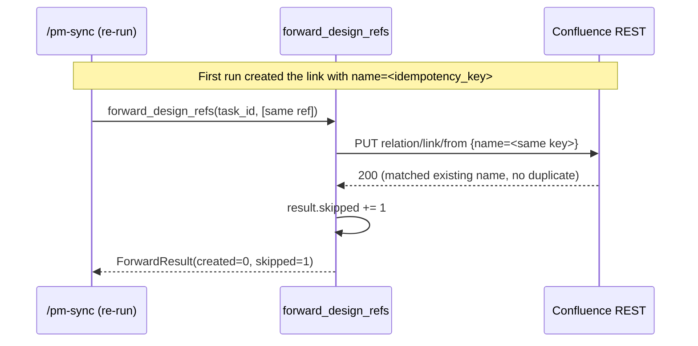

<!-- generated by /lld v2.27.0 on 2026-06-15 -->

**Feature:** `manual`
**Owner:** `ashwinimanoj@gmail.com`
**Status:** `draft`
**Linked PRD:** `n/a`
**Linked plans:** `[]`
**Version:** `0.1.0`
**Last updated:** `2026-06-15`

---

## §1 Overview {#overview}

The Confluence adapter is one of four Shield PM adapters (Jira, Confluence,
ClickUp, Notion). It forwards a plan's `design_refs[]` to a Confluence page or
task as remote-link entries, so a synced PM artifact links back to the TRD/LLD/PRD
sections that justify it.

Runtime shape today: a **Python library function**, not a running service. The
public entry point is `forward_design_refs(task_id, refs) -> ForwardResult` in
`shield/adapters/confluence/server/tools/sync.py`. It calls the Confluence REST
API over `requests`.

The component is **partially implemented**. The forwarding function and its
tests are complete. The MCP server wrapper is a scaffold: `server/main.py` only
prints a placeholder and registers no MCP tools, and `.mcp.json` ships with
`_disabled: true` pending EPIC-4-S3. This LLD documents the implemented function
and flags the unfinished server in §2 and §13.

Component directory: `shield/adapters/confluence/`. Shared types come from
`shield/adapters/_common/` (`shield_adapters_common`).

## §2 Scope & non-goals {#scope-and-non-goals}

**In scope**

- `forward_design_refs(task_id, refs)` — upserts each ref as a Confluence remote
  link, deduplicated by a deterministic idempotency key.
- Idempotent upsert via the Confluence `name` field on `relation/link/from`.
- Per-ref outcome accounting (`created` / `skipped` / `errors`) and structured logging.
- Reuse of the shared `DesignRef` / `ForwardResult` / `ForwardError` contract.

**Out of scope**

- MCP server wiring — `server/main.py` is a scaffold and `.mcp.json` is
  `_disabled`; no MCP tools are registered (deferred to EPIC-4-S3).
- Authentication — the code builds or accepts a bare `requests.Session` with no
  credentials attached. Confluence auth is not implemented (see §11, §13).
- Configuration loading — `base_url` is a function default, not read from
  `.shield.json` or env (see §9, §13).
- Reading or rendering plan.json — the caller projects `design_refs[]` into
  `DesignRef` objects before calling this function.
- Page/task creation — the function attaches links to an existing `task_id`
  (content ID); it does not create the page.

## §3 Module layout {#module-layout}

```
shield/adapters/confluence/
├── pyproject.toml                      unchanged  shield-confluence-adapter package
├── .mcp.json                           unchanged  MCP config (_disabled scaffold)
├── server/
│   ├── __init__.py                     unchanged  empty
│   ├── main.py                         unchanged  scaffold entry point (no tools)
│   └── tools/
│       ├── __init__.py                 unchanged  empty
│       └── sync.py                     unchanged  forward_design_refs + _put_remote_link
└── tests/
    ├── conftest.py                     unchanged  sample_refs fixture
    ├── test_contract.py                unchanged  signature + empty-refs contract
    └── test_idempotency.py             unchanged  P0-4 double-run zero-duplicate test

shield/adapters/_common/                            (referenced, not owned)
└── shield_adapters_common/
    ├── __init__.py                     unchanged  re-exports the shared contract
    └── design_refs.py                  unchanged  DesignRef, ForwardResult, ForwardError, idempotency_key
```

The adapter depends on `shield-adapters-common` (`tool.uv.sources`, editable
path `../_common`). `design_refs.py` defines the cross-adapter contract: all
four adapters implement the same `forward_design_refs(task_id, refs) ->
ForwardResult` signature (`ForwardDesignRefsProtocol`) and share the
`idempotency_key` helper.

## §4 Data model {#data-model}

`n/a — stateless library, no persistent data model.` The adapter holds no
database or cache. It operates on in-memory dataclasses passed by the caller and
on remote state in Confluence. The relevant in-memory shapes (defined in
`shield_adapters_common.design_refs`):

| Type | Field | Type | Notes |
|---|---|---|---|
| `DesignRef` | `story_id` | `str` | Owning plan.json story id; part of the idempotency key. |
| `DesignRef` | `doc` | `str` | `"trd"` \| `"lld"` \| `"prd"`. |
| `DesignRef` | `section_id` | `str \| None` | Doc section anchor. |
| `DesignRef` | `anchor_url` | `str \| None` | Link destination; `None` ⇒ skipped. |
| `DesignRef` | `label` | `str` | Human-readable link title. |
| `DesignRef` | `component` | `str \| None` | Used in the synthetic key for anchorless refs. |
| `DesignRef.idempotency_key` | (property) | `str` | 32-char `sha256(...)`; see below. |
| `ForwardResult` | `created` | `int` | New links created (HTTP 201). |
| `ForwardResult` | `skipped` | `int` | Idempotent (200) or no-anchor skips. |
| `ForwardResult` | `errors` | `list[ForwardError]` | One per failed ref. |
| `ForwardError` | `ref` | `DesignRef` | The originating ref. |
| `ForwardError` | `error_class` | `str` | Exception class name or `"HTTPError"`. |
| `ForwardError` | `message` | `str` | Error text (truncated to 200 chars for HTTP). |
| `ForwardError` | `http_status` | `int \| None` | Status code, or `None` for transport errors. |

**Idempotency key** (`shield_adapters_common.idempotency_key`): for a ref with a
concrete `anchor_url`, `sha256(f"{story_id}::{anchor_url}")[:32]`; for an
anchorless ref, `sha256(f"{story_id}::{doc}::{component or ''}")[:32]`. This key
is sent as the Confluence link `name`, making upsert idempotent across re-runs.

## §5 API contracts {#api-contracts}

This component exposes one public function and one Confluence REST call. It does
not serve HTTP endpoints. The contract below models the public operation.

### forward_design_refs {#api-forward-design-refs}

`forward_design_refs(task_id, refs, *, session=None, base_url="https://example.atlassian.net/wiki") -> ForwardResult`

- **task_id** (`str`) — Confluence content ID (page or task) the links attach to.
- **refs** (`Iterable[DesignRef]`) — refs to forward.
- **session** (`requests.Session | None`) — injected for testing; a bare session
  is created if omitted.
- **base_url** (`str`) — Confluence wiki base URL. Default is a placeholder.

**Behavior per ref:**

| Condition | Outcome |
|---|---|
| `ref.anchor_url` is falsy | `skipped += 1`; no HTTP call. |
| REST returns 201 | `created += 1`. |
| REST returns 200 | `skipped += 1` (idempotent replacement). |
| REST returns other status | `errors.append(ForwardError(..., http_status))`. |
| Transport raises `requests.RequestException` | `errors.append(ForwardError(..., http_status=None))`. |

**Returns** a `ForwardResult` aggregating counts and errors.

### Confluence REST: upsert remote link {#api-put-remote-link}

Internal helper `_put_remote_link`. Wraps:

- **Verb + path:** `PUT {base_url}/rest/api/content/{page_id}/relation/link/from`
- **Request body:**
  ```json
  {
    "name": "<idempotency_key>",
    "destination": { "url": "<anchor_url or about:blank>", "title": "<label>" }
  }
  ```
- **Timeout:** 15s.
- **Responses:** `201` ⇒ created; `200` ⇒ idempotent replace; other ⇒ error with
  `resp.text[:200]`.

## §6 Sequence flows {#sequence-flows}

### Forward a batch of design_refs {#flow-forward-batch}

```mermaid
sequenceDiagram
    participant Caller as /pm-sync (caller)
    participant Fwd as forward_design_refs
    participant Conf as Confluence REST

    Caller->>Fwd: forward_design_refs(task_id, refs)
    loop for each ref
        alt ref.anchor_url is empty
            Fwd->>Fwd: result.skipped += 1; log skipped_no_anchor
        else has anchor
            Fwd->>Conf: PUT relation/link/from {name, destination}
            alt 201 Created
                Conf-->>Fwd: 201
                Fwd->>Fwd: result.created += 1; log created
            else 200 OK
                Conf-->>Fwd: 200
                Fwd->>Fwd: result.skipped += 1; log idempotent_skip
            else other status / transport error
                Conf-->>Fwd: 4xx/5xx or raise
                Fwd->>Fwd: result.errors.append(...); log failed
            end
        end
    end
    Fwd-->>Caller: ForwardResult(created, skipped, errors)
```

### Idempotent re-run {#flow-idempotent-rerun}



## §7 Error handling {#error-handling}

| Identifier | Trigger | HTTP status | Behavior |
|---|---|---|---|
| `skipped_no_anchor` | `ref.anchor_url` falsy | n/a | Skip ref, `skipped += 1`, log `info`. No error recorded. |
| `created` | REST 201 | 201 | `created += 1`, log `info`. |
| `idempotent_skip` | REST 200 | 200 | `skipped += 1`, log `info`. |
| `HTTPError` | REST status ≠ 200/201 | actual | `ForwardError(error_class="HTTPError", message=resp.text[:200], http_status=...)`; log `warning`; continue to next ref. |
| `<RequestException subclass>` | `requests` transport failure | `None` | `ForwardError(error_class=type(exc).__name__, message=str(exc), http_status=None)`; log `warning`; continue. |

Error handling is **non-fatal per ref**: one failed ref does not abort the batch.
Failures accumulate in `ForwardResult.errors`. The caller inspects the aggregate
and decides whether the sync succeeded. No retries are implemented (see §13).

## §8 Concurrency & state {#concurrency-and-state}

`n/a — stateless function, no concurrency-sensitive in-process state.`
Externalised state and ordering:

- **Idempotency token:** the Confluence link `name` (= `idempotency_key`) is the
  only dedup mechanism. Concurrent or repeated calls with the same `name`
  converge: the first wins (201), subsequent calls are 200 no-ops.
- **No locks:** the function holds no shared mutable state; each call owns its
  `ForwardResult`. A `requests.Session` may be injected, but the function does
  not assume it is shared safely across threads.
- Refs are processed sequentially in a single loop; no parallelism inside the
  function.

## §9 Configuration {#configuration}

<details open>
<summary>§9 Configuration</summary>

The function takes two tunable inputs as keyword arguments. Neither is yet
sourced from `.shield.json` or the environment (see §13 Open questions).

| Name | Type | Default | Range | Secret? | Hot-reload? |
|---|---|---|---|---|---|
| `base_url` | `str` | `"https://example.atlassian.net/wiki"` | any Confluence wiki base URL | no | per-call (passed as arg) |
| `session` | `requests.Session \| None` | `None` (bare session created) | — | carries auth if caller sets it | per-call |
| request timeout | `int` (hardcoded) | `15` seconds | — | no | no — literal in `_put_remote_link` |

The placeholder `base_url` default is a known gap: production callers must pass
the real wiki URL until config wiring lands.

</details>

## §10 Observability {#observability}

**Logs** — structured via the stdlib `logging` `extra=` dict on
`logging.getLogger(__name__)`:

| Event | Level | Fields |
|---|---|---|
| `forward_design_ref` | `info` | `story_id`, `adapter="confluence"`, `anchor_url`, `outcome` (`created` \| `idempotent_skip` \| `skipped_no_anchor`), `idempotency_key` |
| `forward_design_ref_failed` | `warning` | `story_id`, `adapter="confluence"`, `error_class`, `http_status`, `idempotency_key` |

**Metrics** — `n/a — no metrics emitted by the code.` Counts are returned in
`ForwardResult` (`created`, `skipped`, `len(errors)`); the caller may turn these
into metrics.

**Traces** — `n/a — no tracing instrumentation in the code.`

## §11 Security & privacy {#security-and-privacy}

<details open>
<summary>§11 Security & privacy</summary>

The component talks to the Confluence REST API and, in production, will carry
Confluence credentials on the `requests.Session`. Auth is **not yet
implemented** — this section documents the intended posture and the current gap.

**AuthN (caller → Confluence)** — `n/a in code today.` The function accepts or
creates a bare `requests.Session` with no `Authorization` header. Confluence
Cloud expects Basic auth (`email:api_token`) or an OAuth/PAT bearer token. A
caller must attach this to the injected session; nothing in the adapter does so.
See §13.

**AuthZ** — Delegated to Confluence. The token's owner determines which content
IDs can receive links. The adapter performs no local authorization.

**Data classification** — The payload sent to Confluence is design metadata:
`anchor_url`, `label`, and the derived `idempotency_key`. No PII or secrets are
in the payload. Credentials, once wired, must never be logged — current log
records carry no token field.

**Threat model**

| Threat | Mitigation / status |
|---|---|
| Credential leakage in logs | Logs carry no auth field today; keep tokens off `extra=`. |
| Sending links to the wrong content ID | Caller supplies `task_id`; no local validation (gap). |
| Untrusted `anchor_url` injection | URL is passed verbatim to Confluence; falls back to `about:blank` if empty. |
| Transport interception | Use HTTPS `base_url` (the default placeholder is HTTPS). No cert pinning. |

</details>

## §12 Performance & scaling {#performance-and-scaling}

#### §12.1 Load {#load}
Driven by `/pm-sync` runs, not user traffic. One PUT per ref with a non-empty
`anchor_url`. A typical plan sync forwards on the order of tens of refs per task;
batches are bounded by the plan's `design_refs[]` count. Spiky, not steady —
fires only on sync.

#### §12.2 SLO {#slo}
`n/a — no SLO defined for a library invoked by an operator-run sync command.`
Correctness target: zero duplicate remote links across re-runs (enforced by
`test_idempotency.py`).

#### §12.3 Bottleneck {#bottleneck}
Network/IO-bound. Each ref is a synchronous, blocking HTTP PUT with a 15s
timeout; wall-clock time is dominated by Confluence round-trips, not CPU. The
sha256 idempotency key is negligible.

#### §12.4 Latency breakdown {#latency-breakdown}
Per ref: one Confluence REST round-trip (network RTT + Confluence processing) +
~0 internal CPU. No DB or downstream beyond Confluence. `n/a — absolute numbers
measured post-ship; dominated by Confluence RTT.`

#### §12.5 Capacity {#capacity}
Single-process, single-threaded loop. Memory footprint is the in-memory
`refs` list and one `ForwardResult` — trivial. One `requests` connection (reused
if a `Session` is injected). No pool sizing needed at current scale.

#### §12.6 Scale-out lever {#scale-out-lever}
Partition by `task_id`: independent tasks can be forwarded by separate processes
with no shared state. Within one task, refs are processed serially; no
horizontal lever exists inside a single call. Confluence API rate limits are the
practical ceiling.

#### §12.7 Caches {#caches}
`n/a — no caching layer.` Idempotency relies on Confluence matching the link
`name` server-side, not on a local cache.

#### §12.8 Degradation {#degradation}
On a per-ref Confluence failure (non-2xx or transport error), the function
records a `ForwardError` and continues the batch — partial success is the
degraded mode. The caller sees populated `ForwardResult.errors` and decides
whether to surface a warning or fail the sync. No automatic retry or backoff.

## §13 Open questions {#open-questions}

| Q# | Question | Options | Owner | Resolve-by |
|---|---|---|---|---|
| Q1 | How is Confluence auth attached to the session? | Basic (email+API token) / OAuth / PAT bearer | ashwinimanoj@gmail.com | EPIC-4-S3 |
| Q2 | Where does `base_url` come from in production? | `.shield.json` / env var / per-call arg | ashwinimanoj@gmail.com | EPIC-4-S3 |
| Q3 | Should the MCP server register a tool, or stay a library? | Wire MCP tool in `main.py` / keep library-only | ashwinimanoj@gmail.com | EPIC-4-S3 |
| Q4 | Are retries/backoff needed for transient 5xx/429? | Add retry with backoff / leave to caller | ashwinimanoj@gmail.com | post-ship |
| Q5 | Is the `relation/link/from` endpoint the correct Confluence API for remote links? | Confirm against current Confluence Cloud REST | ashwinimanoj@gmail.com | EPIC-4-S3 |

## §14 Changelog {#changelog}

| Touch | Date | Summary | Story IDs |
|---|---|---|---|
| manual | 2026-06-15 | reverse-doc by ashwinimanoj@gmail.com | n/a |
