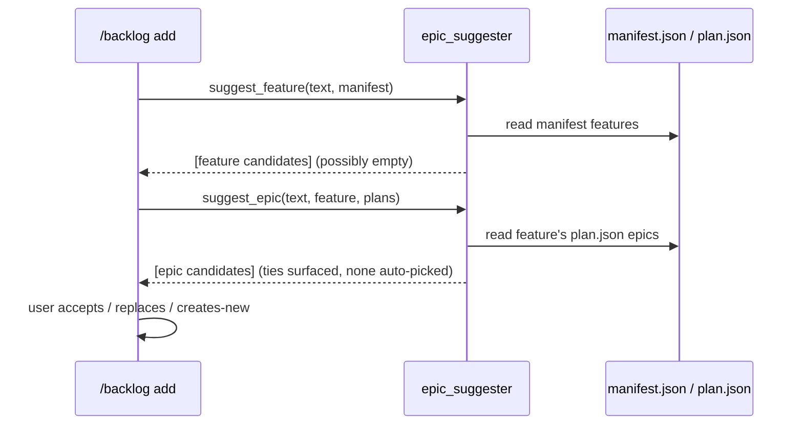

# LLD — epic-suggester

<!-- generated by /lld v2.21.0 on 2026-05-29; promoted to canonical from docs/shield/backlog-20260527/ on 2026-05-29 -->

**Feature:** `backlog-20260527`
**Owner:** `ashwini.manoj@aspora.com`
**Status:** `promoted`
**Linked PRD:** [`prd.md`](../shield/backlog-20260527/prd.md)
**Linked plans:** [`plan.md`](../shield/backlog-20260527/plan.md)
**Version:** `0.1.0`
**Last updated:** `2026-05-29`

## §1 Overview {#overview}

`epic-suggester` is a **read-only** Python helper that, at capture/promotion time, proposes a
matching feature (from `manifest.json`) and epic (from that feature's `plan.json`) for a backlog
entry. It serves PRD milestone **M2** and TRD [§5 F7](../shield/backlog-20260527/trd.md#functional-requirements)
(exact-normalized match). Story EPIC-2-S2 touches this component. It never writes — it returns
candidates; the user accepts/replaces/creates-new and `backlog-store` persists the choice.

## §2 Scope & non-goals {#scope-and-non-goals}

**In scope:** scanning `manifest.json` features and a candidate feature's `plan.json` epics;
exact-normalized matching (`casefold()` + collapsed whitespace); returning ranked-by-presence
candidates and surfacing ties.

**Out of scope:** fuzzy / token-overlap ranking (explicitly excluded in v1); writing the
association (owned by `backlog-store`); the removal decision (owned by `reconciler`, which uses
the same normalization but a different question — "did the epic land?").

## §3 Module layout {#module-layout}

```
shield/scripts/
└── epic_suggester.py        new   (normalize + suggest_feature + suggest_epic)
```

Reads (never writes): `docs/shield/manifest.json`, `docs/shield/<feature>/plan.json`.

## §4 Data model {#data-model}

n/a — stateless helper, no persistent data model. Operates on already-read `manifest.json` and
`plan.json` documents passed in (or read on demand) and returns in-memory candidate lists.

## §5 API contracts {#api-contracts}

#### normalize() {#api-normalize}

`normalize(name: str) -> str` — `casefold()` + collapse internal whitespace to single spaces +
strip. The single normalization used by both suggestion and (independently) the reconciler, so a
proposed-new name suggested here matches the name the reconciler later gates on.

#### suggest_feature() {#api-suggest-feature}

`suggest_feature(text: str, *, manifest: dict) -> list[str]` — reads `manifest["features"][].name`
(the manifest is a list keyed by `name`) and returns the names whose normalized form appears in
the normalized capture text. **`features[].name` IS the feature folder slug** (invariant pinned in
`backlog-store` LLD / EPIC-1-S1), so a returned value resolves directly to `docs/shield/<value>/`
— this is the reconciliation key the `reconciler` later derives the plan path from. Empty list ⇒
no match (capture proceeds proposed-new).

#### suggest_epic() {#api-suggest-epic}

`suggest_epic(text: str, *, feature: str, plans: dict[str, dict]) -> list[Candidate]` — `plans`
is a `{feature-slug → parsed plan.json}` map; reads `plans[feature]["epics"][]` and returns
candidates by normalized-**name** presence. A `Candidate` carries `{epic_id, name, match_kind}`
where `epic_id` is informational only (the within-plan `EPIC-N` slot) — matching and the later
removal gate (F8) key off `name`, never the positional id. A tie (≥2 candidates) is returned in
full; the caller auto-picks none.

## §6 Sequence flows {#sequence-flows}

#### Suggest on capture {#flow-suggest}



## §7 Error handling {#error-handling}

| Error | Raised when | Behavior |
|---|---|---|
| (none — soft) | `manifest.json` / `plan.json` missing or unreadable | return empty candidate list (capture proceeds proposed-new); log a debug line. Suggestion never blocks capture (F7). |
| malformed plan shape | `plan.json` lacks `epics[]` | treat as no candidates; log debug; do not raise |

## §8 Concurrency & state {#concurrency-and-state}

n/a — stateless, read-only helper, no concurrency-sensitive state. It reads point-in-time copies
of `manifest.json`/`plan.json`; staleness is harmless (the user confirms the choice, and the
reconciler re-reads at removal time).

<details>
<summary>§9 Configuration {#configuration}</summary>

n/a — no configuration. Normalization rules are fixed (F7).

</details>

## §10 Observability {#observability}

- **Logs:** a debug line per suggestion `{text_excerpt, feature_candidates, epic_candidates}`; a debug line when inputs are missing/malformed (→ empty candidates).
- **Metrics:** none in v1. The PRD §7 "suggestion acceptance ≥60%" is tracked manually via the `/backlog` audit, not telemetry.
- **Traces:** n/a — single in-process call.

<details>
<summary>§11 Security & privacy {#security-and-privacy}</summary>

n/a — reads developer-authored project artifacts only; no user data, auth, or PII.

</details>

## §12 Performance & scaling {#performance-and-scaling}

#### §12.1 Load {#load}
Invoked once per capture/promotion (interactive, low frequency).

#### §12.2 SLO {#slo}
Returns candidates in ≪ 100ms; contributes to the TRD §6 N2 ~1s budget when run during capture.

#### §12.3 Bottleneck {#bottleneck}
IO-bound: reading `manifest.json` + one `plan.json`. Matching is linear over a handful of epics.

#### §12.4 Latency breakdown {#latency-breakdown}
Two small file reads dominate; normalization + comparison is negligible. `n/a — finer numbers measured post-ship`.

#### §12.5 Capacity {#capacity}
Bounded by feature count (manifest) × epics-per-plan — tens, not thousands. Trivial memory.

#### §12.6 Scale-out lever {#scale-out-lever}
n/a — local read-only helper; no scale-out dimension. If manifest scanning ever dominates the N2 budget, the §8/§12 mitigation is the project-level epic index (TRD §8 alt 4 / §12 Q1).

#### §12.7 Caches {#caches}
None in v1 — reads fresh each call. A read cache is the lever if N2 is breached (deferred).

#### §12.8 Degradation {#degradation}
On any missing/malformed input, degrades to "no candidates" → capture proceeds proposed-new. Suggestion failure never blocks the user.

## §13 Open questions {#open-questions}

| Q# | Question | Options | Owner | Resolve-by |
|---|---|---|---|---|
| Q1 | Add a project-level epic index to avoid opening plan.json per suggestion? | manifest-only (v1) / add index | @ashwinimanoj | if TRD §6 N2 breached |

## §14 Changelog {#changelog}

| Touch | Date | Summary | Story IDs |
|---|---|---|---|
| M2 | 2026-05-29 | Initial draft via /plan | EPIC-2-S2 |
| promoted | 2026-05-29 | Promoted to canonical `docs/lld/` at milestone close | EPIC-2-S2 |
