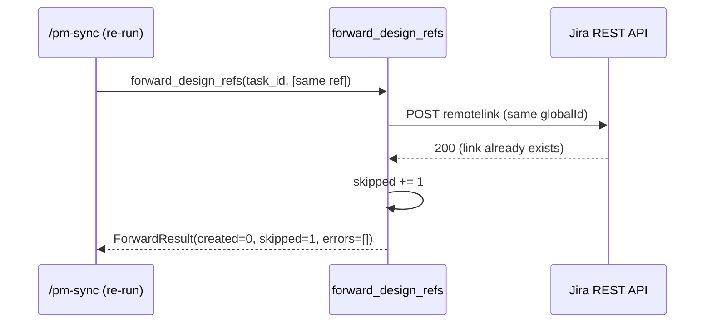

<!-- generated by /lld v2.27.0 on 2026-06-15 -->

**Feature:** `manual`
**Owner:** `ashwinimanoj@gmail.com`
**Status:** `draft`
**Linked PRD:** `n/a`
**Linked plans:** `[]`
**Version:** `0.1.0`
**Last updated:** `2026-06-15`

---

## §1 Overview {#overview}

The Jira adapter is one of Shield's four PM adapters (Jira, Confluence, ClickUp, Notion). It forwards a plan's `design_refs[]` to a Jira issue as remote issue links, so `/pm-sync` can attach design docs (TRD/LLD/PRD anchors) to the tracked story.

The component is **partially implemented**. The core operation `forward_design_refs(task_id, refs) -> ForwardResult` works as a plain callable and is tested for contract conformance and idempotency. The MCP server is a scaffold: `server/main.py` prints a placeholder and registers no MCP tools, and `.mcp.json` carries `_disabled: true`. Wiring the function into an MCP tool is deferred to EPIC-4-S3 of the TRD-refactor plan (see §2 non-goals and §13).

- Runtime shape: Python module dispatched in-process by the (not-yet-registered) MCP server. The shipped surface is a single importable callable, not a running service.
- Source directory: `shield/adapters/jira/`.
- Shared base: `shield/adapters/_common/` (`shield_adapters_common`), which defines the `DesignRef`, `ForwardResult`, `ForwardError` types and the deterministic idempotency key — see §3.

## §2 Scope & non-goals {#scope-and-non-goals}

**In scope**

- Forwarding `design_refs[]` to a Jira issue's remote links via `POST /rest/api/3/issue/{issueIdOrKey}/remotelink`.
- Idempotent upsert keyed on Jira's `globalId`, set to the ref's deterministic `idempotency_key`.
- Skipping anchorless placeholder refs (e.g. LLD `TODO`) before any HTTP call.
- Aggregating per-batch outcomes into `ForwardResult` (`created` / `skipped` / `errors`).
- Structured per-ref observability logging (`forward_design_ref`, `forward_design_ref_failed`).

**Out of scope**

- MCP tool registration — `server/main.py` is a scaffold; no MCP tools are exposed yet (deferred to EPIC-4-S3).
- The broader Shield `pm_*` abstract operations (create/update/rename/link/status/sidecar) — not implemented in this adapter; only `forward_design_refs` exists.
- Credential acquisition / auth handshakes — the caller supplies a configured `requests.Session`; the adapter does not build or store credentials.
- GET-before-POST dedup counting — the scaffold infers `created` vs `skipped` from the HTTP status code (201 vs 200), not from a prior read.
- Confluence / ClickUp / Notion forwarding — sibling adapters, separate components.

## §3 Module layout {#module-layout}

```
shield/adapters/jira/
├── pyproject.toml                  unchanged   package: shield-jira-adapter 0.1.0
├── .mcp.json                       unchanged   MCP server config (_disabled: true scaffold)
├── server/
│   ├── __init__.py                 unchanged   empty
│   ├── main.py                     unchanged   scaffold entry point — prints, no tools
│   └── tools/
│       ├── __init__.py             unchanged   empty
│       └── sync.py                 unchanged   forward_design_refs + _post_remote_link
└── tests/
    ├── conftest.py                 unchanged   sample_refs fixture
    ├── test_contract.py            unchanged   signature + empty-refs + anchorless-skip
    └── test_idempotency.py         unchanged   double-run zero-duplicate (mocked Jira)

shield/adapters/_common/            unchanged   shared base, referenced not owned here
└── shield_adapters_common/
    ├── __init__.py                             re-exports DesignRef/ForwardError/ForwardResult/idempotency_key
    └── design_refs.py                          types + idempotency_key + ForwardDesignRefsProtocol
```

All files carry `unchanged` — this is a reverse-doc of code already in the tree, not a change set.

## §4 Data model {#data-model}

`n/a — stateless adapter, no persistent data model.` The component holds no database or cache. It operates on in-memory dataclasses defined in the shared base (`shield_adapters_common.design_refs`):

| Type | Fields | Notes |
|---|---|---|
| `DesignRef` (frozen) | `story_id: str`, `doc: str` (`trd`/`lld`/`prd`), `section_id: str\|None`, `anchor_url: str\|None`, `label: str`, `component: str\|None` | `idempotency_key` is a derived property. |
| `ForwardError` | `ref: DesignRef`, `error_class: str`, `message: str`, `http_status: int\|None` | One failed forward; exposes `idempotency_key`. |
| `ForwardResult` | `created: int`, `skipped: int`, `errors: list[ForwardError]` | Per-batch aggregate. |

Idempotency key (defined in `_common`, used by Jira as `globalId`):

- With an anchor: `sha256(f"{story_id}::{anchor_url}")[:32]`.
- Anchorless placeholder: `sha256(f"{story_id}::{doc}::{component or ''}")[:32]` — stable across regenerations.

## §5 API contracts {#api-contracts}

The shipped surface is one callable, not an HTTP endpoint. It is the adapter's flavour of the shared `forward_design_refs(task_id, refs) -> ForwardResult` contract (P0-3). The downstream Jira REST call it makes is documented as its own sub-anchor.

#### forward_design_refs {#api-forward-design-refs}

- **Signature:** `forward_design_refs(task_id: str, refs: Iterable[DesignRef], *, session: requests.Session | None = None, base_url: str = "https://example.atlassian.net") -> ForwardResult`
- **`task_id`:** Jira issue ID or key (e.g. `ENG-1234`).
- **`refs`:** design refs to forward; anchorless refs are skipped silently.
- **`session`:** optional `requests.Session` carrying credentials and connection reuse; defaults to a transient session.
- **`base_url`:** Jira cloud/DC base URL.
- **Returns:** `ForwardResult` with `created` / `skipped` / `errors`.
- **Behavior:** iterates refs; anchorless → `skipped`; otherwise POSTs one remote link (see below) and counts the result.

#### POST /rest/api/3/issue/{task_id}/remotelink {#api-remotelink}

Downstream Jira REST call made by `_post_remote_link`.

- **Request body:**
  ```json
  {
    "globalId": "<idempotency_key>",
    "object": { "url": "<anchor_url or about:blank>", "title": "<label>" }
  }
  ```
- **Timeout:** 15s.
- **Response handling:**

  | HTTP status | Adapter interpretation | Result effect |
  |---|---|---|
  | 201 | created | `created += 1` |
  | 200 | idempotent skip (existing link returned) | `skipped += 1` |
  | other | error | append `ForwardError` |

  `globalId` is Atlassian's upsert key: repeating the call with the same `globalId` returns the existing link instead of creating a duplicate.

## §6 Sequence flows {#sequence-flows}

#### Forward a batch of design refs {#flow-forward-batch}

```mermaid
sequenceDiagram
    participant Caller as /pm-sync (caller)
    participant Fwd as forward_design_refs
    participant Jira as Jira REST API
    Caller->>Fwd: forward_design_refs(task_id, refs, session, base_url)
    loop for each ref
        alt ref.anchor_url is None
            Fwd->>Fwd: skipped += 1; log outcome=skipped_no_anchor
        else has anchor
            Fwd->>Jira: POST /rest/api/3/issue/{task_id}/remotelink (globalId=idempotency_key)
            alt 201 Created
                Jira-->>Fwd: 201
                Fwd->>Fwd: created += 1; log outcome=created
            else 200 OK (existing link)
                Jira-->>Fwd: 200
                Fwd->>Fwd: skipped += 1; log outcome=idempotent_skip
            else error / non-2xx / exception
                Jira-->>Fwd: 4xx/5xx or RequestException
                Fwd->>Fwd: errors.append(ForwardError); log forward_design_ref_failed
            end
        end
    end
    Fwd-->>Caller: ForwardResult(created, skipped, errors)
```

#### Idempotent re-run {#flow-idempotent-rerun}



## §7 Error handling {#error-handling}

| Identifier | Trigger | HTTP status | Behavior |
|---|---|---|---|
| `skipped_no_anchor` | `ref.anchor_url is None` | none | Count `skipped`; log `forward_design_ref` with `outcome=skipped_no_anchor`; no HTTP call. |
| `idempotent_skip` | POST returns 200 (link exists) | 200 | Count `skipped`; log `forward_design_ref` with `outcome=idempotent_skip`. |
| `<ExceptionClassName>` | `requests.RequestException` (network/timeout) | `None` | Append `ForwardError(error_class=type(exc).__name__, http_status=None)`; log `forward_design_ref_failed`; continue to next ref. |
| `HTTPError` | non-2xx, non-200/201 response | the response status | Append `ForwardError(error_class="HTTPError", message=resp.text[:200])`; log `forward_design_ref_failed`; continue. |

The batch never aborts on a single ref failure — errors are collected and surfaced in `ForwardResult.errors`. The caller decides how to react.

## §8 Concurrency & state {#concurrency-and-state}

`n/a — stateless adapter, no concurrency-sensitive state.` The function holds no shared mutable state across calls; `ForwardResult` is created per invocation. Externalised state and safety:

- **Idempotency:** Jira's `globalId` upsert is the only cross-call coordination. Two concurrent runs with the same refs converge — both target the same `globalId`, so at most one remote link exists.
- **Session:** an optional caller-supplied `requests.Session` is the only shared object; thread-safety of a shared session is the caller's responsibility (`requests.Session` is not guaranteed thread-safe).

## §9 Configuration {#configuration}

<details open>
<summary>§9 Configuration</summary>

The adapter takes configuration as function arguments, not environment variables or a config file.

| Name | Type | Default | Secret | Hot-reloadable | Notes |
|---|---|---|---|---|---|
| `base_url` | `str` | `https://example.atlassian.net` | no | n/a (per-call arg) | Jira cloud/DC base URL. The default is a placeholder; real callers pass their tenant URL. |
| `session` | `requests.Session \| None` | `None` (transient session) | yes (carries auth) | n/a (per-call arg) | Pre-authenticated session. Credentials live on the session the caller builds; the adapter never reads or stores them. |
| request timeout | `int` (seconds) | `15` | no | no | Hard-coded in `_post_remote_link`; not externally tunable today. |

</details>

## §10 Observability {#observability}

**Logs** — Python `logging` via module logger `server.tools.sync`, structured `extra` fields per the P1-8 observability contract:

| Event | Level | Fields |
|---|---|---|
| `forward_design_ref` | INFO | `story_id`, `adapter="jira"`, `anchor_url`, `outcome` (`created` / `idempotent_skip` / `skipped_no_anchor`), `idempotency_key` |
| `forward_design_ref_failed` | WARNING | `story_id`, `adapter="jira"`, `error_class`, `http_status`, `idempotency_key` |

**Metrics** — `n/a — no metrics emitted; created/skipped/errors counts are returned in ForwardResult for the caller to surface.`

**Traces** — `n/a — no tracing instrumentation in the scaffold; measured post-MCP-wiring (EPIC-4-S3).`

## §11 Security & privacy {#security-and-privacy}

<details open>
<summary>§11 Security & privacy</summary>

**AuthN** — The adapter does not authenticate. The caller passes a `requests.Session` pre-loaded with Jira credentials (API token / basic auth). The adapter only attaches the session to outbound POSTs and never reads, logs, or persists the credential.

**AuthZ** — Delegated entirely to Jira. Whatever the session's principal may do on `/rest/api/3/issue/{id}/remotelink` is what the adapter can do. The adapter performs no local authorization.

**Data classification** — Forwarded payload is design-doc metadata: `anchor_url`, `label`, and the derived `globalId`. No PII or secrets are placed in the payload. Logs include `anchor_url` and `idempotency_key` (a non-reversible sha256 prefix) — both low-sensitivity. Credentials are never logged.

**Threat model**

| Risk | Mitigation |
|---|---|
| Credential leak in logs | Adapter logs no auth material; only anchor URL + idempotency key. |
| Duplicate-link spam on re-run | `globalId` upsert guarantees idempotence. |
| `error.message` leaking response body | Truncated to `resp.text[:200]`; still surfaced to caller, so callers must avoid logging raw Jira error bodies at low sensitivity. Tracked in §13. |
| Default `base_url` pointing at a placeholder tenant | Caller must override `base_url`; default `https://example.atlassian.net` is non-functional, not a real tenant. |

</details>

## §12 Performance & scaling {#performance-and-scaling}

#### §12.1 Load {#load}
Driven by `/pm-sync` runs, not user traffic. One invocation per synced story; one HTTP POST per ref with an anchor. A typical plan carries a handful of refs per story. Spiky (a full sprint sync), not steady.

#### §12.2 SLO {#slo}
`n/a — no formal SLO; this is a CLI-driven batch helper, not a serving path.` Bounded by Jira's API latency and the 15s per-request timeout.

#### §12.3 Bottleneck {#bottleneck}
Network/IO-bound. Each ref is a synchronous, sequential HTTP round-trip to Jira; no CPU-heavy work (only a sha256 prefix per ref).

#### §12.4 Latency breakdown {#latency-breakdown}
`n/a — measured post-ship.` Dominant contributor by design is the Jira REST RTT per ref (≤15s timeout each); internal CPU is negligible.

#### §12.5 Capacity {#capacity}
Single-threaded, sequential. Total wall time ≈ (refs with anchors) × Jira RTT. No connection-pool tuning beyond what the caller's `requests.Session` provides.

#### §12.6 Scale-out lever {#scale-out-lever}
The function is stateless and parallelizable across distinct `task_id`s. No max-replica constraint of its own. Practical limit is Jira API rate limits, not the adapter — see §12.8.

#### §12.7 Caches {#caches}
`n/a — no caching. Idempotency is enforced server-side by Jira's globalId upsert, not a local cache.`

#### §12.8 Degradation {#degradation}
On Jira errors or network failures, the affected refs land in `ForwardResult.errors` and the batch continues; successfully-forwarded refs are unaffected. The caller sees partial success and can re-run safely (idempotent). There is no retry/backoff in the scaffold — Jira rate-limit (429) responses are recorded as `HTTPError` and left to the caller to retry; tracked in §13.

## §13 Open questions {#open-questions}

| Q# | Question | Options | Owner | Resolve-by |
|---|---|---|---|---|
| Q1 | When is the MCP tool registered so the adapter is callable over MCP? | Wire in EPIC-4-S3 per `server/main.py` / `.mcp.json` notes | ashwinimanoj@gmail.com | EPIC-4-S3 |
| Q2 | Should `created` vs `skipped` be derived from a GET-before-POST instead of 201/200 status inference? | (a) keep status inference; (b) GET-first for accurate counts | ashwinimanoj@gmail.com | before GA |
| Q3 | Add retry/backoff for Jira 429 rate limits? | (a) caller retries; (b) adapter retries with backoff | ashwinimanoj@gmail.com | before GA |
| Q4 | Make request timeout (15s) configurable rather than hard-coded? | (a) leave fixed; (b) add `timeout` arg | ashwinimanoj@gmail.com | before GA |
| Q5 | Should the truncated Jira error body be redacted further before reaching callers' logs? | (a) keep `[:200]`; (b) structured redaction | ashwinimanoj@gmail.com | before GA |

## §14 Changelog {#changelog}

| Touch | Date | Summary | Story IDs |
|---|---|---|---|
| manual | 2026-06-15 | reverse-doc by ashwinimanoj@gmail.com | n/a |
