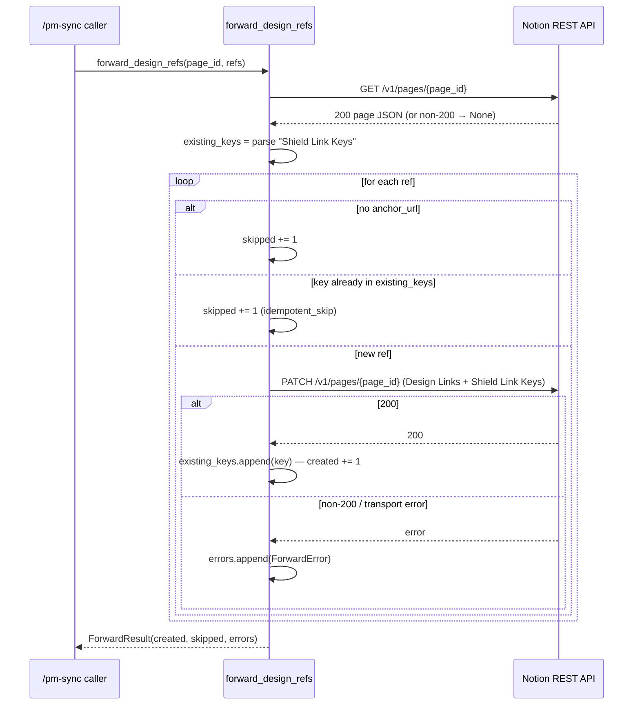
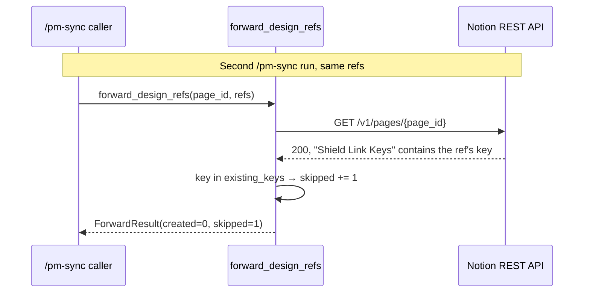

<!-- generated by /lld v2.27.0 on 2026-06-15 -->

**Feature:** `manual`
**Owner:** `ashwinimanoj@gmail.com`
**Status:** `draft`
**Linked PRD:** `n/a`
**Linked plans:** `[]`
**Version:** `0.1.0`
**Last updated:** `2026-06-15`

## §1 Overview {#overview}

The Notion adapter is one of Shield's four PM-tool adapters (alongside Jira,
Confluence, and ClickUp). It forwards `design_refs[]` from a plan's `plan.json`
sidecar onto a Notion page so that synced stories link back to their TRD / LLD /
PRD anchors. It is the Notion implementation of the shared
`forward_design_refs(task_id, refs) -> ForwardResult` contract in
`shield/adapters/_common`.

Runtime shape: a Python MCP server package (`shield-notion-adapter`) intended to
run via `uv run ... server/main.py`. **Status: partially implemented.** The core
forwarding logic in `server/tools/sync.py` is complete and tested, but the MCP
server entry point (`server/main.py`) is a scaffold that registers no tools, and
the MCP wiring (`.mcp.json`) is disabled (`_disabled: true`, "wired in
EPIC-4-S3"). The adapter is callable today only as a Python function, not as a
live MCP server.

Component directory: `shield/adapters/notion/`.

## §2 Scope & non-goals {#scope-and-non-goals}

**In scope:**
- Forwarding `design_refs[]` to a Notion page's URL property (`Design Links`)
  with idempotent dedup via a `Shield Link Keys` rich-text property.
- The deterministic idempotency contract shared across all four adapters (key =
  `sha256(story_id + anchor_url)[:32]`, owned by `_common`).
- GET-then-PATCH write path against the Notion REST API (`api.notion.com`),
  since Notion has no native upsert-by-key.

**Out of scope:**
- Live MCP server exposure — `server/main.py` is a scaffold; MCP tool
  registration is deferred to EPIC-4-S3 (see §13).
- Creating or locating Notion pages — `task_id` is assumed to be an existing
  Notion page UUID supplied by the caller.
- Authentication / token acquisition — the caller supplies a pre-authenticated
  `requests.Session`; the adapter sets no headers itself (see §11, §13).
- Multi-URL property handling — only a single `url` value is written per page;
  prior refs' URLs are not preserved on the `Design Links` property (see §13).
- Notion API rate-limit handling, retries, and backoff — none implemented
  (see §7, §12.8).

## §3 Module layout {#module-layout}

```
shield/adapters/notion/
├── pyproject.toml                 unchanged   # package: shield-notion-adapter v0.1.0
├── .mcp.json                      unchanged   # MCP wiring (currently _disabled)
├── server/
│   ├── __init__.py                unchanged   # empty
│   ├── main.py                    unchanged   # scaffold entry point — no tools registered
│   └── tools/
│       ├── __init__.py            unchanged   # empty
│       └── sync.py                unchanged   # forward_design_refs() — core logic
└── tests/
    ├── conftest.py                unchanged   # sample_refs fixture
    ├── test_contract.py           unchanged   # signature + empty-refs contract
    └── test_idempotency.py        unchanged   # P0-4 double-run dedup test
```

Shared dependency (referenced, not owned by this component):

```
shield/adapters/_common/
└── shield_adapters_common/
    ├── __init__.py                            # re-exports DesignRef, ForwardError, ForwardResult, idempotency_key
    └── design_refs.py                         # shared types + idempotency_key() + ForwardDesignRefsProtocol
```

`server/tools/sync.py` imports `DesignRef`, `ForwardError`, and `ForwardResult`
from `shield_adapters_common` and implements the `ForwardDesignRefsProtocol`
signature defined there.

## §4 Data model {#data-model}

`n/a — stateless adapter, no persistent data store.` The adapter owns no
database or cache. Its only durable state lives remotely on the Notion page, in
two page properties:

| Notion property | Notion type | Written by | Purpose |
|---|---|---|---|
| `Design Links` | `url` | PATCH payload | Holds the ref's `anchor_url`. Single-valued; overwritten per write. |
| `Shield Link Keys` | `rich_text` | PATCH payload | Comma-joined list of idempotency keys; the dedup ledger read on the next run. |

In-process value types (from `shield_adapters_common`, not persisted):

| Type | Fields |
|---|---|
| `DesignRef` (frozen) | `story_id`, `doc`, `section_id`, `anchor_url`, `label`, `component`; derived `idempotency_key` property |
| `ForwardError` | `ref`, `error_class`, `message`, `http_status`; derived `idempotency_key` |
| `ForwardResult` | `created: int`, `skipped: int`, `errors: list[ForwardError]` |

## §5 API contracts {#api-contracts}

The adapter exposes one Python operation and consumes two Notion REST endpoints.
It registers no MCP tool yet (scaffold).

### forward_design_refs {#api-forward-design-refs}

Implements the shared PM operation `forward_design_refs`.

- **Signature:**
  `forward_design_refs(task_id: str, refs: Iterable[DesignRef], *, session: requests.Session | None = None, base_url: str = "https://api.notion.com") -> ForwardResult`
- **`task_id`:** the Notion page UUID.
- **Request:** an iterable of `DesignRef`. Each ref carries `story_id`,
  `anchor_url`, `label`, `idempotency_key`.
- **Response:** `ForwardResult{created, skipped, errors[]}`.
- **Behavior:** GET the page once, read existing keys, then per ref: skip if no
  `anchor_url`, skip if `idempotency_key` already present, else PATCH the page.
- **Errors:** surfaced as `ForwardError` entries in `result.errors` (never
  raised). See §7.

### Notion GET page (consumed) {#api-notion-get-page}

- **Request:** `GET {base_url}/v1/pages/{page_id}` with `timeout=15`.
- **Response (200):** page JSON; the adapter reads
  `properties["Shield Link Keys"].rich_text[0].text.content`.
- **Non-200 or transport error:** treated as "page unknown" — `_fetch_page`
  returns `None`, existing keys default to `[]` (see §7).

### Notion PATCH page (consumed) {#api-notion-patch-page}

- **Request:** `PATCH {base_url}/v1/pages/{page_id}` with `timeout=15` and body:
  ```json
  {
    "properties": {
      "Design Links": { "url": "<ref.anchor_url>" },
      "Shield Link Keys": { "rich_text": [ { "text": { "content": "<comma-joined keys>" } } ] }
    }
  }
  ```
- **Response (200):** counted as `created += 1`; key appended to the in-memory
  ledger for the rest of the batch.
- **Non-200:** `ForwardError(error_class="HTTPError", http_status=<code>,
  message=<resp.text[:200]>)`.

## §6 Sequence flows {#sequence-flows}

### Forward a batch of design refs {#flow-forward-batch}



### Idempotent re-run {#flow-idempotent-rerun}



## §7 Error handling {#error-handling}

No exceptions propagate from `forward_design_refs`; all failures are recorded in
`ForwardResult`. Behavior matrix:

| Identifier | Where | HTTP status | Behavior |
|---|---|---|---|
| `fetch_failed` | `_fetch_page` transport error | n/a | Return `None`; treat page as having no keys; proceed (may re-write existing refs). Log-only (implicit). |
| `fetch_non_200` | `_fetch_page` non-200 | any non-200 | Same as above — `None`, keys default to `[]`. |
| `skipped_no_anchor` | ref has no `anchor_url` | n/a | `skipped += 1`; `logger.info` outcome `skipped_no_anchor`. |
| `idempotent_skip` | key already on page | n/a | `skipped += 1`; `logger.info` outcome `idempotent_skip`. |
| `patch_transport_error` | `_patch_page` `RequestException` | `None` | `ForwardError(error_class=<exc type>, http_status=None)` appended; `logger.warning`. |
| `patch_http_error` | `_patch_page` non-200 | response code | `ForwardError(error_class="HTTPError", message=resp.text[:200])`; `logger.warning`. |

No retry or backoff anywhere — a failed PATCH is recorded and the loop moves to
the next ref. Notion API rate-limit responses (HTTP 429) are not handled
specially; they fall through to `patch_http_error` (see §12.8).

## §8 Concurrency & state {#concurrency-and-state}

`n/a — single-shot, single-threaded call; no in-process concurrency.` The
function GETs once, then iterates refs sequentially with synchronous
`requests` calls. Notes on externalized state and races:

- **Dedup ledger is the remote page.** The `Shield Link Keys` property is the
  only source of truth for what was already forwarded. The in-memory
  `existing_keys` list is updated after each successful PATCH so duplicate refs
  within one batch are deduped without a re-GET.
- **Concurrent runs against the same page** (two `/pm-sync` invocations at once)
  are an unguarded race: both GET the same key set, both PATCH. There is no
  optimistic-concurrency token or lock. The last PATCH wins on `Design Links`;
  `Shield Link Keys` can lose entries because each writer joins onto the keys it
  read at GET time (see §13).

## §9 Configuration {#configuration}

<details open>
<summary>§9 Configuration</summary>

| Name | Type | Default | Range | Secret | Hot-reload |
|---|---|---|---|---|---|
| `base_url` | str (kwarg) | `https://api.notion.com` | any URL | no | n/a — per-call arg |
| `session` | `requests.Session` (kwarg) | new `Session()` | n/a | carries token if caller sets it | n/a — per-call arg |
| `URL_PROPERTY` | module constant | `"Design Links"` | n/a | no | no — code constant |
| `KEY_PROPERTY` | module constant | `"Shield Link Keys"` | n/a | no | no — code constant |
| request `timeout` | literal | `15` s | n/a | no | no — code constant |

The Notion page must already carry a `Design Links` URL property and a
`Shield Link Keys` rich-text property; these names are hard-coded constants, not
configurable. The MCP wiring in `.mcp.json` is present but `_disabled`.

</details>

## §10 Observability {#observability}

**Logs** — structured via `logger` (`logging.getLogger(__name__)`), `extra={...}`:

| Event | Fields |
|---|---|
| `forward_design_ref` (info) | `story_id`, `adapter="notion"`, `anchor_url`, `outcome` (`skipped_no_anchor` / `idempotent_skip` / `created`), `idempotency_key` |
| `forward_design_ref_failed` (warning) | `story_id`, `adapter="notion"`, `error_class`, `http_status`, `idempotency_key` |

**Metrics** — `n/a — no metrics emitted in code.` Counts are returned in
`ForwardResult{created, skipped, errors}` for the caller to aggregate, but no
gauges/counters/histograms are exported.

**Traces** — `n/a — no tracing instrumentation in code.`

## §11 Security & privacy {#security-and-privacy}

<details open>
<summary>§11 Security & privacy</summary>

**AuthN.** The adapter performs no authentication itself. It relies on the
caller-supplied `requests.Session` to carry the Notion API bearer token (and
`Notion-Version` header). If the caller passes no session, the adapter creates a
bare `Session()` with no auth — calls will 401 and surface as `patch_http_error`
/ a `None` GET. The Notion token is a secret; it must never be logged.

**AuthZ.** Delegated entirely to Notion: the token's integration must have edit
access to the target page. The adapter does no permission checks.

**Data classification.** Forwarded payloads are design-doc URLs (`anchor_url`),
human labels, and idempotency keys (SHA-256 hex). No PII or credentials are
written to page properties. Logs include `anchor_url`, `story_id`, and
`idempotency_key` but **not** the token.

**Threat model.**
- *Token leakage* — the token lives only in the caller's `Session`; the adapter
  never reads or logs it. Risk: a caller logging the session at a higher layer.
- *Wrong-page write* — `task_id` is trusted verbatim; a bad page UUID writes to
  an unintended page if the token has access. No validation.
- *Response-body in errors* — `_patch_page` stores `resp.text[:200]` in
  `ForwardError.message`; a Notion error body is low-risk but is surfaced to
  callers/logs.

</details>

## §12 Performance & scaling {#performance-and-scaling}

#### §12.1 Load {#load}
Driven by `/pm-sync`: one batch per synced Notion page, one `DesignRef` per
forwarded plan anchor — typically single digits to low tens of refs per call.
Invocation is operator-triggered, not a steady request stream.

#### §12.2 SLO {#slo}
`n/a — no SLO defined for an operator-triggered sync adapter.` Bounded instead
by Notion API latency; each call is 1 GET + up to N PATCHes at `timeout=15` s.

#### §12.3 Bottleneck {#bottleneck}
Network/IO-bound: every ref is a synchronous round trip to `api.notion.com`. CPU
work (SHA-256 key compute, JSON parse) is negligible against network RTT.

#### §12.4 Latency breakdown {#latency-breakdown}
Per batch: 1 GET RTT + (new refs × 1 PATCH RTT) to Notion. No internal DB or
downstream RPC beyond Notion. Concrete numbers `n/a — measured post-ship`.

#### §12.5 Capacity {#capacity}
`n/a — single-process synchronous function with no pool to size.` Each call uses
one `requests.Session` (one connection); headroom is bounded by Notion API
limits, not local resources.

#### §12.6 Scale-out lever {#scale-out-lever}
Stateless per call — multiple callers can run independently. Constraint: do not
run concurrent batches against the *same* page (lost-update race, §8). No
max-replica limit otherwise.

#### §12.7 Caches {#caches}
No local cache. The single per-call GET acts as the dedup read; within one batch
the in-memory `existing_keys` list avoids re-GETs for duplicate refs. TTL: n/a.

#### §12.8 Degradation {#degradation}
On Notion failure (transport error, non-200, or rate-limit 429), the affected
ref is recorded in `ForwardResult.errors` and the batch continues; no retry or
backoff. A failed GET degrades to "treat page as empty," which can re-PATCH
already-forwarded refs. There is no circuit breaker and no user-facing alert in
this layer — the caller decides what to surface from `errors[]`.

## §13 Open questions {#open-questions}

| Q# | Question | Options | Owner | Resolve-by |
|---|---|---|---|---|
| Q1 | When is the MCP server entry point implemented? | Register tools in `server/main.py`; remove `_disabled` from `.mcp.json` | EPIC-4-S3 | EPIC-4 |
| Q2 | `Design Links` is single-valued `url`; multiple refs overwrite each other on the page. Should it be a multi-URL / relation property? | Switch to multi-URL property; or one child block per ref | ashwinimanoj@gmail.com | unresolved |
| Q3 | `_patch_page` passes `existing_urls=[]` always; the param is unused dead code. Remove or wire up? | Remove param; or use it to preserve prior URLs | ashwinimanoj@gmail.com | unresolved |
| Q4 | Concurrent runs on one page can drop `Shield Link Keys` entries (lost update). Add optimistic concurrency? | Use Notion page version / ETag; or serialize per page | ashwinimanoj@gmail.com | unresolved |
| Q5 | Failed GET defaults keys to `[]`, risking re-write of forwarded refs. Should a GET failure abort instead? | Abort batch on GET failure; or keep best-effort | ashwinimanoj@gmail.com | unresolved |
| Q6 | Where is the Notion token sourced and which `Notion-Version` is pinned? Caller-supplied session today. | Document required session headers; add a session factory | ashwinimanoj@gmail.com | unresolved |

## §14 Changelog {#changelog}

| Touch | Date | Summary | Story IDs |
|---|---|---|---|
| manual | 2026-06-15 | reverse-doc by ashwinimanoj@gmail.com | n/a |
