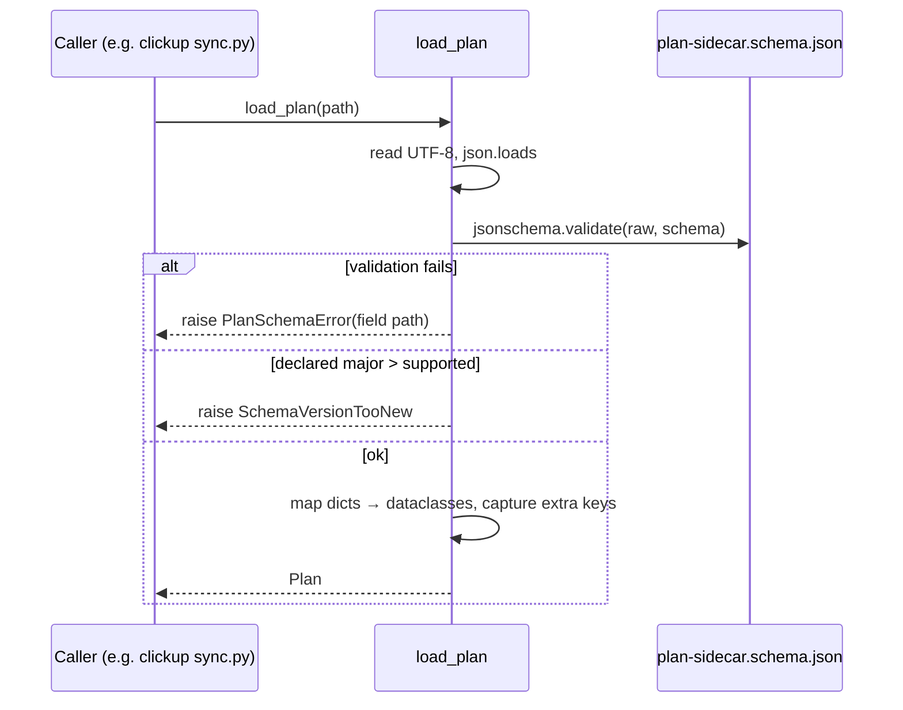
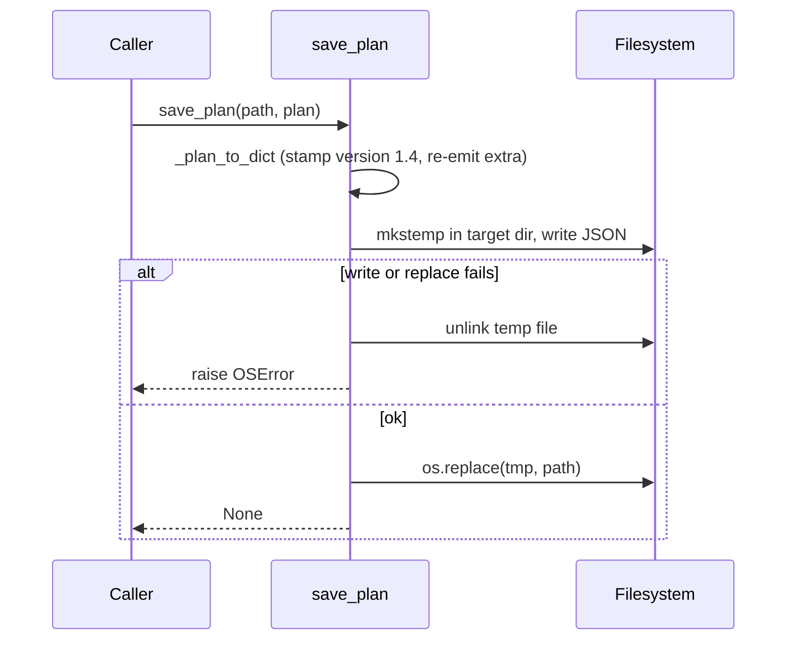

# LLD — parsers

<!-- generated by /lld v2.27.0 on 2026-06-15 -->

**Feature:** `manual`
**Owner:** `ashwinimanoj@gmail.com`
**Status:** `draft`
**Linked PRD:** `n/a`
**Linked plans:** `[]`
**Version:** `0.1.0`
**Last updated:** `2026-06-15`

## §1 Overview {#overview}

`parsers` is the `shield-parsers` Python library (package `shield_parsers`) at
[`shield/parsers/`](../../shield/parsers/). It is the canonical typed reader/writer
for Shield artifact files — today, the `plan.json` sidecar.

It is a stateless library, not a service or daemon. Callers import it, hand it a
file path, and get back typed dataclasses (or write them out). The public surface
is two functions plus the dataclasses they return:

- `load_plan(path)` — read and schema-validate a `plan.json` into a typed `Plan`.
- `save_plan(path, plan)` — atomically write a `Plan` back, stamping the current
  schema version.

Consumers in the repo: the ClickUp adapter
([`sync.py`](../../shield/adapters/clickup/server/tools/sync.py),
`backfill.py`, `rename.py`, `status.py`), the backlog triggers
([`triggers.py`](../../shield/backlog/shield_backlog/triggers.py)), and
[`backlog_store.py`](../../shield/scripts/backlog_store.py). This LLD is a
reverse-doc; no PRD or plan milestone drove it.

## §2 Scope & non-goals {#scope-and-non-goals}

**In scope:**

- The `load_plan` / `save_plan` public API and the typed dataclasses
  (`Plan`, `Epic`, `Story`, `Milestone`, `DesignRef`).
- JSON Schema validation against `shield/schema/plan-sidecar.schema.json`.
- Schema-version gating (reject majors newer than supported).
- Unknown-key preservation across the load/save round trip.
- Atomic write semantics.

**Out of scope:**

- The sidecar JSON Schema itself — owned by `shield/schema/`, not this library.
- Writing or mutating plan content — callers build `Plan` objects; this library
  only serializes them.
- A "future TRD section parser" named in `pyproject.toml` — not yet implemented.
- Network, persistence, or process state — none; this is a pure file transform.

## §3 Module layout {#module-layout}

```
shield/parsers/
├── pyproject.toml                    unchanged   package metadata (shield-parsers 0.1.0)
├── shield_parsers/
│   ├── __init__.py                   unchanged   public re-exports (__all__)
│   └── sidecar.py                    unchanged   load_plan/save_plan + dataclasses
└── tests/
    ├── __init__.py                   unchanged
    ├── conftest.py                   unchanged   schema_path fixture
    └── test_sidecar.py               unchanged   load/save/round-trip/atomicity tests
```

Cross-package dependency: `sidecar.py` resolves the schema at
`shield/schema/plan-sidecar.schema.json` via `parents[2]` from the module file.

## §4 Data model {#data-model}

`n/a — stateless library, no persistent data model`

The library owns no database, cache, or persisted state. Its in-memory typed
shape (the dataclasses returned to callers) is the API contract — see §5. The
on-disk artifact it reads and writes (`plan.json`) is owned by the
`shield/schema/plan-sidecar.schema.json` schema, not by this library.

## §5 API contracts {#api-contracts}

`n/a — library, no network API.` The contract is the public Python callable
surface re-exported from `shield_parsers/__init__.py`. Each "endpoint" below is a
callable; verb/path do not apply.

#### `load_plan(path)` {#api-load-plan}

Read, schema-validate, and parse a `plan.json` sidecar into a typed `Plan`.

- **Signature:** `load_plan(path: Path | str) -> Plan`
- **Input:** filesystem path to a `plan.json`.
- **Behavior:** reads UTF-8 JSON, validates against
  `plan-sidecar.schema.json`, gates the declared major version, then maps each
  object into typed dataclasses. Unknown keys at every level are captured into an
  `extra` dict so they survive a later `save_plan`.
- **Returns:** a `Plan` with `version`, `project`, `name`, `epics[]`,
  `milestones[]`, optional metadata, and `extra`.
- **Raises:** `PlanSchemaError` (schema validation failure, naming the failing
  field path), `SchemaVersionTooNew` (declared major > supported),
  `FileNotFoundError` / `json.JSONDecodeError` (propagated from the read).

#### `save_plan(path, plan)` {#api-save-plan}

Atomically write a `Plan` to disk as `plan.json`.

- **Signature:** `save_plan(path: Path | str, plan: Plan) -> None`
- **Input:** target path and a `Plan` object.
- **Behavior:** serializes the `Plan` to a dict, **always stamps
  `CURRENT_SCHEMA_VERSION` (1.4)** regardless of the input version, writes to a
  temp file in the target directory, then `os.replace()`s it into place. Re-emits
  `extra` keys to preserve forward-compatible fields. A `DesignRef.stale` field
  is written only when `True`; `Milestone.depends_on` and `Plan.metadata` are
  written only when non-empty.
- **Returns:** `None`.
- **Raises:** any `OSError` from write/replace, after removing the temp file.

**Typed model (return shapes):**

| Dataclass | Required fields | Notable optional fields |
|---|---|---|
| `Plan` | `version`, `project`, `name`, `epics` | `milestones`, `phase`, `source_research`, `source_prd`, `metadata`, `extra` |
| `Epic` | `id`, `name`, `stories` | `pm_id`, `pm_url`, `extra` |
| `Story` | `id`, `name`, `status`, `description`, `tasks`, `acceptance_criteria` | `assignee`, `priority`, `week`, `milestone_id`, `design_refs`, `pm_id`, `pm_url`, `extra` |
| `Milestone` | `id`, `name`, `outcome`, `exit_criteria` | `depends_on`, `extra` |
| `DesignRef` | `doc`, `label` | `component`, `section_id`, `anchor_url`, `stale`, `extra` |

## §6 Sequence flows {#sequence-flows}

#### Load and validate a plan {#flow-load-plan}



#### Atomic save of a plan {#flow-save-plan}



## §7 Error handling {#error-handling}

| Identifier | HTTP status | Trigger | Documented behavior |
|---|---|---|---|
| `PlanSchemaError` | n/a (library) | `plan.json` fails JSON Schema validation | Raised by `load_plan`; message names the failing field path so callers can act. Subclass of `ValueError`. |
| `SchemaVersionTooNew` | n/a | declared major version > `CURRENT_SCHEMA_VERSION` major | Raised by `load_plan`; message states declared vs max supported. Subclass of `ValueError`. |
| `FileNotFoundError` | n/a | path does not exist | Propagated from `Path.read_text`; not caught. |
| `json.JSONDecodeError` | n/a | file is not valid JSON | Propagated from `json.loads`; not caught. |
| `KeyError` | n/a | a schema-required key is absent after validation | Theoretically unreachable when the schema is in sync, since validation runs first; would propagate if it occurred. |
| `OSError` (save) | n/a | write or `os.replace` fails | `save_plan` removes the temp file, then re-raises. No partial output left behind. |

Retry, user-surfacing, and logging are the caller's responsibility; the library
only raises typed errors.

## §8 Concurrency & state {#concurrency-and-state}

`n/a — stateless, pure transformation.` The functions hold no shared state and
spawn no threads. Each call reads or writes one file and returns.

Externalised state note: `save_plan` is atomic per call via temp-file +
`os.replace` (POSIX rename is atomic on the same filesystem), so a concurrent
reader sees either the old file or the new file, never a partial write. The
library does not coordinate concurrent writers to the same path — last writer
wins. Cross-file numbering or ordering invariants across multiple `plan.json`
files are not this library's concern.

## §9 Configuration {#configuration}

<details>
<summary>§9 Configuration</summary>

`n/a — no user-tunable configuration.` The only fixed constants are
`CURRENT_SCHEMA_VERSION` (`"1.4"`) and `MIN_SUPPORTED_VERSION` (`"1.0"`), both
compile-time, neither hot-reloadable. The schema path is derived from the module
location, not configured.

(promote-on-demand — lift by replacing `<details>` with `<details open>` and
populating non-vague content)

</details>

## §10 Observability {#observability}

**Logs:** none. The library emits no log lines; it raises typed exceptions and
lets callers decide how to log. Diagnostic context is carried in exception
messages (failing field path, declared-vs-supported version).

**Metrics:** none emitted. Callers may time `load_plan` / `save_plan` if they
need parse-latency counters.

**Traces:** no spans. If a caller runs under a tracer, a `load_plan` /
`save_plan` call appears as in-process time inside the caller's span; the library
adds no instrumentation of its own.

## §11 Security & privacy {#security-and-privacy}

<details>
<summary>§11 Security & privacy</summary>

`n/a — no auth, no PII handling.` The library has no network surface and does no
authentication or authorization. It reads and writes local files supplied by the
trusted caller.

Notes worth flagging: `plan.json` may contain assignee identifiers and PM URLs
(`assignee`, `pm_url`), which are low-sensitivity workspace data, not credentials
or PII. JSON Schema validation runs before any field is trusted, which bounds
malformed-input risk. No secrets are read, stored, or emitted.

(promote-on-demand — lift by replacing `<details>` with `<details open>` and
populating non-vague content)

</details>

## §12 Performance & scaling {#performance-and-scaling}

#### §12.1 Load {#load}
One `plan.json` per call, invoked at low frequency — on `/plan`, `/implement`,
and ClickUp sync/backfill/rename/status runs, not on a request hot path.
Payloads are small: tens of epics/stories per plan, typically well under 1 MB.

#### §12.2 SLO {#slo}
`n/a — library, no service SLO.` Latency is bounded by file size and JSON Schema
validation; for normal plan sizes a load is sub-100 ms on commodity hardware.
The caller owns any end-to-end SLO.

#### §12.3 Bottleneck {#bottleneck}
CPU/IO-bound on two steps: reading the file and `jsonschema.validate` (which
walks the whole document). For the expected payload sizes neither dominates;
validation cost grows with document size, not call rate.

#### §12.4 Latency breakdown {#latency-breakdown}
`n/a — measured post-ship; targets in §12.2 SLO.` Contributors are a single
disk read, one `json.loads`, one schema validation pass, and dataclass mapping —
all in-process, no network RTT or downstream RPC.

#### §12.5 Capacity {#capacity}
Memory scales with the loaded document: the raw dict plus the typed dataclass
tree, both proportional to plan size. No connection pools or persistent
allocations. A single small plan fits comfortably in a few MB.

#### §12.6 Scale-out lever {#scale-out-lever}
Stateless — scales trivially with the calling process. Many processes can call
`load_plan` in parallel on different files with no coordination. There is no
server to replicate and no max-replica constraint.

#### §12.7 Caches {#caches}
No caching. `_load_schema()` re-reads and re-parses the schema file on every
`load_plan` call; this is intentional simplicity given the low call rate. A
schema cache would be the first optimization if call frequency rose.

#### §12.8 Degradation {#degradation}
On bad input the library fails closed: it raises a typed error and writes
nothing rather than emitting a partial or invalid artifact. `save_plan` never
leaves a `.tmp` orphan or a half-written target. There is no downstream to
degrade against; the caller decides whether to retry or surface the error.

## §13 Open questions {#open-questions}

| Q# | Question | Options | Owner | Resolve-by |
|---|---|---|---|---|
| Q1 | `CURRENT_SCHEMA_VERSION` is `"1.4"` but `plan-sidecar.schema.json` is at `1.6` and its `version` enum allows `1.5`/`1.6`. Should the library track the schema, or is the lag intentional? | Bump constant to `1.6`; or document the supported ceiling explicitly | parsers maintainer | n/a |
| Q2 | `MIN_SUPPORTED_VERSION` (`"1.0"`) is exported but never enforced in `load_plan` (only the major-too-new gate runs). Dead constant or planned floor check? | Wire a min-version gate; or drop the constant | parsers maintainer | n/a |
| Q3 | `pyproject.toml` describes a "future TRD section parser." Is that still planned for this package? | Implement here; or split into a separate module | parsers maintainer | n/a |

## §14 Changelog {#changelog}

| Touch | Date | Summary | Story IDs |
|---|---|---|---|
| manual | 2026-06-15 | reverse-doc by ashwinimanoj@gmail.com | n/a |
