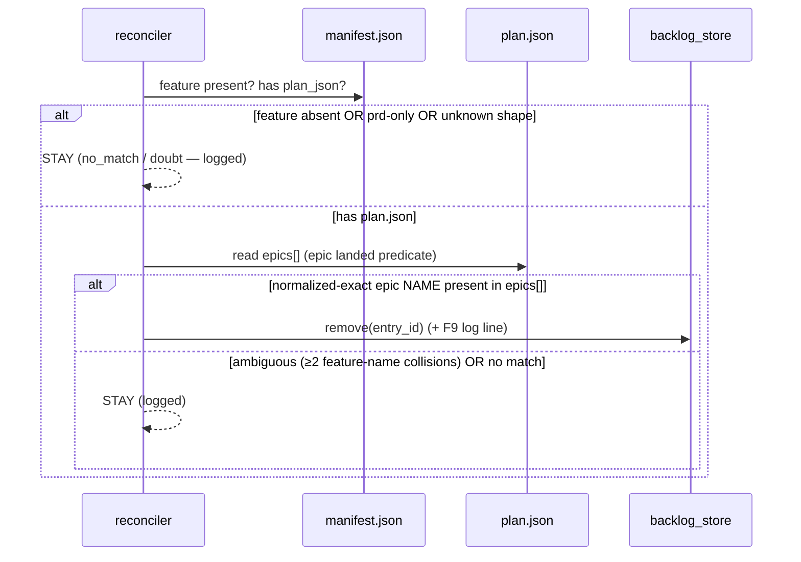

# LLD — reconciler

<!-- generated by /lld v2.21.0 on 2026-05-29; promoted to canonical from docs/shield/backlog-20260527/ on 2026-05-29 -->

**Feature:** `backlog-20260527`
**Owner:** `ashwini.manoj@aspora.com`
**Status:** `promoted`
**Linked PRD:** [`prd.md`](../shield/backlog-20260527/prd.md)
**Linked plans:** [`plan.md`](../shield/backlog-20260527/plan.md)
**Version:** `0.1.0`
**Last updated:** `2026-05-29`

## §1 Overview {#overview}

`reconciler` decides when a backlog entry's work has committed and prunes it. It holds the
**engine** (the single "epic landed" predicate, never-remove-on-doubt, drift tolerance, removal
logging) and the **two triggers** (eager prune at end of a promoted `/plan`|`/implement`; lazy
sweep on `/backlog` view), both gated by the kill switch. It serves PRD milestone **M3** and TRD
[§5 F8–F10](../shield/backlog-20260527/trd.md#functional-requirements). Stories EPIC-3-S2 (engine) and EPIC-3-S3 (triggers
+ kill switch + recovery) touch this component. It calls `backlog-store.remove()` — it never
writes the store directly.

## §2 Scope & non-goals {#scope-and-non-goals}

**In scope:** the F8 removal predicate; matching by feature (`manifest.json` index) + epic
(`plan.json.epics[]` gate); eager prune + lazy sweep (idempotent, shared engine); kill switch;
removal logging; uncommitted-state recovery (commit-before-prune or `.shield/backlog-removed.log`).

**Out of scope:** mutating `backlog.json` (delegated to `backlog-store.remove()`); suggesting
associations (owned by `epic-suggester`); consulting story `status` (explicitly never consulted —
F8); multi-writer locking (TRD §6 N5).

## §3 Module layout {#module-layout}

```
shield/scripts/
└── reconcile_backlog.py        new   (reconcile engine + eager prune + lazy sweep + logging)
shield/schemas/shield.schema.json  mod   (+ optional "backlog" object: {auto_reconcile: bool})
.shield.json                    mod   (+ backlog.auto_reconcile: bool, default true)
.shield/backlog-removed.log     new (runtime)   append-only recovery trail (single recovery mechanism)
```

The `shield.schema.json` change is required: the live schema has `additionalProperties: false`,
so `.shield.json backlog.auto_reconcile` fails validation until an optional `backlog` object is
added (P0-3).

## §4 Data model {#data-model}

Stateless engine over already-read documents. The only persisted artifact it owns is the
append-only `.shield/backlog-removed.log` (one JSON line per prune: the F9 rationale fields),
the **single** v1 recovery mechanism for an uncommitted end-of-run prune (N4).

`RemovalDecision` (returned by `reconcile()`):

| Field | Type | Notes |
|---|---|---|
| `verdict` | enum | `REMOVE` \| `STAY_AMBIGUOUS` \| `STAY_NO_MATCH` \| `STAY_DOUBT` |
| `feature` | str | the entry's feature slug |
| `epic` | str | the entry's epic name |
| `match_kind` | str \| null | `name` on REMOVE; null otherwise |
| `gating_plan_json_path` | str \| null | derived `docs/shield/<feature>/plan.json` on REMOVE |
| `reason` | str | human-readable rationale (also the N3 doubt-warning text) |

The `REMOVE` payload carries exactly the fields the F9 log line needs:
`{entry id, feature, epic, match_kind, triggering run, gating_plan_json_path}`.

## §5 API contracts {#api-contracts}

#### reconcile() {#api-reconcile}

`reconcile(entry, *, manifest: dict, plans: dict[str, dict]) -> RemovalDecision` — **pure
function** over already-read documents (testable without IO). `manifest` is the parsed
`{schema_version, features:[{name, artifacts:{plan_json: bool, …}}]}` (a list keyed by `name`;
`name` == folder slug). `plans` is a `{feature-slug → parsed plan.json}` map the caller
populates by reading the **derived** path `docs/shield/<slug>/plan.json` for each feature whose
`artifacts.plan_json == true` (the manifest stores no plan path). Applies the F8 predicate and
returns `REMOVE` (with rationale), `STAY_AMBIGUOUS`, `STAY_NO_MATCH`, or `STAY_DOUBT`. Story
`status` is never read.

#### eager_prune() {#api-eager-prune}

`eager_prune(entry_id, *, kill_switch) -> bool` — called at end of a promoted `/plan`|`/implement`
when the run carried a promotion reference. No-op when `kill_switch` is off. Recovery-safe:
commit `backlog.json` before the destructive remove, or append the entry to
`.shield/backlog-removed.log` first.

#### sweep() {#api-sweep}

`sweep(*, kill_switch) -> list[str]` — lazy safety net run on `/backlog` view; reconciles every
entry and removes those that landed. No-op when `kill_switch` is off. Returns removed ids.

## §6 Sequence flows {#sequence-flows}

#### Reconcile one entry (the F8 predicate) {#flow-reconcile}



#### The "epic landed" predicate (F8, single source of truth)

An entry is removed **iff** an epic with the matching **normalized-exact name** (via
`epic-suggester.normalize`) is **present in `plan.json.epics[]`** — for **both** existing and
proposed-new entries. The match is by **name, not by the positional `EPIC-N` id**: ids are
reassigned on every re-`/plan` (so `EPIC-2` denotes a different epic after a re-plan), making them
unusable as a cross-plan key; an epic reordered across a re-plan must still resolve by name. Story
`status` is never consulted. A `prd`-only feature (no `plan.json`) is never removed. An epic-name
collision across two different features is ambiguous → entry stays.

## §7 Error handling {#error-handling}

| Error / condition | Behavior |
|---|---|
| `manifest.json` / `plan.json` unrecognized or older shape | `STAY_DOUBT` — entry stays, logged warning (N3); never raises |
| feature absent from manifest | `STAY_NO_MATCH` — entry stays |
| epic-name collision across features | `STAY_AMBIGUOUS` — entry stays (the one place a wrong removal is plausible; PRD §10 / §14 trigger) |
| `backlog-store.remove()` IO failure | surface; the prune did not happen; entry remains (safe) |

## §8 Concurrency & state {#concurrency-and-state}

Both triggers are **idempotent** (remove-if-present), so an eager prune followed by a sweep over
the same entry is a no-op the second time — they cannot double-remove or race each other. A no-op
eager prune (entry already removed by the sweep) emits no log line and writes no recovery record.
Both call the one `reconcile()` engine (no divergent logic). Under the single-writer assumption
(TRD §6 N1/N5) there is no lock; `remove()` carries the compare-before-replace check (refuses if
the store changed underneath). **Recovery (N4):** an eager prune fires at end-of-run, possibly
before `backlog.json` is committed; the **single v1 recovery mechanism** is to append the entry
to `.shield/backlog-removed.log` **before** the destructive remove (replay restores it).
Commit-before-prune is an explicit non-goal.

## §9 Configuration {#configuration}

**Promote-on-demand — lifted.** This component owns the kill switch.

| Name | Type | Default | Range | Secret | Hot-reload |
|---|---|---|---|---|---|
| `backlog.auto_reconcile` | bool | `true` | true \| false | no | read per run |

When `false`, both `eager_prune()` and `sweep()` become no-ops, leaving manual remove
(`/backlog remove`) as the only removal path. This is the TRD §14 first-line rollback fallback.

## §10 Observability {#observability}

- **Logs:** every **removal** emits a structured line (F9): `{entry_id, feature, epic, match_kind (name), triggering_run, gating_plan_json_path}`. Every never-remove-on-doubt decision logs a warning (N3). A confident removal is never a silent git diff.
- **Metrics:** none in v1 (no telemetry). Removal counts are derivable from the log / git history.
- **Traces:** a debug-gated latency line on `/backlog` view reports view+sweep wall time (instruments the N2 ~1s budget so "revisit if breached" is falsifiable).

<details>
<summary>§11 Security & privacy {#security-and-privacy}</summary>

n/a — operates on developer-authored project artifacts only; no user data, auth, or PII. The
destructive action (remove) is bounded by N4 recoverability and the kill switch.

</details>

## §12 Performance & scaling {#performance-and-scaling}

#### §12.1 Load {#load}
Eager prune: once per promoted run. Lazy sweep: once per `/backlog` view, reconciling all entries.

#### §12.2 SLO {#slo}
The sweep over a ≤200-entry backlog completes within the TRD §6 N2 ~1s view budget.

#### §12.3 Bottleneck {#bottleneck}
IO-bound: one `manifest.json` read + one `plan.json` read per distinct flagged feature. The predicate itself is trivial.

#### §12.4 Latency breakdown {#latency-breakdown}
Dominated by opening the flagged `plan.json` files (deduped by feature). `n/a — finer numbers measured post-ship; gated by the §10 debug latency line`.

#### §12.5 Capacity {#capacity}
Bounded by entry count × distinct flagged features. At ≤200 entries / tens of features, memory and time are trivial.

#### §12.6 Scale-out lever {#scale-out-lever}
n/a — local single-actor engine. If sweep IO dominates N2, the lever is a project-level epic index (TRD §8 alt 4 / §12 Q1), not horizontal scaling.

#### §12.7 Caches {#caches}
Within one sweep, `plan.json` reads are deduped per feature (read-once). No cross-run cache in v1.

#### §12.8 Degradation {#degradation}
On any unrecognized/missing input the engine degrades to `STAY` (never removes on doubt) and logs. The user-visible effect is a backlog that errs toward keeping entries — the safe failure direction.

## §13 Open questions {#open-questions}

| Q# | Question | Options | Owner | Resolve-by |
|---|---|---|---|---|
| Q1 | Project-level epic index if sweep IO breaches N2? | manifest+flagged-plan reads (v1) / add index | @ashwinimanoj | if N2 breached (from §10 latency line) |

## §14 Changelog {#changelog}

| Touch | Date | Summary | Story IDs |
|---|---|---|---|
| M3 | 2026-05-29 | Initial draft via /plan | EPIC-3-S2 EPIC-3-S3 |
| promoted | 2026-05-29 | Promoted to canonical `docs/lld/` at milestone close | EPIC-3-S2 EPIC-3-S3 |
