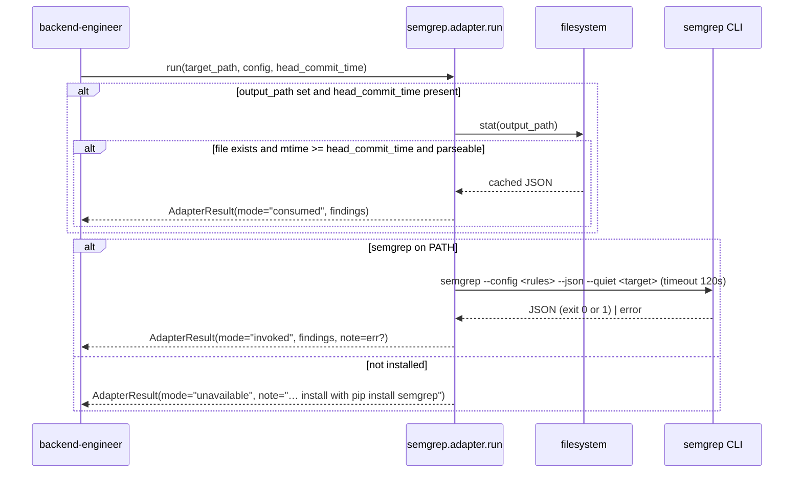

<!-- generated by /lld v2.27.0 on 2026-06-15 -->

**Feature:** `manual`
**Owner:** `ashwinimanoj@gmail.com`
**Status:** `draft`
**Linked PRD:** `n/a`
**Linked plans:** `[]`
**Version:** `0.1.0`
**Last updated:** `2026-06-15`

# SAST Adapter Framework — Low-Level Design

## §1 Overview {#overview}

The SAST adapter framework integrates Static Application Security Testing tools into Shield's `backend-engineer` agent. It serves Plan 4's hybrid review model: SAST tools handle pattern-detectable checks (annotations, imports, fixed call patterns) deterministically, while LLM-driven skills focus on judgment-based review (god-class detection, YAGNI, deployment safety). Findings from both flow through one aggregation pipeline.

The component is a **Python library**, not a service. It lives at `shield/adapters/sast/` and ships as the `shield-sast-adapters` package. `backend-engineer` imports each adapter's `run()` function and calls it in-process, in parallel with the skill review. There is no long-running process, no network listener of its own, and no scheduler.

Two adapters ship today: **Semgrep** (default mode: invoke a local CLI) and **SonarQube Community** (default mode: consume an existing scan via REST API). A shared `common.py` defines the normalized `Finding` and `AdapterResult` dataclasses every adapter emits.

## §2 Scope & non-goals {#scope-and-non-goals}

**In scope:**
- The normalized finding schema (`Finding`, `AdapterResult`) in `common.py`.
- The Semgrep adapter: local invocation, output consumption, JSON parsing, severity/category mapping, bundled Spring Boot 3.x rule packs.
- The SonarQube adapter: file consumption, REST API fetch, `sonar-scanner` last-resort invocation, credential resolution, severity/type mapping.
- The three-mode layered fallback (consume → invoke → best-effort skip) each adapter follows.
- The `run(target_path, config, head_commit_time)` contract `backend-engineer` calls.

**Out of scope (with reasons):**
- Finding aggregation, dedup, and report rendering — owned by `backend-engineer`, not the adapters. The adapters only emit normalized findings; dedup by file + overlapping line range happens downstream.
- Branch/diff analysis — SonarQube Community lacks it, so all findings are repo-wide. Scoping to changed files is the aggregator's concern.
- Shield-native suppression — v1 defers to each tool's native suppression (`// nosemgrep`, `@SuppressWarnings`).
- New tools beyond Semgrep and SonarQube — the README documents how to add one; none are implemented.
- Spring Boot 2.x rule coverage — the bundled rule packs target Spring Boot 3.x / `jakarta.*` patterns only.

## §3 Module layout {#module-layout}

The sast adapter does **not** share `shield/adapters/_common/` (the `shield_adapters_common` package used by the PM adapters). It defines its own `common.py` with a different shape: SAST findings, not PM operations.

```
shield/adapters/sast/
├── pyproject.toml                    unchanged   # package "shield-sast-adapters", v0.1.0
├── common.py                         unchanged   # Finding, AdapterResult dataclasses
├── __init__.py                       unchanged   # empty package marker
├── finding-schema.md                 unchanged   # schema doc (mirrors common.py)
├── severity-mapping.md               unchanged   # per-tool severity tables
├── README.md                         unchanged   # framework overview
├── GETTING-STARTED.md                unchanged   # operator setup guide
├── tests/
│   └── test_common.py                unchanged   # dataclass construction tests
├── semgrep/
│   ├── adapter.py                    unchanged   # run() + parser + fallback
│   ├── adapter.md                    unchanged   # LLM-readable contract
│   ├── rules/spring-*.yml            unchanged   # Spring Boot 3.x rule packs
│   └── tests/test_adapter.py         unchanged   # fixture-based parser tests
└── sonarqube/
    ├── adapter.py                    unchanged   # run() + parser + fallback
    ├── adapter.md                    unchanged   # LLM-readable contract
    └── tests/                        unchanged   # fixture-based parser tests
```

All files are marked `unchanged` because this is a reverse-doc of an existing component, not a change set.

## §4 Data model {#data-model}

`n/a — stateless library, no persistent data store.` The component owns no tables, no cache, no database. Its only "data" is two in-memory dataclasses (`common.py`), reproduced here as the wire shape between adapters and `backend-engineer`:

**`Finding`** — one normalized SAST result:

| Field | Type | Required | Default | Notes |
|---|---|---|---|---|
| `source` | str | yes | — | Adapter name, e.g. `"semgrep"`, `"sonarqube"` |
| `rule_id` | str | yes | — | Tool-native rule ID (`"java.spring.security.csrf-disabled"`, `"java:S5547"`) |
| `file` | str | yes | — | Path relative to repo root |
| `lines` | str | yes | — | Single line `"27"` or range `"27-29"` |
| `severity` | `Literal["high","medium","low"]` | yes | — | Normalized; per-tool mapping in `severity-mapping.md` |
| `category` | `Literal["security","code-quality","performance","reliability","style"]` | yes | — | Normalized |
| `fix_hint` | str \| None | no | `None` | Recommended fix, when the tool provides one |

**`AdapterResult`** — result of one adapter run:

| Field | Type | Required | Default | Notes |
|---|---|---|---|---|
| `source` | str | yes | — | Adapter name |
| `mode` | `Literal["consumed","invoked","unavailable"]` | yes | — | Which fallback tier produced this result |
| `runtime_seconds` | float | yes | — | Wall-clock time the adapter took |
| `findings` | list[Finding] | yes | `[]` | May be empty |
| `note` | str \| None | no | `None` | Best-effort skip messages, invocation errors |

## §5 API contracts {#api-contracts}

No HTTP surface. The public contract is one Python function per adapter, with an identical signature. `backend-engineer` imports it as `shield.adapters.sast.<name>.adapter.run`.

#### `run()` — adapter entry point {#api-run}

**Signature:**
```python
def run(
    target_path: str,
    config: dict[str, Any] | None = None,
    head_commit_time: float | None = None,
) -> AdapterResult
```

**Arguments:**
- `target_path` — path under review.
- `config` — the adapter's block from `.shield.json` `sast.<name>` (e.g. Semgrep `config` / `output_path`; SonarQube `consume_path`). `None` → empty dict.
- `head_commit_time` — HEAD commit Unix timestamp, used for stale-output detection. `None` disables consume-mode mtime checks.

**Return:** always an `AdapterResult`. Never raises for tool-availability or parse failures — those surface as `mode="unavailable"` (or empty findings) with a populated `note`.

**Mode semantics:**

| `mode` | Meaning |
|---|---|
| `consumed` | Findings read from a pre-existing, mtime-fresh output file or live REST API |
| `invoked` | Tool run locally (`semgrep …` / `sonar-scanner …`) |
| `unavailable` | Tool not installed / credentials missing / all tiers failed — empty findings, `note` set |

Semgrep `config` keys: `config` (rules path or registry pack ID; default = bundled `rules/`), `output_path` (pre-existing `semgrep --json` file). SonarQube `config` key: `consume_path` (pre-fetched REST response).

## §6 Sequence flows {#sequence-flows}

#### Semgrep: scan and normalize {#flow-semgrep-scan-and-normalize}



#### SonarQube: consume and normalize {#flow-sonarqube-consume-and-normalize}

```mermaid
sequenceDiagram
    participant BE as backend-engineer
    participant SQ as sonarqube.adapter.run
    participant FS as filesystem
    participant API as SonarQube REST API
    participant SC as sonar-scanner
    BE->>SQ: run(target_path, config, head_commit_time)
    alt consume_path set and mtime fresh
        SQ->>FS: read + parse consume_path
        SQ-->>BE: AdapterResult(mode="consumed", findings)
    end
    SQ->>SQ: _load_credentials() (file then env)
    alt url + token + project_key present
        SQ->>API: GET /api/issues/search (Basic base64(token+":"))
        alt API ok
            API-->>SQ: issues JSON
            SQ-->>BE: AdapterResult(mode="consumed", findings)
        else API fails and sonar-scanner on PATH
            SQ->>SC: sonar-scanner -Dsonar.* (timeout 600s, cwd=target)
            SC-->>SQ: exit 0
            SQ->>API: re-fetch issues
            SQ-->>BE: AdapterResult(mode="invoked", findings)
        else both fail
            SQ-->>BE: AdapterResult(mode="unavailable", note="api err; scan err")
        end
    else credentials missing
        SQ-->>BE: AdapterResult(mode="unavailable", note="credentials missing …")
    end
```

## §7 Error handling {#error-handling}

No error is allowed to fail the review. Every failure path returns an `AdapterResult` with empty `findings` and a populated `note`. Identifiers below are the adapter `note` strings (no HTTP status — this is a library).

| Identifier | Source | Behavior |
|---|---|---|
| `semgrep — tool not available` | Semgrep, tool not on PATH | `mode="unavailable"`, empty findings, note advises `pip install semgrep` |
| `semgrep — invocation timed out after 120s` | `subprocess.TimeoutExpired` | Empty findings, `mode="invoked"`, note set |
| `semgrep — invocation error: …` | `OSError` launching CLI | Empty findings, note set |
| `semgrep — exit code N: <stderr[:200]>` | exit code not in {0,1} | Empty findings, note set |
| `semgrep — could not parse JSON output: …` | `json.JSONDecodeError` on stdout | Empty findings, note set |
| consume parse failure (silent) | `_consume_existing` hits bad JSON / `OSError` | Returns `None` → falls through to invoke; no note |
| `sonarqube — API fetch failed: …` | `URLError` / `JSONDecodeError` / `OSError` | Falls through to scanner; if that fails too → `unavailable` |
| `sonarqube — sonar-scanner not on PATH` | scanner missing | Scanner tier unavailable |
| `sonarqube — credentials missing for local invocation` | url/token/project_key incomplete | Scanner tier unavailable |
| `sonarqube — sonar-scanner timed out after 600s` | `subprocess.TimeoutExpired` | Scanner tier fails |
| `sonarqube — sonar-scanner exit N: <stderr[:200]>` | non-zero exit | Scanner tier fails |
| `sonarqube — credentials missing; …` | no file and no env creds | `mode="unavailable"`, note advises setup |

Unknown tool severity → defaults to `medium` (per `severity-mapping.md`); unknown category → `code-quality`. Both are silent normalization, not errors.

## §8 Concurrency & state {#concurrency-and-state}

`n/a — stateless library, no concurrency-sensitive internal state.` Each `run()` call is self-contained: arguments in, `AdapterResult` out, no shared mutable state between calls or between adapters.

Externalized concurrency and state worth noting:
- **Parallel dispatch is the caller's job.** `backend-engineer` runs adapters concurrently (a `ThreadPoolExecutor` or equivalent) alongside the skill review. The README states adapters are independent with no shared state, so this is safe.
- **Subprocess isolation.** Semgrep (`subprocess.run`, 120s timeout) and `sonar-scanner` (600s timeout, `cwd=target_path`) run as child processes; the adapter blocks on each until completion or timeout.
- **Filesystem mtime as freshness gate.** Consume mode compares output-file `st_mtime` against `head_commit_time`; an output older than HEAD is treated as missing. There is no lock — concurrent writers to the output file are out of scope.

## §9 Configuration {#configuration}

<details open>
<summary>§9 Configuration</summary>

This component is configuration-driven, so the section is lifted. Configuration arrives two ways: per-project via `.shield.json` `sast.<adapter>`, and SonarQube credentials via `~/.shield/credentials.json` or env vars.

**`.shield.json` `sast` block:**

| Key | Type | Default | Secret | Hot-reload | Description |
|---|---|---|---|---|---|
| `sast.adapters` | list[str] | (none) | no | per-review | Adapters to run. Empty/missing → SAST inactive |
| `sast.semgrep.config` | str | bundled `rules/` | no | per-review | Rules path or registry pack ID |
| `sast.semgrep.output_path` | str | (none) | no | per-review | Pre-existing `semgrep --json` file to consume if mtime-fresh |
| `sast.sonarqube.consume_path` | str | (none) | no | per-review | Pre-fetched REST response to consume if mtime-fresh |

**SonarQube credentials** (`~/.shield/credentials.json` `sonarqube` block; env-var fallback per missing key):

| Key | Env-var fallback | Type | Secret | Description |
|---|---|---|---|---|
| `url` | `SHIELD_SONAR_URL` | str | no | SonarQube server base URL |
| `token` | `SHIELD_SONAR_TOKEN` | str | **yes** | API token; sent as HTTP Basic username, empty password |
| `project_key` | `SHIELD_SONAR_PROJECT_KEY` | str | no | Project key for `componentKeys` filter |

All config is read fresh on each `run()` — there is no daemon, so "hot-reload" reduces to per-review re-read. Semgrep honors `SEMGREP_APP_TOKEN` itself; the adapter never references it. Operators should `chmod 600 ~/.shield/credentials.json`.

</details>

## §10 Observability {#observability}

This is a library with no logging framework of its own. Observability is what it returns to `backend-engineer` plus stderr warnings.

**Logs (structured):** `n/a — no logging framework.` Two stderr surfaces exist: `severity-mapping.md` specifies a one-line stderr warning when a tool-native severity is unmapped (so operators notice the `medium` default). All other diagnostics travel in the `AdapterResult.note` field, which the agent renders in the report header, e.g. `semgrep (invoked, 12 findings) · sonarqube (consumed, mtime stale → re-fetched, 47 findings)`.

**Metrics:** `AdapterResult.runtime_seconds` (float, seconds) is the one quantitative signal each adapter emits — wall-clock per run. Finding counts per source are derived downstream by the aggregator (`skill: 38, SAST-skill-overlap: 8, SAST-only: 27`). No counters/gauges/histograms are exported by the library itself.

**Traces:** `n/a — in-process library, no distributed tracing.` The unit of work is a single synchronous `run()` call; the caller owns any span instrumentation around the parallel dispatch.

## §11 Security & privacy {#security-and-privacy}

<details open>
<summary>§11 Security & privacy</summary>

Lifted: a SAST tool reads source code and a credentialed API, so data handling matters.

**AuthN — how callers identify:**
- Semgrep: none. Runs against a local path; no credentials.
- SonarQube: HTTP Basic auth, token as username and empty password (`Authorization: Basic base64(token + ":")`). The raw token is resolved from `~/.shield/credentials.json` (`sonarqube` block) or `SHIELD_SONAR_TOKEN`.

**AuthZ — what callers can do:** Out of band. The SonarQube token's scope is set in SonarQube; the adapter requests only `GET /api/issues/search` with read filters (`statuses=OPEN,REOPENED,CONFIRMED`). It never writes back.

**Data classification:**
- **Scanned source code** — the most sensitive input. Semgrep reads it locally and emits only `file`, `lines`, `rule_id`, and a `message`; it does not copy code snippets into findings. SonarQube findings reference the same metadata. No raw source is persisted by the adapter.
- **Findings** — file paths, line ranges, rule IDs, tool messages. Treated as internal review data; surfaced in the Shield report.
- **Credentials** — the SonarQube token is a secret. It is read from a `chmod 600` file or env var, base64-encoded into the Authorization header, and never written to findings or notes. Error notes truncate server `stderr` to 200 chars to limit accidental leakage.

**Threat model:**
- *Token leakage* — mitigated by file-permission guidance and by keeping the token out of findings/notes.
- *SSRF via configured URL* — the SonarQube `url` is operator-supplied; the adapter trusts it. Out of scope to validate.
- *Untrusted output files* — `consume_path` / `output_path` are parsed with `json.loads`; malformed JSON returns `None`/empty rather than crashing. No code execution from parsed content.
- *Subprocess argument injection* — commands are built as argv lists (no shell), with operator-supplied values for rules path / Sonar host. Treated as trusted operator input.

</details>

## §12 Performance & scaling {#performance-and-scaling}

#### §12.1 Load {#load}
Invoked once per `backend-engineer` review, once per configured adapter (0–2 adapters today). Not a request-serving component — there is no steady request rate. "Load" is the size of the scanned repo and, for SonarQube, the issue count returned (`ps=500` page size cap per fetch).

#### §12.2 SLO {#slo}
`n/a — no formal SLO for a per-review library.` Practical ceilings come from timeouts: Semgrep invocation 120s, SonarQube REST fetch 30s, `sonar-scanner` 600s. The README characterizes Semgrep as "seconds for typical repos" and SonarQube full scans as "minutes" (the reason SonarQube prefers consume mode).

#### §12.3 Bottleneck {#bottleneck}
IO/subprocess-bound, not CPU-bound in the adapter. Time is spent in the external tool (Semgrep process, SonarQube server) and in network round-trips (REST fetch). The adapter's own work — JSON parse and dataclass construction — is negligible.

#### §12.4 Latency breakdown {#latency-breakdown}
- Semgrep invoke: dominated by CLI scan time (subprocess), capped at 120s. Parse is microseconds.
- SonarQube API: network RTT + server query time, capped at 30s/fetch, up to 500 issues/page.
- SonarQube scan (last resort): full scan, capped at 600s, then a follow-up API fetch.
- Consume mode: one `stat` + one file read + JSON parse — sub-millisecond for typical outputs. Exact splits `n/a — measured post-ship`.

#### §12.5 Capacity {#capacity}
Bounded by the host running the review and, for SonarQube, by the server. Memory footprint is the parsed JSON plus the findings list held in memory — small (hundreds to low thousands of findings). Connection pooling `n/a — single one-shot `urllib` request per fetch`.

#### §12.6 Scale-out lever {#scale-out-lever}
`n/a — not horizontally scaled; in-process library.` Parallelism is across adapters within one review (the caller's thread pool), not across replicas. Throughput scales with the host and the SonarQube server, neither owned here.

#### §12.7 Caches {#caches}
The only caching is **consume mode**: a pre-existing tool output (Semgrep `output_path`, SonarQube `consume_path`) is reused when its mtime is newer than the HEAD commit. Invalidation is mtime-based — output older than HEAD is treated as stale and re-fetched/re-invoked. No in-memory cache, no TTL beyond the mtime gate.

#### §12.8 Degradation {#degradation}
Graceful by design. If a tool is missing, credentials are absent, the server is unreachable, or output is unparseable, the adapter returns `mode="unavailable"` (or empty findings) with a `note` and the review proceeds skill-only. The report header lists which adapters were unavailable and why (e.g. `sonarqube (unavailable: credentials missing)`). No SAST failure aborts the review.

## §13 Open questions {#open-questions}

| Q# | Question | Options | Owner | Resolve-by |
|---|---|---|---|---|
| Q1 | Spring Boot 2.x rules are unimplemented. Add coverage? | Broaden existing `pattern-either` blocks (Pattern A) vs. ship sibling `spring-*-sb2.yml` packs | ashwinimanoj@gmail.com | When an SB2 repo needs review |
| Q2 | No Shield-native suppression in v1; relies on tool-native suppression. Is that sufficient at scale? | Keep tool-native only vs. add a Shield suppression layer | ashwinimanoj@gmail.com | After first noisy-output report |
| Q3 | SonarQube REST fetch caps at `ps=500` and does not paginate. Do projects exceed 500 open issues? | Add pagination vs. document the cap | ashwinimanoj@gmail.com | If a project exceeds 500 issues |
| Q4 | The configured SonarQube `url` is trusted (no SSRF validation). Acceptable? | Trust operator input vs. allow-list/validate host | ashwinimanoj@gmail.com | Before exposing config to untrusted users |

## §14 Changelog {#changelog}

| Touch | Date | Summary | Story IDs |
|---|---|---|---|
| manual | 2026-06-15 | reverse-doc by ashwinimanoj@gmail.com | n/a |
