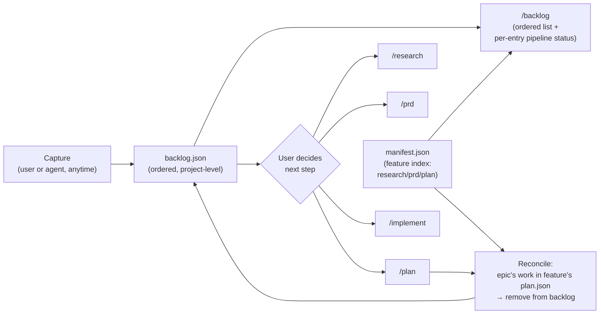

# Shield Backlog

<!-- [PRD-Review enhanced copy — 2026-05-27. Annotations are HTML comments tagged [P0]/[P1]/[P2] with persona attribution. Source content is unchanged; only comments were added. Verdict: Needs Work (composite 2.7, blocked by 1 P0). -->

## 1. Header
| Field | Value |
|---|---|
| Owner | @ashwinimanoj |
| Status | Draft |
| PRD type | Lean |
| Date created | 2026-05-27 |
| Last updated | 2026-05-27 |
| Linked design spec | null |
| Linked research | null |
| Decision-maker | @ashwinimanoj |
| Sign-off contacts | _(n/a for internal tooling)_ |
| Linked plans | _(auto-populated by /plan)_ |

<!-- [P2 from: PM] 7c — Sign-off N/A names no confirmer. Phrase as: "N/A — internal tooling, no Legal/Security/Support surface (confirmed by @ashwinimanoj)". -->

## 2. Terminologies
| Term | Definition |
|---|---|
| Backlog | A project-level, ordered list of future work captured across the Shield workflow. Lives at `docs/shield/backlog.json`. |
| Backlog entry | One captured idea — a future epic, story, or task. May not be actionable when captured. Carries an order, a source (`user` \| `agent`), and a **feature + epic association** (either may be proposed-new until promotion). |
| Feature association | The feature an entry belongs to (a `docs/shield/<feature>/` folder). It is the **reconciliation key**: `manifest.json` is keyed by feature, so this is how an entry is matched to its pipeline progress. May be proposed-new until promotion. |
| Epic association | The epic an entry slots into when planned — an existing epic id (e.g. `EPIC-2`) or a proposed new epic. Acts as the **gate** at reconciliation: the entry is removed only when this epic's work appears in the feature's `plan.json`. |
| Promotion | Acting on a backlog entry by starting the appropriate Shield step for it — `/research`, `/prd`, `/plan`, or `/implement`. **The user decides which step**; the backlog does not auto-route. |
| Reconciliation | Keeping the backlog current: `manifest.json` locates the entry's feature and whether it has a `plan.json`; if so, the entry's epic is looked up there. The entry is removed once its epic's work appears in the feature's `plan.json` (`epics[].stories[]`). No ids are stamped — matching is by feature (manifest) + epic (plan). A `prd`-only feature does **not** trigger removal. |
| Agent-discovered entry | A backlog entry the agent adds on its own when it notices future work mid-task (vs. a user-created entry). |

<!-- [P1 from: DX] Reconciliation match key UNSPECIFIED: with ids removed, define how a proposed-new epic name maps to the eventual real epic in plan.json — exact string match, or user-confirmed binding at promotion time? This is the removal-correctness heart; resolve before /plan. -->
<!-- [P1 from: DX] `kind` field: §6/M1 commit to epic/story/task granularity and "schema defined", but the backing field is left open in §9. Decide it before M1. -->

## 3. Problem & context

Future work surfaces constantly while using Shield — during `/research`, while writing a PRD, mid-`/plan`, and especially during `/implement` ("we should also handle X later", "this whole area needs a rewrite"). Today there is **nowhere to park that work**. The options are bad: derail the current task to chase it, or drop it in a comment / memory / someone's head and lose it.

<!-- [P1 from: PM] 1d — These quoted phrases are illustrative, not cited user-research artifacts. Cite a real transcript/session log, or link the (currently null) research doc. -->

Concretely:
- There is no project-level, ordered place to capture "not now, but later" items. `plan.json` only holds work already committed to a milestone; `manifest.json` is an artifact index. Neither captures un-triaged future work.
- Ideas discovered by the agent mid-task have no home — they're mentioned once in conversation and gone.
- When future work *is* remembered, there's no consistent path from "loose idea" to "stories in a plan." Each pickup re-derives the epic, the feature, and the scope from scratch.

<!-- [P1 from: PM] 1b — No baseline numbers. Add one concrete figure, e.g. "~N follow-up items surfaced and lost across the last M /implement runs", to size the problem. -->

Why now: Shield's pipeline (`/research → /prd → /plan → /implement`) is mature, but it only handles work that's *already* been decided on. The gap is the staging area *before* that pipeline — where future work waits, ordered, until the user promotes it in.

<!-- [P1 from: PM] 11a/11b — Why-now describes a standing capability gap, not a concrete trigger; cost-of-inaction is unquantified. Anchor to a recent specific instance of lost follow-up work, and quantify (items dropped per cycle, or hours re-deriving scope). -->

## 4. Target users / personas
| ID | Persona | Goals | Frictions today |
|---|---|---|---|
| P1 | Developer/PM driving Shield | Capture future work without losing focus on the current task; come back later to an ordered list of what to pick up next | Future ideas get lost or derail the current task; no ordered "later" list at the project level |
| P2 | The agent (Claude) running a Shield task | Record follow-up work it discovers mid-task so the human doesn't have to remember it | Discovered work is mentioned once in chat then forgotten; no place to persist it |

<!-- [P1 from: PM] 1a — Personas are role categories, not a named persona. Name P1 concretely (e.g. "Ashwini, Shield maintainer running /implement daily"). -->

## 5. Architecture & flows

A single global store `docs/shield/backlog.json` (sibling to `manifest.json`), a `/backlog` command to view it, a capture path usable from any Shield skill or by the user, and a **user-driven promotion**: the user picks an entry and starts whichever Shield step fits — `/research`, `/prd`, `/plan`, or `/implement`. Each entry carries an order, a source (`user` | `agent`), and a **feature + epic association**. **Reconciliation** reads `manifest.json` as the project-level index — to find each entry's feature, see whether it has a `plan.json`, and surface its pipeline status (research/prd/plan) in the `/backlog` view — then opens the flagged `plan.json` and removes any entry whose epic's work now appears there. A `prd`-only feature stays in the backlog; only plan-committed work is removed. No ids are tracked.

<!-- [P1 from: DX] Capture-from-skill interface is undefined — M1 requires capture "usable from any Shield skill" but no command/helper/write-contract is given. Specify the capture entrypoint. -->
<!-- [INFO from: Tech-lead] NFR notes to fold into /plan: (1) atomic write for backlog.json (temp-then-rename) + concurrent capture-vs-reconcile is the primary failure case; (2) add schema_version for forward migration; (3) reconciliation no-ops (never removes) on missing/old manifest.json or plan.json rather than erroring; (4) backlog.json is git-tracked, so bad removals are git-revertable — consider dry-run/confirm before reconcile removals. -->

## 6. Goals & non-goals

### Goals
- Capture future work (epic / story / task granularity) at **any point** in the workflow — before a PRD exists, during planning, during implementation — without derailing the current task.
- Support **both** capture sources: user-created and agent-discovered.
- Keep the backlog **ordered** so there's a clear "what to pick up next."
- Every entry is **associated with a feature and an epic** — existing or proposed-new — and the agent **suggests a matching feature/epic** at capture or promotion time.
- A `/backlog` command **shows the current backlog**, ordered, with each entry's feature + epic association, source, and **pipeline status (research / prd / plan, read from `manifest.json`)** — so you can see what's been started (e.g. a prd written) without the entry being removed.
- Provide a **user-driven promotion path**: the user picks an entry and starts the Shield step they judge appropriate (`/research`, `/prd`, `/plan`, or `/implement`). The backlog suggests, but does not dictate, the next step.
- **Keep the backlog current**: when an entry's work appears in a feature's `plan.json`, the entry is removed automatically, so the backlog reflects only not-yet-planned work.

<!-- [P2 from: DX] "removed automatically" contradicts the on-/backlog-view reconciliation described in §2/§5/§9 and the §6 non-goal disclaiming automatic surfacing machinery. Replace with "removed on next /backlog view". -->

### Non-goals
- **Automatic end-of-task surfacing machinery** (hooks). The agent already calls out new entries conversationally; no dedicated surfacing mechanism in v1.
- **Per-feature backlogs.** v1 is a single global backlog.
- **A status/workflow engine.** The lifecycle is minimal: an entry exists in the backlog until its work lands in a `plan.json`, at which point it is removed. No multi-state machine.
- **Syncing the backlog to the PM tool** (ClickUp/Jira/etc.). The backlog is a pre-pipeline staging area; PM sync happens after promotion, via the existing `/pm-sync` on the resulting plan.
- **Replacing the PM tool's own backlog.** This is Shield-local triage, not a project-management backlog of record.

<!-- [P2 from: PM] 2c — Add a scope-creep guard: name the most probable creep ask (e.g. a rejected/dropped state, or ClickUp sync) and state that @ashwinimanoj gates any v1 expansion. -->

## 7. Success metrics
| Metric | Type | Target | Counter |
|---|---|---|---|
| Captured entries that get acted on (work started, or removed once it lands in a plan) vs. left to rot | Outcome | Majority of entries reach a terminal state (promoted/landed in a plan, or explicitly dropped) rather than rotting | Entries pile up un-triaged → backlog becomes a graveyard |
| Entries carrying a feature + epic association at promotion time | Quality | 100% — promotion cannot complete without a feature and epic | Forcing association makes capture so heavy nobody captures |
| Agent feature/epic-suggestion acceptance | Quality | Suggested feature/epic accepted often enough to save manual lookup | Bad suggestions that users routinely override |
| Capture friction | Adoption | Capturing an entry mid-task takes one step and does not interrupt the current task | Capture is so quick the backlog fills with low-signal noise |

<!-- [P1 from: PM/DX] 3a — Three of four targets are vague ("Majority", "often enough", "one step"). Attach numbers + a time horizon, e.g. ">=70% of entries reach a terminal state within 30 days", ">=60% suggestion-acceptance". -->
<!-- [P1 from: PM] 3d — Name a tracking owner/method: there is no dashboard or cadence, and reconciliation deletes entries (no source of truth for "terminal state"). Measure via periodic /backlog audit or git history of backlog.json. -->

## 8. Milestones
| ID | Name | Outcome | Exit criteria | Depends on |
|---|---|---|---|---|
| M1 | Capture + store + view | A global `backlog.json` exists; entries can be added (user + agent) with order, source, and feature + epic association; `/backlog` shows the ordered list with per-entry pipeline status from `manifest.json` | `backlog.json` schema defined; an entry can be captured from a skill or by the user; `/backlog` renders the ordered backlog with feature + epic and a research/prd/plan status read from `manifest.json` | — |
| M2 | Feature + epic association + suggestion | Every entry references a feature and an epic (existing or proposed new); the agent suggests a matching feature/epic | Capture prompts for a feature + epic; agent scans `manifest.json` features and known epics and proposes a match; user can accept, pick another, or create-new | M1 |
| M3 | Promotion + reconciliation | The user picks an entry and starts the Shield step they choose (`/research`, `/prd`, `/plan`, or `/implement`); once the entry's epic's work appears in the feature's `plan.json`, it is removed from the backlog | Reconciliation uses `manifest.json` (find feature, has-plan?) + `plan.json` (epic present?) — no ids stamped; a `prd`-only feature is **not** removed; `/backlog` reconciles on view; the user-chosen step is never overridden | M2 |

<!-- [P1 from: DX] M3 exit criteria asserts "/backlog reconciles on view" as settled, but §9 still lists the reconciliation trigger as OPEN. Resolve §9 or soften M3 — a developer can't implement against an unsettled trigger. -->
<!-- [P1 from: Agile-coach] 4a/4e — Exit criteria are happy-path only and a few are thresholdless ("agent suggests a matching feature/epic"). Tighten to verifiable conditions and add ≥1 error path per flow (missing plan.json, abandoned capture, concurrent write). -->

## 9. Open questions

<!-- [P0 from: PM] 12a (Risks & assumptions) — There is NO risks section anywhere. Add a lean risks table (risk + mitigation + named owner) and an assumptions list (validated vs unvalidated). The key unvalidated assumption: "agents reliably surface follow-ups conversationally" — the entire no-hooks non-goal rests on it. Mitigations mostly exist already (reconciliation-on-view → graveyard; atomic write → corruption). This is the single P0 blocking /plan. -->

- **Feature/epic discovery scope.** `manifest.json` lists features (the reconciliation key). Epics still live inside per-feature `plan.json` files, so confirming an entry's epic means opening the plan the manifest flags as having one. (Leaning: manifest as the index, open only flagged `plan.json` files; revisit if a project-level epic index is ever needed.)
- **Reconciliation matching (resolved):** no ids are stamped. An entry references a **feature** (matched against `manifest.json`) and an **epic** (confirmed in that feature's `plan.json`). The entry is removed only once its epic's work appears in the plan — a `prd`-only feature is **not** removed. Open: does reconciliation run on `/backlog` view, at the end of `/plan`, or both? (Leaning: on `/backlog` view, since the user drives promotion.)
<!-- [P1 from: DX] This "(resolved)" still leaves the proposed-new-epic → real-epic match key undefined (string match vs user-confirmed). And the trailing "Open: ..." trigger contradicts M3 (line above). Settle both. -->
- **Ordering scheme.** Single global rank (explicit integer order, like `orderindex`), priority buckets (P0/P1/P2), or both? (Leaning: explicit order field for v1.)
- **Entry granularity.** The ask says "epics/stories/tasks." Do we model a `kind` field, or treat every entry uniformly as "future work that becomes ≥1 story on promotion"? (Leaning: a `kind` hint, but promotion always yields stories.)
- **Dropped/rejected entries.** Do we need an explicit terminal state for "decided against," or is deleting the entry enough? (Deferred — see Out of scope.)

<!-- [P2 from: PM] 12c — Promote the resolved/settled open questions into a short decision log (alternative considered + why set aside) so the dissenting view survives. -->

## 10. Out of scope / Non-goals

- Automatic end-of-task surfacing via hooks (the agent calls it out conversationally; revisit if that proves unreliable).
- Per-feature backlogs and a global↔per-feature promotion path.
- A `rejected`/`dropped` lifecycle state and the audit trail for declined ideas.
- `/pm-sync` of backlog entries to the PM tool before promotion.
- Cross-project / multi-repo backlogs.
- Reordering UX beyond editing the order field (no drag-and-drop, no auto-prioritization).

<!-- [P2 from: PM] 2b — Several items here are bare. Add a one-line why-deferred to each (e.g. "Per-feature backlogs — prove the single global store in v1 first; split only if features grow large"). -->

---

> **This is a lean PRD.** It intentionally omits the following standard sections:
> - Section 8 — User stories & scenarios
> - Section 9 — Functional requirements
> - Section 10 — Non-functional requirements
> - Section 11 — RBAC & permissions matrix
> - Section 12 — Dependencies
> - Section 13 — Risks & mitigations
> - Section 14 — Assumptions
> - Section 15 — Rollout plan (full — lean has its own §8 Milestones)
> - Section 16 — Cost & resource impact
> - Section 17 — GTM & customer-comms
> - Section 18 — Support / CX impact
>
> If scope grows or stakeholders need more detail, run `/prd` again — Shield
> will offer to add specific sections or upgrade to `standard`.

<!-- [Reviewer note] The lean footer omits §13 Risks and §14 Assumptions, but the PRD-Review rubric grades dim 12 (Risks & assumptions) even for lean PRDs — hence the P0 above. A lean risks/assumptions treatment (a few lines) satisfies it without upgrading to standard. -->
