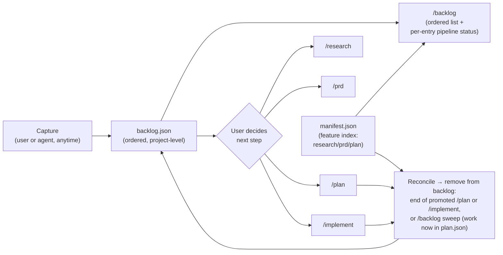

# Shield Backlog

<!--
  PRD-Review enhanced copy — 2026-05-27 (run _2). Verdict: Ready (composite 3.1, 0 P0).
  Source is unchanged; remaining items are listed here with line refs (table/mermaid splicing avoided).

  P1 (§2, ~line 23): "the entry is removed only when this epic's work appears in plan.json" contradicts the
      manual-remove trigger (§5/§6/§9) — change "only when" to "when", or add "(or removed manually)".
  P1 (§5 / §8 M1, ~lines 47/97): capture "usable from any Shield skill" — the capture interface
      (command/helper name + entry fields) is undefined; define at/before /plan.
  P1 (§3 / §10, ~line 127): problem baseline unquantified (honestly logged as unvalidated) —
      add one real figure from past /implement transcripts to harden why-now.

  P2 (§5 / §9, ~lines 47/104): the "transient promotion reference" mechanism is prose-only — pin how
      /plan and /implement receive and act on it in the /plan/TRD.
  P2 (§6, ~line 74): state that eager-prune and the /backlog sweep are idempotent (remove-if-present).
  P2 (§6/§11): add a scope-creep guard naming the likely ask + @ashwinimanoj as accept authority.
  P2 (§1): sign-off N/A → "N/A — internal tooling, confirmed by @ashwinimanoj".

  TRD inputs (tech-lead, informational/lean-exempt but carry forward): add backlog.json schema_version +
      migration policy; reconciliation treats unknown manifest.json/plan.json shapes as doubt→entry-stays;
      state a /backlog sweep perf budget; name a rollback-to-manual-only trigger.
-->

## 1. Header
| Field | Value |
|---|---|
| Owner | @ashwinimanoj |
| Status | Draft |
| PRD type | Lean |
| Date created | 2026-05-27 |
| Last updated | 2026-05-27 |
| Linked design spec | null |
| Linked research | null |
| Decision-maker | @ashwinimanoj |
| Sign-off contacts | _(n/a for internal tooling)_ |
| Linked plans | _(auto-populated by /plan)_ |

## 2. Terminologies
| Term | Definition |
|---|---|
| Backlog | A project-level, ordered list of future work captured across the Shield workflow. Lives at `docs/shield/backlog.json`. |
| Backlog entry | One captured idea — a future epic, story, or task. May not be actionable when captured. Carries an order, a `kind` hint (`epic` \| `story` \| `task`), a source (`user` \| `agent`), and a **feature + epic association** (either may be proposed-new until promotion). |
| Feature association | The feature an entry belongs to (a `docs/shield/<feature>/` folder). It is the **reconciliation key**: `manifest.json` is keyed by feature, so this is how an entry is matched to its pipeline progress. May be proposed-new until promotion. |
| Epic association | The epic an entry slots into when planned — an existing epic id (e.g. `EPIC-2`) or a proposed new epic. Acts as the **gate** at reconciliation: the entry is removed only when this epic's work appears in the feature's `plan.json`. |
| Promotion | Acting on a backlog entry by starting the appropriate Shield step for it — `/research`, `/prd`, `/plan`, or `/implement`. **The user decides which step**; the backlog does not auto-route. |
| Reconciliation | Keeping the backlog current: `manifest.json` locates the entry's feature and whether it has a `plan.json`; if so, the entry's epic is looked up there. The entry is removed once its epic's work appears in the feature's `plan.json` (`epics[].stories[]`). No ids are stamped — matching is by feature (manifest) + epic (plan): an existing-epic entry matches by **epic id**, a proposed-new-epic entry matches by **epic name** (names expected stable). On any ambiguity or no match, the entry stays — reconciliation never removes on doubt. A `prd`-only feature does **not** trigger removal. Removal fires at the end of the `/plan` or `/implement` run promoted from the entry, or on the `/backlog` view sweep. |
| Agent-discovered entry | A backlog entry the agent adds on its own when it notices future work mid-task (vs. a user-created entry). |

## 3. Problem & context

Future work surfaces constantly while using Shield — during `/research`, while writing a PRD, mid-`/plan`, and especially during `/implement` ("we should also handle X later", "this whole area needs a rewrite"). Today there is **nowhere to park that work**. The options are bad: derail the current task to chase it, or drop it in a comment / memory / someone's head and lose it.

Concretely:
- There is no project-level, ordered place to capture "not now, but later" items. `plan.json` only holds work already committed to a milestone; `manifest.json` is an artifact index. Neither captures un-triaged future work.
- Ideas discovered by the agent mid-task have no home — they're mentioned once in conversation and gone.
- When future work *is* remembered, there's no consistent path from "loose idea" to "stories in a plan." Each pickup re-derives the epic, the feature, and the scope from scratch.

Why now: Shield's pipeline (`/research → /prd → /plan → /implement`) is mature, but it only handles work that's *already* been decided on. The gap is the staging area *before* that pipeline — where future work waits, ordered, until the user promotes it in.

## 4. Target users / personas
| ID | Persona | Goals | Frictions today |
|---|---|---|---|
| P1 | Ashwini — Shield maintainer running `/research`/`/plan`/`/implement` daily | Capture future work without losing focus on the current task; come back later to an ordered list of what to pick up next | Future ideas get lost or derail the current task; no ordered "later" list at the project level |
| P2 | The agent (Claude) running a Shield task | Record follow-up work it discovers mid-task so the human doesn't have to remember it | Discovered work is mentioned once in chat then forgotten; no place to persist it |

## 5. Architecture & flows

A single global store `docs/shield/backlog.json` (sibling to `manifest.json`), a `/backlog` command to view it, a capture path usable from any Shield skill or by the user, and a **user-driven promotion**: the user picks an entry and starts whichever Shield step fits — `/research`, `/prd`, `/plan`, or `/implement`. Each entry carries an order, a source (`user` | `agent`), and a **feature + epic association**. **Reconciliation** reads `manifest.json` as the project-level index — to find each entry's feature, see whether it has a `plan.json`, and surface its pipeline status (research/prd/plan) in the `/backlog` view — then opens the flagged `plan.json` and removes any entry whose epic's work now appears there. A `prd`-only feature stays in the backlog; only committed work is removed. No ids are tracked. An entry promoted via `/plan` or `/implement` is pruned at the **end of that run** (the command carries the entry as a transient promotion reference); the `/backlog` view sweep is the lazy safety net for work that landed without an explicit reference; and a **manual remove** clears ideas decided against or anything not tied to a promotion run.

## 6. Goals & non-goals

### Goals
- Capture future work (epic / story / task granularity) at **any point** in the workflow — before a PRD exists, during planning, during implementation — without derailing the current task.
- Support **both** capture sources: user-created and agent-discovered.
- Keep the backlog **ordered** so there's a clear "what to pick up next."
- Every entry is **associated with a feature and an epic** — existing or proposed-new — and the agent **suggests a matching feature/epic** at capture or promotion time.
- A `/backlog` command **shows the current backlog**, ordered, with each entry's feature + epic association, source, and **pipeline status (research / prd / plan, read from `manifest.json`)** — so you can see what's been started (e.g. a prd written) without the entry being removed.
- Provide a **user-driven promotion path**: the user picks an entry and starts the Shield step they judge appropriate (`/research`, `/prd`, `/plan`, or `/implement`). The backlog suggests, but does not dictate, the next step.
- **Keep the backlog current**: an entry promoted via `/plan` or `/implement` is removed at the end of that run; the `/backlog` view also sweeps out any entry whose work has since landed in a `plan.json`. The backlog reflects only not-yet-committed work.
- **Manual remove**: any entry can be explicitly removed from `/backlog` — covers ideas decided against and entries not cleared by a promotion run.

### Non-goals
- **Automatic end-of-task surfacing machinery** (hooks). The agent already calls out new entries conversationally; no dedicated surfacing mechanism in v1.
- **Per-feature backlogs.** v1 is a single global backlog.
- **A status/workflow engine.** The lifecycle is minimal: an entry exists until it is removed — at the end of the `/plan` or `/implement` it was promoted from, by the `/backlog` sweep once its work is in a `plan.json`, or manually. No multi-state machine.
- **Syncing the backlog to the PM tool** (ClickUp/Jira/etc.). The backlog is a pre-pipeline staging area; PM sync happens after promotion, via the existing `/pm-sync` on the resulting plan.
- **Replacing the PM tool's own backlog.** This is Shield-local triage, not a project-management backlog of record.

## 7. Success metrics
| Metric | Type | Target | Counter |
|---|---|---|---|
| Captured entries that get acted on (work started, or removed once it lands in a plan) vs. left to rot | Outcome | ≥70% reach a terminal state (promoted/landed in a plan, or explicitly dropped) within 30 days; <20% sit untouched >60 days | Entries pile up un-triaged → backlog becomes a graveyard |
| Entries carrying a feature + epic association at promotion time | Quality | 100% — promotion cannot complete without a feature and epic | Forcing association makes capture so heavy nobody captures |
| Agent feature/epic-suggestion acceptance | Quality | ≥60% of agent feature/epic suggestions accepted without override | Bad suggestions that users routinely override |
| Capture friction | Adoption | Capture is a single `/backlog add` (or one agent action) and never blocks the current task | Capture is so quick the backlog fills with low-signal noise |

**Measurement (v1):** no telemetry — metrics are tracked manually via a periodic `/backlog` audit and the git history of `backlog.json` (entry add/remove commits). Owner: @ashwinimanoj.

## 8. Milestones
| ID | Name | Outcome | Exit criteria | Depends on |
|---|---|---|---|---|
| M1 | Capture + store + view | A global `backlog.json` exists; entries can be added (user + agent) with order, source, and feature + epic association; `/backlog` shows the ordered list with per-entry pipeline status from `manifest.json` | `backlog.json` schema defined; an entry can be captured from a skill or by the user; `/backlog` renders the ordered backlog with feature + epic and a research/prd/plan status read from `manifest.json`; an entry can be manually removed from `/backlog` | — |
| M2 | Feature + epic association + suggestion | Every entry references a feature and an epic (existing or proposed new); the agent suggests a matching feature/epic | Capture prompts for a feature + epic; agent scans `manifest.json` features and known epics and proposes a match; user can accept, pick another, or create-new | M1 |
| M3 | Promotion + reconciliation | The user picks an entry and starts the Shield step they choose (`/research`, `/prd`, `/plan`, or `/implement`); once the entry's epic's work appears in the feature's `plan.json`, it is removed from the backlog | Reconciliation uses `manifest.json` (find feature, has-plan?) + `plan.json` (epic present?) — no ids stamped; a `prd`-only feature is **not** removed; removal fires eagerly at the end of the `/plan` or `/implement` run promoted from the entry and lazily on the `/backlog` sweep; the user-chosen step is never overridden | M2 |

## 9. Open questions

### Decided (locked for v1)
- **Reconciliation triggers:** an entry is removed (a) **eagerly** at the end of the `/plan` or `/implement` run it was promoted *from* — the entry id is passed to the command as a transient promotion reference, and the entry is pruned on success; and (b) **lazily** by the `/backlog` view sweep, which prunes any entry whose epic's work is now in a `plan.json` (the safety net for work that landed without an explicit reference). The promotion reference is a runtime command argument, not an id stamped into `plan.json`.
- **Reconciliation match key:** feature (via `manifest.json`) + epic. Existing-epic entries match by **epic id**; proposed-new-epic entries match by **epic name** (names expected stable). On ambiguity or no match, the entry stays — reconciliation never removes on doubt.
- **Ordering scheme:** a single explicit integer `order` field per entry (like `orderindex`); no priority buckets in v1.
- **Entry granularity:** entries carry a `kind` hint (`epic` | `story` | `task`); promotion always yields ≥1 story regardless of `kind`.
- **Shippable work routes through `/plan`:** anything that produces stories is promoted via `/plan` so it lands in `plan.json` (the lazy-sweep signal) and is pruned at the end of that `/plan` run. Direct `/implement` stays available for rare tiny planless changes; when promoted from an entry, that entry is pruned at the end of the `/implement` run too.
- **Manual remove:** `/backlog` supports explicitly removing an entry — for ideas decided against, or any entry not cleared by a promotion run (e.g. captured-then-abandoned). Removal is a plain delete; no retained history in v1.

### Still open
- **Feature/epic discovery cost.** Epics live inside per-feature `plan.json`, so confirming an entry's epic means opening the plan the manifest flags as having one. (Leaning: manifest as the index, open only flagged `plan.json` files; add a project-level epic index only if this gets slow.)
- **Dropped/rejected entries.** Do we need an explicit terminal state for "decided against," or is deleting the entry enough? (Deferred — see §11 Out of scope.)

## 10. Risks & assumptions

### Risks
| Risk | Mitigation | Owner |
|---|---|---|
| Backlog becomes a graveyard (captured, never acted on) | Reconciliation prunes plan-committed work on `/backlog` view; periodic audit surfaces stale entries; §7 counter-metric tracks it | @ashwinimanoj |
| Concurrent writes corrupt `backlog.json` (capture racing reconciliation) | Atomic write (temp-then-rename); validate-or-refuse on read; `backlog.json` is git-tracked so corruption is revertable | @ashwinimanoj |
| Reconciliation wrongly removes an entry (epic-name collision / ambiguous match) | Match on feature + epic only; never remove on ambiguity (entry stays); `git revert` recovers any bad removal | @ashwinimanoj |
| Capture friction too high → nobody captures | Single-step capture; agent can capture without prompting | @ashwinimanoj |

### Assumptions
- **(unvalidated)** Agents reliably surface follow-up work conversationally — the entire no-hooks non-goal (§6) rests on this. Revisit if discovered work is still being lost after v1.
- **(unvalidated)** The volume/loss of future-work items today is high enough to justify the tool — no baseline count has been measured; v1's own `backlog.json` history will validate it.
- **(assumed stable)** Epic names in `plan.json` are stable enough to serve as the proposed-new-epic match key (see §9).
- **(validated)** `manifest.json` is feature-keyed and `plan.json` carries `epics[].stories[]` — confirmed against the current schema.

## 11. Out of scope / Non-goals

- Automatic end-of-task surfacing via hooks (the agent calls it out conversationally; revisit if that proves unreliable).
- Per-feature backlogs and a global↔per-feature promotion path.
- An audit trail / retained history for removed or declined entries (manual remove is a plain delete in v1 — the entry is gone, with no kept record).
- `/pm-sync` of backlog entries to the PM tool before promotion.
- Cross-project / multi-repo backlogs.
- Reordering UX beyond editing the order field (no drag-and-drop, no auto-prioritization).

---

> **This is a lean PRD.** It intentionally omits the following standard sections:
> - Section 8 — User stories & scenarios
> - Section 9 — Functional requirements
> - Section 10 — Non-functional requirements
> - Section 11 — RBAC & permissions matrix
> - Section 12 — Dependencies
> - Section 13 — Risks & mitigations
> - Section 14 — Assumptions
> - Section 15 — Rollout plan (full — lean has its own §8 Milestones)
> - Section 16 — Cost & resource impact
> - Section 17 — GTM & customer-comms
> - Section 18 — Support / CX impact
>
> If scope grows or stakeholders need more detail, run `/prd` again — Shield
> will offer to add specific sections or upgrade to `standard`.
