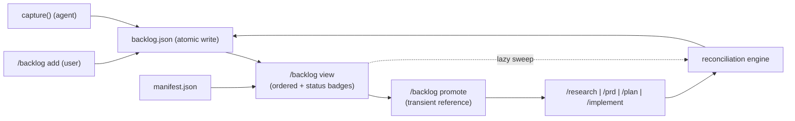

<!-- generated by /plan v2.21.0 on 2026-05-29 -->

# TRD — Shield Backlog

> **In one line:** a project-level "later" list (`docs/shield/backlog.json`) that
> captures future work from anywhere in the Shield workflow, shows it ordered with
> per-entry pipeline status, and prunes itself when that work lands in a plan — so
> ideas stop getting lost without becoming a graveyard.

| Field | Value |
|---|---|
| Project | Shield |
| Feature | `backlog-20260527` |
| Domain | backend (Python) |
| Owner | @ashwinimanoj |
| Linked PRD | [`./prd.md`](./prd.md) (reviewed **Ready**, composite 3.12) |
| Linked plan | [`./plan.md`](./plan.md) · Sidecar: [`./plan.json`](./plan.json) |
| Status | Draft |

## §1 Document Overview {#document-overview}

This TRD covers **Shield Backlog v1** — a single project-level store of future work,
a `/backlog` command to view and curate it, a capture path callable by the user or by
any Shield skill, a user-driven promotion path, and a reconciliation engine that prunes
entries once their work commits to a plan. It is read by the Shield maintainer
(@ashwinimanoj) and by any contributor implementing the `/backlog` command, the
`backlog_store`, the `epic-suggester`, or the `reconciler`.

It derives its problem framing, users, goals, and risks from the linked PRD
([`./prd.md`](./prd.md), lean, reviewed Ready) and translates them into testable
functional/non-functional requirements, a component design, and a ship plan. The
execution breakdown (epics, stories, acceptance criteria) lives in
[`./plan.md`](./plan.md) and its sidecar [`./plan.json`](./plan.json); this document
stays at the "what fits where and why" level — component-internal detail lives in the
three LLD drafts ([`./lld-backlog-store.md`](./lld-backlog-store.md),
[`./lld-epic-suggester.md`](./lld-epic-suggester.md),
[`./lld-reconciler.md`](./lld-reconciler.md)).

## §2 Problem Statement {#problem-statement}

Shield's pipeline (`/research → /prd → /plan → /implement`) only acts on work that has
**already** been decided on. There is no staging area *upstream* of it: `plan.json`
holds only milestone-committed work, and `manifest.json` is an artifact index — neither
models an un-triaged "do this later" item. The technical gap is therefore a missing
**ordered, project-level, persistent queue** that any pipeline step (or the agent
mid-task) can append to without derailing the current task, and that drains itself once
an item's work reaches a plan.

See PRD [§3 Problem & context](./prd.md) for the user-facing narrative (lost ideas,
mid-`/implement` "we should also handle X later", no consistent path from loose idea to
planned stories). This section restates only the *engineering* shape of that gap: a
capture-anywhere write surface + an ordered store + a removal gate keyed off existing
Shield artifacts.

## §3 Objective & Scope {#objective-scope}

Deliver a global backlog store, a `/backlog` view/curate command, a
user-and-agent capture path, a feature+epic association with agent suggestion, and a
promotion+reconciliation loop that keeps the backlog reflecting only not-yet-committed
work.

**In scope**

- A single global store `docs/shield/backlog.json` with a versioned JSON Schema and a Python validator.
- A capture path: `/backlog add` (user) and a documented `capture()` write helper (skills/agent), atomic and validate-or-refuse.
- `/backlog` view: ordered list, per-entry feature+epic+source, and pipeline-status badges read from `manifest.json`.
- Feature+epic association (either may be proposed-new) with exact-normalized agent suggestion.
- User-driven promotion (the user picks `/research`|`/prd`|`/plan`|`/implement`); a transient promotion reference.
- A reconciliation engine + eager prune, lazy sweep, manual remove, and a kill switch.
- An executable eval suite + version bump.

**Out of scope** (per PRD §6/§11)

- Hooks / automatic end-of-task surfacing machinery.
- Per-feature backlogs and a global↔per-feature promotion path.
- A status/workflow state machine; an audit trail for removed entries (manual remove is a plain delete in v1).
- `/pm-sync` of backlog entries before promotion; cross-project/multi-repo backlogs.
- Reordering UX beyond editing the `order` field; multi-writer locking (single-writer assumption — see §6 N1).

## §4 Product Journey {#product-journey}

**Backend interpretation** — the representative paths exercised by the change:

1. **Capture (user).** `/backlog add "<text>"` → `capture()` assigns a `uuid4` id and the
   next integer `order`, prompts for / accepts a feature + epic (proposed-new allowed),
   writes the full doc to `backlog.json.tmp`, then `os.replace()` → `backlog.json`.
2. **Capture (agent).** A Shield skill mid-task calls
   `capture(text, kind=…, feature=…, epic=…, source="agent")` and receives the entry id.
   Same atomic write; never blocks the current task.
3. **View.** `/backlog` reads `backlog.json` (validate-or-refuse), sorts by `order`, and
   for each entry looks up its feature in `manifest.json` to render
   `research ✓  prd ✓  plan –` style badges. A lazy reconciliation sweep runs over all
   entries (unless the kill switch is off) before rendering.
4. **Promote.** `/backlog promote <id>` launches the user-chosen Shield step and forwards
   `<id>` as a **transient runtime reference** (never stamped into `plan.json`).
5. **Reconcile / prune.** At the end of a promoted `/plan` or `/implement` run, if the run
   carried a promotion reference, the entry is pruned (eager). The `/backlog` view sweep is
   the lazy safety net. Both call the one reconciliation engine and log every removal.
6. **Manual remove.** `/backlog remove <id>` plain-deletes an entry (confirm-before-delete);
   `git revert` recovers it only if it had reached a commit.



## §5 Functional Requirements {#functional-requirements}

**Backend interpretation** — each item is a verifiable behavior:

- **F1.** `backlog.json` validates against `shield/schema/backlog.schema.json`; an entry
  with an unknown `kind` (∉ {epic, story, task}) or `source` (∉ {user, agent}) is rejected
  with a named error.
- **F2.** Entry `id` is a `uuid4` string; the **validator** (`validate_backlog.py`) rejects an
  `entries[]` array containing duplicate `id` values with the named error `duplicate_entry_id`.
  (JSON Schema draft 2020-12 `uniqueItems` is whole-item equality and cannot express
  property-level uniqueness, so this check lives in the validator, not the schema.)
- **F3.** `capture(text, *, kind="task", feature=None, epic=None, source) -> str` appends one
  entry, assigns the next integer `order` and a fresh `uuid4` id, and returns that id. It is
  callable from `/backlog add` (source=user) and from any skill (source=agent).
- **F4.** All writes are atomic: full document → `backlog.json.tmp` → `os.replace()`. A kill
  mid-write never leaves a corrupt `backlog.json` (at most a stray `.tmp`).
- **F5.** Reads are validate-or-refuse: a malformed/partial `backlog.json` raises
  `BacklogInvalid` (named error), never a silent truncation or partial parse.
- **F6.** Promotion forwards the entry id as a **transient runtime reference only**; neither
  `plan.json` nor any story record is mutated by promotion (the no-stamping trust boundary).
- **F7.** Feature/epic suggestion uses **exact normalized match** (`casefold()` + collapsed
  whitespace) by **name**, for both existing and proposed-new epics. No fuzzy/token-overlap
  ranking. A tie (≥2 normalized matches) surfaces all tied candidates and auto-picks none;
  no match → the entry is captured proposed-new.
- **F8.** The **"epic landed" predicate** (single source of truth, used by every removal path):
  an entry is removed iff an epic with the matching **normalized-exact name** is **present in
  `plan.json.epics[]`**. The match is by **name, not by the positional `EPIC-N` id** — `EPIC-N`
  is a within-a-single-plan slot reassigned on every re-`/plan`, so it is not a stable cross-plan
  key (an epic reordered across a re-plan must still resolve by name). Story `status` is never
  consulted; a `prd`-only feature is never removed; ambiguity or no match → the entry stays.
- **F9.** Eager prune (end of promoted `/plan`|`/implement`) and lazy sweep (`/backlog` view)
  are idempotent (remove-if-present) and call the same reconciliation engine. Every removal
  emits a structured log line: `{entry id, feature, epic, match-kind (id|name), triggering run,
  gating plan.json path}`.
- **F10.** A `.shield.json` flag `backlog.auto_reconcile` (default `true`) disables both
  eager prune and lazy sweep when `false`, leaving manual remove functional.

## §6 Non-Functional Requirements {#non-functional-requirements}

**Backend interpretation** — measurable targets and guarantees:

- **N1 — Integrity under single-writer.** Shield is single-actor (N5), so v1 assumes one
  writer: no lock. Correctness rests on full-doc → `.tmp` → `os.replace()` (atomic rename),
  validate-or-refuse reads, **and a compare-before-replace check**: `capture()`/`remove()`
  record the on-disk `schema_version`+entry-count (or mtime/hash) at read time and refuse the
  `os.replace()` (raising `BacklogInvalid`) if the file changed underneath. This converts a
  silent lost-update — the failure mode if N5 is violated — into a loud refusal **without a
  lockfile**. The concurrency eval (EPIC-4-S1) asserts the refusal fires and **no entry is lost
  or corrupted**. Multi-writer locking is deferred until Shield becomes multi-actor.
- **N2 — View latency.** `/backlog` view + lazy sweep completes in **≲ 1s** for a backlog of
  ≤ ~200 entries against a typical `manifest.json`. A debug-gated latency line reports actual
  view+sweep wall time so "revisit if breached" is falsifiable rather than impressionistic.
- **N3 — Drift tolerance / no-crash.** An unrecognized `manifest.json` / `plan.json` shape is
  treated as **doubt** (entry stays) with a logged warning; reconciliation never raises on a
  shape it doesn't recognize.
- **N4 — Recoverability.** `backlog.json` is git-tracked; a wrong removal that reached a commit
  is recoverable via `git revert`. For an **end-of-run eager prune** (which may fire before
  `backlog.json` is committed), the v1 recovery mechanism is the transient append-only
  `.shield/backlog-removed.log`: the pruned entry is appended **before** the destructive remove,
  and replaying the log restores it. Commit-before-prune was considered and rejected as a v1
  non-goal (it would force a possibly-dirty-tree commit on every prune and couple recovery to git
  state mid-`/implement`). A manual remove of an *uncommitted* entry is unrecoverable by design
  (documented).
- **N5 — Single-actor assumption.** The whole concurrency posture (N1) and the no-lock design
  rest on Shield being driven by one actor at a time. This is stated as an assumption, not a
  guarantee; if violated, N1's mitigation must be revisited.

## §7 High-Level Design {#high-level-design}

**Backend interpretation** — components and the data they exchange. Three Python
components plus the command/skill surface, all reading/writing the one store.

```
        ┌────────────────────────────────────────────────────────────┐
        │  /backlog command  +  backlog SKILL.md  (add/view/remove/    │
        │                       promote)                                │
        └───────┬───────────────┬───────────────┬─────────────────────┘
                │ capture()      │ view          │ promote(id)
                ▼                ▼               ▼
        ┌───────────────┐  ┌──────────────┐  (transient ref → /plan|/implement)
        │ backlog-store │  │ epic-suggester│
        │ (atomic R/W,  │  │ (manifest +   │
        │  validate)    │  │  plan.json    │
        │               │  │  exact-norm   │
        │               │  │  match)       │
        └──────┬────────┘  └──────┬────────┘
               │ read/write       │ read
               ▼                  ▼
        ┌──────────────────────────────────────┐
        │ docs/shield/backlog.json (ordered)    │
        └──────────────────────────────────────┘
               ▲                  ▲
               │ remove-if-present│ read (epic-landed predicate, F8)
        ┌──────┴────────┐         │
        │  reconciler   │─────────┘  reads manifest.json (feature index)
        │ (engine + eager│            + flagged plan.json (epics[])
        │  prune + lazy  │
        │  sweep + kill  │
        │  switch + log) │
        └────────────────┘
```

- **`backlog-store`** owns the store contract: schema, `capture()`, read (validate-or-refuse),
  remove, atomic write. It is the only writer of `backlog.json`.
- **`epic-suggester`** is read-only: given capture text + a candidate feature, it scans
  `manifest.json` features and the feature's `plan.json` epics and returns exact-normalized
  candidates (F7). It never writes.
- **`reconciler`** holds the engine (F8 predicate + never-remove-on-doubt + drift tolerance +
  removal logging) and the two triggers (eager prune, lazy sweep) gated by the kill switch (F10).
  It calls `backlog-store` to remove entries.
- **`manifest.json`** is the **feature index** (does the feature exist? does it have a
  `plan.json`?). **`plan.json.epics[]`** is the **removal gate**. No ids are stamped into either.

## §8 Alternatives Considered {#alternatives-considered}

1. **Stamp a backlog-entry id into `plan.json` / story records at promotion.** Would make
   reconciliation a trivial id lookup. **Rejected:** it couples the pre-pipeline staging area
   into the committed plan format (a schema change to `plan.json`), pollutes the PM-sync surface,
   and breaks the "no ids tracked" PRD decision. Matching on feature (manifest) + epic name/id
   (plan) keeps the backlog a pure overlay (F6/F8).
2. **Per-feature backlogs** (a `backlog.json` per `docs/shield/<feature>/`). **Rejected for v1:**
   the dominant capture moment is "future work with no feature yet," so a global store with a
   *proposed-new* feature association fits the actual flow; per-feature adds a global↔local
   promotion path with no v1 payoff.
3. **A status/workflow state machine** (`captured → triaged → promoted → done`). **Rejected:**
   the lifecycle is minimal — an entry exists until removed (promotion-prune, sweep, or manual).
   A state machine is unmeasurable scope creep against the §7 success metric.
4. **A project-level epic index** to avoid opening `plan.json` files during reconciliation.
   **Rejected for v1** (kept as PRD §9 open question): `manifest.json`-as-index + opening only
   *flagged* `plan.json` files is simpler and within the N2 budget; add the index only if N2 is
   breached (the debug latency line makes that decision data-driven).
5. **A lockfile for concurrent writes.** **Rejected for v1:** the single-actor assumption (N5)
   makes atomic-rename + validate-or-refuse sufficient (N1); a lock is dead weight until Shield
   is multi-actor.

## §9 Cross-Cutting Concerns {#cross-cutting-concerns}

- **Validation.** One schema (`backlog.schema.json`) + one validator (`validate_backlog.py`)
  gate every read and the eval suite. Validate-or-refuse is the single integrity primitive.
- **Logging.** Two logged surfaces: (a) every reconciliation **removal** with rationale
  (F9 structured line), and (b) every never-remove-on-doubt decision (N3 warning). Removals are
  never a silent `git diff`.
- **Configuration.** `.shield.json` gains `backlog.auto_reconcile` (bool, default `true`) — the
  kill switch (F10). No secrets; the store is plaintext JSON, git-tracked.
- **Schema evolution.** `schema_version` is set in v1 so future shape changes (priority buckets,
  audit trail) migrate read-old/write-new. v1 ships **no live `migrate()` code** — the policy is
  documented only (doc-only until `schema_version` 2), to avoid mistaking documentation for
  working code.
- **Recovery.** N4 governs the destructive paths: commit-before-prune or
  `.shield/backlog-removed.log`; manual-remove-of-uncommitted is unrecoverable by design.

## §10 Milestones {#milestones}

The ship plan below is **rendered from `plan.json` `milestones[]`** — it is the structured
source of truth. Do not hand-edit the region between the markers; edit `plan.json` and re-run
`/plan` to refresh it. Exit criteria tie back to §5 (F1–F10) and §6 (N1–N5).

<!-- BEGIN rendered:milestones — do not edit, regenerated by /plan from plan.json -->

### M1 — Capture + store + view  *(no deps)*

**Outcome:** A global docs/shield/backlog.json exists; entries can be added (user + agent) with order, kind, source, and a feature + epic association; /backlog renders the ordered list with per-entry pipeline status from manifest.json; an entry can be manually removed.

**Exit criteria:**
- backlog.json has a documented JSON Schema with a top-level schema_version and per-entry {id, order, kind, source, feature, epic, text}; ids are unique across entries[]; shield/scripts/validate_backlog.py exits 0 on valid and non-zero with a named error on invalid.
- An entry can be captured both from the user (/backlog add) and from a Shield skill via the documented write helper; the write is atomic (temp-then-rename) and validate-or-refuse.
- /backlog renders entries in order with each entry's feature + epic and a research/prd/plan status read from manifest.json.
- /backlog can remove an entry by id (plain delete; no retained history).

### M2 — Feature + epic association + suggestion  *(deps M1)*

**Outcome:** Every entry references a feature and an epic (existing or proposed-new); the agent suggests a matching feature/epic by scanning manifest.json features and plan.json epics, and the user can accept, pick another, or create-new.

**Exit criteria:**
- Capture prompts for (or accepts) a feature + epic; both may be proposed-new.
- The agent proposes >=1 candidate feature (from manifest.json) and >=1 candidate epic (from the feature's plan.json) using exact-normalized match; the user can accept/replace/create-new.
- Suggestion never blocks capture — an entry can be captured with a proposed-new feature/epic when no match exists; a normalized-name tie surfaces all tied candidates and auto-picks none.

### M3 — Promotion + reconciliation  *(deps M2)*

**Outcome:** The user promotes an entry by starting /research, /prd, /plan, or /implement from it; the entry is removed when its work commits — eagerly at the end of the promoted /plan or /implement run, lazily on the /backlog sweep, or manually. Reconciliation matches by feature (manifest) + epic (plan.json) and never removes on doubt.

**Exit criteria:**
- Promoting an entry passes it as a transient reference to /plan or /implement; on success that entry is pruned (eager).
- The /backlog sweep removes any entry whose epic's work now appears in the feature's plan.json (lazy safety net); a prd-only feature is NOT removed.
- Match key: both existing and proposed-new entries match by casefold+collapsed-whitespace exact epic NAME (never by positional epic id); on ambiguity or no match the entry stays.
- Eager prune and lazy sweep are idempotent (remove-if-present), share one reconciliation engine, log every removal with rationale, and treat an unrecognized manifest.json/plan.json shape as doubt (entry stays), never crashing.
- A .shield.json kill switch (backlog.auto_reconcile=false), made schema-valid by an additive 'backlog' object in shield.schema.json, disables eager prune and lazy sweep, leaving manual-remove only.
- An executable eval exercises capture (user + skill), view+status, manual remove, eager prune, lazy sweep, match-key, never-remove-on-doubt, concurrency (no lost entry), no-stamping (F6), and recovery-rehearsal with a RED->GREEN trail; the Shield plugin version is bumped per CLAUDE.md.

<!-- END rendered:milestones -->

## §11 APIs Involved {#apis-involved}

**Backend interpretation** — the interface surface. Component-internal detail lives in the
LLD drafts; this is the boundary contract.

### `backlog.json` document shape

```jsonc
{
  "schema_version": 1,
  "entries": [
    {
      "id": "f47ac10b-58cc-4372-a567-0e02b2c3d479",  // uuid4 string, unique across entries[]
      "order": 10,                                     // integer; ascending = view order
      "kind": "epic",                                  // enum: epic | story | task
      "source": "agent",                               // enum: user | agent
      "feature": "billing-retries",                    // feature folder slug (proposed-new allowed)
      "epic": "EPIC-2",                                // epic id (existing) or name (proposed-new)
      "text": "Add exponential backoff to webhook retries"
    }
  ]
}
```

### `backlog_store` write helper (LOCKED — plan-review 2026-05-27)

```python
def capture(
    text: str,
    *,
    kind: str = "task",          # epic | story | task
    feature: str | None = None,  # None ⇒ prompt / proposed-new at capture
    epic: str | None = None,
    source: str,                 # user | agent  (required, keyword-only)
) -> str:                        # returns the new entry's uuid4 id
    """Append one entry atomically. Raises BacklogInvalid on a malformed/partial store."""
```

Every capturing skill builds against this signature. Companion store operations:
`read() -> dict` (validate-or-refuse, raises `BacklogInvalid`), `remove(entry_id) -> bool`
(remove-if-present, idempotent).

### CLI surface (`/backlog`)

| Command | Behavior |
|---|---|
| `/backlog` | View ordered list + per-entry feature/epic/source + manifest status badges; runs lazy sweep (unless kill switch off). |
| `/backlog add "<text>"` | `capture(..., source="user")`; prompts for feature+epic with agent suggestion. |
| `/backlog remove <id>` | Confirm-then-plain-delete (`remove(id)`). |
| `/backlog promote <id>` | Launch user-chosen step; forward `<id>` as transient reference (no stamping). |

### `manifest.json` read-contract (consumed, not owned)

The backlog reads — never writes — the existing `manifest.json`. Its real shape is pinned here
so EPIC-2-S1 (status badges) and EPIC-3-S2 (reconciliation) build against ground truth rather
than reverse-engineering the live file:

```jsonc
{
  "schema_version": 2,
  "features": [                       // a LIST keyed by name, not a feature-keyed map
    {
      "name": "billing-retries",      // == the docs/shield/<feature>/ folder slug (invariant)
      "artifacts": {                  // booleans, not paths
        "research": false,
        "prd": true,
        "plan_json": true,            // the flag the reconciler gates "has a plan?" on
        "plan_md": true,
        "plan_arch_md": false
      },
      "reviews": { /* ... */ },
      "updated": "2026-05-29T00:00:00+00:00"
    }
  ]
}
```

Key facts the components rely on: `features` is a **list keyed by `name`**; `name` **is** the
feature folder slug (the reconciliation key); `artifacts.plan_json` is a **boolean** flag, and
the manifest does **not** store a plan path — the reconciler **derives** `docs/shield/<name>/plan.json`.

### `reconciler` engine entry point

`reconcile(entry, *, manifest: dict, plans: dict[str, dict]) -> RemovalDecision` — applies the
F8 "epic landed" predicate. `manifest` is the parsed document above; `plans` is a
`{feature-slug → parsed plan.json}` map the trigger populates by reading `docs/shield/<slug>/plan.json`
for each feature whose `artifacts.plan_json == true`. Returns `REMOVE` / `STAY_AMBIGUOUS` /
`STAY_NO_MATCH` / `STAY_DOUBT`, each carrying the rationale fields for the F9 log line
(`{entry id, feature, epic, match-kind, triggering run, gating plan.json path}`). Pure function
over already-read documents (testable without IO).

## §12 Open Questions {#open-questions}

1. **Feature/epic discovery cost (PRD §9).** Confirming a proposed-new epic means opening the
   `plan.json` the manifest flags as having one. *Lean:* manifest-as-index, open only flagged
   plans; add a project-level epic index only if N2 is breached. **Resolve-by:** after M1, from
   the N2 debug latency line.
2. **Dropped/rejected terminal state (PRD §9).** Is plain-delete enough, or do we need an explicit
   "decided against" state? **Resolve-by:** deferred to post-v1 (PRD §11 out-of-scope); revisit if
   the §7 metric shows entries being silently deleted rather than promoted.
3. ~~Capture-from-skill interface~~ — **closed** by F3 / EPIC-1-S2 (the `capture()` signature is
   locked).

## §13 References {#references}

- PRD: [`./prd.md`](./prd.md) (lean, reviewed Ready, composite 3.12)
- Execution plan: [`./plan.md`](./plan.md) · Sidecar: [`./plan.json`](./plan.json)
- LLD drafts: [`./lld-backlog-store.md`](./lld-backlog-store.md),
  [`./lld-epic-suggester.md`](./lld-epic-suggester.md),
  [`./lld-reconciler.md`](./lld-reconciler.md)
- Plan review: [`./reviews/plan/2026-05-27/summary.md`](./reviews/plan/2026-05-27/summary.md) (Ready, composite 3.14)
- PRD review: [`./reviews/prd/2026-05-27_2/summary.md`](./reviews/prd/2026-05-27_2/summary.md)
- CLAUDE.md — mandatory eval-coverage policy; Shield versioning (`.claude-plugin/marketplace.json`).
- Existing Shield schemas read by reconciliation: `manifest.json` (feature index), `plan.json` (`epics[]` gate).

## §14 Rollback Strategy {#rollback-strategy}

**Backend interpretation** — the change is additive (new store, new command, new scripts) and
ships behind observable triggers.

**Steps to undo:**

1. **Disable reconciliation without uninstalling:** set `.shield.json`
   `backlog.auto_reconcile = false` (F10). Eager prune and lazy sweep stop; manual remove and
   capture/view still work. This is the first-line mitigation for a misbehaving reconciler.
2. **Recover a wrongly-removed entry:** replay it from `.shield/backlog-removed.log` (the v1
   recovery mechanism — appended before every destructive prune, N4), or `git revert` the commit
   that dropped it if the removal had already been committed.
3. **Full feature back-out:** revert the feature PR — removes `/backlog`, the scripts, and the
   schema. `backlog.json` itself is plain data; deleting it loses only captured entries (which are
   recoverable from git history while the file was tracked).

**Triggers (observable):**

- Reconciliation removes an entry whose work is *not* in any `plan.json` (a confident-but-wrong
  removal) — surfaced by the F9 removal log → flip the kill switch, then `git revert`.
- `/backlog` view+sweep exceeds the N2 ~1s budget (debug latency line) → flip the kill switch and
  evaluate the project-level epic index (§12 Q1).
- The eval suite (EPIC-4-S1) regresses on concurrency/no-lost-entry, no-stamping (F6), or
  never-remove-on-doubt → block release / revert the offending change.
