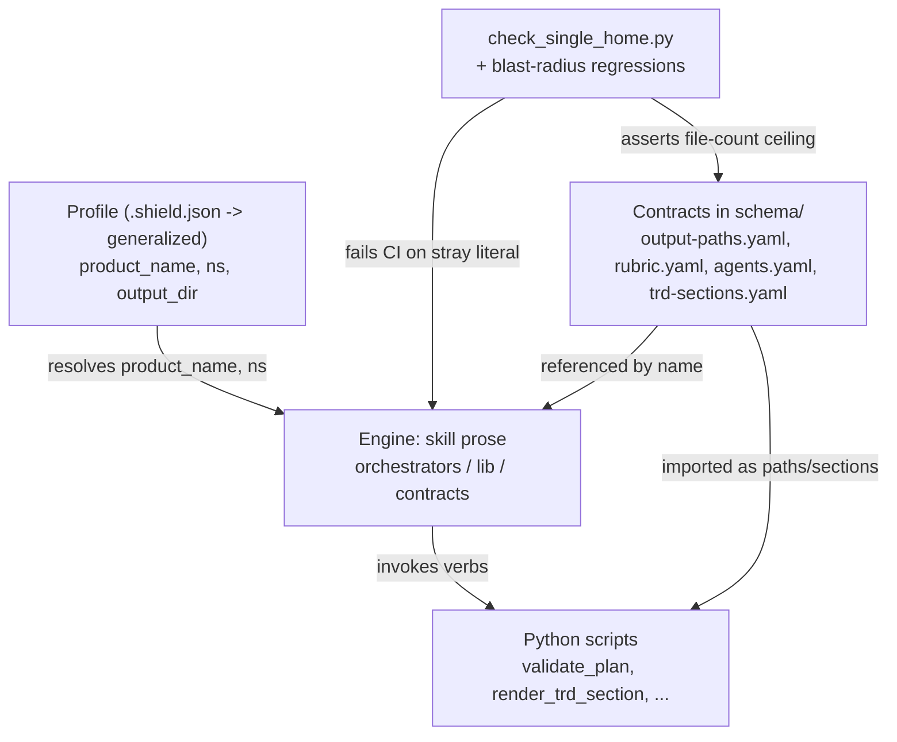
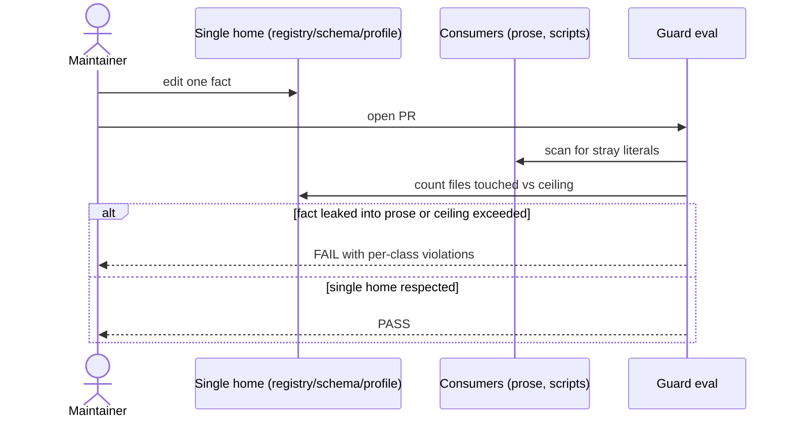
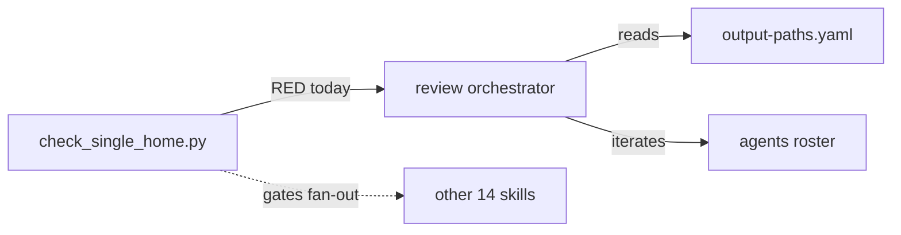
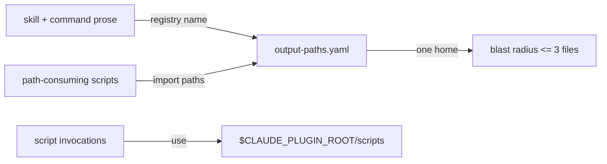
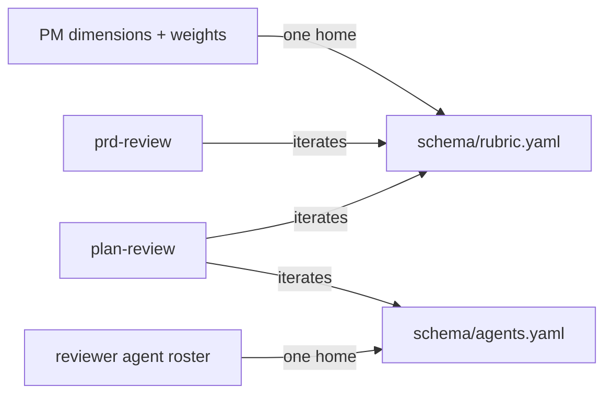
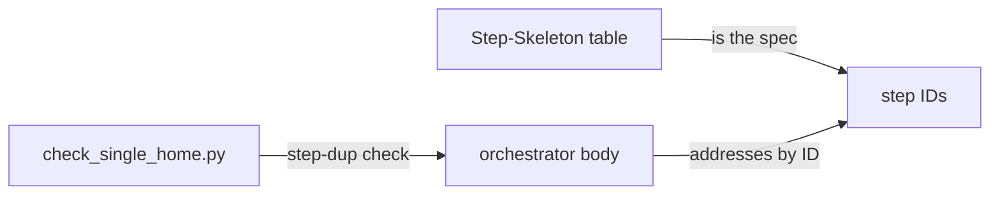
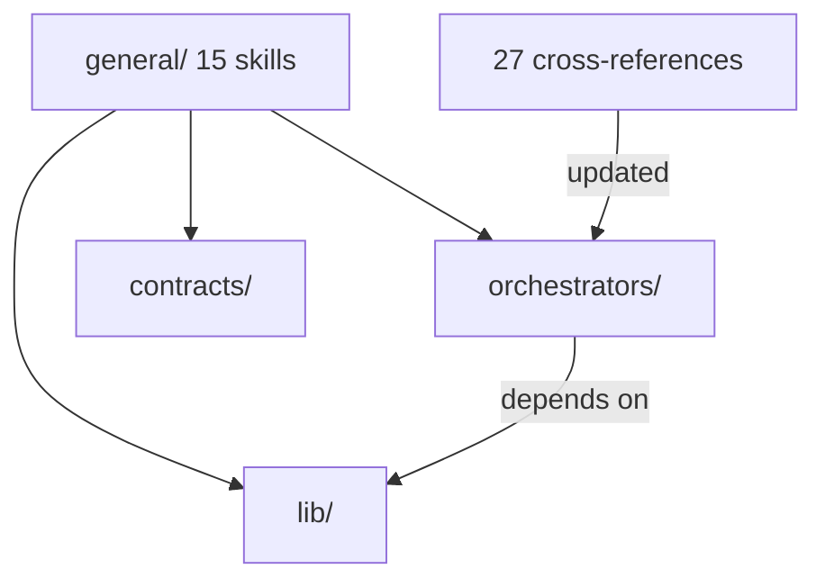
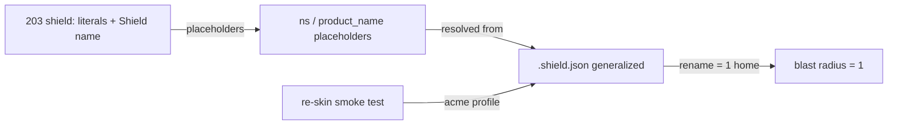

# TRD — Reduce skill change amplification

<!-- generated by /plan v2.29.0 on 2026-06-17 -->

## §1 Document Overview {#document-overview}

**In plain terms (for any reader):** Today, changing one thing in Shield's skills — a file location, a review rule, the product's own name — means hand-editing the same fact in many places (up to 40 files for one path, 203 places to rename the plugin), and a missed copy ships silently. This refactor gives each fact one home so the same change takes minutes in one file, and a CI check stops the copies from creeping back. The payoff is faster, safer maintenance and a path to white-labeling Shield for other products.

This TRD covers that maintainability refactor of the Shield plugin's skills: moving every duplicated fact (paths, rubric dimensions, agent roster, steps, product name, namespace) to a single home so prose, commands, and scripts reference it instead of restating it. The audience is Shield maintainers. It implements the decision in `../../adr/0002-reduce-skill-change-amplification.md` and pairs with `./plan.md`. There is no PRD or prior research for this feature; the ADR is the upstream source.

Owner: @ashwinimanoj. Date: 2026-06-17.

## §2 Problem Statement {#problem-statement}

A single conceptual change to Shield forces edits across many files that must all agree. Measured today: renaming one output path (`plan.json`) touches 40 files; changing one PM rubric dimension touches 6; the agent namespace `shield:` is 203 literals across 34 files; one doc section is restated in ~12 places; and every orchestrator states each step twice (a Step-Skeleton table plus a body that re-describes it). The root cause is that facts are restated, not referenced — and the drift it invites is already visible (29 inline `docs/shield` literals sit next to the registry that was meant to retire them).

**Business linkage:** this is not engineering polish for its own sake. The cost lands on every release — maintenance hours spent on multi-file sweeps and the latent risk of a missed copy shipping. And the M6 profile layer is the enabler for a concrete product capability: white-labeling / re-skinning Shield for another product becomes a config edit rather than a 203-site rewrite. Track that capability as the strategic payoff, not just as the re-skin smoke test.

## §3 Objective & Scope {#objective-scope}

Make a representative change touch ~1 home instead of 6–40, by giving each fact exactly one home and having everything else reference it by name.

**In scope:**
- Path nouns routed through `output-paths.yaml` (prose, invocation args, and the scripts' own code).
- Script-root references normalized to `$CLAUDE_PLUGIN_ROOT/scripts/`.
- Rubric dimensions/weights and the reviewer-agent roster externalized to `schema/` and iterated.
- Step-Skeleton/body duplication collapsed.
- `skills/general/` split into kind-based groups.
- Product name + agent namespace moved into a profile.
- A single-home guard eval and per-scenario blast-radius regressions.

**Out of scope:**
- Changing Shield's *opinions* — the 20-section PRD scaffold and PM1–PM11 rubric stay exactly as opinionated; they only change form (data, not prose).
- A script-name registry (script names are verbs and stay inline).
- New skills, agents, or commands beyond what the refactor requires.

## §4 Product Journey {#product-journey}

The "user" here is a Shield maintainer making a change.

1. **Trigger:** a maintainer needs to change a fact — rename an output file, reweight a dimension, add a reviewer agent, or rename the plugin.
2. **Today:** they grep for every copy of the literal, edit each, and hope none drifted; CI has no guard, so a missed copy ships.
3. **After:** they edit the one home (a registry entry, a schema row, or the profile). Consumers that reference it by name need no edit.
4. **Guardrail:** `check_single_home.py` runs in CI and fails if a fact reappears outside its home; the blast-radius regression fails if a representative change exceeds its committed file-count ceiling.
5. **Observable effect:** the diff for a fact change is one home plus stable references — not a 40-file sweep.

## §5 Functional Requirements {#functional-requirements}

- **F1.** Skill and command prose contain zero inline `docs/shield` literals; output paths resolve from `output-paths.yaml` via `{output_dir}`.
- **F2.** Path-consuming scripts (`validate_plan.py`, `render_trd_section.py`, and peers) read filenames from `output-paths.yaml` rather than hardcoding them.
- **F3.** Every script invocation uses `$CLAUDE_PLUGIN_ROOT/scripts/<name>`; zero bare `shield/scripts/` references remain.
- **F4.** Rubric dimensions + weights live only in `schema/rubric.yaml`; the reviewer-agent roster (slug → owned dimensions) lives only in `schema/agents.yaml`; `plan-review` and `prd-review` iterate them.
- **F5.** Each orchestrator states each step exactly once: the Step-Skeleton table is the spec; the body addresses steps by ID.
- **F6.** `skills/general/` is replaced by kind-based groups (orchestrators / lib / contracts) with all cross-references updated.
- **F7.** The product name and agent namespace resolve from a single profile via `{product_name}` / `{ns}`; no `shield:` prefix or hardcoded `Shield` name remains in engine prose.
- **F8.** `scripts/check_single_home.py` exits non-zero when any fact appears outside its home, reporting a per-class violation count.

## §6 Non-Functional Requirements {#non-functional-requirements}

- **Blast radius:** a path rename touches ≤3 files; adding a rubric dimension touches ≤2 files; a namespace rename touches 1 home. Each ceiling is asserted by a regression eval.
- **Indirection budget:** a fact gets its own home only if it is restated in ≥2 places today or a maintainer changes it as a unit; single-use facts stay inline. This caps added file-hops.
- **Behavior preservation:** `plan-review` and `prd-review` produce the same dimension set and dispatch set after externalization as before (eval-verified).
- **No regression:** the existing skill and eval suites pass at every stage.
- **Portability:** script references resolve regardless of working directory (no dependency on cwd being the repo root).

## §7 High-Level Design {#high-level-design}

The design separates three layers. **Engine** = generic skill prose (the verbs). **Contract** = Shield's opinions as data in `schema/` (the nouns: paths, sections, rubric, agent roster). **Profile** = per-deployment bindings (product name, namespace, config filename, output_dir). A skill's prose holds only the algorithm; every deployment-specific noun resolves by name from a contract or the profile. The guard eval enforces the boundary so facts cannot drift back into prose.

The migration order is gated: prove the resolution mechanism on one orchestrator (M1) before fanning out. Path/script-root (M2), rubric/roster (M3), and step collapse (M4) are independent once the pattern holds, then the folder split (M5) consolidates, and the profile layer (M6) lands last because it depends on the consolidated structure.

**Resolution mechanism (the keystone assumption).** References resolve at **skill-load / run time**, not via a build step: when a skill runs, the agent reads `.shield.json` (the profile) and the `schema/` contracts and substitutes each `{output_dir}` / `{ns}` / `{product_name}` / registry-name token in place — the same way `{output_dir}` already resolves today. Python scripts resolve the same nouns by importing the contract files directly. There is no compiled/generated artifact. This is the load-bearing assumption of the whole design, and M1 exists to *validate* it (does a dispatched subagent resolve every token at load time, with no dangling placeholder?) rather than to discover it. If a token cannot be resolved, the skill fails fast with a named `missing_profile_field` error rather than emitting the literal placeholder (see §14).

**Indirection budget — a checkable rule.** A fact earns its own home **iff** it is restated in ≥2 places today OR a maintainer changes it as a unit; single-use facts stay inline. This is not just prose guidance: a sibling check (alongside `check_single_home.py`) flags *single-use facts that got externalized*, so the guard protects against over-rotation (too much indirection) as well as under-referencing (restatement) — both directions of the boundary.

**Backend interpretation:** the "services" here are the skill engine, the schema contracts, and the Python scripts; the contracts are the canonical data store, and the guard eval is the enforcement boundary at PR time.

## §8 Alternatives Considered {#alternatives-considered}

1. **Leave it as-is.** Rejected: amplification is measured and already causes drift (29 inline literals beside the registry meant to replace them).
2. **Generate skills from one big template.** Rejected: hides the engine behind a build step and is harder to read and debug than named references in plain prose.
3. **One mega-config file for all facts.** Rejected: collapses distinct contracts (paths, sections, rubric, agents, profile) into a new junk drawer one layer down. Keep one home *per kind of fact*.
4. **A script-name registry.** Rejected (the near-win): renaming a script is rare (a code refactor) while path/dimension/agent edits are frequent; a name lookup would tax the common path to save the rare one. Script names stay inline as verbs.

## §9 Cross-Cutting Concerns {#cross-cutting-concerns}

- **Eval coverage (mandatory per CLAUDE.md):** every stage ships with eval coverage. The single-home guard starts RED and turns GREEN class-by-class; blast-radius regressions lock each ceiling so future edits cannot reintroduce restatement.
- **Behavior equivalence:** externalizing the rubric/roster must not change grading; covered by re-running `plan-review`/`prd-review` evals.
- **Migration safety:** each stage is independently revertable; the folder split (M5) is the highest-reference-churn step and lands after the content stages settle.
- **Documentation:** the engine/contract/profile boundary and the verbs-inline/nouns-external rule are recorded in ADR 0002 and enforced by the guard, not just prose.
- **Adoption / change-management risk:** the human risk is that maintainers must learn the engine/contract/profile mental model and the verbs-inline / nouns-external rule, and may keep restating facts out of habit. Mitigation: a short convention note in `CLAUDE.md` (one paragraph + a pointer to ADR 0002), with `check_single_home.py` as the mechanical teaching backstop — it fails the PR and names the violated rule, so the convention is learned by enforcement, not memo.
- **Tooling & CI substrate (stated once for all stories):** Python runs through `uv` (per CLAUDE.md — no system pip). Evals live under `shield/evals/` and run via `shield/evals/run-evals.sh` (criteria-based) or `shield/evals/run.py` (structured, as the plan-trd eval uses); "registered in CI" means a GitHub Actions workflow under `.github/workflows/` (mirroring `eval-plan-trd.yml`'s path-filtered trigger) invokes the runner and fails the build on non-zero exit. `check_single_home.py` gets its own such workflow (e.g. `eval-skills-single-home.yml`). `$CLAUDE_PLUGIN_ROOT` is harness-provided at run time and must never be hardcoded.

## §10 Milestones {#milestones}

The ship plan below is rendered from `plan.json` `milestones[]` — edit the sidecar and re-run `/plan` to change it; do not hand-edit the rendered region.

<!-- BEGIN rendered:milestones — do not edit, regenerated by /plan from plan.json -->

### M1 — Pattern proven on one skill  *(no deps)*

**Outcome:** One orchestrator is fully converted to the single-home pattern and a failing single-home guard eval exists, so the rest of the migration is gated on a working, regression-tested mechanism.

**Description:** Prove load-time resolution of registry/profile references on the review orchestrator (chosen because it exercises both path-noun resolution and roster-driven dispatch) before touching the other 14 skills. Land the single-home guard eval RED so each later stage turns it GREEN incrementally.

**Exit criteria:**
- The review orchestrator resolves {output_dir} path nouns, dispatches from a roster instead of a hand-typed list, and contains no inline docs/shield literal.
- scripts/check_single_home.py exists and fails (exit non-zero) against the current tree, naming each violation class (inline docs/shield, bare shield/scripts/, hand-typed dimension list, literal shield: outside profile, step restated in table+body).
- evals/ has a case that runs the prototype orchestrator and asserts zero brand/path literals leak into its generated artifacts.

**Architecture:**

### M2 — Paths and script root have one home  *(deps M1)*

**Outcome:** Every output path and the scripts root resolve from a single source; the 40-file plan.json blast radius and the 39 bare script-root literals are gone.

**Description:** Delete the 29 inline docs/shield literals, make the Python scripts read paths from output-paths.yaml instead of hardcoding filenames, and rewrite the 39 bare shield/scripts/ references to $CLAUDE_PLUGIN_ROOT/scripts/.

**Exit criteria:**
- Zero inline docs/shield literals remain in skills/ and commands/ prose (verified by check_single_home.py).
- Zero bare shield/scripts/ references remain; all script calls use $CLAUDE_PLUGIN_ROOT/scripts/.
- validate_plan.py, render_trd_section.py and the other path-consuming scripts read filenames from output-paths.yaml; changing a path in the registry requires editing <=3 files (blast-radius regression asserts the ceiling).

**Architecture:**

### M3 — Rubric and agent roster are data  *(deps M1)*

**Outcome:** Reviewers add or reweight a rubric dimension or reviewer agent by editing one schema file; the orchestrators iterate the roster instead of listing it.

**Description:** Promote the rubric dimensions + weights into schema/rubric.yaml and the reviewer-agent roster (slug to owned-dimensions) into schema/agents.yaml, then convert plan-review and prd-review to iterate the registries rather than re-typing the lists inline.

**Exit criteria:**
- schema/rubric.yaml holds every PM dimension and its weight; schema/agents.yaml maps each reviewer agent to the dimensions it owns.
- plan-review and prd-review dispatch by iterating the roster; no hand-typed dimension or agent list remains in their prose (check_single_home.py passes).
- Adding one dimension touches <=2 files (blast-radius regression asserts the ceiling).

**Architecture:**

### M4 — Steps stated once per skill  *(deps M1)*

**Outcome:** Each orchestrator states each step exactly once; adding or reordering a step is a single edit.

**Description:** Collapse the Step-Skeleton table / body duplication across the remaining orchestrators so the table is the spec and the body addresses steps by ID without restating the list.

**Exit criteria:**
- Every orchestrator's body addresses steps by ID and no longer restates the step list that the Step-Skeleton table holds.
- check_single_home.py's step-duplication check passes for all orchestrators.
- Spot-check: reordering a step in one orchestrator changes exactly one region of the file.

**Architecture:**

### M5 — Skills grouped by kind  *(deps M2, M3, M4)*

**Outcome:** skills/ is split into orchestrators / lib / contracts so the dependency direction is visible and general/ is no longer a junk drawer.

**Description:** Move the 15 general/ skills into orchestrators, lib, and contracts groupings and update every cross-reference (skills, commands, agent defs, scripts, hooks) to the new locations.

**Exit criteria:**
- general/ is gone; skills live under the three kind-based groups.
- All cross-references (Skill invocations, command docs, hook context, script paths) resolve to the new locations; no dangling reference remains.
- All existing skill/eval suites pass against the new layout.

**Architecture:**

### M6 — Brand and namespace are a profile  *(deps M5)*

**Outcome:** The product name and agent namespace live in one profile; renaming the plugin or adding a reviewer agent no longer ripples across 34 files.

**Description:** Replace the 203 shield: namespace literals and the embedded Shield product name with {ns} / {product_name} placeholders resolved from a single profile, generalizing .shield.json into that profile.

**Exit criteria:**
- No literal shield: namespace prefix or hardcoded Shield product name remains in engine prose; both resolve from the profile (check_single_home.py passes).
- A re-skin smoke test swaps in a throwaway acme profile, runs one orchestrator, and asserts zero shield/Shield strings appear in the generated artifacts.
- Renaming the namespace in the profile changes exactly one home (blast-radius regression asserts the ceiling).

**Architecture:**

<!-- END rendered:milestones -->

## §11 APIs Involved {#apis-involved}

The interface surface here is internal contracts, not network APIs.

- **`schema/output-paths.yaml`** — path registry; consumed by skill prose (by name) and by scripts (imported). New consumers reference, never re-list.
- **`schema/rubric.yaml`** (new) — dimension → weight map; consumed by `plan-review`/`prd-review` grading. Shape: `<dim_id>: { name, weight, severity }` (e.g. `user-impact-clarity: { name: "User impact clarity", weight: 0.7, severity: Critical }`).
- **`schema/agents.yaml`** (new) — agent slug → owned-dimensions map; consumed by reviewer dispatch. Shape: `<slug>: { owns: [<dim_id>...], weight }` (e.g. `architect: { owns: [high-level-design], weight: 1.0 }`).
- **Profile** = **`.shield.json` generalized in place** (decision locked). It is a *superset* of today's `.shield.json` — not a new file and not a rename — gaining two fields, `product_name` and `ns`, alongside the existing `output_dir`. Resolution order is unchanged: search the current directory, then parent directories. Engine prose consumes it via `{product_name}` / `{ns}` placeholders. This keeps profile vs. project-config as one file with one resolution path; the only new surface is the two added fields.
- **`scripts/check_single_home.py`** (new) — CLI: exit code 0 = clean, non-zero = violations; prints per-class counts. Consumed by the eval runner / CI.

## §12 Open Questions {#open-questions}

All three open questions are now resolved (2026-06-17):

1. ~~Final group names for the skill split~~ — **resolved: `orchestrators` / `lib` / `contracts` (locked)**. orchestrators = command-backed; lib = reusable utilities; contracts = doc-shape skills.
2. ~~Profile filename and resolution order~~ — **resolved: generalize `.shield.json` in place** (add `product_name` + `ns`; resolution order unchanged, cwd then parents). The profile is a superset of today's config, not a new file (see §11).
3. ~~Whether the prototype orchestrator should be `review` or `research`~~ — **resolved: `review`**, because it exercises both path-noun resolution (date-keyed output dirs) and roster-driven dispatch at moderate size.

No open questions remain at this scope.

## §13 References {#references}

- `../../adr/0002-reduce-skill-change-amplification.md` — the decision this TRD implements.
- `../../adr/0001-introduce-prd-layer.md` — prior ADR (format reference).
- `shield/schema/output-paths.yaml` — the existing single-home precedent being generalized.
- `CLAUDE.md` → "Eval coverage — MANDATORY for plugin updates".

LLD references: n/a — no component LLDs at this scope.

## §14 Rollback Strategy {#rollback-strategy}

Each milestone is an independent, revertable change.

**Steps to undo:** revert the milestone's commit(s); because each stage only moves a fact from many homes to one (or normalizes a reference), reverting restores the prior literals without data loss. The folder split (M5) is the only move with wide reference churn — revert it as a single commit so references flip back atomically.

**Triggers (observable):**
- The existing skill or eval suite regresses (any previously-GREEN eval goes RED) after a stage merges.
- `plan-review`/`prd-review` evals show a changed dimension or dispatch set after the M3 externalization (behavior was supposed to be identical).
- The re-skin smoke test or a blast-radius regression cannot be made GREEN within the stage — signals the chosen home/resolution mechanism is wrong; revert and revisit before proceeding.

**Resolution-failure fallback (degradation path, not just retreat):** if the M1 prototype shows the harness cannot resolve a `{…}` token at load time, the skill must **fail fast** with a named `missing_profile_field` / `unresolved_reference` error rather than silently emitting the literal placeholder into an artifact. This converts the keystone risk from a silent-corruption failure into a loud, catchable one — the prototype either proves load-time resolution works, or surfaces a named error that gates the rest of the migration before any fan-out. Only if fail-fast itself proves unworkable do we fall back to "revert M1 and revisit the mechanism."
