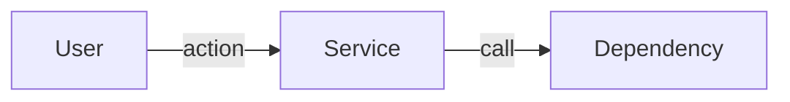
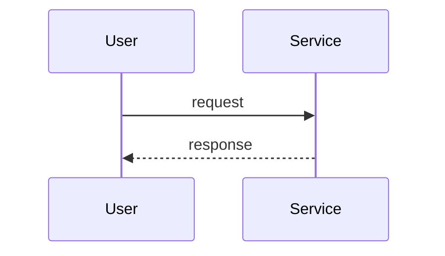
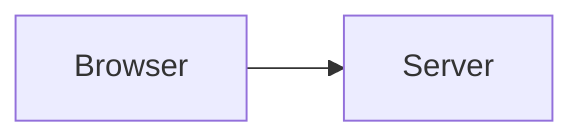

# PRD Scaffold Expansion Implementation Plan

> **For agentic workers:** REQUIRED SUB-SKILL: Use superpowers:subagent-driven-development (recommended) or superpowers:executing-plans to implement this plan task-by-task. Steps use checkbox (`- [ ]`) syntax for tracking.

**Goal:** Expand the Shield PRD scaffolds with Terminologies (§2), Architecture & flows (§5), per-story Type labels in §8, auto-generated Table of Contents in `prd.html`, and Mermaid diagram rendering. Establish a lightweight eval pattern (`shield/evals/`) and ship 5 evals covering the new behavior.

**Architecture:** Renderer changes (TOC + mermaid) are server-side in `render-markdown.py` and gated by placeholders so non-PRD callers are unaffected. Scaffold changes are mechanical renumbering on top of PR #41's merged Milestones work (standard 18→20, lean 8→10). Skill walk order defers Terminologies (filled last from research-glossary + LLM scan) and inserts the new Architecture & flows step between Personas and Goals. Evals dispatch a subagent via the `claude` CLI in non-interactive mode, capture output, and judge structurally + via a second LLM pass.

**Tech Stack:** Python 3 + markdown-it-py 3.x + mdit-py-plugins 0.4.x; `uv` for ephemeral deps; `mermaid.js` 10.x via CDN; `claude` CLI for eval dispatch; markdown skill definitions for `/prd`.

**Spec:** `docs/superpowers/specs/2026-05-13-prd-toc-terminologies-design.md`

---

## File Structure

| File | Disposition |
|---|---|
| `shield/scripts/render-markdown.py` | Modify — TOC token-walk + `{{TOC}}` substitution + mermaid `fence` rule override. |
| `shield/scripts/test_render_markdown_toc.py` | Create — pytest tests for TOC, mermaid, and backwards-compat. |
| `shield/skills/general/prd-docs/templates.md` | Modify — rewrite both scaffolds (20/10 sections); add Terminologies + Architecture & flows templates; update story template with Type + Existing-behavior; add `{{TOC}}` + mermaid script + TOC CSS to HTML shell. |
| `shield/skills/general/prd-docs/SKILL.md` | Modify — walk order, all section-number refs, story-type prompt, terminologies-build step. |
| `shield/skills/general/prd-docs/meta-schema.md` | Modify — `sections_present` example, `rubric_version` 1.1→1.2, counts. |
| `shield/skills/general/prd-docs/type-detection.md` | Modify — lean list, threshold, load-bearing range. |
| `shield/skills/general/prd-docs/test-fixtures/*.md` | Modify — 6 fixtures renumbered + new sections + Type fields. |
| `shield/skills/general/prd-review/personas.md` | Modify — Section 6 → 8. |
| `shield/skills/general/milestone-coverage/SKILL.md` | Modify — trigger refs Section 6→8 (std), 5→7 (lean). |
| `shield/skills/general/story-coverage/SKILL.md` | Modify — note that scaffolded stories default `Type: new`. |
| `shield/commands/prd.md` | Modify — counts and walk-order summary. |
| `shield/evals/` | Create — new directory for eval pattern. |
| `shield/evals/README.md` | Create — format conventions + how-to-run. |
| `shield/evals/run-eval.sh` | Create — runner that dispatches via `claude` CLI. |
| `shield/evals/prd-docs/01..05*.md` | Create — 5 eval files for this skill's new behaviors. |
| `.claude-plugin/marketplace.json` | Modify — shield 2.15.0 → 2.16.0. |

---

## Task 1: TOC generation in render-markdown.py (TDD)

The renderer already uses `anchors_plugin` which emits stable `id` attrs on headings. We add a token-walk to collect h2/h3 entries and build a `<nav class="toc">` block, substituted into a new `{{TOC}}` placeholder.

**Files:**
- Create: `shield/scripts/test_render_markdown_toc.py`
- Modify: `shield/scripts/render-markdown.py`

- [ ] **Step 1: Write failing test `test_basic_toc_built_from_h2_and_h3`**

Create `shield/scripts/test_render_markdown_toc.py`:

```python
"""Tests for render-markdown.py TOC + mermaid handling.

Invokes render-markdown.sh end-to-end so uv resolves deps the same way
production does. Runnable: `cd shield/scripts && uv run --with pytest pytest -v`.
"""
from __future__ import annotations

import subprocess
import tempfile
from pathlib import Path

SCRIPT_DIR = Path(__file__).resolve().parent
RENDER_SH = SCRIPT_DIR / "render-markdown.sh"

SHELL_WITH_TOC = """<!DOCTYPE html>
<html><body>
{{TOC}}
{{BODY}}
</body></html>
"""

SHELL_NO_TOC = """<!DOCTYPE html>
<html><body>
{{BODY}}
</body></html>
"""


def _run(md_text: str, shell_text: str) -> str:
    with tempfile.TemporaryDirectory() as d:
        d = Path(d)
        (d / "input.md").write_text(md_text)
        (d / "shell.html").write_text(shell_text)
        result = subprocess.run(
            [str(RENDER_SH),
             "--md", str(d / "input.md"),
             "--shell", str(d / "shell.html"),
             "--out", str(d / "out.html")],
            capture_output=True, text=True,
        )
        if result.returncode != 0:
            raise AssertionError(f"render-markdown.sh failed: {result.stderr}")
        return (d / "out.html").read_text()


def test_basic_toc_built_from_h2_and_h3():
    md = "# Title\n\n## 1. Header\n\n## 2. Terminologies\n\n### Glossary\n\n## 3. Problem\n"
    out = _run(md, SHELL_WITH_TOC)
    assert '<nav class="toc">' in out
    assert '<div class="toc-title">Contents</div>' in out
    assert '<a href="#1-header">1. Header</a>' in out
    assert '<a href="#2-terminologies">2. Terminologies</a>' in out
    assert '<a href="#3-problem">3. Problem</a>' in out
    assert '<a href="#glossary">Glossary</a>' in out
    assert '<a href="#title">Title</a>' not in out  # h1 excluded
```

- [ ] **Step 2: Run test — expect FAIL**

```bash
cd shield/scripts && uv run --quiet --with pytest --with "markdown-it-py>=3,<4" --with "mdit-py-plugins>=0.4,<1" pytest test_render_markdown_toc.py::test_basic_toc_built_from_h2_and_h3 -v
```

Expected: FAIL — script renders without TOC, `{{TOC}}` stays literal or substitution does nothing.

- [ ] **Step 3: Implement TOC in `render-markdown.py`**

Replace `shield/scripts/render-markdown.py` with:

```python
"""Render a markdown file into an HTML shell.

The shell is an HTML file containing a literal `{{BODY}}` placeholder
(mandatory) and an optional literal `{{TOC}}` placeholder. This script
reads the markdown, renders it with a CommonMark-strict parser
(markdown-it-py) plus the `tables`, `strikethrough`, and `anchors`
extensions, builds a Table of Contents from h2/h3 headings, and writes
the shell with placeholders substituted. Mermaid fences (info string
`mermaid`) are emitted as `<pre class="mermaid">...</pre>` so mermaid.js
can render them client-side.

Invocation contract is owned by render-markdown.sh — see that file.
"""
from __future__ import annotations

import argparse
import html
import sys
from pathlib import Path

from markdown_it import MarkdownIt
from mdit_py_plugins.anchors import anchors_plugin


BODY_PLACEHOLDER = "{{BODY}}"
TOC_PLACEHOLDER = "{{TOC}}"


def _make_parser() -> MarkdownIt:
    md = (
        MarkdownIt("commonmark", {"html": True, "linkify": True, "typographer": False})
        .enable("table")
        .enable("strikethrough")
        .use(anchors_plugin, min_level=1, max_level=4, permalink=False)
    )
    _override_mermaid_fence(md)
    return md


def _override_mermaid_fence(md: MarkdownIt) -> None:
    """Render ```mermaid fences as <pre class="mermaid">…</pre> (no <code>)."""
    default_fence = md.renderer.rules.get("fence")

    def fence(tokens, idx, options, env):
        token = tokens[idx]
        if token.info.strip().lower() == "mermaid":
            return f'<pre class="mermaid">{html.escape(token.content)}</pre>\n'
        if default_fence is not None:
            return default_fence(tokens, idx, options, env)
        # Fallback to a basic fence (should not happen — markdown-it always has one).
        return f'<pre><code>{html.escape(token.content)}</code></pre>\n'

    md.renderer.rules["fence"] = fence


def _collect_toc_entries(tokens):
    """Return list of (level, text, anchor_id) for h2/h3 in document order."""
    entries = []
    for i, tok in enumerate(tokens):
        if tok.type != "heading_open":
            continue
        level = int(tok.tag[1:])
        if level not in (2, 3):
            continue
        anchor_id = tok.attrGet("id") or ""
        text = ""
        if i + 1 < len(tokens) and tokens[i + 1].type == "inline":
            text = tokens[i + 1].content
        entries.append((level, text, anchor_id))
    return entries


def _build_toc_html(entries) -> str:
    """Build a <nav class='toc'> tree. Empty input → ''."""
    if not entries:
        return ""
    parts = ['<nav class="toc">', '<div class="toc-title">Contents</div>', '<ul>']
    in_h2_li = False
    in_h3_ul = False
    for level, text, anchor in entries:
        safe_text = html.escape(text)
        href = f"#{anchor}" if anchor else "#"
        if level == 2:
            if in_h3_ul:
                parts.append("</ul>")
                in_h3_ul = False
            if in_h2_li:
                parts.append("</li>")
            parts.append(f'<li><a href="{href}">{safe_text}</a>')
            in_h2_li = True
        else:  # level == 3
            if not in_h2_li:
                parts.append(f'<li><a href="{href}">{safe_text}</a></li>')
                continue
            if not in_h3_ul:
                parts.append("<ul>")
                in_h3_ul = True
            parts.append(f'<li><a href="{href}">{safe_text}</a></li>')
    if in_h3_ul:
        parts.append("</ul>")
    if in_h2_li:
        parts.append("</li>")
    parts.append("</ul>")
    parts.append("</nav>")
    return "\n".join(parts)


def render(md_text: str) -> tuple[str, str]:
    """Return (toc_html, body_html). toc_html is '' when no h2/h3 found."""
    md = _make_parser()
    env: dict = {}
    tokens = md.parse(md_text, env)
    body = md.renderer.render(tokens, md.options, env)
    toc = _build_toc_html(_collect_toc_entries(tokens))
    return toc, body


def main() -> int:
    parser = argparse.ArgumentParser(description=__doc__)
    parser.add_argument("--md", required=True, type=Path)
    parser.add_argument("--shell", required=True, type=Path)
    parser.add_argument("--out", required=True, type=Path)
    args = parser.parse_args()

    if not args.md.is_file():
        print(f"render-markdown: --md not found: {args.md}", file=sys.stderr)
        return 2
    if not args.shell.is_file():
        print(f"render-markdown: --shell not found: {args.shell}", file=sys.stderr)
        return 2

    shell = args.shell.read_text()
    if BODY_PLACEHOLDER not in shell:
        print(
            f"render-markdown: shell file is missing {BODY_PLACEHOLDER!r}: {args.shell}",
            file=sys.stderr,
        )
        return 2

    toc, body = render(args.md.read_text())
    out = shell
    if TOC_PLACEHOLDER in out:
        out = out.replace(TOC_PLACEHOLDER, toc)
    out = out.replace(BODY_PLACEHOLDER, body)

    args.out.parent.mkdir(parents=True, exist_ok=True)
    args.out.write_text(out)
    return 0


if __name__ == "__main__":
    sys.exit(main())
```

- [ ] **Step 4: Run test — expect PASS**

```bash
cd shield/scripts && uv run --quiet --with pytest --with "markdown-it-py>=3,<4" --with "mdit-py-plugins>=0.4,<1" pytest test_render_markdown_toc.py::test_basic_toc_built_from_h2_and_h3 -v
```

- [ ] **Step 5: Add backwards-compat + edge-case + mermaid tests**

Append to `test_render_markdown_toc.py`:

```python
def test_shell_without_toc_placeholder_renders_body_only():
    md = "# Title\n\n## 1. Section\n\nBody.\n"
    out = _run(md, SHELL_NO_TOC)
    assert "<h2" in out
    assert "<nav" not in out
    assert "{{TOC}}" not in out
    assert "{{BODY}}" not in out


def test_empty_doc_produces_no_toc_block():
    out = _run("# Only Title\n\nNo subsections.\n", SHELL_WITH_TOC)
    assert "<nav" not in out
    assert "{{TOC}}" not in out


def test_orphan_h3_before_h2_emitted_top_level():
    md = "# Title\n\n### Orphan\n\n## 1. First\n\n### Child\n"
    out = _run(md, SHELL_WITH_TOC)
    assert '<a href="#orphan">Orphan</a>' in out
    assert '<a href="#1-first">1. First</a>' in out
    assert '<a href="#child">Child</a>' in out


def test_mermaid_fence_emits_pre_class_mermaid():
    md = "# T\n\n## H\n\n```mermaid\nflowchart LR\n  A --> B\n```\n"
    out = _run(md, SHELL_WITH_TOC)
    assert '<pre class="mermaid">' in out
    assert "flowchart LR" in out  # source preserved
    assert '<code class="language-mermaid">' not in out  # NOT the default fence
    assert "</pre>" in out


def test_non_mermaid_fence_unchanged():
    md = "# T\n\n## H\n\n```python\nx = 1\n```\n"
    out = _run(md, SHELL_WITH_TOC)
    # Default markdown-it behavior: <pre><code class="language-python">…
    assert 'class="language-python"' in out
    assert '<pre class="mermaid">' not in out
```

- [ ] **Step 6: Run full test suite — expect 5 PASS**

```bash
uv run --quiet --with pytest --with "markdown-it-py>=3,<4" --with "mdit-py-plugins>=0.4,<1" pytest test_render_markdown_toc.py -v
```

- [ ] **Step 7: Commit**

```bash
git add shield/scripts/render-markdown.py shield/scripts/test_render_markdown_toc.py
git commit -m "feat(shield): TOC + mermaid fence override in render-markdown.py

- {{TOC}} placeholder: walk tokens for h2/h3, build <nav class=\"toc\">
  with nested <ul>s linking to anchor ids. Tolerate missing placeholder.
- Mermaid fences emit <pre class=\"mermaid\">…</pre> (no inner <code>)
  so mermaid.js can render client-side. Non-mermaid fences unchanged."
```

---

## Task 2: HTML shell + TOC CSS + mermaid script in templates.md

Update `shield/skills/general/prd-docs/templates.md`'s HTML render template so the shell `prd.shell.html` written by `/prd` includes the `{{TOC}}` placeholder, TOC CSS, and a mermaid.js script tag.

**Files:**
- Modify: `shield/skills/general/prd-docs/templates.md` (the HTML render template block, currently ~lines 185-275)

- [ ] **Step 1: Add TOC CSS to the `<style>` block**

After the `.meta-banner` rules, before `</style>`:

```css
    .toc {
      background: var(--panel);
      border: 1px solid var(--border);
      border-left: 3px solid var(--accent);
      border-radius: 6px;
      padding: 16px 20px;
      margin-bottom: 32px;
      font-size: 0.94rem;
    }
    .toc-title { font-weight: 600; color: var(--text); margin-bottom: 8px; }
    .toc ul { margin: 0; padding-left: 22px; }
    .toc > ul { list-style: decimal; }
    .toc ul ul { list-style: disc; margin-top: 4px; }
    .toc li { margin: 2px 0; }
    .toc a { color: var(--accent); text-decoration: none; }
    .toc a:hover { text-decoration: underline; }
    pre.mermaid { background: transparent; border: none; padding: 0; text-align: center; }
```

- [ ] **Step 2: Add mermaid.js script-tag to `<head>` block**

Inside the `<head>` of the HTML shell template, after the closing `</style>`:

```html
  <script type="module">
    import mermaid from "https://cdn.jsdelivr.net/npm/mermaid@10/dist/mermaid.esm.min.mjs";
    mermaid.initialize({ startOnLoad: false, theme: "default" });
    document.addEventListener("DOMContentLoaded", () => {
      mermaid.run({ querySelector: "pre.mermaid" });
    });
  </script>
```

- [ ] **Step 3: Insert `{{TOC}}` placeholder under the meta-banner**

In the `<body>`, immediately after the closing `</div>` of `.meta-banner`, before `{{BODY}}`:

```html
{{TOC}}
```

- [ ] **Step 4: Update the explanatory prose in templates.md**

Find the paragraph under `### Step 1 — Write the HTML shell next to prd.md`. Replace with:

```markdown
The shell contains the full document scaffold (DOCTYPE, head, CSS, mermaid script, body open, meta-banner, body close) with two literal placeholders: `{{TOC}}` (optional — replaced by an auto-generated Table of Contents built from h2/h3 headings) and `{{BODY}}` (mandatory — replaced by the rendered markdown body). Fill in `<title>`, the meta-banner content (owner, status, sidecar/research links), and any feature-specific metadata directly when writing the shell — those are not placeholders.
```

- [ ] **Step 5: Commit**

```bash
git add shield/skills/general/prd-docs/templates.md
git commit -m "feat(shield): add {{TOC}}, TOC CSS, and mermaid.js script to prd.html shell"
```

---

## Task 3: Rewrite standard scaffold (20 sections)

Replace the standard scaffold in `templates.md` with the new 20-section numbering, including Terminologies (§2), Architecture & flows (§5), and updated story template inside §8.

**Files:**
- Modify: `shield/skills/general/prd-docs/templates.md`

- [ ] **Step 1: Update intro line**

Find: `The 17-section problem-first scaffold (standard) and 7-section lean variant.` (or the post-PR-#41 wording referring to 18/8). Replace with:

```markdown
The 20-section problem-first scaffold (standard) and 10-section lean variant. Plus the HTML render template that mirrors prd.md.
```

- [ ] **Step 2: Update the `## Standard scaffold` heading**

Find: `## Standard scaffold (17 sections)` (or `(18 sections)` post-PR-#41). Replace with:

```markdown
## Standard scaffold (20 sections)
```

- [ ] **Step 3: Replace the standard scaffold body**

Replace the entire fenced ` ```markdown … ``` ` block under `## Standard scaffold (20 sections)` with:

````markdown
```markdown
# <Feature name>

## 1. Header
| Field | Value |
|---|---|
| Owner | @<handle> |
| Status | Draft |
| PRD type | Standard |
| Date created | YYYY-MM-DD |
| Last updated | YYYY-MM-DD |
| Linked design spec | <path or null> |
| Linked research | <path or null> |
| Decision-maker | @<handle> |
| Sign-off contacts | Legal: @<handle>, Security: @<handle>, Support: @<handle> |
| Linked plans | _(auto-populated by /plan)_ |

## 2. Terminologies
| Term | Definition |
|---|---|
| <term> | <one-line definition; link to deeper doc if needed> |

## 3. Problem & context
What's broken, who hurts, baseline data, why now (cost-of-inaction).

## 4. Target users / personas
| ID | Persona | Goals | Frictions today |
|---|---|---|---|
| P1 | <name> | <user-language goals> | <current pain> |

## 5. Architecture & flows

Optional. If this feature has non-trivial system topology, user flows, or
state machines, capture them here as Mermaid diagrams (preferred — render
in prd.html) or linked images alongside prd.md. Leave empty if all flows
are simple enough to describe in prose elsewhere.

### System overview


### Key flows


## 6. Goals & non-goals
### Goals
1. <goal 1>
2. <goal 2>
### Non-goals
- <explicitly NOT trying to do>

## 7. Success metrics
| Metric | Type | Target | Counter |
|---|---|---|---|
| <metric> | Leading / Lagging | <numeric threshold> | <counter-metric> |
**Dashboard plan:** <where will this be tracked>

## 8. User stories & scenarios

### Story <ID>: <name>
- **Type:** new | enhancement | existing
- **Existing behavior:** <path / link / one-line description, or "N/A">
  *(required when Type is enhancement or existing; "N/A" for new)*
- **Persona:** <P-id>
- **Goal:** <user-language goal>
- **Happy path:** <numbered steps>
- **Error / timeout / abandon paths:** <branches>
- **Edge cases:** <enumeration>
- **State transitions:** <if applicable>
- **Cross-functional handoffs:** <who/when downstream teams pulled in>
- **Acceptance criteria (Given/When/Then):**
  - Given <pre>, When <action>, Then <outcome>

#### Type semantics
- **new** — behavior does not exist in any form today (net-new feature)
- **enhancement** — modifies existing behavior in a user-visible way
- **existing** — already exists, documented for context (regression-risk surface in rewrites)

## 9. Functional requirements
Per-story or per-feature; uses Given/When/Then. May reference Section 8 stories.

## 10. Non-functional requirements
| NFR | Requirement |
|---|---|
| Performance | <budget> |
| Security | <auth model + threat model> |
| Accessibility | <WCAG level> |
| Privacy | <data classification + retention> |
| Telemetry / event taxonomy | <named events> |
| i18n / l10n | <RTL, encoding, formats, translation pipeline — or N/A> |

## 11. RBAC & permissions matrix
| Role | Can do |
|---|---|
| <role> | <permissions> |

## 12. Dependencies
Internal services, third parties, integration contracts.

## 13. Risks & mitigations
| # | Risk | Likelihood | Impact | Mitigation | Owner |
|---|---|---|---|---|---|
| R1 | <risk> | L/M/H | L/M/H | <mitigation> | @<handle> |

## 14. Assumptions
| # | Assumption | Status | If wrong |
|---|---|---|---|
| A1 | <assumption> | Validated / Unvalidated | <consequence> |

## 15. Rollout plan

### Milestones
| ID | Name | Outcome | Exit criteria | Depends on |
|---|---|---|---|---|
| M1 | <short user-language name> | <what ships, in user language> | <testable list — what facts must be true to declare done> | — |
| M2 | … | … | … | M1 |

### Rollout mechanics
- Flag plan: <feature flag>
- Canary: <staged rollout slices>
- Kill-switch: <criteria>
- Abort thresholds: <specific metric values>
- Data migration: <plan if touching existing data>
- Backward compatibility: <commitments>

## 16. Cost & resource impact
| Component | Cost dimension | Estimate |
|---|---|---|
| Build cost | Engineering time | <estimate> |
| Run cost | LLM / compute / storage / bandwidth | <$X/month at projected scale> |
| Counter-metric | <should not exceed $Y/user/month> | |

## 17. GTM & customer-comms
- Pricing / packaging implications: <description>
- In-app messaging plan: <description>
- Release notes: <description>
- CS / sales enablement: <description>
- Beta / early-access plan: <description or N/A>

## 18. Support / CX impact
- Day-1 ticket owner: @<handle>
- Runbook: <link or description>
- Escalation path: <description>
- Sales enablement: <description>
- Training plan: <description>

## 19. Open questions
| # | Question | Owner | Target resolution |
|---|---|---|---|

## 20. Out of scope / Non-goals
- <named item with one-line rationale>
```
````

- [ ] **Step 4: Commit**

```bash
git add shield/skills/general/prd-docs/templates.md
git commit -m "feat(shield): rewrite standard PRD scaffold for 20-section numbering

Adds Terminologies (§2), Architecture & flows (§5), and the Type field
on the §8 story template (with three-state semantics: new / enhancement
/ existing). Renumbers Sections 3-20 accordingly. The §15 Rollout plan
keeps the Milestones sub-section added by PR #41."
```

---

## Task 4: Rewrite lean scaffold (10 sections)

**Files:**
- Modify: `shield/skills/general/prd-docs/templates.md`

- [ ] **Step 1: Update the `## Lean variant` heading**

Find: `## Lean variant (7 sections)` (or `(8 sections)` post-PR-#41). Replace with:

```markdown
## Lean variant (10 sections)
```

- [ ] **Step 2: Replace the lean scaffold body**

Replace the entire fenced ` ```markdown … ``` ` block under `## Lean variant (10 sections)` with:

````markdown
```markdown
# <Feature name>

## 1. Header
(Same Header table as standard)

## 2. Terminologies
| Term | Definition |
|---|---|
| <term> | <one-line definition; link to deeper doc if needed> |

## 3. Problem & context
What's broken, who hurts, baseline data, why now.

## 4. Target users / personas
| ID | Persona | Goals | Frictions today |

## 5. Architecture & flows

Optional. Same content guidance as standard scaffold's §5.


## 6. Goals & non-goals
### Goals
### Non-goals

## 7. Success metrics
| Metric | Type | Target | Counter |

## 8. Milestones
| ID | Name | Outcome | Exit criteria | Depends on |

## 9. Open questions

## 10. Out of scope / Non-goals

---

> **This is a lean PRD.** It intentionally omits the following standard sections:
> - Section 8 — User stories & scenarios
> - Section 9 — Functional requirements
> - Section 10 — Non-functional requirements
> - Section 11 — RBAC & permissions matrix
> - Section 12 — Dependencies
> - Section 13 — Risks & mitigations
> - Section 14 — Assumptions
> - Section 15 — Rollout plan (full — lean has its own §8 Milestones)
> - Section 16 — Cost & resource impact
> - Section 17 — GTM & customer-comms
> - Section 18 — Support / CX impact
>
> If scope grows or stakeholders need more detail, run `/prd` again — Shield
> will offer to add specific sections or upgrade to `standard`.
```
````

- [ ] **Step 3: Update the story-template note**

Find: `## Story template (used inside Section 6 of standard scaffold)` (or `Section 7` post any other update). Replace with:

```markdown
## Story template (used inside Section 8 of standard scaffold)
```

- [ ] **Step 4: Commit**

```bash
git add shield/skills/general/prd-docs/templates.md
git commit -m "feat(shield): rewrite lean PRD scaffold for 10-section numbering

Lean grows from 8 to 10 sections (Terminologies §2 + Architecture & flows
§5 inserted). The omits-list is renumbered to match the new standard."
```

---

## Task 5: Update `prd-docs/SKILL.md` walk order + section refs

Largest single edit. Defer Section 2, add Section 5 walk, renumber every section reference, add story-Type prompting, move milestone-coverage trigger to §8↔§15, add step 16 terminologies-build.

**Files:**
- Modify: `shield/skills/general/prd-docs/SKILL.md`

- [ ] **Step 1: Frontmatter description**

Find the existing description line (starts `description: Use when authoring...`). Replace with:

```markdown
description: Use when authoring a new PRD or upgrading a lean PRD to standard. Walks user through 20-section problem-first scaffold (or 10-section lean), pre-populates from prior /research transcript if present, defers Terminologies (§2) until after the rest is drafted (auto-fills from research glossary + scan of body), invokes shield:story-coverage between Sections 6 and 8 and shield:milestone-coverage between Sections 8 and 15, prompts for story Type (new/enhancement/existing), supports custom team templates via .shield.json. Triggers on /prd, write a PRD, author a PRD.
```

- [ ] **Step 2: Opening blurb**

Find: `Author a new PRD with the Shield 17-section problem-first scaffold (or lean variant)…` (or `18-section` post-PR-#41). Replace with:

```markdown
Author a new PRD with the Shield 20-section problem-first scaffold (or 10-section lean variant), or upgrade an existing lean PRD to standard by adding missing sections.
```

- [ ] **Step 3: Rewrite the Step Skeleton table**

Find the table starting `| Step | Action | Condition | Mandatory |`. Replace entirely with:

```markdown
| Step | Action | Condition | Mandatory |
|---|---|---|---|
| 1 | Read `.shield.json` for `prd_template`, `prd_required_sections` | always | Yes |
| 2 | Resolve feature folder context | always | Yes |
| 3 | Check for prior PRD in feature folder (lean → trigger upgrade flow) | only if prior PRD exists | conditional |
| 4 | Ask user for PRD type (standard | lean) | always | Yes |
| 5 | Check for prior `/research` transcript; pre-populate Problem/Personas/Dependencies if present | only if research exists | conditional |
| 6 | Walk Section 1 (Header) | always | Yes |
| 6a | Insert empty Terminologies placeholder for §2; fill later (step 16) | always | Yes |
| 7 | Walk Sections 3, 4 (Problem, Personas) | always | Yes |
| 7a | Walk Section 5 (Architecture & flows) — optional; user adds Mermaid blocks / image links, or leaves empty | always | Yes |
| 8 | Walk Section 6 (Goals) | always | Yes |
| 9 | Invoke `shield:story-coverage` between Sections 6 and 8 — scaffold expected stories | standard only | conditional |
| 10 | Walk Section 7 (Success metrics) | always | Yes |
| 11 | Walk Section 8 (User stories — scaffolded by step 9). Prompt each story for Type (new/enhancement/existing); when type ≠ new, also prompt for Existing-behavior reference | standard only | conditional |
| 12 | Walk Sections 9..14 | standard only | conditional |
| 13 | Invoke `shield:milestone-coverage` between Sections 8 and 15 (standard) or after Section 7 (lean) | always | Yes |
| 14 | Walk Section 15 (Rollout plan: Milestones is pre-populated by step 13; walk only Rollout-mechanics sub-section) | standard only | conditional |
| 15 | Walk Sections 16..20 (standard) or Sections 9, 10 (lean) | always | Yes |
| 16 | Build Terminologies (§2) — research-glossary copy + LLM scan of drafted body, user confirms | always | Yes |
| 17 | Apply custom-template merging if `.shield.json.prd_template` is set | only if config set | conditional |
| 18 | Write `prd.md`, `prd.html`, `prd.meta.json` | always | Yes |
| 19 | Update manifest, regenerate index.html | always | Yes |
```

- [ ] **Step 4: Update lean-upgrade multi-select**

Find the block starting `I found a lean PRD in this feature folder.`. Replace the option-list with the new numbering:

```markdown
I found a lean PRD in this feature folder. What would you like to do?

  [ ] Add sections (a new run is created with your existing content + new sections)
       [x] Section 8 — User stories & scenarios
       [x] Section 9 — Functional requirements
       [x] Section 10 — Non-functional requirements
       [x] Section 11 — RBAC & permissions matrix
       [x] Section 12 — Dependencies
       [x] Section 13 — Risks & mitigations
       [x] Section 14 — Assumptions
       [x] Section 15 — Rollout plan (mechanics; milestones already in lean §8)
       [x] Section 16 — Cost & resource impact
       [x] Section 17 — GTM & customer-comms
       [x] Section 18 — Support / CX impact

  ( ) Start fresh — new run, blank slate
  ( ) Cancel
```

- [ ] **Step 5: PRD-type prompt copy**

Find the prompt: `1. Standard — full 17-section scaffold` (or `18-section`). Replace both lines with:

```markdown
1. Standard — full 20-section scaffold (recommended for substantial features)
2. Lean — 10-section variant (good for 1-pagers, small features, "stop me if this is wrong" docs)
```

- [ ] **Step 6: Research pre-population copy**

Find: `Tell user: "I pre-populated Sections 2 (Problem), 3 (Personas), 10 (Dependencies)`. Replace with:

```markdown
- Tell user: "I pre-populated Sections 3 (Problem), 4 (Personas), 12 (Dependencies) from your research transcript. Confirm or edit before we continue."
```

- [ ] **Step 7: Replace the `### 6. Walk Sections 1-4` and following sections**

Find `### 6. Walk Sections 1-4` and replace the heading and its body through the start of `### 7. Story coverage scaffolding`. Replace with:

```markdown
### 6. Walk Section 1 and defer Section 2

Walk Section 1 (Header) — present the template fields and ask the user for content. Then insert an empty Terminologies table as a placeholder for Section 2; do NOT walk it now. It is filled in step 16 once the rest of the PRD has content to scan.

### 7. Walk Sections 3, 4, then 5, then 6

Walk Section 3 (Problem) and Section 4 (Personas) — skip pre-populated fields unless the user wants to edit.

Then walk Section 5 (Architecture & flows). Prompt the user:

```
Optional: Add a system overview or key flow diagrams? You can write Mermaid
code blocks (preferred — they render in prd.html) or link images stored
alongside prd.md. Leave empty if this feature has no notable architecture
or flows worth diagramming.
```

If the user adds Mermaid, sanity-check the syntax by trying a quick parse (the renderer will surface errors; don't block on syntax). If the user leaves it empty, leave the section content as a brief comment so the heading still appears.

Then walk Section 6 (Goals).
```

- [ ] **Step 8: Story coverage section refs**

Find `### 7. Story coverage scaffolding (standard only)` and rename to `### 8. Story coverage scaffolding (standard only)`. Inside, find these lines and replace:

Find: `Once Sections 3 (Personas) and 4 (Goals) are captured`. Replace with: `Once Sections 4 (Personas) and 6 (Goals) are captured`.

Find: `- personas: from Section 3`. Replace with: `- personas: from Section 4`.

Find: `- goals: from Section 4`. Replace with: `- goals: from Section 6`.

Find: `Selected stories are seeded into Section 6 with the standard story template structure (blank for the user to fill).`. Replace with:

```markdown
Selected stories are seeded into Section 8 with the standard story template structure (blank for the user to fill). Each scaffolded story is created with `Type: new` as the default placeholder — the user will override during the walk in step 11.
```

- [ ] **Step 9: Add new `### 9. Walk story content with Type prompt` section**

Insert after the story-coverage section (before `### 8. Walk remaining sections` or its current equivalent):

```markdown
### 9. Walk Section 8 — story content with Type prompt

For each story (scaffolded by step 8 or added by the user), walk the template fields. For the Type field, prompt:

```
Story <ID>: <name> — what's the Type?
  1. new — behavior does not exist today (default)
  2. enhancement — modifies existing user-visible behavior
  3. existing — already exists; documenting for context (regression surface)
```

If the user picks `enhancement` or `existing`, also prompt:

```
Briefly name the existing behavior (path, link, or one-line description):
```

Substitute both fields into the story template before walking the remaining fields.
```

- [ ] **Step 10: Milestone coverage section refs**

Find `### 7a. Milestone scaffolding (both scaffolds)`. Inside, find these refs and update:

- `After Section 6 (standard, once stories are filled)` → `After Section 8 (standard, once stories are filled)`
- `or after Section 5 (lean, once metrics are filled)` → `or after Section 7 (lean, once metrics are filled)`
- `personas: from Section 3` → `personas: from Section 4`
- `goals: from Section 4` → `goals: from Section 6`
- `stories: from Section 6 (standard only — pass empty for lean)` → `stories: from Section 8 (standard only — pass empty for lean)`
- `success_metrics: from Section 5 (optional)` → `success_metrics: from Section 7 (optional)`

Also rename the heading: `### 7a. Milestone scaffolding (both scaffolds)` → `### 10. Milestone scaffolding (both scaffolds)`.

Find the writeback note inside that section:
```
- **Standard:** §13 Milestones table (then walk §13 rollout-mechanics fields next as in the standard flow).
- **Lean:** §6 Milestones table (then proceed to §7 Open questions).
```
Replace with:
```
- **Standard:** §15 Milestones table (then walk §15 rollout-mechanics fields next as in the standard flow).
- **Lean:** §8 Milestones table (then proceed to §9 Open questions).
```

- [ ] **Step 11: Replace `### 8. Walk remaining sections`**

Rename heading to `### 11. Walk remaining sections`. Replace the body with:

```markdown
Walk Section 7 (Metrics), Section 8 (Stories — see step 9 above for the Type prompt during this walk), then Sections 9-14 in order. Section 15's Milestones table is already populated by step 10 above — walk only the rollout-mechanics fields beneath it. Then walk Sections 16-20.

For lean PRDs, walk lean §7 (Success metrics), then §8 Milestones is already populated by step 10 above (skip ahead), then walk §9 (Open questions), §10 (Out of scope). Do NOT walk standard §8-§18; lean omits them intentionally. Use the lean scaffold from `templates.md`, not the standard one.
```

- [ ] **Step 12: Add `### 12. Build Terminologies (§2)`**

Insert before the existing `### 9. Custom-template merging` heading:

```markdown
### 12. Build Terminologies (§2)

Now that Sections 3-20 have content (or 3-10 for lean), populate the Terminologies placeholder inserted in step 6a.

**Source A — research transcript glossary.** If a `/research` transcript exists at `{output_dir}/{feature}/research/*/transcript.md` (or `findings.md`), scan it for any `## Glossary`, `## Terminology`, or `## Terms` section. Parse rows (table or bullet list) and seed those terms into the Terminologies table.

**Source B — LLM scan of drafted PRD body.** Scan Sections 3..20 (or 3..10 for lean) and propose 5–15 additional terms that meet at least one of:
- ALL-CAPS acronyms used 2+ times (e.g., "SLA", "RBAC")
- Capitalized multi-word phrases used as named concepts (e.g., "Sign-off Contact", "Kill-switch")
- Domain nouns in Personas, NFRs, or Dependencies without prior definition
- Internal product / service names referenced in Dependencies / GTM / Rollout

For each term, propose a one-line definition that prefers terminology from the PRD's own prose. Reference the research-transcript source path when applicable.

**Merge.** Deduplicate by lowercased term. Source A rows win on conflict.

**User confirmation.** Present the merged table. Offer: accept all, edit, add, remove rows. Default: accept all.

Substitute the final table into Section 2.
```

- [ ] **Step 13: Renumber subsequent headings**

Find `### 9. Custom-template merging` → replace with `### 13. Custom-template merging`.
Find `### 10. Write artifacts` → replace with `### 14. Write artifacts`.
Find `### 11. Update dashboard` → replace with `### 15. Update dashboard`.
Find `### 12. Offer next steps` → replace with `### 16. Offer next steps`.

- [ ] **Step 14: Common Mistakes**

Find: `| Walking lean PRD through all 17 sections | Lean is intentionally 7 sections (its own numbering); use the lean scaffold from templates.md, not the standard one |` (or the 18/8 post-#41 variant). Replace with:

```markdown
| Walking lean PRD through all 20 sections | Lean is intentionally 10 sections (its own numbering); use the lean scaffold from templates.md, not the standard one |
```

Add new rows after that one:

```markdown
| Walking §2 (Terminologies) in order during the first pass | §2 is intentionally deferred; placeholder inserted in step 6a, content filled in step 12 after the rest of the PRD is drafted |
| Forcing diagrams in §5 (Architecture & flows) for every PRD | §5 is optional. If the feature has no notable architecture/flows, leave the section empty — don't manufacture diagrams |
| Forgetting the Type field on stories | Every story in §8 MUST have Type (new/enhancement/existing). For rewrites, "existing" stories make regression surface visible |
```

- [ ] **Step 15: See-Also list**

Find: `- templates.md — 17-section scaffold + lean variant + HTML render templates` (or post-#41 18-section). Replace with:

```markdown
- `templates.md` — 20-section scaffold + 10-section lean variant + HTML render templates
```

Find: `- shield:story-coverage skill — invoked between Sections 4 and 6 for scaffolding`. Replace with:

```markdown
- `shield:story-coverage` skill — invoked between Sections 6 and 8 for scaffolding
```

Find: `- shield:milestone-coverage skill — invoked after stories (standard) or after Section 5 (lean) for milestone scaffolding`. Replace with:

```markdown
- `shield:milestone-coverage` skill — invoked between Sections 8 and 15 (standard) or after Section 7 (lean) for milestone scaffolding
```

- [ ] **Step 16: Verify no stale section refs**

```bash
grep -nE "(17[- ]section|18[- ]section|7[- ]section|8[- ]section|Section [0-7][^0-9])" shield/skills/general/prd-docs/SKILL.md
```

Inspect each hit. False positives (e.g., "Section 8" as part of new numbering) are fine; stale refs like "Section 6 stories" referencing the old numbering must be updated.

- [ ] **Step 17: Commit**

```bash
git add shield/skills/general/prd-docs/SKILL.md
git commit -m "feat(shield): SKILL.md walk order for 20/10-section scaffolds

- Defer §2 Terminologies; add §5 Architecture & flows walk between
  Personas and Goals; add Type prompt to §8 story walk.
- Renumber all references; move story-coverage trigger to §6↔§8,
  milestone-coverage trigger to §8↔§15.
- Add step 12 (terminologies-build). Add new Common Mistakes rows
  for Terminologies deferral, optional §5, and story-Type completeness."
```

---

## Task 6: meta-schema.md updates

**Files:**
- Modify: `shield/skills/general/prd-docs/meta-schema.md`

- [ ] **Step 1: Update `sections_present` example**

Find: `"sections_present": [1, 2, 3, 4, 5, 6, 7, 8, 9, 10, 11, 12, 13, 14, 15, 16, 17, 18],`. Replace with:

```json
"sections_present": [1, 2, 3, 4, 5, 6, 7, 8, 9, 10, 11, 12, 13, 14, 15, 16, 17, 18, 19, 20],
```

- [ ] **Step 2: Update `rubric_version` example**

Find: `"rubric_version": "1.1",`. Replace with `"rubric_version": "1.2",`.

- [ ] **Step 3: Update `type` description**

Find: `"standard" if all 18 sections present; "lean" if only the 8 lean sections are present`. Replace with `"standard" if all 20 sections present; "lean" if only the 10 lean sections are present`.

- [ ] **Step 4: Update `rubric_version` field-rules note**

Find the paragraph beginning `rubric_version: "1.1" adds the §13 Milestones table…`. Append a new paragraph after it:

```markdown
  `rubric_version: "1.2"` adds Terminologies (§2), Architecture & flows (§5), and the Type field on §8 stories. `prd-review` reading a `1.0` or `1.1` PRD MUST NOT expect these; reading a `1.2` PRD MAY expect them. As with 1.1, the version bump is scaffold-version awareness only — it does NOT introduce a new scored rubric *dimension*.
```

- [ ] **Step 5: Commit**

```bash
git add shield/skills/general/prd-docs/meta-schema.md
git commit -m "feat(shield): meta-schema rubric_version 1.2 for §2/§5/Type fields"
```

---

## Task 7: type-detection.md updates

**Files:**
- Modify: `shield/skills/general/prd-docs/type-detection.md`

- [ ] **Step 1: Update lean section list**

Find the numbered Lean block. Replace its sub-items with the new lean list:

```markdown
1. **Lean** — only these headings present:
   - Header
   - Terminologies
   - Problem & context
   - Target users / personas
   - Architecture & flows
   - Goals & non-goals
   - Success metrics
   - Milestones
   - Open questions
   - Out of scope / Non-goals
```

- [ ] **Step 2: Update standard threshold**

Find: `at least 12 of the 18 numbered standard sections present`. Replace with:

```markdown
2. **Standard** — at least 12 of the 20 numbered standard sections present. The load-bearing standard-only sections are 8-14 and 16-18 (User stories through Assumptions, plus Cost / GTM / Support); presence of any 4+ of these implies standard intent regardless of total count. (Sections 1, 2, 3, 4, 5, 6, 7, 15, 19, 20 appear in both lean and standard — §15 in lean is just the Milestones sub-section as standalone §8.)
```

- [ ] **Step 3: Commit**

```bash
git add shield/skills/general/prd-docs/type-detection.md
git commit -m "feat(shield): type-detection rules for 20/10-section scaffolds"
```

---

## Task 8: prd-review/personas.md update

**Files:**
- Modify: `shield/skills/general/prd-review/personas.md:64`

- [ ] **Step 1**: Find `the PRD's Section 6` (in the story-coverage gap reference). Replace with `the PRD's Section 8`.

- [ ] **Step 2: Commit**

```bash
git add shield/skills/general/prd-review/personas.md
git commit -m "feat(shield): prd-review story-coverage gap references §8"
```

---

## Task 9: milestone-coverage/SKILL.md updates

**Files:**
- Modify: `shield/skills/general/milestone-coverage/SKILL.md`

- [ ] **Step 1: Update the "When to Use" section**

Find: `- /prd invokes this after Section 6 (User stories) is filled in the standard scaffold, or after Section 5 (Success metrics) in the lean scaffold`. Replace with:

```markdown
- `/prd` invokes this after Section 8 (User stories) is filled in the standard scaffold, or after Section 7 (Success metrics) in the lean scaffold, to scaffold the Milestones table.
```

- [ ] **Step 2: Update Input contract refs**

Find references in the Input contract section: `stories: list of story objects from PRD §6`. Replace with: `stories: list of story objects from PRD §8`.

- [ ] **Step 3: Update any remaining section refs**

```bash
grep -n "Section [0-9]\|§[0-9]" shield/skills/general/milestone-coverage/SKILL.md
```

For each line where the number is in the OLD numbering (pre-Terminologies+Architecture, i.e., the post-PR-#41 numbering), update to the new mapping:
- §6 → §8 (Stories)
- §5 → §7 (Metrics)
- §3 → §4 (Personas)
- §4 → §6 (Goals)
- §13 → §15 (Rollout plan)

- [ ] **Step 4: Commit**

```bash
git add shield/skills/general/milestone-coverage/SKILL.md
git commit -m "feat(shield): milestone-coverage section refs for new numbering"
```

---

## Task 10: story-coverage/SKILL.md note

**Files:**
- Modify: `shield/skills/general/story-coverage/SKILL.md`

- [ ] **Step 1**: Search for `Type` and `Section` in the file:

```bash
grep -n "Type\|Section" shield/skills/general/story-coverage/SKILL.md
```

For each section ref, update per the mapping in Task 9 Step 3. Then add a sentence at the end of the "Output contract" section (or before "## See Also"):

```markdown
**Default story Type.** Scaffolded stories are created with `Type: new` as a placeholder. The user overrides this during `/prd`'s §8 walk — particularly for rewrites of existing services, where some stories will be retyped to `enhancement` or `existing`.
```

- [ ] **Step 2: Commit**

```bash
git add shield/skills/general/story-coverage/SKILL.md
git commit -m "feat(shield): story-coverage notes Type default for scaffolded stories"
```

---

## Task 11: shield/commands/prd.md

**Files:**
- Modify: `shield/commands/prd.md`

- [ ] **Step 1: Frontmatter description**

Find: `description: Author a new PRD with Shield's 18-section problem-first scaffold (or 8-section lean variant)`. Replace with:

```markdown
description: Author a new PRD with Shield's 20-section problem-first scaffold (or 10-section lean variant). Includes Terminologies (§2, auto-filled from research+body), Architecture & flows (§5, optional Mermaid), per-story Type labels (new/enhancement/existing) in §8, and auto-generated TOC + rendered Mermaid in prd.html. Supports custom team templates, lean→standard upgrade flow.
```

- [ ] **Step 2: Update "What it does" list**

Replace the numbered list under `## What it does` with:

```markdown
1. **Reads `.shield.json`** for `prd_template` (custom team template path, optional)
2. **Resolves feature folder** — `--feature` flag or current context
3. **Detects prior lean PRD** in the folder — if present, offers upgrade flow (multi-select of standard sections to add)
4. **Asks for PRD type** — standard (20 sections) or lean (10 sections)
5. **Pre-populates from prior `/research` transcript** if present
6. **Walks Section 1** (Header) — defers Section 2 (Terminologies) for now
7. **Walks Sections 3, 4** (Problem, Personas), **then Section 5** (Architecture & flows — optional Mermaid), **then Section 6** (Goals)
8. **Invokes `shield:story-coverage`** between Sections 6 and 8 — scaffolds expected stories
9. **Walks Section 7** (Metrics), **then Section 8** (Stories — prompts each story for Type: new | enhancement | existing)
10. **Walks Sections 9..14** (Functional through Assumptions)
11. **Invokes `shield:milestone-coverage`** between Sections 8 and 15 — scaffolds Milestones into §15 (or §8 for lean)
12. **Walks Section 15** rollout-mechanics, **then Sections 16..20**
13. **Builds Terminologies (§2)** — copies from research-transcript glossary, proposes terms via LLM scan of drafted body, user confirms
14. **Merges custom template** if configured
15. **Writes** `prd.md`, `prd.html` (rendered via Shield's renderer — includes auto-TOC + Mermaid rendering), `prd.meta.json`
```

- [ ] **Step 3: Commit**

```bash
git add shield/commands/prd.md
git commit -m "feat(shield): /prd command docs for 20/10-section scaffolds"
```

---

## Task 12: Test fixtures regeneration

Six fixtures need updating. Each is large and mechanical: renumber section headings, insert Terminologies and Architecture & flows, add Type fields to stories where applicable.

**Files:**
- Modify: `shield/skills/general/prd-docs/test-fixtures/new-from-scratch-expected.md`
- Modify: `shield/skills/general/prd-docs/test-fixtures/with-research-transcript-expected.md`
- Modify: `shield/skills/general/prd-docs/test-fixtures/with-research-transcript.md`
- Modify: `shield/skills/general/prd-docs/test-fixtures/lean-upgrade-prior-prd.md`
- Modify: `shield/skills/general/prd-docs/test-fixtures/with-milestones-standard.md`
- Modify: `shield/skills/general/prd-docs/test-fixtures/with-milestones-lean.md`
- Modify: `shield/skills/general/prd-docs/test-fixtures/without-milestones.md`

For EACH standard fixture (`new-from-scratch-expected.md`, `with-research-transcript-expected.md`, `with-milestones-standard.md`, `without-milestones.md`):

- [ ] **Step 1: Renumber headings**

For each `## N. <name>` heading where N ≥ 2 in the original, increment N by 2 (Terminologies inserted as new §2, Architecture & flows as new §5). Process in reverse order (highest N first) to avoid collisions:

Old §18 → §20, §17 → §19, §16 → §18, §15 → §17, §14 → §16, §13 → §15, §12 → §14, §11 → §13, §10 → §12, §9 → §11, §8 → §10, §7 → §9, §6 → §8, §5 → §7, §4 → §6, §3 → §4, §2 → §3.

(Note: §2 was the old "Problem & context" → becomes §3; new §2 = Terminologies. §4 was the old "Goals & non-goals" → becomes §6; new §5 = Architecture & flows.)

- [ ] **Step 2: Insert Terminologies as §2**

Immediately before the new `## 3. Problem & context`, insert:

```markdown
## 2. Terminologies
| Term | Definition |
|---|---|
| <2-4 domain-appropriate rows for this fixture's feature> |
```

For `new-from-scratch-expected.md` (payment domain): include PSP, Tokenization, Idempotency key, 3DS.
For `with-research-transcript-expected.md`: include the 2 rows from the glossary (ICP, PLG) + LLM-scanned terms.
For `with-milestones-*.md` / `without-milestones.md` (use the fixture's actual domain): pick 3-4 representative terms.

- [ ] **Step 3: Insert Architecture & flows as §5**

Immediately before the new `## 6. Goals & non-goals`, insert:

```markdown
## 5. Architecture & flows

### System overview

```

(Use a representative single Mermaid block per fixture; the exact diagram doesn't have to be elaborate.)

For one fixture, leave §5 empty to demonstrate the "no diagram needed" case:

```markdown
## 5. Architecture & flows

_No notable architecture; flows described in stories._
```

- [ ] **Step 4: Update story template usage**

For each story under the new `## 8. User stories & scenarios`, ensure each `### Story <ID>:` block starts with:

```markdown
- **Type:** new
- **Existing behavior:** N/A
```

For `with-milestones-standard.md` / `without-milestones.md` if they represent a rewrite scenario, mark 1-2 stories as `enhancement` with the Existing-behavior field filled. Otherwise all `new` is fine.

- [ ] **Step 5: Update §15 Rollout plan**

§15 in the new numbering keeps the Milestones sub-section from PR #41. No structural change needed beyond the renumbered heading.

- [ ] **Step 6: Update expectation comments at bottom**

For `new-from-scratch-expected.md`, find the comment block (currently ends ~line 212):

```
  Sections 1-17 + 18 (out of scope) all filled
  Section 6 has 3 stories matching story-coverage scaffolding for payment domain
  Sections 9 (RBAC), 14 (Cost), 15 (GTM), 16 (Support) all have content (not N/A)
```

(Or whatever it says post-PR-#41.) Replace with:

```
  Sections 1-20 all filled (Terminologies §2, Architecture & flows §5 added)
  Section 2 (Terminologies) has 4 rows
  Section 5 (Architecture & flows) has 1 Mermaid block
  Section 8 has 3 stories with Type field set; story-coverage scaffolding for payment domain
  Sections 11 (RBAC), 16 (Cost), 17 (GTM), 18 (Support) all have content (not N/A)
```

Adjust correspondingly for `with-research-transcript-expected.md`:

```
  Sections 3, 4, and 12 are marked with `<!-- pre-populated from research -->` comments
  Section 2 (Terminologies) shows research-glossary rows first (ICP, PLG), then LLM-scanned terms
  Sections 8+ are user-completed (not pre-populated)
```

For lean and other fixtures, adjust analogously.

- [ ] **Step 7: with-research-transcript.md — Add a Glossary section**

In the INPUT transcript fixture (`with-research-transcript.md`), insert a glossary section after the personas section, before the next top-level heading:

```markdown
## Glossary

| Term | Definition |
|---|---|
| ICP | Ideal Customer Profile — the company size and shape we win at most. |
| PLG | Product-led growth — self-serve activation without a sales call. |
```

- [ ] **Step 8: lean-upgrade-prior-prd.md — update note**

Find: `EXPECTED: When /prd runs in the same feature folder, offer multi-select to add Sections 6-15.` (or whatever the post-PR-#41 version says). Replace with:

```markdown
EXPECTED: When /prd runs in the same feature folder, offer multi-select to add Sections 8-18 (the standard-only sections). Existing lean §2 Terminologies, §5 Architecture & flows, and §8 Milestones carry forward.
```

If the prior PRD body doesn't yet have §2 Terminologies or §5 Architecture & flows, add empty placeholder sections so the upgrade flow has somewhere to anchor.

- [ ] **Step 9: For lean fixtures (`with-milestones-lean.md`)**

Renumber to 10-section lean: §1 Header, §2 Terminologies (new), §3 Problem, §4 Personas, §5 Architecture & flows (new), §6 Goals, §7 Metrics, §8 Milestones, §9 Open questions, §10 Out of scope.

- [ ] **Step 10: Commit**

```bash
git add shield/skills/general/prd-docs/test-fixtures/
git commit -m "feat(shield): regenerate PRD test fixtures for 20/10-section scaffolds

All fixtures updated to new numbering. New sections (§2 Terminologies,
§5 Architecture & flows) populated with representative content. Stories
in §8 carry the Type field. Research-transcript fixture exercises
glossary copy + LLM scan for §2 auto-fill."
```

---

## Task 13: Create eval infrastructure

Set up the `shield/evals/` directory with conventions and a runner script.

**Files:**
- Create: `shield/evals/README.md`
- Create: `shield/evals/run-eval.sh`

- [ ] **Step 1: Write `shield/evals/README.md`**

```markdown
# Shield Evals

Lightweight quality measurements for shield skills. Each eval is a markdown file with:
- **Setup** — what state the working directory should be in.
- **Prompt** — what we tell the subagent under test.
- **Success criteria** — structural assertions (deterministic) + qualitative checks (LLM-judged).
- **Pass threshold** — how many checks must pass.

## Running an eval

```bash
# Single eval
./shield/evals/run-eval.sh prd-docs/01-terminologies-autofill

# All evals in a folder
./shield/evals/run-eval.sh prd-docs
```

Each eval produces a transcript and a pass/fail verdict. Aggregate results print at the end.

## Eval file format

```markdown
---
name: <kebab-case slug matching filename>
skill_under_test: shield:<skill-name>
scenario: <one-line description>
---

## Setup
<bash steps to create the working directory state>

## Prompt
> <prompt sent to the subagent>

## Success criteria

### Structural (deterministic)
- <assert exact text in output>
- <regex match on output file>

### Qualitative (LLM-judged)
- <criterion phrased as a yes/no question for the judge>

## Pass threshold
<N> of <M> structural checks + <P> of <Q> qualitative checks.
```

## Adding a new eval

1. Pick the next sequential number in the folder.
2. Write the markdown file following the format above.
3. Add a short row to this README's "Index" table below.
4. Run it locally; commit only after it passes (or document why it currently fails).

## Index — prd-docs

| # | Name | Measures |
|---|---|---|
| 01 | terminologies-autofill | Research-glossary merge + LLM scan; no hallucinations |
| 02 | architecture-flows-prompting | Right prompting for flow-heavy vs trivial features |
| 03 | story-types-rewrite | new/enhancement/existing assignment for rewrites |
| 04 | walk-order | Terminologies deferral, §5 placement, story-coverage trigger |
| 05 | end-to-end-render | TOC, sections, Type labels, mermaid in final prd.html |
```

- [ ] **Step 2: Write `shield/evals/run-eval.sh`**

```bash
#!/usr/bin/env bash
# Shield eval runner — dispatches a subagent via the `claude` CLI, captures
# output, and runs structural + qualitative checks defined in the eval file.
#
# Usage:
#   ./shield/evals/run-eval.sh <path-fragment>
#   ./shield/evals/run-eval.sh prd-docs/01-terminologies-autofill
#   ./shield/evals/run-eval.sh prd-docs            # run all in folder
set -euo pipefail

if ! command -v claude >/dev/null 2>&1; then
  echo "run-eval: requires the \`claude\` CLI in PATH" >&2
  exit 127
fi

SCRIPT_DIR="$(cd "$(dirname "${BASH_SOURCE[0]}")" && pwd)"
TARGET="${1:?Usage: run-eval.sh <folder-or-eval-path>}"

run_one() {
  local eval_file="$1"
  local name
  name=$(basename "$eval_file" .md)
  echo "=== $name ==="
  local workdir
  workdir=$(mktemp -d)
  # Parse setup, prompt, criteria from eval markdown (simple sectional split)
  python3 "$SCRIPT_DIR/_parse_eval.py" "$eval_file" "$workdir"

  # Run the setup
  if [[ -f "$workdir/setup.sh" ]]; then
    (cd "$workdir" && bash setup.sh) >"$workdir/setup.log" 2>&1
  fi

  # Dispatch the subagent under test
  local prompt
  prompt=$(cat "$workdir/prompt.txt")
  claude --print --dangerously-skip-permissions --add-dir "$workdir" \
    --append-system-prompt "Working directory: $workdir" \
    <<<"$prompt" >"$workdir/output.txt" 2>"$workdir/output.err" || true

  # Run structural checks
  local struct_pass=0 struct_total=0 qual_pass=0 qual_total=0
  while IFS= read -r assertion; do
    [[ -z "$assertion" ]] && continue
    struct_total=$((struct_total + 1))
    if grep -qE "$assertion" "$workdir/output.txt"; then
      struct_pass=$((struct_pass + 1))
    else
      echo "  STRUCT FAIL: $assertion"
    fi
  done <"$workdir/structural.txt"

  # Run qualitative checks via judge call
  if [[ -s "$workdir/qualitative.txt" ]]; then
    while IFS= read -r criterion; do
      [[ -z "$criterion" ]] && continue
      qual_total=$((qual_total + 1))
      local verdict
      verdict=$(claude --print --dangerously-skip-permissions <<EOF
You are a strict eval judge. Given the model output below and a single criterion,
answer ONLY "PASS" or "FAIL".

Criterion: $criterion

Output:
$(cat "$workdir/output.txt")
EOF
      )
      if [[ "$verdict" == *"PASS"* ]]; then
        qual_pass=$((qual_pass + 1))
      else
        echo "  QUAL FAIL: $criterion"
      fi
    done <"$workdir/qualitative.txt"
  fi

  echo "  STRUCTURAL: $struct_pass/$struct_total"
  echo "  QUALITATIVE: $qual_pass/$qual_total"

  # Check pass threshold
  local threshold
  threshold=$(cat "$workdir/threshold.txt")
  echo "  THRESHOLD: $threshold"
  echo "  WORKDIR: $workdir"
  echo
}

if [[ -d "$SCRIPT_DIR/$TARGET" ]]; then
  for f in "$SCRIPT_DIR/$TARGET"/*.md; do
    [[ -f "$f" ]] || continue
    [[ "$(basename "$f")" == "README.md" ]] && continue
    run_one "$f"
  done
elif [[ -f "$SCRIPT_DIR/$TARGET.md" ]]; then
  run_one "$SCRIPT_DIR/$TARGET.md"
elif [[ -f "$SCRIPT_DIR/$TARGET" ]]; then
  run_one "$SCRIPT_DIR/$TARGET"
else
  echo "Eval not found: $TARGET" >&2
  exit 1
fi
```

- [ ] **Step 3: Write `shield/evals/_parse_eval.py`**

```python
#!/usr/bin/env python3
"""Parse an eval markdown file into discrete artifacts for run-eval.sh."""
from __future__ import annotations

import re
import sys
from pathlib import Path

def split_sections(text):
    """Split markdown by ## headings, returning {heading-slug: body}."""
    sections = {}
    current_key = None
    current_lines = []
    for line in text.splitlines():
        m = re.match(r"^## +(.+)$", line)
        if m:
            if current_key is not None:
                sections[current_key] = "\n".join(current_lines).strip()
            current_key = m.group(1).strip().lower()
            current_lines = []
        else:
            current_lines.append(line)
    if current_key is not None:
        sections[current_key] = "\n".join(current_lines).strip()
    return sections


def extract_code_block(body, fence_lang=""):
    """Extract first fenced code block of given lang (or any if blank)."""
    pattern = rf"```{fence_lang}\n(.*?)```" if fence_lang else r"```[a-z]*\n(.*?)```"
    m = re.search(pattern, body, re.DOTALL)
    return m.group(1) if m else ""


def main():
    eval_file = Path(sys.argv[1])
    out_dir = Path(sys.argv[2])
    text = eval_file.read_text()
    sections = split_sections(text)

    # setup -> setup.sh
    setup_body = sections.get("setup", "")
    setup_sh = extract_code_block(setup_body, "bash") or setup_body
    (out_dir / "setup.sh").write_text(setup_sh)

    # prompt -> prompt.txt (strip leading "> " markers if blockquote)
    prompt_body = sections.get("prompt", "")
    prompt = "\n".join(l.lstrip("> ").rstrip() for l in prompt_body.splitlines() if l.strip())
    (out_dir / "prompt.txt").write_text(prompt)

    # success criteria -> structural.txt and qualitative.txt
    crit_body = sections.get("success criteria", "")
    structural = []
    qualitative = []
    current_bucket = None
    for line in crit_body.splitlines():
        if re.match(r"^### +Structural", line, re.I):
            current_bucket = structural
            continue
        if re.match(r"^### +Qualitative", line, re.I):
            current_bucket = qualitative
            continue
        m = re.match(r"^- +(.+)$", line)
        if m and current_bucket is not None:
            current_bucket.append(m.group(1).strip())
    (out_dir / "structural.txt").write_text("\n".join(structural))
    (out_dir / "qualitative.txt").write_text("\n".join(qualitative))

    # pass threshold
    threshold = sections.get("pass threshold", "all").strip()
    (out_dir / "threshold.txt").write_text(threshold)


if __name__ == "__main__":
    main()
```

- [ ] **Step 4: Make scripts executable**

```bash
chmod +x shield/evals/run-eval.sh shield/evals/_parse_eval.py
```

- [ ] **Step 5: Smoke-test the runner with a minimal eval**

Create a stub eval `shield/evals/_smoke.md`:

```markdown
---
name: _smoke
skill_under_test: none
scenario: Verify runner machinery works
---

## Setup
```bash
echo "ready" > ready.txt
```

## Prompt
> Reply only with the word "hello".

## Success criteria

### Structural
- ^hello

### Qualitative

## Pass threshold
1 of 1 structural.
```

Run it:

```bash
./shield/evals/run-eval.sh _smoke
```

Expected: STRUCTURAL 1/1. Cleanup: `rm shield/evals/_smoke.md`.

- [ ] **Step 6: Commit**

```bash
git add shield/evals/
git commit -m "feat(shield): eval infrastructure — README, runner, parser"
```

---

## Task 14: Author 5 evals for prd-docs

**Files:**
- Create: `shield/evals/prd-docs/01-terminologies-autofill.md`
- Create: `shield/evals/prd-docs/02-architecture-flows-prompting.md`
- Create: `shield/evals/prd-docs/03-story-types-rewrite.md`
- Create: `shield/evals/prd-docs/04-walk-order.md`
- Create: `shield/evals/prd-docs/05-end-to-end-render.md`

- [ ] **Step 1: Write `01-terminologies-autofill.md`**

```markdown
---
name: 01-terminologies-autofill
skill_under_test: shield:prd-docs
scenario: Authoring a PRD for a JWT auth rewrite, with research transcript containing a glossary
---

## Setup
```bash
mkdir -p docs/shield/auth-rewrite/research/1-discovery
mkdir -p .shield
cat > .shield.json <<'EOF'
{ "output_dir": "docs/shield" }
EOF
cat > docs/shield/auth-rewrite/research/1-discovery/transcript.md <<'EOF'
# Auth rewrite — research

Context: legacy session-token auth being rewritten to JWT.

## Glossary
| Term | Definition |
|---|---|
| ICP | Ideal Customer Profile — companies with 50-500 employees. |
| PLG | Product-led growth — self-serve activation without sales. |

## Existing systems
Session tokens stored in Redis with 24h TTL. Refresh via /session/refresh.
EOF
```

## Prompt
> Author a standard PRD for "auth-rewrite" using the shield:prd-docs skill. Walk all sections; populate each with plausible content for rewriting legacy session-token auth to JWT. When prompted to confirm Terminologies, accept defaults. Output the final prd.md content only — do not write files.

## Success criteria

### Structural
- ## 2\. Terminologies
- \| ICP \| Ideal Customer Profile
- \| PLG \| Product-led growth
- (JWT|Session token|Refresh token|Token rotation|OAuth).*\|

### Qualitative
- The Terminologies table contains BOTH the research-glossary terms (ICP, PLG) AND at least 2 JWT/auth-specific terms proposed by the LLM scan.
- No Terminologies row's term is absent from the rest of the PRD body or the research transcript (no hallucinations).
- One-line definitions are factually accurate for the auth domain.

## Pass threshold
4 of 4 structural + 3 of 3 qualitative.
```

- [ ] **Step 2: Write `02-architecture-flows-prompting.md`**

```markdown
---
name: 02-architecture-flows-prompting
skill_under_test: shield:prd-docs
scenario: A flow-heavy feature should get a populated §5; a trivial one should allow §5 empty
---

## Setup
```bash
mkdir -p docs/shield/payment-checkout
cat > .shield.json <<'EOF'
{ "output_dir": "docs/shield" }
EOF
```

## Prompt
> Author a standard PRD for "payment-checkout" — a new checkout flow integrating with three PSPs (Stripe, Adyen, Braintree), 3DS challenges, and idempotency keys. Walk all sections. When you reach §5 Architecture & flows, propose what diagrams (if any) make sense and include at least one Mermaid block if the flows warrant it. Output the final prd.md content only.

## Success criteria

### Structural
- ## 5\. Architecture & flows
- ```mermaid

### Qualitative
- §5 contains at least one Mermaid code block showing a meaningful payment flow or system topology (not a placeholder).
- The diagram references PSPs, 3DS, or idempotency — terms central to the feature's flow complexity.

## Pass threshold
2 of 2 structural + 2 of 2 qualitative.
```

- [ ] **Step 3: Write `03-story-types-rewrite.md`**

```markdown
---
name: 03-story-types-rewrite
skill_under_test: shield:prd-docs
scenario: A service-rewrite PRD should mark carried-over stories as "existing" and modified ones as "enhancement"
---

## Setup
```bash
mkdir -p docs/shield/inventory-rewrite
cat > .shield.json <<'EOF'
{ "output_dir": "docs/shield" }
EOF
```

## Prompt
> Author a standard PRD for "inventory-rewrite": migrating a legacy MySQL-backed inventory service to a new event-driven design. The legacy service supports: (a) listing items by warehouse, (b) decrementing stock, (c) restocking, (d) low-stock alerts. The rewrite adds: real-time multi-warehouse aggregation. Behavior (a) is unchanged from the user's perspective; (b)(c) get tighter consistency guarantees; (d) is unchanged; aggregation is brand new.
>
> Walk §8 (Stories). Author at least one story per legacy behavior plus one for aggregation. Assign Types accordingly.

## Success criteria

### Structural
- \*\*Type:\*\* existing
- \*\*Type:\*\* enhancement
- \*\*Type:\*\* new
- \*\*Existing behavior:\*\*

### Qualitative
- Stories for behavior (a) listing and (d) low-stock alerts are typed `existing`.
- Stories for behavior (b) decrement and (c) restock are typed `enhancement` (with the consistency change called out in Existing-behavior).
- The aggregation story is typed `new`.
- No story has `Type: new` AND a non-"N/A" Existing-behavior field.

## Pass threshold
4 of 4 structural + 3 of 4 qualitative.
```

- [ ] **Step 4: Write `04-walk-order.md`**

```markdown
---
name: 04-walk-order
skill_under_test: shield:prd-docs
scenario: Verify Terminologies is deferred; §5 walked between Personas and Goals; story-coverage triggers between §6 and §8
---

## Setup
```bash
mkdir -p docs/shield/walk-order-test
cat > .shield.json <<'EOF'
{ "output_dir": "docs/shield" }
EOF
```

## Prompt
> Author a standard PRD for "walk-order-test" — a simple feature for testing this skill's walk order. Before populating each section, announce the section name. When you defer a section, say "DEFERRED: §N <name>". When you invoke a sub-skill, say "INVOKE: <skill-name>". Output your full transcript of section announcements and sub-skill invocations (do not produce the PRD body itself).

## Success criteria

### Structural
- §1 Header
- DEFERRED: §2 Terminologies
- §3 Problem
- §4.*Personas
- §5 Architecture & flows
- §6 Goals
- INVOKE: shield:story-coverage
- §7.*Metrics
- §8.*Stories
- INVOKE: shield:milestone-coverage
- §15.*Rollout
- §20

### Qualitative
- §2 Terminologies announcement appears AFTER §20 announcement (filled last).

## Pass threshold
12 of 12 structural + 1 of 1 qualitative.
```

- [ ] **Step 5: Write `05-end-to-end-render.md`**

```markdown
---
name: 05-end-to-end-render
skill_under_test: shield:prd-docs
scenario: After /prd writes prd.md and prd.html, verify the rendered HTML has all new affordances
---

## Setup
```bash
mkdir -p docs/shield/render-e2e
cat > .shield.json <<'EOF'
{ "output_dir": "docs/shield" }
EOF
```

## Prompt
> Author a standard PRD for "render-e2e" — feature: cache-warm-on-deploy. Include at least one Mermaid block in §5 Architecture & flows. Write the PRD to disk at `docs/shield/render-e2e/prd/1-cache-warm-on-deploy/`. Confirm by printing the path to prd.html and the first 80 lines of prd.html.

## Success criteria

### Structural
- <nav class="toc">
- <a href="#2-terminologies">2. Terminologies
- <a href="#5-architecture-flows">5. Architecture
- <a href="#8-user-stories-scenarios">8. User stories
- <pre class="mermaid">
- (Type:|<strong>Type</strong>)

### Qualitative
- The TOC links match the document's actual h2 headings (no dangling or missing entries).
- At least one story renders the Type field in the HTML output.

## Pass threshold
6 of 6 structural + 2 of 2 qualitative.
```

- [ ] **Step 6: Commit**

```bash
git add shield/evals/prd-docs/
git commit -m "feat(shield): 5 evals for prd-docs new behaviors

Covers Terminologies auto-fill (research+LLM merge, no hallucinations),
Architecture & flows prompting, story-Type assignment in rewrites,
walk order (Terminologies deferral + §5 placement), and end-to-end
prd.html rendering with TOC + mermaid + Type labels."
```

---

## Task 15: Run all 5 evals and gate on pass

**Files:** none modified — this task is a gate.

- [ ] **Step 1: Run all evals**

```bash
./shield/evals/run-eval.sh prd-docs
```

Capture the aggregate output.

- [ ] **Step 2: Interpret results**

For each eval, verify the structural pass count meets the threshold AND the qualitative pass count meets the threshold. Record the result.

- [ ] **Step 3: REFACTOR if any eval fails**

If structural failures: usually a SKILL.md instruction the subagent is ignoring or rephrasing. Tighten the relevant SKILL.md walk-order step or Common Mistakes row. Re-run the failing eval.

If qualitative failures: usually a behavior ambiguity. Update the SKILL.md prompt phrasing (e.g., be more explicit about Type assignment for rewrites). Re-run.

If an eval is fundamentally too strict for the variance in agent output, loosen the threshold in the eval file — but document the change in the commit message.

- [ ] **Step 4: Re-run until all 5 evals pass**

Do NOT proceed to Task 16 until `./shield/evals/run-eval.sh prd-docs` shows all 5 evals at or above their pass thresholds.

- [ ] **Step 5: Commit any SKILL.md tightening that came out of REFACTOR**

```bash
git add shield/skills/general/prd-docs/SKILL.md   # or other files updated
git commit -m "fix(shield): tighten SKILL.md walk-order based on eval feedback"
```

---

## Task 16: Version bump

**Files:**
- Modify: `.claude-plugin/marketplace.json`

- [ ] **Step 1**: Find `"version": "2.15.0"` under the shield plugin entry. Replace with `"version": "2.16.0"`.

- [ ] **Step 2: Commit**

```bash
git add .claude-plugin/marketplace.json
git commit -m "chore(shield): bump version to 2.16.0 for TOC + scaffold expansion"
```

---

## Task 17: Final RED-GREEN validation

Per CLAUDE.md, RED-GREEN testing is mandatory.

- [ ] **Step 1: RED — dispatch a subagent on origin/main**

From a separate context (parent repo's main), use the Agent tool with `general-purpose` subagent type:

```
Working directory: /Users/apple/projects/infraspecdev/tesseract

Task: Read the Shield prd-docs SKILL.md and author a sample PRD for "team-presence-indicator". Produce prd.md content (no file writes). Stop after Section 7. Then describe what happens between Sections 6 and 8 in the walk order.

Report: Section 2 name? Section 5 name? When does story-coverage fire? Any Type field on stories?
```

Expected RED: Section 2 = Problem & context; no §5 Architecture & flows; story-coverage fires between §4 and §6; no Type field.

- [ ] **Step 2: GREEN — dispatch a subagent in this worktree**

From the worktree (current cwd):

```
Working directory: /Users/apple/projects/infraspecdev/tesseract/.claude/worktrees/prd-toc-terminologies

Task: Same as above against the UPDATED skill.
```

Expected GREEN: Section 2 = Terminologies (deferred); Section 5 = Architecture & flows; story-coverage fires between §6 and §8; story template has Type field.

- [ ] **Step 3: Verify renderer smoke test**

```bash
TMP=$(mktemp -d)
cat > "$TMP/prd.md" <<'EOF'
# Team Presence

## 1. Header
Owner: @test

## 2. Terminologies
| Term | Definition |
|---|---|
| Presence | Real-time online/offline status. |

## 3. Problem & context
Users can't see who's online.

## 5. Architecture & flows


## 8. User stories
### Story P1-S1
- **Type:** new
EOF

cat > "$TMP/prd.shell.html" <<'EOF'
<!DOCTYPE html>
<html><head><title>Test</title></head>
<body>
<div class="meta-banner">Test</div>
{{TOC}}
{{BODY}}
</body></html>
EOF

./shield/scripts/render-markdown.sh --md "$TMP/prd.md" --shell "$TMP/prd.shell.html" --out "$TMP/prd.html"

echo "--- TOC anchors ---"
grep -E '<a href="#[0-9]' "$TMP/prd.html"
echo "--- mermaid block ---"
grep -c '<pre class="mermaid">' "$TMP/prd.html"
echo "--- Type label ---"
grep -c "Type" "$TMP/prd.html"
```

Expected:
- TOC anchor list includes `#1-header`, `#2-terminologies`, `#3-problem-context`, `#5-architecture-flows`, `#8-user-stories`.
- mermaid block count: 1
- "Type" mention: ≥1

- [ ] **Step 4: Mark task complete**

No commit needed.

---

## Final: Push and PR

- [ ] **Step 1: Verify clean state**

```bash
git status
git log --oneline -25
```

- [ ] **Step 2: Push branch** (confirm with user before pushing)

```bash
git push -u origin worktree-prd-toc-terminologies
```

- [ ] **Step 3: Open PR** (confirm with user before opening)

```bash
gh pr create --title "feat(shield): PRD TOC + Terminologies + Architecture & flows + Story types (v2.16.0)" --body "$(cat <<'EOF'
## Summary
Builds on top of PR #41 (milestones). Adds five affordances to the PRD scaffolds:

- **Terminologies (§2)** auto-filled at the end of `/prd`'s walk from any research-transcript glossary plus LLM scan of the drafted body.
- **Architecture & flows (§5)** optional section for Mermaid diagrams / linked images.
- **Story Type field** (new / enhancement / existing) in §8 stories, useful for service rewrites.
- **Auto-generated Table of Contents** in `prd.html` via `render-markdown.py` (server-side, walks token stream).
- **Mermaid rendering** — `mermaid` fence blocks become `<pre class="mermaid">` and render via `mermaid.js` in the HTML shell.

Standard scaffold 18→20; lean 8→10.

This PR also establishes a lightweight eval pattern at `shield/evals/` (5 evals included; all passing).

Spec: `docs/superpowers/specs/2026-05-13-prd-toc-terminologies-design.md`

## Test plan
- [x] `pytest shield/scripts/test_render_markdown_toc.py -v` passes (5 tests).
- [x] All 5 evals in `shield/evals/prd-docs/` pass their thresholds.
- [x] RED-GREEN subagent test on a sample feature.
- [x] Renderer smoke test confirms TOC + Mermaid + Type fields in rendered HTML.
- [x] Existing PRDs in the repo render unchanged (no `{{TOC}}` in their shells).

🤖 Generated with [Claude Code](https://claude.com/claude-code)
EOF
)"
```
