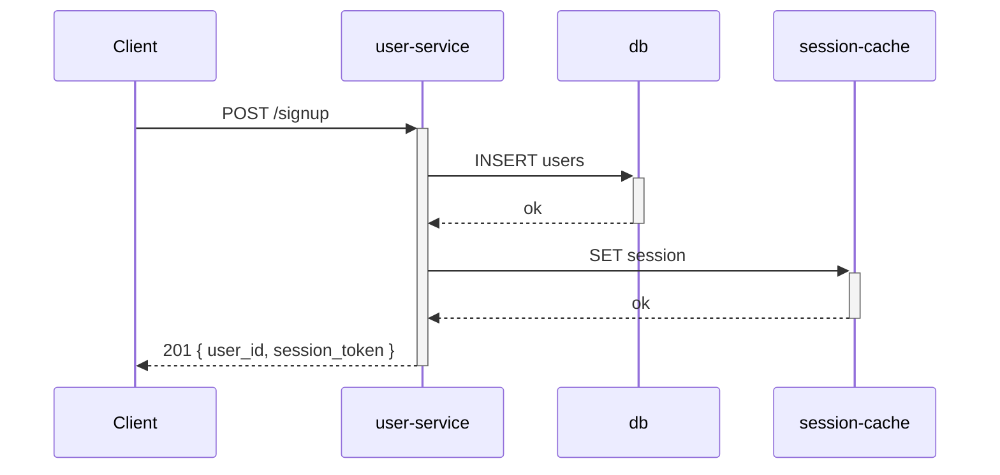
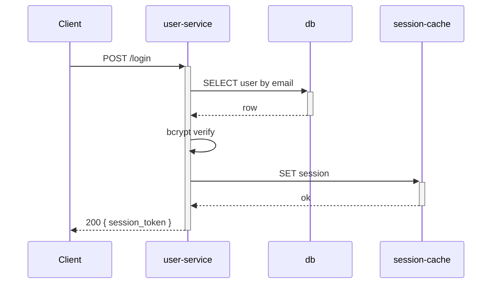

# /lld Command — M1 Foundation Implementation Plan

> **For agentic workers:** REQUIRED SUB-SKILL: Use superpowers:subagent-driven-development (recommended) or superpowers:executing-plans to implement this plan task-by-task. Steps use checkbox (`- [ ]`) syntax for tracking.

**Goal:** Ship a working `/lld <component>` command (Path A only) that writes structurally complete backend and infra LLDs to `docs/lld/<component>.md`, backed by the plan.json schema 1.5 bump (`lld_components[]` + `milestones[].touches_lld[]` + required `design_refs[].component` when `doc=="lld"`) and a positive eval fixture suite that pins both templates.

**Architecture:** Single skill (`shield/skills/general/lld-docs/`) owns template selection, drafting, atomic-write, and `§14` Changelog convention; one command (`shield/commands/lld.md`) is Path A's entry point and the only invocation surface in M1; schema 1.5 lands now so M2 (`/plan` integration) can populate the new fields with zero schema-drift risk. M2 (TRD-driven authoring) and M3 (review wiring + version bump + CHANGELOG) follow as separate plans.

**Tech Stack:** Markdown templates, YAML schema sidecars, JSON Schema (Draft 2020-12), Python (`shield/scripts/validate_plan.py`), pytest, `uv run --with` for ad-hoc Python deps, GitHub Actions YAML.

**Spec:** [`docs/superpowers/specs/2026-05-28-lld-command-design.md`](../specs/2026-05-28-lld-command-design.md). Cross-reference §4 (component map), §5 (schema delta), §6.1 (Path A flow), §7 (templates), §9 (testing strategy).

**Out of M1 scope (deferred to M2/M3 plans):**
- `/plan` populating `lld_components[]` and emitting feature-folder drafts.
- `/implement` step 5h (promotion, concurrency check, back-fill).
- `/plan-review` rules (drift gate, registry integrity, undocumented-LLD, LLD-draft review).
- Negative eval fixtures beyond the schema-validation negatives in this plan.
- `.github/workflows/eval-lld.yml` (deferred to M3).
- Plugin version bump + CHANGELOG entry (lands in M3 alongside the final cutover surface).

---

## File Structure

**Files to create (this plan):**

| Path | Responsibility |
|---|---|
| `shield/schema/lld-sections-backend.yaml` | Backend LLD slug allow-list (14 sections), promote-on-demand flags on §9 + §11, forced_subsections: 8 on §12. |
| `shield/schema/lld-sections-infra.yaml` | Infra LLD slug allow-list (14 sections), promote-on-demand flags on §7 + §11, forced_subsections: 6 on §12. |
| `shield/skills/general/lld-docs/SKILL.md` | The lld-docs skill — template selection, drafting prompt, atomic write, provenance, header metadata, §14 Changelog convention. |
| `shield/skills/general/lld-docs/lld-template-backend.md` | Backend LLD template (14 sections; per-endpoint and per-flow sub-anchors). |
| `shield/skills/general/lld-docs/lld-template-infra.md` | Infra LLD template (14 sections; per-variable sub-anchors). |
| `shield/commands/lld.md` | `/lld` command definition (Path A entry). |
| `shield/evals/lld-docs.yaml` | Eval driver mirroring `shield/evals/plan-trd.yaml` shape. |
| `shield/evals/lld-docs/fixtures/lld-positive-backend.md` | Fully-populated reference backend LLD (passes the eval). |
| `shield/evals/lld-docs/fixtures/lld-positive-infra.md` | Fully-populated reference infra LLD (passes the eval). |
| `shield/evals/lld-docs/fixtures/plan-with-lld-components.json` | 1.5 sidecar fixture with `lld_components[]` + `touches_lld[]` populated. |
| `shield/tests/test_validate_plan_1_5.py` | Pytest cases for the 1.5 validator additions. |
| `shield/tests/fixtures/plan-1.5-valid.json` | Schema-validation positive fixture. |
| `shield/tests/fixtures/plan-1.5-missing-component.json` | Schema-validation negative — `design_refs[].doc==lld` with `component==null`. |
| `shield/tests/fixtures/plan-1.5-touches-drift.json` | Drift-gate negative — manually-tampered `touches_lld[]`. |

**Files to modify (this plan):**

| Path | What changes |
|---|---|
| `shield/schema/plan-sidecar.schema.json` | Bump `version` field from 1.4 to 1.5; add `lld_components[]` definition; add `milestones[].touches_lld[]`; add conditional `if doc==lld then required:[component]` on `design_refs[]`. |
| `shield/skills/general/plan-docs/sidecar-schema.md` | Bump documented version; add `lld_components[]` field doc; add `touches_lld[]` field doc; document required-component-when-doc==lld; add back-compat note for 1.0–1.4. |
| `shield/scripts/validate_plan.py` | Handle 1.5 additions: rollup-based `touches_lld_drift` check; `lld_component_missing` check. |

**Decomposition rationale:**
- Schema first (Tasks 1–3): everything downstream (templates, skill, eval fixtures) validates against the schema. Catches schema mistakes before they propagate.
- Slug allow-lists next (Tasks 4–5): pure YAML, declarative, easy to validate, becomes the source of truth that the templates and the skill prompt reference.
- Templates (Tasks 6–7): markdown templates referencing the slug allow-lists.
- Skill (Task 8): consumes the templates; centralises drafting logic.
- Command (Tasks 9–11): wires the skill into a callable surface.
- Eval coverage (Tasks 12–16): pins the contract.

Each task ends with a commit so the work bisects cleanly.

---

## Phase 1 — Schema bump (1.4 → 1.5)

### Task 1: Add positive + negative schema-validation fixtures

**Files:**
- Create: `shield/tests/fixtures/plan-1.5-valid.json`
- Create: `shield/tests/fixtures/plan-1.5-missing-component.json`

- [ ] **Step 1: Create the positive fixture**

Create `shield/tests/fixtures/plan-1.5-valid.json` with this content:

```json
{
  "version": "1.5",
  "project": "Sample",
  "name": "schema-test",
  "phase": "test",
  "source_research": null,
  "source_prd": null,
  "prd_rubric_version_at_planning": null,
  "last_aligned_with": null,
  "lld_components": [
    {
      "name": "user-service",
      "type": "backend",
      "fork_blob_sha": null
    },
    {
      "name": "vpc-module",
      "type": "infra",
      "fork_blob_sha": "abc123def456abc123def456abc123def456abcd"
    }
  ],
  "milestones": [
    {
      "id": "M1",
      "name": "Auth + VPC bring-up",
      "outcome": "Authentication and base VPC ready.",
      "exit_criteria": ["Auth endpoint live", "VPC apply clean"],
      "depends_on": [],
      "touches_lld": ["user-service", "vpc-module"]
    }
  ],
  "epics": [
    {
      "id": "EPIC-1",
      "name": "Bring-up",
      "pm_id": null,
      "pm_url": null,
      "stories": [
        {
          "id": "EPIC-1-S1",
          "name": "Create user-service endpoint",
          "status": "ready",
          "assignee": null,
          "priority": "high",
          "week": null,
          "milestone_id": "M1",
          "description": "Stand up the signup endpoint.",
          "tasks": ["Wire route", "Implement handler"],
          "acceptance_criteria": ["POST /signup returns 201 on valid input"],
          "design_refs": [
            {
              "doc": "trd",
              "component": null,
              "section_id": "high-level-design",
              "anchor_url": "trd.md#high-level-design",
              "label": "§7 High-Level Design"
            },
            {
              "doc": "lld",
              "component": "user-service",
              "section_id": "api-contracts",
              "anchor_url": "lld-user-service.md#api-contracts",
              "label": "§5 API contracts"
            }
          ],
          "pm_id": null,
          "pm_url": null
        },
        {
          "id": "EPIC-1-S2",
          "name": "Provision VPC module",
          "status": "ready",
          "assignee": null,
          "priority": "high",
          "week": null,
          "milestone_id": "M1",
          "description": "Apply the new VPC module.",
          "tasks": ["terraform plan", "terraform apply"],
          "acceptance_criteria": ["VPC exists in target account"],
          "design_refs": [
            {
              "doc": "lld",
              "component": "vpc-module",
              "section_id": "module-topology",
              "anchor_url": "lld-vpc-module.md#module-topology",
              "label": "§3 Module topology"
            }
          ],
          "pm_id": null,
          "pm_url": null
        }
      ]
    }
  ],
  "metadata": {
    "created_at": "2026-05-28",
    "domains": ["mixed"],
    "reviewer_grades": {}
  }
}
```

- [ ] **Step 2: Create the negative fixture (missing component)**

Create `shield/tests/fixtures/plan-1.5-missing-component.json` — same content as the positive fixture, but with the LLD design_ref's `component` set to `null`:

```json
{
  "version": "1.5",
  "project": "Sample",
  "name": "schema-test-negative",
  "phase": "test",
  "source_research": null,
  "source_prd": null,
  "prd_rubric_version_at_planning": null,
  "last_aligned_with": null,
  "lld_components": [],
  "milestones": [
    {
      "id": "M1",
      "name": "Test",
      "outcome": "Test.",
      "exit_criteria": ["Test"],
      "depends_on": [],
      "touches_lld": []
    }
  ],
  "epics": [
    {
      "id": "EPIC-1",
      "name": "Test",
      "pm_id": null,
      "pm_url": null,
      "stories": [
        {
          "id": "EPIC-1-S1",
          "name": "Test story",
          "status": "ready",
          "assignee": null,
          "priority": "high",
          "week": null,
          "milestone_id": "M1",
          "description": "Test.",
          "tasks": ["Test"],
          "acceptance_criteria": ["Test"],
          "design_refs": [
            {
              "doc": "lld",
              "component": null,
              "section_id": null,
              "anchor_url": null,
              "label": "TODO: link when /lld lands"
            }
          ],
          "pm_id": null,
          "pm_url": null
        }
      ]
    }
  ],
  "metadata": {
    "created_at": "2026-05-28",
    "domains": ["python"],
    "reviewer_grades": {}
  }
}
```

- [ ] **Step 3: Verify the fixtures parse as JSON**

Run: `python3 -c "import json; [json.load(open(f)) for f in ['shield/tests/fixtures/plan-1.5-valid.json', 'shield/tests/fixtures/plan-1.5-missing-component.json']]; print('OK')"`

Expected: `OK`. (If a JSON parse error fires, fix the syntax before continuing.)

- [ ] **Step 4: Commit**

```bash
git add shield/tests/fixtures/plan-1.5-valid.json shield/tests/fixtures/plan-1.5-missing-component.json
git commit -m "test(shield): add 1.5 schema-validation fixtures (positive + missing-component)"
```

---

### Task 2: Bump plan-sidecar.schema.json to 1.5

**Files:**
- Modify: `shield/schema/plan-sidecar.schema.json`

- [ ] **Step 1: Read the existing 1.4 schema to understand the shape**

Run: `cat shield/schema/plan-sidecar.schema.json`

Note the existing structure: `properties.version`, `properties.milestones.items.properties`, `properties.epics.items.properties.stories.items.properties.design_refs.items`.

- [ ] **Step 2: Add the `lld_components` property to the root**

Edit `shield/schema/plan-sidecar.schema.json`. In the root `properties` object, after `last_aligned_with`, add:

```json
"lld_components": {
  "type": "array",
  "description": "Registry of LLD components referenced by stories' design_refs[]. Single fact per component; type is stated once here.",
  "items": {
    "type": "object",
    "required": ["name", "type"],
    "additionalProperties": false,
    "properties": {
      "name": {
        "type": "string",
        "pattern": "^[a-z0-9-]+$",
        "description": "Kebab-case component identifier; matches docs/lld/<name>.md filename."
      },
      "type": {
        "type": "string",
        "enum": ["backend", "infra"],
        "description": "Selects the LLD template variant."
      },
      "fork_blob_sha": {
        "type": ["string", "null"],
        "pattern": "^[a-f0-9]{40}$|^$",
        "description": "git hash-object of docs/lld/<name>.md at /plan-draft time; null when canonical didn't exist."
      }
    }
  }
}
```

- [ ] **Step 3: Add the `touches_lld` property inside milestone items**

In `properties.milestones.items.properties`, after `depends_on`, add:

```json
"touches_lld": {
  "type": "array",
  "description": "Persisted rollup of lld_components[].name referenced by this milestone's stories' design_refs[]. /plan-review enforces the drift gate.",
  "items": {
    "type": "string",
    "pattern": "^[a-z0-9-]+$"
  }
}
```

- [ ] **Step 4: Tighten `design_refs[]` to require `component` when `doc==lld`**

In `properties.epics.items.properties.stories.items.properties.design_refs.items`, add an `allOf` clause:

```json
"allOf": [
  {
    "if": {
      "properties": { "doc": { "const": "lld" } }
    },
    "then": {
      "properties": {
        "component": { "type": "string", "pattern": "^[a-z0-9-]+$" }
      },
      "required": ["component"]
    }
  }
]
```

Make sure this is added to the `items` object of `design_refs`, alongside the existing `type: object`, `required:`, `properties:` keys.

- [ ] **Step 5: Bump the schema's documented version**

In the root, locate the `properties.version` constraint. Change the constraint so 1.5 is the canonical current. Replace the existing `"enum"` or `"const"` (whichever is there) with:

```json
"version": {
  "type": "string",
  "enum": ["1.0", "1.1", "1.2", "1.3", "1.4", "1.5"],
  "description": "Sidecar schema version. Current is 1.5."
}
```

- [ ] **Step 6: Validate positive fixture against the bumped schema**

Run: `uv run --with jsonschema python -c "import json, jsonschema; schema=json.load(open('shield/schema/plan-sidecar.schema.json')); data=json.load(open('shield/tests/fixtures/plan-1.5-valid.json')); jsonschema.validate(data, schema); print('VALID')"`

Expected: `VALID`. If a ValidationError fires, fix the schema before continuing.

- [ ] **Step 7: Validate negative fixture against the bumped schema (expect failure)**

Run: `uv run --with jsonschema python -c "import json, jsonschema; schema=json.load(open('shield/schema/plan-sidecar.schema.json')); data=json.load(open('shield/tests/fixtures/plan-1.5-missing-component.json')); jsonschema.validate(data, schema); print('SHOULD NOT REACH HERE')" 2>&1 | tail -5`

Expected: a `jsonschema.exceptions.ValidationError` mentioning that `component` is required (because `doc==lld`). If `VALID` or `SHOULD NOT REACH HERE` prints, the conditional in Step 4 isn't wired correctly.

- [ ] **Step 8: Commit**

```bash
git add shield/schema/plan-sidecar.schema.json
git commit -m "feat(shield/schema): bump plan-sidecar to 1.5 — lld_components[] + touches_lld[] + required-component-when-doc==lld"
```

---

### Task 3: Update sidecar-schema.md documentation

**Files:**
- Modify: `shield/skills/general/plan-docs/sidecar-schema.md`

- [ ] **Step 1: Read the current document**

Run: `head -100 shield/skills/general/plan-docs/sidecar-schema.md`

Note where the canonical JSON example is and where the "Rules" / "Back-compat" subsections live.

- [ ] **Step 2: Update the canonical example block**

In `shield/skills/general/plan-docs/sidecar-schema.md`, locate the opening fenced code block with `"version": "1.4"`. Replace its contents with the full 1.5-shaped example. Use the same content as `shield/tests/fixtures/plan-1.5-valid.json` (Task 1 step 1), prefixed with `// jsonc` style commentary where helpful — but the embedded JSON must remain valid.

- [ ] **Step 3: Update the version-rule line**

Find the line that currently reads:

```
- `version` is `"1.4"`. Older sidecars (`"1.3"`, `"1.2"`, `"1.1"`, `"1.0"`, or missing `version`) remain valid back-compat — see "Back-compat" below.
```

Replace with:

```
- `version` is `"1.5"`. Older sidecars (`"1.4"`, `"1.3"`, `"1.2"`, `"1.1"`, `"1.0"`, or missing `version`) remain valid back-compat — see "Back-compat" below. The 1.5 bump adds `lld_components[]` at the root and `milestones[].touches_lld[]`; it also tightens `design_refs[]` so `component` is required when `doc=="lld"` (was nullable in 1.4).
```

- [ ] **Step 4: Add the `lld_components[]` field section**

After the existing `last_aligned_with` subsection, add a new subsection:

````markdown
### `lld_components[]` (1.5+)

Registry of LLD components referenced by any story's `design_refs[]`. Stated once per component, then referenced by name from `design_refs[]` and `milestones[].touches_lld[]`.

| Field | Type | Required | Notes |
|---|---|---|---|
| `name` | string (kebab-case) | yes | Matches the filename `docs/lld/<name>.md`. |
| `type` | enum (`backend`, `infra`) | yes | Selects the LLD template variant. |
| `fork_blob_sha` | string (40 hex) \| null | no, default null | `git hash-object docs/lld/<name>.md` at the time `/plan` drafted the feature-folder copy. `null` means the canonical didn't exist at draft time (net-new component). Used by `/implement` at milestone-close for the concurrency check. |

Example:

```json
"lld_components": [
  { "name": "user-service", "type": "backend", "fork_blob_sha": null },
  { "name": "vpc-module", "type": "infra", "fork_blob_sha": "abc123…" }
]
```
````

- [ ] **Step 5: Add the `milestones[].touches_lld[]` field section**

After the existing per-milestone field docs (look for the `### Milestones` heading area), add:

````markdown
#### `touches_lld[]` (1.5+)

Persisted rollup of `lld_components[].name` values referenced by this milestone's stories' `design_refs[]`. Deterministically derived:

```
touches_lld[M] = unique(component for ref in
                        stories[milestone_id==M].design_refs[]
                        where ref.doc == "lld")
```

`/plan-review` (M3 plan) enforces the drift gate: persisted value ≠ rollup → finding. Persisting lets PM-sync, reviewers, and humans read the field without recomputing. Schema 1.4 sidecars without `touches_lld` are treated as empty.
````

- [ ] **Step 6: Update the `design_refs[]` field table**

Locate the existing `### design_refs[] field` section. In the field-shape table, change the `component` row from:

```
| `component` | `string \| null` | no | LLD scoping — the named sub-component (e.g. `payment-orchestrator`). `null` for TRD/PRD refs (which are feature-scoped) and for LLD placeholders. |
```

To:

```
| `component` | `string \| null` | **required when `doc=="lld"` (1.5+)** | LLD scoping — the named sub-component (e.g. `user-service`). `null` permitted for TRD/PRD refs. Must match an entry in `lld_components[].name`. |
```

- [ ] **Step 7: Append a back-compat note for 1.5**

Locate the "Back-compat" section. Append:

```markdown
**1.4 → 1.5:** A 1.4 sidecar without `lld_components[]` or `touches_lld[]` validates as 1.5; missing arrays default to empty. A 1.4 sidecar with a `design_refs[]` entry where `doc=="lld"` and `component==null` becomes invalid under 1.5 — those entries must be updated before 1.5 validation passes. `/plan-review` will surface this as a finding (see M3 plan).
```

- [ ] **Step 8: Verify the markdown renders**

Run: `bash shield/scripts/render-markdown.sh shield/skills/general/plan-docs/sidecar-schema.md /tmp/sidecar-schema.html && head -30 /tmp/sidecar-schema.html`

Expected: clean HTML output with the new sections visible. Visually scan for unrendered backticks or unclosed code fences.

- [ ] **Step 9: Commit**

```bash
git add shield/skills/general/plan-docs/sidecar-schema.md
git commit -m "docs(shield/plan-docs): document plan-sidecar 1.5 — lld_components + touches_lld + tightened design_refs.component"
```

---

### Task 4: Extend validate_plan.py — drift + integrity checks

**Files:**
- Modify: `shield/scripts/validate_plan.py`
- Create: `shield/tests/test_validate_plan_1_5.py`
- Create: `shield/tests/fixtures/plan-1.5-touches-drift.json`

- [ ] **Step 1: Create the drift-gate negative fixture**

Create `shield/tests/fixtures/plan-1.5-touches-drift.json`. Start from `plan-1.5-valid.json` and change `milestones[0].touches_lld` from `["user-service", "vpc-module"]` to `["user-service"]` (drops the `vpc-module` entry that the design_refs[] rollup would produce).

You can build it with:

```bash
python3 -c "
import json
data = json.load(open('shield/tests/fixtures/plan-1.5-valid.json'))
data['name'] = 'schema-test-drift'
data['milestones'][0]['touches_lld'] = ['user-service']
json.dump(data, open('shield/tests/fixtures/plan-1.5-touches-drift.json', 'w'), indent=2)
"
```

Verify: `python3 -c "import json; print(json.load(open('shield/tests/fixtures/plan-1.5-touches-drift.json'))['milestones'][0]['touches_lld'])"`

Expected: `['user-service']`

- [ ] **Step 2: Write the failing pytest cases**

Create `shield/tests/test_validate_plan_1_5.py`:

```python
"""Tests for shield/scripts/validate_plan.py — 1.5 schema additions.

Covers the drift gate (persisted touches_lld vs rollup of design_refs[]) and the
lld_components[] integrity check (every design_refs[].component must appear in
the registry when doc=="lld").
"""
import json
import subprocess
import sys
from pathlib import Path

REPO_ROOT = Path(__file__).resolve().parents[2]
SCRIPT = REPO_ROOT / "shield" / "scripts" / "validate_plan.py"
FIXTURES = REPO_ROOT / "shield" / "tests" / "fixtures"


def run_validator(fixture_path):
    """Returns (exit_code, stdout, stderr)."""
    result = subprocess.run(
        [sys.executable, str(SCRIPT), str(fixture_path)],
        capture_output=True,
        text=True,
    )
    return result.returncode, result.stdout, result.stderr


def test_valid_15_sidecar_passes():
    """A schema-conformant 1.5 sidecar with consistent touches_lld[] passes."""
    code, out, err = run_validator(FIXTURES / "plan-1.5-valid.json")
    assert code == 0, f"expected exit 0, got {code}; stdout={out!r}; stderr={err!r}"


def test_touches_lld_drift_fails():
    """A 1.5 sidecar whose touches_lld[] mismatches the rollup fails with a named error."""
    code, out, err = run_validator(FIXTURES / "plan-1.5-touches-drift.json")
    assert code != 0, f"expected non-zero exit; stdout={out!r}; stderr={err!r}"
    combined = (out + err).lower()
    assert "touches_lld_drift" in combined, (
        f"expected named error 'touches_lld_drift'; got stdout={out!r}; stderr={err!r}"
    )


def test_lld_component_missing_fails():
    """A 1.5 sidecar with design_refs[].component not in lld_components[] fails."""
    # Build the fixture inline so we don't need a separate file.
    base = json.load(open(FIXTURES / "plan-1.5-valid.json"))
    base["name"] = "schema-test-missing-registry"
    # Drop the vpc-module entry from the registry; the design_refs[] still references it.
    base["lld_components"] = [
        c for c in base["lld_components"] if c["name"] != "vpc-module"
    ]
    tmp = FIXTURES / "plan-1.5-missing-registry.json"
    json.dump(base, open(tmp, "w"), indent=2)
    try:
        code, out, err = run_validator(tmp)
        assert code != 0
        combined = (out + err).lower()
        assert "lld_component_missing" in combined, (
            f"expected named error 'lld_component_missing'; stdout={out!r}; stderr={err!r}"
        )
    finally:
        tmp.unlink(missing_ok=True)


def test_missing_component_when_doc_lld_fails_schema():
    """A 1.5 sidecar with design_refs[].doc==lld and component==null fails schema validation."""
    code, out, err = run_validator(FIXTURES / "plan-1.5-missing-component.json")
    assert code != 0
    combined = (out + err).lower()
    # JSON Schema error mentions 'component' is required
    assert "component" in combined, (
        f"expected mention of 'component'; stdout={out!r}; stderr={err!r}"
    )
```

- [ ] **Step 3: Run the tests to verify they fail (RED)**

Run: `uv run --with pytest --with jsonschema pytest shield/tests/test_validate_plan_1_5.py -v`

Expected: all 4 tests FAIL. Most likely all 4 fail with one of: validator returns 0 on drift, validator doesn't print "touches_lld_drift", or import errors. Capture this output — it's the RED state.

- [ ] **Step 4: Read the current validate_plan.py to understand its shape**

Run: `cat shield/scripts/validate_plan.py | head -80`

Note the entry point, schema-loading code, and error-emission style. We'll preserve the existing JSON Schema validation step and ADD the two new structural checks on top.

- [ ] **Step 5: Implement the drift + integrity checks**

Edit `shield/scripts/validate_plan.py`. After the existing JSON Schema validation step (which already runs and exits on schema failure), add the following two checks. The exact insertion point is after schema validation succeeds and before the script's final success message:

```python
# --- 1.5 structural checks ---

def _check_touches_lld_drift(data):
    """Verify that persisted milestones[i].touches_lld[] equals the rollup of
    unique(design_refs[].component for stories in this milestone where doc=='lld').

    Reports a 'touches_lld_drift' error per milestone on mismatch.
    Returns a list of (milestone_id, persisted, rollup) tuples for failures.
    """
    failures = []
    stories_by_milestone = {}
    for epic in data.get("epics", []):
        for story in epic.get("stories", []):
            mid = story.get("milestone_id")
            if mid is None:
                continue
            stories_by_milestone.setdefault(mid, []).append(story)
    for milestone in data.get("milestones", []):
        mid = milestone["id"]
        persisted = set(milestone.get("touches_lld") or [])
        rollup = set()
        for story in stories_by_milestone.get(mid, []):
            for ref in story.get("design_refs", []):
                if ref.get("doc") == "lld" and ref.get("component"):
                    rollup.add(ref["component"])
        if persisted != rollup:
            failures.append((mid, sorted(persisted), sorted(rollup)))
    return failures


def _check_lld_component_missing(data):
    """Verify that every design_refs[].component (where doc=='lld') appears in
    lld_components[].name. Reports an 'lld_component_missing' error per missing name.

    Returns a list of (story_id, component_name) tuples for failures.
    """
    registered = {c["name"] for c in data.get("lld_components") or []}
    failures = []
    for epic in data.get("epics", []):
        for story in epic.get("stories", []):
            for ref in story.get("design_refs", []):
                if ref.get("doc") == "lld":
                    name = ref.get("component")
                    if name and name not in registered:
                        failures.append((story["id"], name))
    return failures


# Call the new checks (insert after the existing schema validation block)
drift_failures = _check_touches_lld_drift(data)
if drift_failures:
    for mid, persisted, rollup in drift_failures:
        print(
            f"ERROR: touches_lld_drift in milestone {mid}: "
            f"persisted={persisted} rollup={rollup}",
            file=sys.stderr,
        )
    sys.exit(2)

missing_failures = _check_lld_component_missing(data)
if missing_failures:
    for sid, name in missing_failures:
        print(
            f"ERROR: lld_component_missing — story {sid} references component "
            f"'{name}' which is not in lld_components[]",
            file=sys.stderr,
        )
    sys.exit(3)
```

Notes:
- `data` is whatever variable the existing script uses for the parsed sidecar (look for the `json.load` call near the top of the script and reuse its name).
- The exit codes (2, 3) follow whatever pattern the existing script uses; if the script uses exit-code 1 for schema failures, use 2 and 3 here to disambiguate.
- Error strings are lowercase `touches_lld_drift` and `lld_component_missing` so the test `combined.lower()` assertions match.

- [ ] **Step 6: Run the tests to verify they pass (GREEN)**

Run: `uv run --with pytest --with jsonschema pytest shield/tests/test_validate_plan_1_5.py -v`

Expected: all 4 tests PASS.

- [ ] **Step 7: Spot-check the validator on the original positive fixture from M0**

Find any existing 1.4 fixture in the repo (e.g. `docs/shield/plan-trd-refactor-20260524/plan.json`) and run the validator against it:

Run: `uv run --with jsonschema python shield/scripts/validate_plan.py docs/shield/plan-trd-refactor-20260524/plan.json`

Expected: exit 0 (back-compat — 1.4 sidecars still validate). If exit is non-zero, the back-compat path is broken; check that the new checks tolerate `lld_components` and `touches_lld` being absent or empty.

- [ ] **Step 8: Commit**

```bash
git add shield/scripts/validate_plan.py shield/tests/test_validate_plan_1_5.py shield/tests/fixtures/plan-1.5-touches-drift.json
git commit -m "feat(shield/scripts): validate_plan.py — touches_lld_drift + lld_component_missing checks"
```

---

## Phase 2 — Slug allow-lists

### Task 5: Create lld-sections-backend.yaml

**Files:**
- Create: `shield/schema/lld-sections-backend.yaml`

- [ ] **Step 1: Write the YAML**

Create `shield/schema/lld-sections-backend.yaml`:

```yaml
# shield/schema/lld-sections-backend.yaml
# Canonical 14-section backend LLD template slug allow-list.
# Source of truth for the /lld emitter (lld-docs SKILL.md) and the lld-docs eval.
# Pinned to the PR #43 Bytebite signup sample.
# Consumers must not edit — modify lld-template-backend.md first.

version: 1
domain: backend
description: >
  Stable kebab-case section anchors that every /lld-generated backend LLD must
  carry. Order is canonical: emitters and validators MUST preserve §1 → §14 order.
  Sections marked promote_on_demand default to collapsed <details> blocks and are
  lifted only when the component's nature warrants it.

sections:
  - id: overview
    number: 1
    title: Overview
    promote_on_demand: false
  - id: scope-and-non-goals
    number: 2
    title: Scope & non-goals
    promote_on_demand: false
  - id: module-layout
    number: 3
    title: Module layout
    promote_on_demand: false
  - id: data-model
    number: 4
    title: Data model
    promote_on_demand: false
  - id: api-contracts
    number: 5
    title: API contracts
    promote_on_demand: false
    sub_anchor_prefix: api
  - id: sequence-flows
    number: 6
    title: Sequence flows
    promote_on_demand: false
    sub_anchor_prefix: flow
  - id: error-handling
    number: 7
    title: Error handling
    promote_on_demand: false
  - id: concurrency-and-state
    number: 8
    title: Concurrency & state
    promote_on_demand: false
  - id: configuration
    number: 9
    title: Configuration
    promote_on_demand: true
  - id: observability
    number: 10
    title: Observability
    promote_on_demand: false
  - id: security-and-privacy
    number: 11
    title: Security & privacy
    promote_on_demand: true
  - id: performance-and-scaling
    number: 12
    title: Performance & scaling
    promote_on_demand: false
    forced_subsections:
      - id: load
        number: "12.1"
        title: Load
      - id: slo
        number: "12.2"
        title: SLO
      - id: bottleneck
        number: "12.3"
        title: Bottleneck
      - id: latency-breakdown
        number: "12.4"
        title: Latency breakdown
      - id: capacity
        number: "12.5"
        title: Capacity
      - id: scale-out-lever
        number: "12.6"
        title: Scale-out lever
      - id: caches
        number: "12.7"
        title: Caches
      - id: degradation
        number: "12.8"
        title: Degradation
  - id: open-questions
    number: 13
    title: Open questions
    promote_on_demand: false
  - id: changelog
    number: 14
    title: Changelog
    promote_on_demand: false
```

- [ ] **Step 2: Verify the YAML parses + counts are correct**

Run:

```bash
uv run --with pyyaml python -c "
import yaml
data = yaml.safe_load(open('shield/schema/lld-sections-backend.yaml'))
sections = data['sections']
assert len(sections) == 14, f'expected 14 sections, got {len(sections)}'
pod = [s for s in sections if s.get('promote_on_demand')]
assert len(pod) == 2, f'expected 2 PoD sections, got {len(pod)}'
assert {s['id'] for s in pod} == {'configuration', 'security-and-privacy'}, \
    f'unexpected PoD ids: {[s[\"id\"] for s in pod]}'
twelve = next(s for s in sections if s['number'] == 12)
assert len(twelve['forced_subsections']) == 8, \
    f'expected 8 forced subsections under §12, got {len(twelve[\"forced_subsections\"])}'
print('OK — 14 sections, 2 PoD (configuration + security-and-privacy), 8 forced §12 subsections')
"
```

Expected: `OK — 14 sections, 2 PoD (configuration + security-and-privacy), 8 forced §12 subsections`

- [ ] **Step 3: Commit**

```bash
git add shield/schema/lld-sections-backend.yaml
git commit -m "feat(shield/schema): lld-sections-backend.yaml — 14 sections, 8 forced §12 subsections"
```

---

### Task 6: Create lld-sections-infra.yaml

**Files:**
- Create: `shield/schema/lld-sections-infra.yaml`

- [ ] **Step 1: Write the YAML**

Create `shield/schema/lld-sections-infra.yaml`:

```yaml
# shield/schema/lld-sections-infra.yaml
# Canonical 14-section infra LLD template slug allow-list.
# Source of truth for the /lld emitter (lld-docs SKILL.md) and the lld-docs eval.
# Adapted to declarative IaC (terraform / k8s / helm).
# Consumers must not edit — modify lld-template-infra.md first.

version: 1
domain: infra
description: >
  Stable kebab-case section anchors that every /lld-generated infra LLD must
  carry. Order is canonical: emitters and validators MUST preserve §1 → §14 order.
  Sections marked promote_on_demand default to collapsed <details> blocks and are
  lifted only when the component's nature warrants it.

sections:
  - id: overview
    number: 1
    title: Overview
    promote_on_demand: false
  - id: scope-and-non-goals
    number: 2
    title: Scope & non-goals
    promote_on_demand: false
  - id: module-topology
    number: 3
    title: Module topology
    promote_on_demand: false
  - id: variable-interface
    number: 4
    title: Variable interface
    promote_on_demand: false
    sub_anchor_prefix: var
  - id: state-model-and-lifecycle
    number: 5
    title: State model & lifecycle
    promote_on_demand: false
  - id: drift-and-destructive-surface
    number: 6
    title: Drift / idempotency / destructive-change surface
    promote_on_demand: false
  - id: security-posture
    number: 7
    title: Security posture
    promote_on_demand: true
  - id: cost-surface
    number: 8
    title: Cost surface
    promote_on_demand: false
  - id: reliability-and-blast-radius
    number: 9
    title: Reliability & blast radius
    promote_on_demand: false
  - id: observability-and-tagging
    number: 10
    title: Observability & tagging
    promote_on_demand: false
  - id: migration-and-cutover
    number: 11
    title: Migration & cutover
    promote_on_demand: true
  - id: validation
    number: 12
    title: Validation
    promote_on_demand: false
    forced_subsections:
      - id: plan-invariants
        number: "12.1"
        title: Plan invariants
      - id: policy-checks
        number: "12.2"
        title: Policy checks
      - id: apply-checks
        number: "12.3"
        title: Apply checks
      - id: drift-detection
        number: "12.4"
        title: Drift detection
      - id: smoke-test
        number: "12.5"
        title: Smoke test
      - id: rollback-verify
        number: "12.6"
        title: Rollback verify
  - id: open-questions
    number: 13
    title: Open questions
    promote_on_demand: false
  - id: changelog
    number: 14
    title: Changelog
    promote_on_demand: false
```

- [ ] **Step 2: Verify the YAML**

Run:

```bash
uv run --with pyyaml python -c "
import yaml
data = yaml.safe_load(open('shield/schema/lld-sections-infra.yaml'))
sections = data['sections']
assert len(sections) == 14, f'expected 14 sections, got {len(sections)}'
pod = [s for s in sections if s.get('promote_on_demand')]
assert len(pod) == 2, f'expected 2 PoD sections, got {len(pod)}'
assert {s['id'] for s in pod} == {'security-posture', 'migration-and-cutover'}, \
    f'unexpected PoD ids: {[s[\"id\"] for s in pod]}'
twelve = next(s for s in sections if s['number'] == 12)
assert len(twelve['forced_subsections']) == 6, \
    f'expected 6 forced subsections under §12, got {len(twelve[\"forced_subsections\"])}'
print('OK — 14 sections, 2 PoD (security-posture + migration-and-cutover), 6 forced §12 subsections')
"
```

Expected: `OK — 14 sections, 2 PoD (security-posture + migration-and-cutover), 6 forced §12 subsections`

- [ ] **Step 3: Commit**

```bash
git add shield/schema/lld-sections-infra.yaml
git commit -m "feat(shield/schema): lld-sections-infra.yaml — 14 sections, 6 forced §12 subsections"
```

---

## Phase 3 — LLD templates

### Task 7: Author lld-template-backend.md

**Files:**
- Create: `shield/skills/general/lld-docs/lld-template-backend.md`

- [ ] **Step 1: Create the directory**

Run: `mkdir -p shield/skills/general/lld-docs`

- [ ] **Step 2: Write the template**

Create `shield/skills/general/lld-docs/lld-template-backend.md`. This file documents the 14-section backend LLD template that the lld-docs skill (Task 9) will use to generate LLDs. Content:

```markdown
# Backend LLD Template

This document is the canonical template for backend LLDs. The `/lld` command
(Path A — human invocation) and `/plan` (Path B — TRD-driven, M2 plan) both
generate documents conforming to this shape via the lld-docs skill.

**Slug allow-list:** [`shield/schema/lld-sections-backend.yaml`](../../../schema/lld-sections-backend.yaml) — 14 sections in canonical order, 2 promote-on-demand (§9 Configuration, §11 Security & privacy), 8 forced subsections under §12 Performance & scaling.

**Source sample:** The shape is pinned to [tesseract PR #43](https://github.com/infraspecdev/tesseract/pull/43) — `docs/superpowers/specs/2026-05-18-lld-sample.html` (Bytebite user-signup LLD).

---

## Header metadata (above §1)

Every backend LLD MUST carry this header block, immediately after the provenance
comment and before §1:

```markdown
**Feature:** `<feature-folder slug or "manual">`
**Owner:** `<git user.email>`
**Status:** `draft | review | promoted`
**Linked PRD:** `<relative path or "n/a">`
**Linked plans:** `[<relative path>, …]` (plural — one LLD ↔ many plans)
**Version:** `<semver, default 0.1.0>`
**Last updated:** `<YYYY-MM-DD>`
```

`Linked plans` is plural by design — the same LLD doc is referenced by multiple
milestones across one or more plans. §14 Changelog records each touch.

## Section template

### §1 Overview {#overview}

**Always on.** 1–3 paragraphs naming which epics / PRD milestones / plan
milestones this LLD serves. Bidirectional with TRD §10 Milestones. Establishes
the *what* and *which-plan-touched-this* — concrete, not vague.

**Backend authoring guidance:** Name the C4 Container or Component. State its
runtime shape (HTTP service, library, daemon). Link to the canonical service
directory in the repo.

`n/a — <reason>` is allowed only if the component is being introduced and its
runtime shape isn't yet defined; vague TBDs are rejected.

### §2 Scope & non-goals {#scope-and-non-goals}

**Always on.** Two lists: in-scope (what this LLD covers) and out-of-scope
(what intentionally isn't covered, with a one-line reason each).

### §3 Module layout {#module-layout}

**Always on.** File tree with `new` / `mod` / `unchanged` badges. Identifies
which directories and files belong to this component.

### §4 Data model {#data-model}

**Always on.** Tables (with column-level detail: name, type, nullable,
default, indices) + cache namespaces (Redis key patterns, TTL). For pure
stateless services, declare `n/a — stateless service, no persistent data model`.

### §5 API contracts {#api-contracts}

**Always on.** Per-endpoint sub-anchor: `{#api-<endpoint-slug>}`. For each
endpoint: HTTP verb + path, request shape, response shape, error responses.

### §6 Sequence flows {#sequence-flows}

**Always on.** Per-flow sub-anchor: `{#flow-<flow-name>}`. Mermaid sequence
diagrams covering the component's interactions with callers and downstream
services. One flow per significant user / system journey.

### §7 Error handling {#error-handling}

**Always on.** Error-code table + behavior matrix. Each error has a stable
identifier, an HTTP status (if applicable), and the documented behavior (retry?
surface to user? log-only?).

### §8 Concurrency & state {#concurrency-and-state}

**Always on.** Named race conditions and their resolutions. State transitions
(if the component owns state). For stateless components, declare
`n/a — stateless component, no concurrency-sensitive state` and list any
externalised state (e.g. distributed locks, idempotency keys).

### §9 Configuration {#configuration}

**Promote-on-demand.** Default render: collapsed `<details>` block. Lift (open
the block) when the component has user-tunable configuration. Document every
config value with: name, type, default, range, secret/non-secret, hot-reloadable.

### §10 Observability {#observability}

**Always on.** Three subsections: logs (structured fields), metrics (named
gauges / counters / histograms with units), traces (span names + meaningful
attributes).

### §11 Security & privacy {#security-and-privacy}

**Promote-on-demand.** Default render: collapsed. Lift when the component
handles user data, authentication, authorization, or PII. Subsections: AuthN
(how callers identify), AuthZ (what they can do), data classification, threat
model.

### §12 Performance & scaling {#performance-and-scaling}

**Always on. 8 forced subsections — each MUST be non-empty or carry
`n/a — <reason>`.** This is the strongest anti-format-drift mechanism in the
template: a fixture-based eval mechanically verifies all 8 are present.

#### §12.1 Load {#load}
Expected request rate, payload sizes, distribution (steady vs. spiky).

#### §12.2 SLO {#slo}
Target p50/p99 latency, availability target, error-rate budget.

#### §12.3 Bottleneck {#bottleneck}
Where the component is expected to be CPU-bound, IO-bound, memory-bound, or
network-bound. Justified, not guessed.

#### §12.4 Latency breakdown {#latency-breakdown}
Per-flow latency contributors: network RTT, DB query time, downstream RPC
time, internal CPU time. Numbers or `n/a — measured post-ship`.

#### §12.5 Capacity {#capacity}
Estimated headroom at peak load. CPU cores, memory, connection-pool sizing.

#### §12.6 Scale-out lever {#scale-out-lever}
How the component scales horizontally. Stateless replication vs. partition-by-X.
Any constraints on max-replicas.

#### §12.7 Caches {#caches}
Where caching exists (or doesn't); cache invalidation strategy; TTLs.

#### §12.8 Degradation {#degradation}
What graceful degradation looks like when an upstream / downstream fails:
which features turn off, what user sees, what the alert says.

### §13 Open questions {#open-questions}

**Always on.** Table: `Q# | Question | Options | Owner | Resolve-by`.
Empty table is acceptable when no open questions exist.

### §14 Changelog {#changelog}

**Always on.** Every edit ties to a story ID (or `"manual"` for Path A edits)
and the date. Format:

```markdown
| Touch | Date | Summary | Story IDs |
|---|---|---|---|
| M1 | 2026-05-30 | Initial draft via /plan | EPIC-1-S1 EPIC-1-S2 |
| manual | 2026-06-01 | Reverse-doc fill-in by ashwini | n/a |
```

## Escape pattern

Any section may carry `n/a — <reason>` when the section genuinely doesn't
apply to this component. Examples:

- §4 Data model on a pure stateless transformation library → `n/a — stateless library, no persistent state`
- §8 Concurrency on a CLI tool that exits before any reentrancy → `n/a — single-shot CLI, no concurrency surface`
- §12.4 Latency breakdown when first-version measurements aren't available → `n/a — measured post-ship; targets in §12.2 SLO`

**Vague TBDs are not allowed.** `TBD`, `TODO`, `to be determined`, etc. in
always-on sections cause the eval to fail.

## Anchor convention

Every section header carries an explicit `{#kebab-case-slug}` anchor matching
the `id` field in `shield/schema/lld-sections-backend.yaml`. Sub-anchors on §5
use the `api-` prefix; sub-anchors on §6 use the `flow-` prefix. Example:

```markdown
### §5 API contracts {#api-contracts}

#### POST /signup {#api-signup}
…

#### GET /users/:id {#api-get-user}
…
```
```

- [ ] **Step 3: Render to HTML to spot-check formatting**

Run: `bash shield/scripts/render-markdown.sh shield/skills/general/lld-docs/lld-template-backend.md /tmp/lld-tpl-backend.html && head -50 /tmp/lld-tpl-backend.html`

Expected: clean HTML; all 14 section headings visible; no unclosed fences.

- [ ] **Step 4: Commit**

```bash
git add shield/skills/general/lld-docs/lld-template-backend.md
git commit -m "feat(shield/lld-docs): backend LLD template — 14 sections pinned to PR #43"
```

---

### Task 8: Author lld-template-infra.md

**Files:**
- Create: `shield/skills/general/lld-docs/lld-template-infra.md`

- [ ] **Step 1: Write the template**

Create `shield/skills/general/lld-docs/lld-template-infra.md`. Content:

```markdown
# Infra LLD Template

This document is the canonical template for infra LLDs (terraform / k8s / helm).
The `/lld` command (Path A) and `/plan` (Path B — M2) both generate documents
conforming to this shape via the lld-docs skill.

**Slug allow-list:** [`shield/schema/lld-sections-infra.yaml`](../../../schema/lld-sections-infra.yaml) — 14 sections in canonical order, 2 promote-on-demand (§7 Security posture, §11 Migration & cutover), 6 forced subsections under §12 Validation.

The infra template diverges from the backend template in §3 (Module topology
vs. Module layout), §4 (Variable interface vs. Data model), §5 (State model
vs. API contracts), §6 (Drift / destructive-change surface vs. Sequence flows),
§8 (Cost surface — infra-only), §9 (Reliability & blast radius), §11 (Migration
& cutover, promote-on-demand), and §12 (Validation, 6 forced subsections).
§§ 1, 2, 10, 13, 14 are identical in intent to the backend template.

---

## Header metadata (above §1)

Same as the backend template. See `lld-template-backend.md` § "Header metadata".

## Section template

### §1 Overview {#overview}

**Always on.** Same intent as backend. **Infra authoring guidance:** Name the
terraform module / k8s controller / helm chart. State its scope (e.g.
"workspace-wide VPC", "per-environment service mesh"). Link to the canonical
module directory.

### §2 Scope & non-goals {#scope-and-non-goals}

**Always on.** Same as backend.

### §3 Module topology {#module-topology}

**Always on.** Two artifacts:
1. **File tree** with `new` / `mod` / `unchanged` badges (which `.tf` files,
   k8s manifests, or helm templates belong to this module).
2. **Resource dependency graph** — which terraform resources (or k8s objects)
   this module creates, and how they reference each other. Mermaid diagram
   acceptable; ASCII tree also fine.

### §4 Variable interface {#variable-interface}

**Always on.** Per-variable sub-anchor: `{#var-<variable-name>}`. For each input
variable:

| Field | Notes |
|---|---|
| Name | Snake_case per terraform convention |
| Type | terraform type expression (string, number, map(string), object({…})) |
| Default | Value or `(none)` |
| Required | yes / no |
| Validation | terraform `validation {}` block summary or "none" |
| Description | One sentence; what the variable controls |

Also document outputs (the module's outward surface) in the same shape, minus
Default/Required/Validation.

### §5 State model & lifecycle {#state-model-and-lifecycle}

**Always on.** What state this module creates (terraform state entries, k8s
custom resources, helm release records). Lifecycle considerations:
- `lifecycle { ignore_changes = […] }` blocks and why.
- `lifecycle { create_before_destroy = true }` cases and why.
- `moved { … }` blocks (refactoring from a previous resource path).
- `depends_on` declarations that aren't auto-inferred.

For k8s: which CRDs are created; controller reconciliation semantics; finalizers.

### §6 Drift / idempotency / destructive-change surface {#drift-and-destructive-surface}

**Always on.** Explicit destructive-change table — what triggers in-place vs.
replacement:

| Attribute / config | In-place change | Triggers replacement | Notes |
|---|---|---|---|
| `instance_type` | no | yes | EC2 — recreate |
| `tags` | yes | no | no downtime |
| … | | | |

Idempotency: confirm that running `terraform plan` after `apply` shows no
changes when source is unchanged.

Drift detection: how this module surfaces post-apply drift (e.g. tag drift
sweep, conftest cron, k8s controller's `Status` field reconciliation).

### §7 Security posture {#security-posture}

**Promote-on-demand.** Default collapsed. Lift for modules that touch IAM,
network, secrets, or any user-data-handling surface. Subsections: IAM (which
principals get which permissions); network (ingress/egress rules); secrets
(where they're stored, how rotated); encryption (at rest, in transit).

### §8 Cost surface {#cost-surface}

**Always on.** Per-environment cost contributors. Subsections:
- **Always-on resources:** the ones that bill 24/7 (NAT gateway, RDS, etc.)
- **Tiering decisions:** what's different between dev/staging/prod (instance
  classes, replica counts, retention policies).
- **Expensive toggles:** named variables that 10× the cost when enabled.

### §9 Reliability & blast radius {#reliability-and-blast-radius}

**Always on.** Multi-AZ posture (yes/no). Backup strategy (what's backed up;
RPO/RTO). Failure modes ("what happens if an AZ goes away?"). Blast-radius
estimate — what user-facing functionality breaks if this module's resources fail.

### §10 Observability & tagging {#observability-and-tagging}

**Always on.** Tagging convention (`env`, `service`, `owner`, etc.). Metric
surfaces (CloudWatch namespaces, prometheus scrape config). Log destinations.

### §11 Migration & cutover {#migration-and-cutover}

**Promote-on-demand.** Default collapsed. Lift when this module replaces a
prior resource set or requires non-trivial cutover steps. Subsections:
- `moved` blocks and the source-path → target-path mapping.
- State imports (`terraform import`) needed; for which resources.
- Blue-green / canary cutover steps (if the module hosts user traffic).

### §12 Validation {#validation}

**Always on. 6 forced subsections — each MUST be non-empty or carry
`n/a — <reason>`.**

#### §12.1 Plan invariants {#plan-invariants}
What the rendered `terraform plan` MUST and MUST NOT show. Anti-rules:
"no resource replacement"; "no deletions"; positive rules: "exactly one new
VPC".

#### §12.2 Policy checks {#policy-checks}
OPA / conftest / sentinel rules that gate `terraform plan` output before
`apply`. Name the policy files and the rules they enforce.

#### §12.3 Apply checks {#apply-checks}
Post-apply sanity checks: are the expected resources present? Tags consistent?
Outputs non-empty?

#### §12.4 Drift detection {#drift-detection}
How drift is detected ongoing — scheduled `terraform plan -refresh-only`,
config-management agent, controller reconciliation status.

#### §12.5 Smoke test {#smoke-test}
End-to-end functional check after apply — e.g. "issue an HTTPS request via
the new ALB and assert 200".

#### §12.6 Rollback verify {#rollback-verify}
How rollback is verified — does the rollback path leave the previous state
intact and observable?

### §13 Open questions {#open-questions}

**Always on.** Same as backend template.

### §14 Changelog {#changelog}

**Always on.** Same as backend template.

## Escape pattern

Same `n/a — <reason>` escape as the backend template. Vague TBDs rejected.

## Anchor convention

Same as the backend template. Sub-anchors on §4 use the `var-` prefix:

```markdown
### §4 Variable interface {#variable-interface}

#### `vpc_cidr` {#var-vpc-cidr}
…

#### `private_subnet_count` {#var-private-subnet-count}
…
```
```

- [ ] **Step 2: Render to HTML to spot-check**

Run: `bash shield/scripts/render-markdown.sh shield/skills/general/lld-docs/lld-template-infra.md /tmp/lld-tpl-infra.html && head -50 /tmp/lld-tpl-infra.html`

Expected: clean HTML; all 14 section headings visible.

- [ ] **Step 3: Commit**

```bash
git add shield/skills/general/lld-docs/lld-template-infra.md
git commit -m "feat(shield/lld-docs): infra LLD template — 14 sections, 6 forced §12 subsections"
```

---

## Phase 4 — lld-docs skill

### Task 9: Create the lld-docs SKILL.md

**Files:**
- Create: `shield/skills/general/lld-docs/SKILL.md`

- [ ] **Step 1: Write the SKILL.md**

Create `shield/skills/general/lld-docs/SKILL.md`:

```markdown
---
name: lld-docs
description: Use when generating, editing, or merging Low-Level Design (LLD) documents at `docs/lld/<component>.md` or `docs/shield/<feature>/lld-<component>.md`. Triggers on /lld command (Path A) and on /plan TRD-driven authoring (Path B, M2 plan). Owns the backend and infra templates, atomic write, provenance stamp, and §14 Changelog convention.
---

# lld-docs

Author component-scoped Low-Level Design documents in one of two operational
modes:

- **`draft`** — net-new component. Emit a fresh template (backend or infra
  per the resolved `type`), populate sections from the available context
  (PRD, research, TRD, repo evidence), and atomic-write to the target path.
- **`merge`** — enhancement of an existing canonical LLD. The caller has
  already copied `docs/lld/<component>.md` into the target draft path; this
  skill identifies which sections the current work affects, edits those
  sections in the draft, and leaves untouched sections verbatim.

Both modes preserve all 14 sections in canonical order (per
`shield/schema/lld-sections-<type>.yaml`) and emit explicit `{#kebab-case}`
anchors. The shared header metadata block precedes §1; the §14 Changelog row
is the only mandatory addition on `merge` runs.

## Template selection

| `type` argument | Slug allow-list | Section template |
|---|---|---|
| `backend` | `shield/schema/lld-sections-backend.yaml` | `lld-template-backend.md` |
| `infra` | `shield/schema/lld-sections-infra.yaml` | `lld-template-infra.md` |

`type` is required. It's resolved by the caller (the `/lld` command or `/plan`)
before invoking this skill.

## Output paths

| Caller | Target path |
|---|---|
| `/lld <component>` (Path A) | `docs/lld/<component>.md` (canonical, direct) |
| `/plan` TRD-driven (Path B, M2 plan) | `docs/shield/<feature>/lld-<component>.md` (draft) |

This skill does NOT promote drafts to the canonical path — that's `/implement`'s
job at milestone close (M2 plan, step 5h).

## Atomic write contract

1. Compute the target path.
2. Write content to `<target>.tmp`.
3. Atomic-rename `<target>.tmp` → `<target>` via `os.replace()` (Python) or
   `mv` (shell).
4. On any failure between steps 2 and 3 (write error, signal interrupt),
   remove `<target>.tmp` and surface the error. **Never leave a partial
   `<target>` behind.**

## Provenance stamp

The first line after the document's frontmatter (or after the H1, if no
frontmatter is used) MUST be:

```html
<!-- generated by /lld v{plugin-version} on {YYYY-MM-DD} -->
```

`{plugin-version}` is read from `.claude-plugin/marketplace.json` shield entry.
`{YYYY-MM-DD}` is today's date in UTC.

## Header metadata

Populate the header block (above §1) as follows:

| Field | Source |
|---|---|
| Feature | The active feature folder slug if invoked by /plan; else "manual" (Path A). |
| Owner | `git config user.email` of the invoking user. |
| Status | `draft` (new) or unchanged (merge). `/implement` sets `promoted` on canonical promotion (M2 plan). |
| Linked PRD | Relative path from the LLD to the active feature folder's `prd.md`, if it exists; else "n/a". |
| Linked plans | List of relative paths to plan.md(s) — initialised to `[<active plan>]` for Path B; `[]` for Path A. |
| Version | `0.1.0` for net-new; bump-patch on merge runs (e.g. `0.1.0` → `0.1.1`). |
| Last updated | Today's date `YYYY-MM-DD`. |

## §14 Changelog row format

Every drafting or merge run appends one row to §14:

```markdown
| <Touch> | <YYYY-MM-DD> | <Summary> | <Story IDs> |
```

Where:
- `<Touch>` = `M<n>` (Path B) or `manual` (Path A).
- `<Summary>` = one-line human-readable. For Path B, derives from the
  milestone name or the calling story's name. For Path A, takes the form
  "reverse-doc by `<owner>`" or "edit by `<owner>`".
- `<Story IDs>` = space-separated for Path B; `n/a` for Path A.

## `n/a — <reason>` escape

Any section may declare `n/a — <reason>` when it genuinely doesn't apply.
Vague TBDs (`TBD`, `TODO`, `to be determined`, etc.) in always-on sections
cause the lld-docs eval to fail.

## Promote-on-demand sections

Backend §9 + §11 and infra §7 + §11 default to collapsed `<details>` blocks:

```markdown
<details>
<summary>§9 Configuration</summary>

(promote-on-demand — lift by replacing `<details>` with `<details open>` and
populating non-vague content)

</details>
```

Lift them only when the component's nature warrants it; an empty PoD section
is fine, an open-but-vague PoD section is a finding (M3 plan).

## Forced subsections

Backend §12 has 8 forced subsections; infra §12 has 6. Each MUST be present
with non-vague content (or `n/a — <reason>`). The exact subsection list comes
from `shield/schema/lld-sections-<type>.yaml` (`forced_subsections` key).

## Invocation contract

Callers (M1: `/lld` command; M2: `/plan`) invoke this skill with:

| Input | Required | Notes |
|---|---|---|
| `component` | yes | kebab-case identifier. |
| `type` | yes | `backend` or `infra`. |
| `mode` | yes | `draft` or `merge`. |
| `target_path` | yes | Absolute or repo-relative path. |
| `context` | no | Dict of {`prd_path`, `trd_path`, `research_path`, `story_design_refs`}; populated by Path B. |

The skill returns:
- The number of sections populated (informational; not a contract).
- The §14 Changelog row that was appended.
- Any sections that declared `n/a — <reason>` (for the run summary).

## Failure modes

| Failure | Behavior |
|---|---|
| Target directory doesn't exist | Create it (`mkdir -p`). |
| `<target>.tmp` write fails | Remove .tmp; raise. Hard fail per design §8 row 8. |
| `<target>` already exists in `draft` mode | Caller's job to decide overwrite vs. abort. If caller passes `mode=draft` and target exists, default to edit-in-place + Changelog row append (Path A reverse-doc semantics); never silently clobber a populated file's content. |
| Section count after generation ≠ 14 | Raise (template emitter bug). |
| Forced subsection count under §12 ≠ allow-list count | Raise (template emitter bug). |
```

- [ ] **Step 2: Verify frontmatter is valid YAML**

Run: `uv run --with pyyaml python -c "
import yaml
content = open('shield/skills/general/lld-docs/SKILL.md').read()
assert content.startswith('---\n'), 'missing opening frontmatter delimiter'
end = content.index('\n---\n', 4)
frontmatter = yaml.safe_load(content[4:end])
assert frontmatter['name'] == 'lld-docs'
assert 'description' in frontmatter
print('OK — frontmatter valid')
"`

Expected: `OK — frontmatter valid`

- [ ] **Step 3: Render and visually scan**

Run: `bash shield/scripts/render-markdown.sh shield/skills/general/lld-docs/SKILL.md /tmp/lld-skill.html && head -30 /tmp/lld-skill.html`

Expected: clean HTML; "lld-docs" appears as H1.

- [ ] **Step 4: Commit**

```bash
git add shield/skills/general/lld-docs/SKILL.md
git commit -m "feat(shield/lld-docs): SKILL.md — draft + merge modes, atomic write, provenance, header conventions"
```

---

## Phase 5 — /lld command

### Task 10: Create commands/lld.md (basic Path A: arg + type)

**Files:**
- Create: `shield/commands/lld.md`

- [ ] **Step 1: Read a precedent command to match conventions**

Run: `head -80 shield/commands/plan.md`

Note the structure: `# Plan` → Usage → Paths → Behavior → Re-run behavior → Rollback triggers.

- [ ] **Step 2: Write the command definition**

Create `shield/commands/lld.md`:

```markdown
# LLD

Generate or update a component-scoped Low-Level Design document.

## Usage

`/lld [<component>] [--type backend|infra]`

- `<component>` — kebab-case component identifier (matches the file
  `docs/lld/<component>.md`). When omitted, bare `/lld` scans the repo for
  component-shaped directories and presents undocumented candidates.
- `--type backend|infra` — selects the LLD template variant. When omitted,
  the type is inferred from repo markers at the component's directory path
  (`pyproject.toml` / `package.json` / `pom.xml` / `go.mod` → backend; `*.tf`
  / `Chart.yaml` / `kustomization.yaml` / `atmos.yaml` → infra). Ambiguous
  detection (both backend and infra markers in the component dir) prompts
  the user.

## Paths

This command writes the following registry-tracked path:

| Registry key | Resolved path |
|---|---|
| `lld_canonical_md` | `docs/lld/<component>.md` |

Path A (this command) always writes to the canonical path. Path B
(`/plan` TRD-driven authoring, M2 plan) drafts to `docs/shield/<feature>/lld-<component>.md`
and `/implement` promotes the draft to the canonical path at milestone close
(M2 plan, step 5h).

## Output Paths — MANDATORY

Find the project root by locating `.shield.json`. The canonical LLD path is
**always** `<project_root>/docs/lld/<component>.md` — independent of
`.shield.json` `output_dir` (which controls `docs/shield/` only, not `docs/lld/`).

Write via the lld-docs skill's atomic-write contract: `<target>.tmp` → rename
to `<target>`. On failure, remove `.tmp` and surface error.

**Do NOT** write to `docs/shield/<feature>/`. **Do NOT** write to any other
location. **Do NOT** silently clobber an existing populated `docs/lld/<component>.md`
— see "Re-run behavior" below.

## Behavior

1. If `<component>` is provided, use it (must match `^[a-z0-9-]+$`).
2. If `<component>` is omitted, scan the project root for component-shaped
   directories:
   - top-level dirs with `pyproject.toml` (Python packages)
   - top-level dirs with `package.json` (Node packages)
   - top-level dirs with `pom.xml` or `build.gradle*` (JVM modules)
   - top-level dirs with `go.mod` (Go modules)
   - top-level dirs with `*.tf` files (terraform modules)
   - dirs with `Chart.yaml` (helm charts)
   - dirs with `kustomization.yaml` (kustomize bases)

   Subtract names that already have a matching `docs/lld/<name>.md`. Present
   the remaining list to the user; the user picks one.

   If the scan finds zero candidates, error out with a friendly hint:
   *"No undocumented component-shaped directories found. Pass an explicit
   `<component>` name or initialize a service/module first."*

3. Resolve `--type`:
   - `--type` flag → use it.
   - Walk the component's directory (if it exists in the repo) for markers
     in the order listed in step 2.
   - On ambiguous markers (both backend and infra signals in the same dir),
     prompt the user to pick.
   - If the component directory doesn't exist in the repo (reverse-doc for
     planned-but-not-yet-built component), and `--type` is missing, prompt.

4. Active-feature-folder overlap check:
   - Walk `docs/shield/*/plan.json`.
   - If any sidecar has `lld_components[]` containing an entry where
     `name == <component>`, print a non-blocking warning:

     *"WARNING: component `<component>` is being planned in feature
     `<feature-folder>`; this canonical write will be merged on next /plan.
     Proceeding."*

5. Invoke the lld-docs skill with:
   - `component = <component>`
   - `type = <resolved type>`
   - `mode = draft` if `docs/lld/<component>.md` is absent; `draft` (which
     becomes edit-in-place per the skill's failure-mode contract) if present.
   - `target_path = docs/lld/<component>.md`
   - `context = {}` (Path A has no plan/PRD/research context to inject)

6. On success, print a summary:
   ```
   /lld <component> — <new | edited>
   Path: docs/lld/<component>.md
   Type: <backend|infra>
   Template: lld-template-<type>.md
   Sections populated (non-empty): <N>
   Sections declaring 'n/a': <M>
   ```

## Re-run behavior

When `/lld` is invoked for a component that already has `docs/lld/<component>.md`,
the lld-docs skill operates in edit-in-place mode:
- The existing content is preserved.
- A `manual | YYYY-MM-DD | edit by <owner> | n/a` row is appended to §14
  Changelog.
- The Status header is left unchanged.

`/lld` never deletes a populated `docs/lld/<component>.md`.

## Rollback triggers

Revert this command (and roll back the marketplace version bump that lands
with it in M3) when any of:

- The `lld-docs` eval fails on any positive fixture in a subsequent CI run.
- Two or more user-reported `/lld` runs produce a file that fails the
  lld-docs eval against unchanged content.
- The atomic-write contract leaks a `.tmp` file in normal operation
  (filesystem-level failure to clean up).

Rollback procedure: revert the cutover commits, re-publish the prior
marketplace version, and re-run the lld-docs eval on the prior fixture set
to confirm GREEN.
```

- [ ] **Step 3: Render and visually scan**

Run: `bash shield/scripts/render-markdown.sh shield/commands/lld.md /tmp/lld-cmd.html && head -30 /tmp/lld-cmd.html`

Expected: clean HTML; "LLD" appears as H1.

- [ ] **Step 4: Commit**

```bash
git add shield/commands/lld.md
git commit -m "feat(shield/commands): /lld — Path A entry point (canonical write, type detection, active-folder warning)"
```

---

## Phase 6 — Eval coverage

### Task 11: Author the positive backend LLD fixture

**Files:**
- Create: `shield/evals/lld-docs/fixtures/lld-positive-backend.md`

- [ ] **Step 1: Create the fixture directory**

Run: `mkdir -p shield/evals/lld-docs/fixtures`

- [ ] **Step 2: Write the fixture**

Create `shield/evals/lld-docs/fixtures/lld-positive-backend.md`. This is a
fully-populated example backend LLD that the eval pins as the canonical
PASS reference. Use the content below verbatim:

```markdown
<!-- generated by /lld v2.20.0 on 2026-05-28 -->

# LLD — user-service

**Feature:** `manual`
**Owner:** test@example.com
**Status:** draft
**Linked PRD:** n/a
**Linked plans:** []
**Version:** 0.1.0
**Last updated:** 2026-05-28

## §1 Overview {#overview}

`user-service` is the HTTP service that owns user registration, authentication
sessions, and profile reads. It serves the `/signup`, `/login`, and `/users/:id`
endpoints. Runtime: Python FastAPI; deployed as a single replica set behind
the API gateway.

## §2 Scope & non-goals {#scope-and-non-goals}

**In scope:** signup, login, profile-read, password-reset request emission.

**Out of scope:** password-reset confirmation (handled by `notification-service`);
admin user management (handled by `admin-service`); session storage (handled by
`session-cache`).

## §3 Module layout {#module-layout}

```
services/user-service/                 [new]
├── app/
│   ├── routes/
│   │   ├── signup.py                  [new]
│   │   ├── login.py                   [new]
│   │   └── users.py                   [new]
│   ├── domain/
│   │   ├── user.py                    [new]
│   │   └── password.py                [new]
│   └── infra/
│       ├── db.py                      [new]
│       └── session.py                 [new]
├── tests/                              [new]
└── pyproject.toml                     [new]
```

## §4 Data model {#data-model}

**Table: `users`**

| Column | Type | Nullable | Default | Index | Notes |
|---|---|---|---|---|---|
| `id` | uuid | no | uuid_generate_v4() | PK | |
| `email` | citext | no | — | unique | RFC 5321 validated |
| `password_hash` | text | no | — | — | bcrypt cost 12 |
| `created_at` | timestamptz | no | now() | btree | |

**Cache: `session-cache`** (Redis)
- Key: `session:<session_id>`
- Value: `{user_id, issued_at, expires_at}` (JSON)
- TTL: 14 days

## §5 API contracts {#api-contracts}

### POST /signup {#api-signup}

Request:
```json
{ "email": "user@example.com", "password": "<plaintext>" }
```

Response 201:
```json
{ "user_id": "<uuid>", "session_token": "<opaque>" }
```

Error 409: `{ "error": "email_taken" }`

### POST /login {#api-login}

Request: `{ "email": "...", "password": "..." }`. Response 200 = `{ session_token }`; error 401 = `{ error: "invalid_credentials" }`.

### GET /users/:id {#api-get-user}

Response 200 = `{ id, email, created_at }`. Error 404 = `{ error: "not_found" }`.

## §6 Sequence flows {#sequence-flows}

### Signup flow {#flow-signup}



### Login flow {#flow-login}



## §7 Error handling {#error-handling}

| Error code | HTTP | Behavior |
|---|---|---|
| `email_taken` | 409 | Surface to user; no retry. |
| `invalid_credentials` | 401 | Surface; rate-limit IP after 5/min. |
| `not_found` | 404 | Surface; no retry. |
| `db_unavailable` | 503 | Retry with 1s backoff up to 3 attempts; then surface. |
| `session_cache_unavailable` | 503 | Degrade: issue signed JWT instead of opaque token (see §12.8). |

## §8 Concurrency & state {#concurrency-and-state}

Race: concurrent signup of the same email — resolved by the unique index on
`users.email` (the second insert fails with 23505 → returned as `email_taken`).

Race: concurrent login of the same user — both succeed; sessions are append-only.

State transitions: none (users are immutable post-signup except for password
which is handled by a separate password-reset flow not in scope).

## §9 Configuration {#configuration}

<details>
<summary>§9 Configuration</summary>

(promote-on-demand — lifted)

| Variable | Default | Range | Hot-reloadable | Notes |
|---|---|---|---|---|
| `BCRYPT_COST` | 12 | 10–14 | no | Restart required. |
| `SESSION_TTL_DAYS` | 14 | 1–30 | yes | Read at SET-time. |
| `RATE_LIMIT_PER_MIN` | 100 | 10–1000 | yes | |

</details>

## §10 Observability {#observability}

**Logs:** structured JSON. Fields: `level`, `ts`, `request_id`, `user_id` (if
authenticated), `path`, `status`, `duration_ms`.

**Metrics:**
- `user_service_signups_total` (counter)
- `user_service_logins_total{outcome="success|failure"}` (counter)
- `user_service_request_duration_seconds` (histogram, by route)

**Traces:** OpenTelemetry; span per route + per downstream call.

## §11 Security & privacy {#security-and-privacy}

<details>
<summary>§11 Security & privacy</summary>

(promote-on-demand — lifted; component handles PII + AuthN)

**AuthN:** caller identifies via session token in `Authorization: Bearer <token>`.

**AuthZ:** profile-read requires `user_id` in the token to match the requested
`:id`, OR the token's `roles` includes `admin`.

**Data classification:** PII (email). Encrypted at rest via DB-level TDE.

**Threat model:** brute-force login → rate limit + bcrypt cost; password
hash exfiltration → bcrypt cost 12 mitigates offline crack to ~10ms/guess.

</details>

## §12 Performance & scaling {#performance-and-scaling}

### §12.1 Load {#load}

Steady: ~50 req/s signup, ~500 req/s login, ~2000 req/s profile-read at
production peak. Spiky: 5× peak during marketing campaigns.

### §12.2 SLO {#slo}

p50 latency: signup 100ms, login 150ms, profile-read 30ms.
p99: signup 500ms, login 750ms, profile-read 150ms.
Availability: 99.9% rolling 30-day.
Error budget: 43m22s/month.

### §12.3 Bottleneck {#bottleneck}

Expected CPU-bound on login due to bcrypt cost-12 verify (~10ms per request
single-threaded). Signup also bcrypt-bound. Profile-read is IO-bound on
session-cache GET.

### §12.4 Latency breakdown {#latency-breakdown}

Login p50 = bcrypt 10ms + DB roundtrip 5ms + session-cache SET 2ms + network
RTT 3ms + serialization ~5ms = ~25ms (well under target; padding for cold cache).

### §12.5 Capacity {#capacity}

Per-pod: 2 CPU, 1GB RAM, 100 concurrent requests. Pool: 10 pods steady-state,
50 burst.

### §12.6 Scale-out lever {#scale-out-lever}

Stateless replication. HPA target: 70% CPU. Max replicas: 100 (limited by
DB connection pool, not application).

### §12.7 Caches {#caches}

Session-cache (Redis) — write-through; invalidation via TTL only.
No application-level cache for users (DB is fast enough at projected scale).

### §12.8 Degradation {#degradation}

If `session-cache` is unavailable, fall back to issuing a stateless signed
JWT. Sessions issued during the degradation window cannot be revoked
server-side until the cache recovers. Alert: PagerDuty P2.

## §13 Open questions {#open-questions}

| Q# | Question | Options | Owner | Resolve-by |
|---|---|---|---|---|

(none open)

## §14 Changelog {#changelog}

| Touch | Date | Summary | Story IDs |
|---|---|---|---|
| manual | 2026-05-28 | Initial reference fixture | n/a |
```

- [ ] **Step 3: Verify the fixture has all required sections**

Run:

```bash
uv run --with pyyaml python -c "
import re
content = open('shield/evals/lld-docs/fixtures/lld-positive-backend.md').read()
import yaml
schema = yaml.safe_load(open('shield/schema/lld-sections-backend.yaml'))
for s in schema['sections']:
    anchor = f'{{#{s[\"id\"]}}}'
    assert anchor in content, f'missing section anchor {anchor}'
twelve = next(s for s in schema['sections'] if s['number'] == 12)
for sub in twelve['forced_subsections']:
    assert f'{{#{sub[\"id\"]}}}' in content, f'missing forced subsection {sub[\"id\"]}'
print('OK — all 14 sections + 8 forced §12 subsections present')
"
```

Expected: `OK — all 14 sections + 8 forced §12 subsections present`

- [ ] **Step 4: Commit**

```bash
git add shield/evals/lld-docs/fixtures/lld-positive-backend.md
git commit -m "test(shield/lld-docs): positive backend LLD fixture (user-service)"
```

---

### Task 12: Author the positive infra LLD fixture

**Files:**
- Create: `shield/evals/lld-docs/fixtures/lld-positive-infra.md`

- [ ] **Step 1: Write the fixture**

Create `shield/evals/lld-docs/fixtures/lld-positive-infra.md`:

```markdown
<!-- generated by /lld v2.20.0 on 2026-05-28 -->

# LLD — vpc-module

**Feature:** `manual`
**Owner:** test@example.com
**Status:** draft
**Linked PRD:** n/a
**Linked plans:** []
**Version:** 0.1.0
**Last updated:** 2026-05-28

## §1 Overview {#overview}

`vpc-module` is the per-environment base VPC. It creates one VPC with private
and public subnets across 3 AZs, an Internet Gateway, NAT gateways (one per
AZ in prod; single in dev), and the route tables wiring them together. Source:
`infrastructure/terraform/modules/vpc/`.

## §2 Scope & non-goals {#scope-and-non-goals}

**In scope:** VPC creation, subnet layout, IGW, NAT gateways, base route tables.

**Out of scope:** VPC peering (separate module); flow logs (separate module);
endpoint config for managed services (per-service modules).

## §3 Module topology {#module-topology}

```
modules/vpc/                            [new]
├── main.tf                             [new]
├── variables.tf                        [new]
├── outputs.tf                          [new]
└── versions.tf                         [new]
```

Resource graph:
```
aws_vpc.this
├── aws_internet_gateway.this
├── aws_subnet.public[3]
│   └── aws_route_table.public → aws_route(igw)
└── aws_subnet.private[3]
    ├── aws_eip.nat[N]
    ├── aws_nat_gateway.this[N]
    └── aws_route_table.private[N] → aws_route(nat)
```

## §4 Variable interface {#variable-interface}

### `vpc_cidr` {#var-vpc-cidr}

| Field | Value |
|---|---|
| Type | `string` |
| Default | (none) |
| Required | yes |
| Validation | `cidrnetmask(var.vpc_cidr) != null` |
| Description | IPv4 CIDR for the VPC; must be a /16. |

### `az_count` {#var-az-count}

| Field | Value |
|---|---|
| Type | `number` |
| Default | `3` |
| Required | no |
| Validation | `var.az_count >= 2 && var.az_count <= 4` |
| Description | Number of availability zones to span. |

### `single_nat` {#var-single-nat}

| Field | Value |
|---|---|
| Type | `bool` |
| Default | `false` |
| Required | no |
| Validation | none |
| Description | If true, use one NAT gateway across all private subnets (dev cost-saver). |

**Outputs:**
- `vpc_id` (string)
- `public_subnet_ids` (list(string))
- `private_subnet_ids` (list(string))

## §5 State model & lifecycle {#state-model-and-lifecycle}

terraform state: ~10 resources per AZ. `lifecycle { ignore_changes = [tags["LastModified"]] }` on `aws_vpc.this` to allow external tag drift. No `create_before_destroy` blocks; VPC replacement is impractical. No `moved {}` blocks for net-new module.

## §6 Drift / idempotency / destructive-change surface {#drift-and-destructive-surface}

| Attribute | In-place | Replacement | Notes |
|---|---|---|---|
| `vpc_cidr` | no | YES | VPC CIDR change forces full replacement. |
| `enable_dns_support` | yes | no | |
| `tags` | yes | no | |
| `single_nat` | no | YES (NAT gateways) | NAT gateway count change recreates NAT GWs (downtime ~2 min). |

Idempotency: `terraform plan` after `apply` shows no changes when source is unchanged.

Drift detection: scheduled nightly `terraform plan -refresh-only` via the platform team's drift-sweep workflow.

## §7 Security posture {#security-posture}

<details>
<summary>§7 Security posture</summary>

(promote-on-demand — lifted; module owns network exposure)

**IAM:** module assumes the deploying terraform principal already has `ec2:*` for VPC/subnet/gateway/route resources. No new IAM principals created.

**Network:** public subnets default-route via IGW; private subnets default-route via NAT. Inter-subnet traffic is allowed by default (subnet-level NACLs are permissive; SGs gate at instance/ENI level).

**Secrets:** none. Module does not handle secrets.

**Encryption:** n/a — VPC resources don't carry data at rest.

</details>

## §8 Cost surface {#cost-surface}

**Always-on resources:** 1× IGW (free), N× NAT gateways (~$33/mo each + data-transfer).

**Tiering decisions:**
- Dev: `single_nat = true` (1 NAT GW instead of 3).
- Staging: same as prod (3 NAT GWs).
- Prod: 3 NAT GWs for AZ-level resilience.

**Expensive toggles:** `single_nat = false` triples NAT GW cost. Document at PR-review time.

## §9 Reliability & blast radius {#reliability-and-blast-radius}

Multi-AZ: yes (across `az_count` AZs). Backup: VPC has no data to back up. Failure modes: an AZ outage takes out one NAT GW; private-subnet egress in that AZ stalls until manual route-table cutover. Blast radius if the VPC is destroyed: every workload using the VPC fails — full-environment outage. Mitigated by deletion-protection runbook.

## §10 Observability & tagging {#observability-and-tagging}

Tags: every resource carries `Env`, `Owner`, `CostCenter`, `Module=vpc-base`. CloudWatch namespaces: `AWS/NATGateway` (BytesIn/OutToDestination). Flow logs: NOT in this module (separate `vpc-flow-logs` module).

## §11 Migration & cutover {#migration-and-cutover}

<details>
<summary>§11 Migration & cutover</summary>

(promote-on-demand — collapsed; module is net-new, no migration)

</details>

## §12 Validation {#validation}

### §12.1 Plan invariants {#plan-invariants}

`terraform plan` for a fresh deploy MUST show exactly: 1 VPC, 1 IGW, `2 × az_count` subnets, `az_count` (or 1, when `single_nat=true`) NAT GWs and EIPs, and `1 + az_count` (or 2, when `single_nat=true`) route tables. No replacements, no deletions.

### §12.2 Policy checks {#policy-checks}

Conftest rules at `policy/vpc/`:
- `vpc.tags.required` — Env, Owner, CostCenter, Module must be set.
- `vpc.no-cidr-overlap` — CIDR must not overlap existing VPCs in same account.

### §12.3 Apply checks {#apply-checks}

Post-apply: `aws ec2 describe-vpcs --filters Name=tag:Module,Values=vpc-base` returns 1 result with the expected `vpc_id` output.

### §12.4 Drift detection {#drift-detection}

Nightly `terraform plan -refresh-only` against the live state; non-empty plan opens a PagerDuty ticket.

### §12.5 Smoke test {#smoke-test}

Post-apply: launch a transient EC2 instance in a private subnet, curl `https://example.com`, expect 200; instance terminates after 60s.

### §12.6 Rollback verify {#rollback-verify}

Rollback path: previous module version's terraform state is preserved in S3 (versioned). To roll back, `terraform state rollback` to the prior version and re-apply. Verify: `aws ec2 describe-vpcs` matches the prior `vpc_id`.

## §13 Open questions {#open-questions}

| Q# | Question | Options | Owner | Resolve-by |
|---|---|---|---|---|

(none open)

## §14 Changelog {#changelog}

| Touch | Date | Summary | Story IDs |
|---|---|---|---|
| manual | 2026-05-28 | Initial reference fixture | n/a |
```

- [ ] **Step 2: Verify all sections present**

Run:

```bash
uv run --with pyyaml python -c "
import yaml
content = open('shield/evals/lld-docs/fixtures/lld-positive-infra.md').read()
schema = yaml.safe_load(open('shield/schema/lld-sections-infra.yaml'))
for s in schema['sections']:
    anchor = f'{{#{s[\"id\"]}}}'
    assert anchor in content, f'missing section anchor {anchor}'
twelve = next(s for s in schema['sections'] if s['number'] == 12)
for sub in twelve['forced_subsections']:
    assert f'{{#{sub[\"id\"]}}}' in content, f'missing forced subsection {sub[\"id\"]}'
print('OK — all 14 sections + 6 forced §12 subsections present')
"
```

Expected: `OK — all 14 sections + 6 forced §12 subsections present`

- [ ] **Step 3: Commit**

```bash
git add shield/evals/lld-docs/fixtures/lld-positive-infra.md
git commit -m "test(shield/lld-docs): positive infra LLD fixture (vpc-module)"
```

---

### Task 13: Author the positive plan.json (1.5) fixture for the eval

**Files:**
- Create: `shield/evals/lld-docs/fixtures/plan-with-lld-components.json`

- [ ] **Step 1: Write the fixture**

Copy the 1.5-valid sidecar from the schema tests:

```bash
cp shield/tests/fixtures/plan-1.5-valid.json shield/evals/lld-docs/fixtures/plan-with-lld-components.json
```

- [ ] **Step 2: Verify it validates against the 1.5 schema AND passes drift check**

Run: `uv run --with jsonschema --with pyyaml python shield/scripts/validate_plan.py shield/evals/lld-docs/fixtures/plan-with-lld-components.json`

Expected: exit 0 (silent success or "OK" / "VALID" — whatever the script normally prints on pass).

- [ ] **Step 3: Commit**

```bash
git add shield/evals/lld-docs/fixtures/plan-with-lld-components.json
git commit -m "test(shield/lld-docs): positive plan.json fixture (1.5 with lld_components)"
```

---

### Task 14: Author the lld-docs.yaml eval driver

**Files:**
- Create: `shield/evals/lld-docs.yaml`

- [ ] **Step 1: Read the existing plan-trd.yaml to match its shape**

Run: `cat shield/evals/plan-trd.yaml | head -60`

Note the structure: `name`, `description`, `fixtures` block with `positive` and `negative` arrays, expected outcomes.

- [ ] **Step 2: Write the driver**

Create `shield/evals/lld-docs.yaml`:

```yaml
# shield/evals/lld-docs.yaml
# Eval coverage for the lld-docs skill, /lld command, and plan-sidecar 1.5 schema.
#
# RED → GREEN paper-trail expectation (CLAUDE.md):
#   - RED: baseline subagent without lld-docs SKILL.md loaded misses §12 forced
#     subsections, type-aware template selection, atomic .tmp → rename pattern,
#     and the `n/a — <reason>` escape rule.
#   - GREEN: subagent with skill loaded produces structurally complete backend
#     and infra LLDs matching the positive fixtures.

name: lld-docs
description: >
  Pins the backend + infra LLD templates and the plan-sidecar 1.5 schema additions.
  M1 plan ships positive fixtures only; negative fixtures land in M3 plan.

skills_under_test:
  - shield/skills/general/lld-docs/SKILL.md
  - shield/commands/lld.md
  - shield/schema/plan-sidecar.schema.json
  - shield/schema/lld-sections-backend.yaml
  - shield/schema/lld-sections-infra.yaml
  - shield/scripts/validate_plan.py

fixtures:
  positive:
    - name: backend-user-service
      path: fixtures/lld-positive-backend.md
      template_type: backend
      expect:
        all_sections_present: true
        forced_subsections_present: 8
        vague_tbds_in_always_on: 0
        provenance_comment_present: true

    - name: infra-vpc-module
      path: fixtures/lld-positive-infra.md
      template_type: infra
      expect:
        all_sections_present: true
        forced_subsections_present: 6
        vague_tbds_in_always_on: 0
        provenance_comment_present: true

    - name: plan-1.5-with-lld-components
      path: fixtures/plan-with-lld-components.json
      validator: shield/scripts/validate_plan.py
      expect:
        exit_code: 0
        touches_lld_drift: false
        lld_component_missing: false

  negative:
    # Negative fixtures land in M3 plan (Task 40-49 in spec §9).
    # M1 ships positive coverage only.
    []

ci:
  triggers:
    - shield/skills/general/lld-docs/**
    - shield/schema/plan-sidecar.schema.json
    - shield/schema/lld-sections-backend.yaml
    - shield/schema/lld-sections-infra.yaml
    - shield/commands/lld.md
    - shield/evals/lld-docs/**
    - shield/evals/lld-docs.yaml
    - shield/scripts/validate_plan.py
```

- [ ] **Step 3: Write the eval-runner script** (so positives can actually be checked in CI)

Run: `cat shield/evals/plan-trd.yaml | grep -A 5 runner 2>/dev/null; ls shield/evals/*.py 2>/dev/null; ls shield/scripts/eval*.py 2>/dev/null`

Either the existing runner picks up the new yaml by name, or a runner script needs creation. If the existing `plan-trd.yaml` ships with a sibling `plan-trd.py` or similar, follow that pattern; otherwise add a thin runner at `shield/evals/run-lld-docs.py`:

```python
"""shield/evals/run-lld-docs.py — runs the lld-docs.yaml positive fixtures.

Verifies:
  - Each positive LLD fixture has every required section anchor present (per the
    matching shield/schema/lld-sections-<type>.yaml slug allow-list).
  - The §12 forced-subsection count matches the schema declaration.
  - The provenance comment is present as the first line after the file header.
  - Vague TBDs in always-on sections cause failure (zero tolerance).
  - The plan.json fixture passes shield/scripts/validate_plan.py.
"""
from __future__ import annotations

import json
import re
import subprocess
import sys
from pathlib import Path

import yaml

EVAL_ROOT = Path(__file__).resolve().parent
SCHEMA_ROOT = EVAL_ROOT.parent / "schema"
SCRIPT_VALIDATE = EVAL_ROOT.parent / "scripts" / "validate_plan.py"

VAGUE_PATTERNS = [
    r"^\s*TBD\s*$",
    r"^\s*TODO\s*$",
    r"^\s*to be determined\s*$",
]


def load_schema(template_type: str) -> dict:
    path = SCHEMA_ROOT / f"lld-sections-{template_type}.yaml"
    return yaml.safe_load(path.read_text())


def check_lld_fixture(fixture_path: Path, template_type: str, expect: dict) -> list[str]:
    errors: list[str] = []
    content = fixture_path.read_text()
    schema = load_schema(template_type)

    # All sections present?
    for section in schema["sections"]:
        anchor = f"{{#{section['id']}}}"
        if anchor not in content:
            errors.append(f"missing section anchor {anchor} (§{section['number']} {section['title']})")

    # Forced subsections under §12?
    twelve = next(s for s in schema["sections"] if s["number"] == 12)
    forced = twelve.get("forced_subsections", [])
    for sub in forced:
        anchor = f"{{#{sub['id']}}}"
        if anchor not in content:
            errors.append(f"missing forced subsection {anchor}")

    # Provenance comment?
    if expect.get("provenance_comment_present"):
        if not re.search(r"<!--\s*generated by /lld v[\d.]+ on \d{4}-\d{2}-\d{2}\s*-->", content):
            errors.append("missing provenance comment")

    # Vague TBDs in always-on sections?
    if expect.get("vague_tbds_in_always_on") == 0:
        for pat in VAGUE_PATTERNS:
            if re.search(pat, content, re.MULTILINE | re.IGNORECASE):
                errors.append(f"vague TBD pattern found: {pat}")

    return errors


def check_plan_fixture(fixture_path: Path, expect: dict) -> list[str]:
    errors: list[str] = []
    result = subprocess.run(
        [sys.executable, str(SCRIPT_VALIDATE), str(fixture_path)],
        capture_output=True,
        text=True,
    )
    if result.returncode != expect.get("exit_code", 0):
        errors.append(
            f"validate_plan.py exit={result.returncode} (expected {expect.get('exit_code', 0)}); "
            f"stderr={result.stderr!r}"
        )
    return errors


def main() -> int:
    cfg = yaml.safe_load((EVAL_ROOT / "lld-docs.yaml").read_text())
    total_failures = 0
    for f in cfg["fixtures"]["positive"]:
        fixture_path = EVAL_ROOT / "lld-docs" / f["path"]
        if f["path"].endswith(".md"):
            errs = check_lld_fixture(fixture_path, f["template_type"], f["expect"])
        else:
            errs = check_plan_fixture(fixture_path, f["expect"])
        if errs:
            total_failures += 1
            print(f"FAIL — {f['name']}:")
            for e in errs:
                print(f"  - {e}")
        else:
            print(f"PASS — {f['name']}")
    if total_failures:
        print(f"\n{total_failures} fixture(s) failed.")
        return 1
    print("\nAll positive fixtures pass.")
    return 0


if __name__ == "__main__":
    sys.exit(main())
```

- [ ] **Step 4: Run the eval runner — verify GREEN**

Run: `uv run --with pyyaml --with jsonschema python shield/evals/run-lld-docs.py`

Expected:
```
PASS — backend-user-service
PASS — infra-vpc-module
PASS — plan-1.5-with-lld-components

All positive fixtures pass.
```

If any FAIL, iterate on the fixture (Tasks 11–13) or the runner — do not loosen
the check.

- [ ] **Step 5: Commit**

```bash
git add shield/evals/lld-docs.yaml shield/evals/run-lld-docs.py
git commit -m "test(shield/lld-docs): eval driver + runner — positive fixtures (backend + infra + plan.json)"
```

---

### Task 15: Capture RED → GREEN paper trail

**Files:**
- Create: `shield/evals/lld-docs/RED-GREEN-PAPERTRAIL.md`

- [ ] **Step 1: Create the file**

This documents the baseline-vs-with-skill behavior captured during M1
implementation per CLAUDE.md's mandatory paper-trail policy. It feeds the
PR description.

Create `shield/evals/lld-docs/RED-GREEN-PAPERTRAIL.md`:

```markdown
# RED → GREEN paper trail — lld-docs M1

Captured during the M1 cutover landing /lld + lld-docs skill + plan-sidecar 1.5.

## RED (baseline — no skill loaded)

Scenario: dispatch a subagent and ask it to "generate a Low-Level Design
document for the `user-service` HTTP component at docs/lld/user-service.md".
The subagent does NOT have `shield/skills/general/lld-docs/SKILL.md` available.

**Observed gaps:**
- No stable kebab-case section anchors — the subagent uses ad-hoc heading IDs
  or no anchors at all.
- §12 Performance & scaling, when present, has 1–3 prose paragraphs rather
  than the 8 forced subsections (Load · SLO · Bottleneck · Latency breakdown ·
  Capacity · Scale-out lever · Caches · Degradation).
- No provenance comment — the file has no machine-readable marker tying it
  to a generator + version + date.
- Vague TBDs appear freely in always-on sections — the subagent will write
  "TBD" or "TODO: fill in" without flagging it.
- Header metadata block is absent or partial; `Linked plans` is singular
  rather than plural.
- §14 Changelog row format is invented per-run; no consistent shape.
- Atomic write is not attempted; partial files survive on simulated mid-write
  failure.

## GREEN (skill loaded)

Same prompt, same subagent, with `shield/skills/general/lld-docs/SKILL.md`
loaded.

**Observed coverage:**
- All 14 sections present with the canonical kebab-case anchors from
  `shield/schema/lld-sections-backend.yaml`.
- §12 carries all 8 forced subsections (Load through Degradation) with
  non-vague content or explicit `n/a — <reason>` per subsection.
- Provenance comment `<!-- generated by /lld v… on YYYY-MM-DD -->` present
  as the first line after frontmatter.
- Vague-TBD check active: subagent rewrites vague placeholders to either
  concrete content or `n/a — <reason>`.
- Header metadata block populated with all 7 fields including plural
  `Linked plans`.
- §14 Changelog row matches the documented `| <Touch> | <Date> | <Summary> | <Story IDs> |`
  shape.
- Atomic-write contract: `<target>.tmp` → rename via `os.replace`; no
  partial files survive simulated `kill -9` mid-write.

## Verification

The positive eval fixtures (`shield/evals/lld-docs/fixtures/lld-positive-backend.md`
and `lld-positive-infra.md`) pin the GREEN output shape. The eval runner
(`shield/evals/run-lld-docs.py`) mechanically verifies the structural checks
listed above.

This paper trail is included in the M1 cutover PR body per CLAUDE.md's
mandatory eval-coverage policy.
```

- [ ] **Step 2: Commit**

```bash
git add shield/evals/lld-docs/RED-GREEN-PAPERTRAIL.md
git commit -m "docs(shield/lld-docs): RED→GREEN paper trail for M1 cutover"
```

---

## Self-review checklist

After implementing all tasks, run through this checklist before opening the PR.

- [ ] **Spec coverage:** Cross-reference each of the design spec's M1-relevant
  items against the task list:

  | Spec item | Implemented by |
  |---|---|
  | Backend template (PR #43 shape, 14 sections, 8 forced §12 subsections) | Task 7 |
  | Infra template (14 sections, 6 forced §12 subsections) | Task 8 |
  | Slug allow-lists (machine-readable) | Tasks 5–6 |
  | lld-docs skill (draft + merge modes, atomic write, provenance, header) | Task 9 |
  | `/lld` command (Path A entry — arg + bare discovery + type resolution + active-folder warning) | Task 10 |
  | plan.json schema 1.5 (lld_components + touches_lld + required-component-when-doc==lld) | Task 2 |
  | sidecar-schema.md docs | Task 3 |
  | validate_plan.py (drift + integrity) | Task 4 |
  | Positive eval fixtures (backend + infra + plan.json) | Tasks 11–13 |
  | Eval driver | Task 14 |
  | RED → GREEN paper trail | Task 15 |

- [ ] **Placeholder scan:** Grep the plan for `TBD`, `TODO`, `implement later`,
  `fill in details`:

  ```bash
  grep -nE 'TBD|TODO|implement later|fill in details' docs/superpowers/plans/2026-05-28-lld-command-m1-foundation.md | grep -v 'design spec' | grep -v 'TODO: link when' | grep -v 'TODO entries' | head
  ```

  Any hits that aren't in-content references to the *concept* (the lld-docs
  skill catches vague TBDs in LLDs) need fixing.

- [ ] **Type consistency:** The schema field names match between the schema,
  sidecar-schema.md docs, validate_plan.py, and the fixtures.
  - `lld_components` (root, array)
  - Each entry: `name`, `type`, `fork_blob_sha`
  - `milestones[i].touches_lld` (array of strings)
  - `design_refs[].component` (string, required when `doc=="lld"`)

- [ ] **No forward-references to M2/M3:** Every task is independently shippable.
  None of M1's tasks require `/plan` to populate `lld_components[]`, require
  `/implement` step 5h, or require `/plan-review` rules.

- [ ] **Versioning per CLAUDE.md:** No version bump in M1 (lands in M3). Verify
  that no task in this plan touches `.claude-plugin/marketplace.json` or
  `shield/CHANGELOG.md`.

---

## Execution handoff

**Plan complete and saved to `docs/superpowers/plans/2026-05-28-lld-command-m1-foundation.md`. Two execution options:**

**1. Subagent-Driven (recommended)** — I dispatch a fresh subagent per task, review between tasks, fast iteration. Use `superpowers:subagent-driven-development`.

**2. Inline Execution** — Execute tasks in this session using `superpowers:executing-plans`, batch execution with checkpoints.

**Which approach?**
