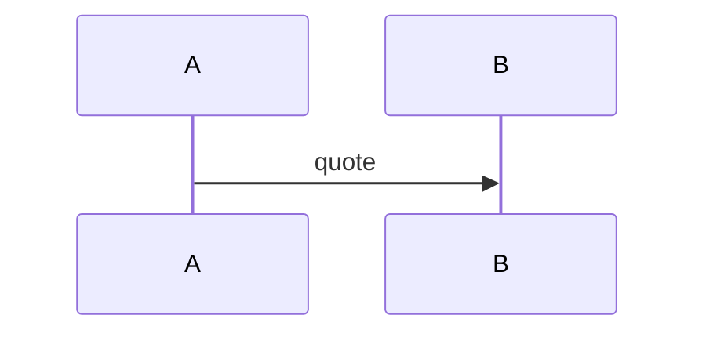
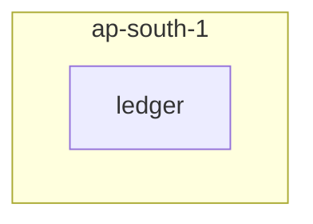

# Shield TRD Rendering & Generation Fixes — Implementation Plan

> **For agentic workers:** REQUIRED SUB-SKILL: Use superpowers:subagent-driven-development (recommended) or superpowers:executing-plans to implement this plan task-by-task. Steps use checkbox (`- [ ]`) syntax for tracking.

**Goal:** Fix five TRD-generation defects in the Shield plugin — milestone ordering, broken relative links in rendered HTML, ASCII→mermaid §7 diagrams, and rendering the milestone→LLD relationship — so every future TRD is correct, proven by regenerating the bill-payments TRD.

**Architecture:** Three deterministic Python-script fixes (`render_trd_section.py`, `render-markdown.py`) carry the load and are TDD-covered. `validate_trd.py` imports `render_milestones` directly, so the §10 drift check stays byte-consistent for free. Two content-generation guidance edits (`trd-template.md`, `plan.md`, `sidecar-schema.md`) steer `/plan` to emit mermaid §7 and an `lld_components[]`-driven §13. The bill-payments TRD is regenerated as the living proof.

**Tech Stack:** Python 3.11+ (stdlib + `markdown-it-py`, `mdit-py-plugins`), run via `uv`; markdown skill/command assets; mermaid.js (already wired in the HTML shell).

---

## File Structure

| File | Responsibility | Workstream |
|---|---|---|
| `shield/scripts/render_trd_section.py` | §10 renderer: dependency-topological+numeric ordering; per-milestone LLD links + optional description | A, B |
| `shield/scripts/test_render_trd_section.py` | Unit tests for ordering + LLD-link/description rendering | A, B |
| `shield/scripts/validate_trd.py` | (No logic change) drift check shares `render_milestones`; confirm green with new fields | A, B |
| `shield/scripts/test_validate_trd_drift.py` | Drift-stays-green test with `touches_lld`/`description` present | A, B |
| `shield/scripts/render-markdown.py` | Rewrite relative `href`/`src` by the md→out directory delta | C |
| `shield/scripts/test_render_markdown_links.py` | Unit tests for relative-link rewriting (new file) | C |
| `shield/skills/general/plan-docs/trd-template.md` | §7 multi-mermaid guidance; §10 description guidance; §13 `lld_components[]`-driven LLD list | D, E, B |
| `shield/skills/general/plan-docs/sidecar-schema.md` | Document the additive optional `milestones[].description` field | B |
| `shield/commands/plan.md` | Reference description generation + §13 LLD-list derivation in emit steps | B, E |
| `.claude-plugin/marketplace.json` | Shield version bump 2.22.0 → 2.23.0 | — |
| `shield/CHANGELOG.md` | Changelog entry | — |

**Key decisions locked here:**
- §10 LLD links target the **co-located Path-B draft** `lld-{component}.md` (always `./lld-{component}.md` relative to `trd.md`) — deterministic, no output-dir math, and exactly where `/plan` drafts them. The HTML link-rewrite (C) corrects it to `../lld-{component}.md` in `outputs/`.
- `render_milestones(milestones)` signature is **unchanged** (LLD links need only `touches_lld[]` component names already in each milestone). This is what keeps `validate_trd.py` in sync with zero changes there.
- `milestones[].description` is **additive + optional**: renderer omits it when absent, so all existing tests and pre-existing TRDs stay valid (no schema version bump needed).

---

## Task 1: Dependency-topological + numeric milestone ordering (A)

**Files:**
- Modify: `shield/scripts/render_trd_section.py:43-79` (the `render_milestones` body + new helpers)
- Test: `shield/scripts/test_render_trd_section.py`

- [ ] **Step 1: Write the failing tests**

Add these tests to `shield/scripts/test_render_trd_section.py` (after the existing `test_render_is_idempotent`, in the determinism section):

```python
def test_orders_topologically_then_numeric() -> None:
    """M10..M16 must NOT sort lexically after M1; deps drive order, numeric breaks ties."""
    ms = [
        {"id": "M1", "name": "One", "outcome": "a", "exit_criteria": ["x"], "depends_on": []},
        {"id": "M10", "name": "Ten", "outcome": "j", "exit_criteria": ["x"], "depends_on": ["M9"]},
        {"id": "M2", "name": "Two", "outcome": "b", "exit_criteria": ["x"], "depends_on": ["M1"]},
        {"id": "M9", "name": "Nine", "outcome": "i", "exit_criteria": ["x"], "depends_on": ["M2"]},
    ]
    out = render_milestones(ms)
    p1 = out.index("M1 — One")
    p2 = out.index("M2 — Two")
    p9 = out.index("M9 — Nine")
    p10 = out.index("M10 — Ten")
    assert p1 < p2 < p9 < p10, "must be M1, M2, M9, M10 — not lexical M1, M10, M2, M9"


def test_ties_broken_by_numeric_id_within_a_dep_level() -> None:
    """Two milestones both depending only on M1 emit in numeric (not lexical) order."""
    ms = [
        {"id": "M1", "name": "One", "outcome": "a", "exit_criteria": ["x"], "depends_on": []},
        {"id": "M2", "name": "Two", "outcome": "b", "exit_criteria": ["x"], "depends_on": ["M1"]},
        {"id": "M11", "name": "Eleven", "outcome": "k", "exit_criteria": ["x"], "depends_on": ["M1"]},
    ]
    out = render_milestones(ms)
    assert out.index("M2 — Two") < out.index("M11 — Eleven")


def test_unknown_dep_is_ignored_not_crashing() -> None:
    ms = [
        {"id": "M1", "name": "One", "outcome": "a", "exit_criteria": ["x"], "depends_on": ["M99"]},
        {"id": "M2", "name": "Two", "outcome": "b", "exit_criteria": ["x"], "depends_on": ["M1"]},
    ]
    out = render_milestones(ms)  # must not raise
    assert out.index("M1 — One") < out.index("M2 — Two")


def test_dependency_cycle_falls_back_to_numeric_without_hanging() -> None:
    ms = [
        {"id": "M1", "name": "One", "outcome": "a", "exit_criteria": ["x"], "depends_on": ["M2"]},
        {"id": "M2", "name": "Two", "outcome": "b", "exit_criteria": ["x"], "depends_on": ["M1"]},
    ]
    out = render_milestones(ms)  # must terminate
    assert "M1 — One" in out and "M2 — Two" in out
```

- [ ] **Step 2: Run tests to verify they fail**

Run: `cd shield/scripts && uv run --with pytest pytest test_render_trd_section.py -k "topolog or ties_broken or unknown_dep or cycle" -v`
Expected: FAIL — `test_orders_topologically_then_numeric` fails on the lexical order (M10 before M2); cycle test may hang or fail.

- [ ] **Step 3: Implement topo+numeric ordering**

In `shield/scripts/render_trd_section.py`, add `import re` near the top (after `import json`), then add these helpers immediately above `render_milestones`:

```python
_ID_NUM_RE = re.compile(r"^M(\d+)$")


def _milestone_num(mid: str) -> int:
    """Numeric component of an ``M<n>`` id. Malformed ids sort last via a
    large sentinel so ordering stays total and deterministic."""
    m = _ID_NUM_RE.match(mid or "")
    return int(m.group(1)) if m else 1_000_000


def _order_milestones(milestones: list[dict]) -> list[dict]:
    """Dependency-topological order, ties broken by numeric id.

    A milestone is emitted only after every id in its ``depends_on`` is
    already emitted. Among ready milestones, the lowest numeric id wins.
    Unknown deps are ignored; an unbreakable cycle falls back to numeric
    order for the remaining nodes so this never loops forever.
    """
    by_id = {m["id"]: m for m in milestones}
    remaining = sorted(milestones, key=lambda m: (_milestone_num(m["id"]), m["id"]))
    emitted: list[dict] = []
    emitted_ids: set[str] = set()
    while remaining:
        progressed = False
        for ms in list(remaining):
            deps = [d for d in (ms.get("depends_on") or []) if d in by_id]
            if all(d in emitted_ids for d in deps):
                emitted.append(ms)
                emitted_ids.add(ms["id"])
                remaining.remove(ms)
                progressed = True
        if not progressed:  # cycle / unsatisfiable — emit rest in numeric order
            emitted.extend(remaining)
            break
    return emitted
```

Then change the loop header in `render_milestones` from:

```python
    for ms in sorted(milestones, key=lambda m: m["id"]):
```

to:

```python
    for ms in _order_milestones(milestones):
```

Finally update the `render_milestones` docstring: replace the paragraph beginning *"Determinism: milestones are sorted by `id` (lexicographic)…"* with:

```python
    Determinism: milestones are ordered dependency-topologically (a milestone
    appears only after everything in its ``depends_on``), ties broken by the
    numeric component of the id. This keeps M10+ in build order rather than
    lexical order.
```

- [ ] **Step 4: Run tests to verify they pass**

Run: `cd shield/scripts && uv run --with pytest pytest test_render_trd_section.py -v`
Expected: PASS — all new tests plus the pre-existing `test_id_sort_is_deterministic` and `test_render_is_idempotent` (M1→M2→M3 topo order matches their assertions).

- [ ] **Step 5: Commit**

```bash
git add shield/scripts/render_trd_section.py shield/scripts/test_render_trd_section.py
git commit -m "fix(shield): order TRD §10 milestones topologically + numeric, not lexically

Replaces the lexical sort that rendered M1, M10, M11..M16, M2, M3 for any
project with 10+ milestones. validate_trd shares render_milestones so the
drift check stays byte-consistent.

Co-Authored-By: Claude Opus 4.8 (1M context) <noreply@anthropic.com>"
```

---

## Task 2: Per-milestone LLD links + optional description (B)

**Files:**
- Modify: `shield/scripts/render_trd_section.py` (the per-milestone block builder inside `render_milestones`)
- Test: `shield/scripts/test_render_trd_section.py`

- [ ] **Step 1: Write the failing tests**

Add to `shield/scripts/test_render_trd_section.py` (in the format section):

```python
def test_renders_touches_lld_as_detailed_design_links() -> None:
    out = render_milestones([
        {
            "id": "M3", "name": "Trunk live", "outcome": "x",
            "exit_criteria": ["y"], "depends_on": ["M1"],
            "touches_lld": ["corridor-trunk", "ledger-service"],
        },
    ])
    assert "**Detailed design:** [`corridor-trunk`](lld-corridor-trunk.md), " \
           "[`ledger-service`](lld-ledger-service.md)" in out


def test_omits_detailed_design_line_when_no_touches_lld() -> None:
    out = render_milestones([
        {"id": "M1", "name": "A", "outcome": "a",
         "exit_criteria": ["x"], "depends_on": []},
    ])
    assert "**Detailed design:**" not in out


def test_renders_optional_description_when_present() -> None:
    out = render_milestones([
        {"id": "M1", "name": "A", "outcome": "a", "description": "More detail here.",
         "exit_criteria": ["x"], "depends_on": []},
    ])
    assert "**Description:** More detail here." in out


def test_omits_description_line_when_absent_or_blank() -> None:
    out = render_milestones([
        {"id": "M1", "name": "A", "outcome": "a", "description": "  ",
         "exit_criteria": ["x"], "depends_on": []},
        {"id": "M2", "name": "B", "outcome": "b",
         "exit_criteria": ["x"], "depends_on": ["M1"]},
    ])
    assert "**Description:**" not in out
```

- [ ] **Step 2: Run tests to verify they fail**

Run: `cd shield/scripts && uv run --with pytest pytest test_render_trd_section.py -k "touches_lld or detailed_design or description" -v`
Expected: FAIL — `**Detailed design:**` and `**Description:**` are not produced yet.

- [ ] **Step 3: Implement the new lines**

In `render_milestones`, replace the per-milestone block builder. The current body is:

```python
    blocks: list[str] = []
    for ms in _order_milestones(milestones):
        deps = ms.get("depends_on") or []
        deps_str = "no deps" if not deps else "deps " + ", ".join(deps)
        outcome = (ms.get("outcome") or "").strip()
        exit_criteria = [ec.strip() for ec in (ms.get("exit_criteria") or [])]

        lines = [
            f"### {ms['id']} — {ms['name']}  *({deps_str})*",
            "",
            f"**Outcome:** {outcome}",
        ]
        if exit_criteria:
            lines += ["", "**Exit criteria:**"]
            lines += [f"- {ec}" for ec in exit_criteria]
        blocks.append("\n".join(lines))
```

Replace it with:

```python
    blocks: list[str] = []
    for ms in _order_milestones(milestones):
        deps = ms.get("depends_on") or []
        deps_str = "no deps" if not deps else "deps " + ", ".join(deps)
        outcome = (ms.get("outcome") or "").strip()
        description = (ms.get("description") or "").strip()
        exit_criteria = [ec.strip() for ec in (ms.get("exit_criteria") or [])]
        touches = [c.strip() for c in (ms.get("touches_lld") or []) if c and c.strip()]

        lines = [
            f"### {ms['id']} — {ms['name']}  *({deps_str})*",
            "",
            f"**Outcome:** {outcome}",
        ]
        if description:
            lines += ["", f"**Description:** {description}"]
        if exit_criteria:
            lines += ["", "**Exit criteria:**"]
            lines += [f"- {ec}" for ec in exit_criteria]
        if touches:
            links = ", ".join(f"[`{c}`](lld-{c}.md)" for c in touches)
            lines += ["", f"**Detailed design:** {links}"]
        blocks.append("\n".join(lines))
```

- [ ] **Step 4: Run tests to verify they pass**

Run: `cd shield/scripts && uv run --with pytest pytest test_render_trd_section.py -v`
Expected: PASS — all new + existing tests green.

- [ ] **Step 5: Commit**

```bash
git add shield/scripts/render_trd_section.py shield/scripts/test_render_trd_section.py
git commit -m "feat(shield): render milestone→LLD links + optional description in TRD §10

Each milestone now shows a 'Detailed design:' line linking its touches_lld
components to their co-located Path-B drafts (lld-<component>.md), plus an
optional Description line. Both render deterministically from plan.json so the
drift validator stays byte-exact.

Co-Authored-By: Claude Opus 4.8 (1M context) <noreply@anthropic.com>"
```

---

## Task 3: Confirm §10 drift check stays green with new fields (A, B)

**Files:**
- Test: `shield/scripts/test_validate_trd_drift.py`

- [ ] **Step 1: Inspect the existing drift test harness**

Run: `sed -n '1,60p' shield/scripts/test_validate_trd_drift.py`
Expected: see how it builds a `trd.md` + sibling `plan.json` and asserts `validate(...)` returns 0 (no drift) when §10 is freshly rendered. Note the helper it uses to render the region (it should call `render_section_with_markers`).

- [ ] **Step 2: Write the failing/confirming test**

Add a test that exercises `touches_lld` + `description` end-to-end through the validator. Match the existing file's helper names for building the TRD/plan; the assertion is the contract:

```python
def test_drift_green_with_touches_lld_and_description(tmp_path) -> None:
    """A TRD whose §10 was rendered from milestones carrying touches_lld +
    description must validate with no milestone_drift (renderer and validator
    share render_milestones, so the bytes match)."""
    milestones = [
        {"id": "M1", "name": "Foundation", "outcome": "base", "description": "Sets the base.",
         "exit_criteria": ["compiles"], "depends_on": [], "touches_lld": ["core-svc"]},
        {"id": "M2", "name": "Cutover", "outcome": "ship",
         "exit_criteria": ["green"], "depends_on": ["M1"], "touches_lld": []},
    ]
    # Build trd.md with a freshly rendered §10 region + sibling plan.json,
    # then assert validate(...) == 0. (Reuse this file's existing TRD-builder
    # helper; if none exists, render_section_with_markers(milestones) supplies
    # the §10 body and the surrounding 14-section scaffold can be minimal.)
    ...
```

> Implementation note: if `test_validate_trd_drift.py` already has a `_make_trd(...)`/`_write_plan(...)` helper, call it with the `milestones` above. If it does not, build a minimal 14-section TRD inline using the section slugs from `shield/schema/trd-sections.yaml` and inject `render_section_with_markers(milestones)` under §10. The assertion `assert validate(trd_path, sidecar_path=plan_path) == 0` is the point.

- [ ] **Step 3: Run the test**

Run: `cd shield/scripts && uv run --with pytest pytest test_validate_trd_drift.py -v`
Expected: PASS — no `milestone_drift`. (If it fails, the renderer and validator have diverged — they must not.)

- [ ] **Step 4: Commit**

```bash
git add shield/scripts/test_validate_trd_drift.py
git commit -m "test(shield): drift check stays green with milestone touches_lld + description

Co-Authored-By: Claude Opus 4.8 (1M context) <noreply@anthropic.com>"
```

---

## Task 4: Rewrite relative links when rendering into outputs/ (C)

**Files:**
- Modify: `shield/scripts/render-markdown.py` (parser construction + new rewrite helpers + `render()`/`main()`)
- Test: `shield/scripts/test_render_markdown_links.py` (new)

- [ ] **Step 1: Write the failing tests (new file)**

Create `shield/scripts/test_render_markdown_links.py`:

```python
"""Tests for render-markdown.py relative-link rewriting.

When markdown at {feature}/trd.md renders to {feature}/outputs/trd.html, all
relative body links must be prefixed by the md→out directory delta so they
keep resolving. Invokes render-markdown.sh end-to-end.
"""
from __future__ import annotations

import subprocess
import tempfile
from pathlib import Path

SCRIPT_DIR = Path(__file__).resolve().parent
RENDER_SH = SCRIPT_DIR / "render-markdown.sh"
SHELL = "<!DOCTYPE html>\n<html><body>\n{{BODY}}\n</body></html>\n"


def _run(md_text: str, *, out_subdir: str) -> str:
    with tempfile.TemporaryDirectory() as d:
        d = Path(d)
        outdir = d / out_subdir if out_subdir else d
        outdir.mkdir(parents=True, exist_ok=True)
        (d / "input.md").write_text(md_text)
        (d / "shell.html").write_text(SHELL)
        result = subprocess.run(
            [str(RENDER_SH), "--md", str(d / "input.md"),
             "--shell", str(d / "shell.html"), "--out", str(outdir / "out.html")],
            capture_output=True, text=True,
        )
        if result.returncode != 0:
            raise AssertionError(f"render-markdown.sh failed: {result.stderr}")
        return (outdir / "out.html").read_text()


def test_dot_relative_link_prefixed_when_out_is_subdir():
    out = _run("[plan]( ./plan.json )\n".replace(" ", ""), out_subdir="outputs")
    assert 'href="../plan.json"' in out


def test_bare_relative_link_prefixed():
    out = _run("[prd](prd/1/prd.md)\n", out_subdir="outputs")
    assert 'href="../prd/1/prd.md"' in out


def test_relative_image_src_prefixed():
    out = _run("\n", out_subdir="outputs")
    assert 'src="../diagrams/a.png"' in out


def test_absolute_url_untouched():
    out = _run("[x](https://example.com/a)\n", out_subdir="outputs")
    assert 'href="https://example.com/a"' in out


def test_anchor_link_untouched():
    out = _run("[x](#section)\n", out_subdir="outputs")
    assert 'href="#section"' in out


def test_root_relative_untouched():
    out = _run("[x](/abs/path)\n", out_subdir="outputs")
    assert 'href="/abs/path"' in out


def test_no_prefix_when_md_and_out_share_dir():
    out = _run("[plan](./plan.json)\n", out_subdir="")
    assert 'href="./plan.json"' in out or 'href="plan.json"' in out


def test_relative_link_with_fragment_prefixed_and_fragment_kept():
    out = _run("[x](./prd.md#sec)\n", out_subdir="outputs")
    assert 'href="../prd.md#sec"' in out
```

- [ ] **Step 2: Run tests to verify they fail**

Run: `cd shield/scripts && uv run --with pytest pytest test_render_markdown_links.py -v`
Expected: FAIL — links emitted verbatim (`./plan.json`, `prd/1/prd.md`), not prefixed.

- [ ] **Step 3: Implement the rewrite**

In `shield/scripts/render-markdown.py`:

(a) Add imports near the top (after `from pathlib import Path`):

```python
import os
import posixpath
```

(b) Add these helpers above `_make_parser`:

```python
def _rewrite_relative(url: str, prefix: str) -> str:
    """Prefix a *relative* URL with the md→out directory delta.

    Absolute (`http(s)://`, `//`), root-relative (`/…`), anchor (`#…`) and
    `mailto:` URLs are returned unchanged. ``prefix`` of "" or "." is a no-op.
    """
    if not prefix or prefix == "." or not url:
        return url
    if url.startswith(("#", "/", "mailto:")) or url.startswith("//") or "://" in url:
        return url
    return posixpath.normpath(posixpath.join(prefix, url))


def _override_link_rewrite(md: MarkdownIt, prefix: str) -> None:
    """Rewrite relative href/src on link_open + image tokens by ``prefix``."""
    if not prefix or prefix == ".":
        return

    default_link = md.renderer.rules.get("link_open")

    def link_open(tokens, idx, options, env):
        href = tokens[idx].attrGet("href")
        if href is not None:
            tokens[idx].attrSet("href", _rewrite_relative(href, prefix))
        if default_link is not None:
            return default_link(tokens, idx, options, env)
        return md.renderer.renderToken(tokens, idx, options, env)

    md.renderer.rules["link_open"] = link_open

    default_image = md.renderer.rules.get("image")

    def image(tokens, idx, options, env):
        src = tokens[idx].attrGet("src")
        if src is not None:
            tokens[idx].attrSet("src", _rewrite_relative(src, prefix))
        if default_image is not None:
            return default_image(tokens, idx, options, env)
        return md.renderer.renderToken(tokens, idx, options, env)

    md.renderer.rules["image"] = image
```

(c) Thread `link_prefix` through `_make_parser` and `render`. Change the signatures:

```python
def _make_parser(link_prefix: str = "") -> MarkdownIt:
```

and add, just before `return md` in `_make_parser` (after `_override_mermaid_fence(md)`):

```python
    _override_link_rewrite(md, link_prefix)
```

Change `render`:

```python
def render(md_text: str, link_prefix: str = "") -> tuple[str, str]:
    """Return (toc_html, body_html). toc_html is '' when no h2/h3 found."""
    md = _make_parser(link_prefix)
    env: dict = {}
    tokens = md.parse(md_text, env)
    body = md.renderer.render(tokens, md.options, env)
    toc = _build_toc_html(_collect_toc_entries(tokens))
    return toc, body
```

(d) In `main`, compute the prefix from `--md` and `--out` and pass it to `render`. Replace the line `toc, body = render(args.md.read_text())` with:

```python
    link_prefix = os.path.relpath(
        args.md.resolve().parent, args.out.resolve().parent
    ).replace(os.sep, "/")
    toc, body = render(args.md.read_text(), link_prefix=link_prefix)
```

(e) Update the module docstring: append a sentence after the mermaid sentence — *"Relative links and image sources in the body are rewritten by the directory delta between `--md` and `--out`, so a doc rendered into an `outputs/` subdir keeps its `./`-relative links resolvable."*

- [ ] **Step 4: Run tests to verify they pass**

Run: `cd shield/scripts && uv run --with pytest pytest test_render_markdown_links.py test_render_markdown_toc.py -v`
Expected: PASS — link tests green AND all pre-existing TOC/mermaid tests still green (they use a single temp dir → prefix "." → no rewrite).

- [ ] **Step 5: Commit**

```bash
git add shield/scripts/render-markdown.py shield/scripts/test_render_markdown_links.py
git commit -m "fix(shield): rewrite relative links when rendering markdown into outputs/

Body links inherited from trd.md/plan.md (e.g. ./plan.json) were emitted
verbatim into outputs/*.html and 404'd one directory up. Now prefixed by the
md->out directory delta; absolute/root/anchor/mailto URLs untouched.

Co-Authored-By: Claude Opus 4.8 (1M context) <noreply@anthropic.com>"
```

---

## Task 5: §7 multi-mermaid + §10 description + §13 LLD-list generation guidance (D, E, B)

**Files:**
- Modify: `shield/skills/general/plan-docs/trd-template.md` (§7, §10, §13 sections)
- Modify: `shield/skills/general/plan-docs/sidecar-schema.md` (document optional `milestones[].description`)
- Modify: `shield/commands/plan.md` (emit steps reference description + §13 derivation)

- [ ] **Step 1: Rewrite the §7 guidance to require mermaid diagrams**

In `shield/skills/general/plan-docs/trd-template.md`, replace the §7 body (lines 154–169, from *"**Purpose:** The shape…"* through the anti-pattern paragraph) with:

```markdown
**Purpose:** The shape of the solution — components, data flow, key contracts.
Detail belongs in `/lld` (when it lands); §7 stays at the "what fits where" level.

**Diagrams are mandatory and MUST be Mermaid** (rendered client-side by the HTML
shell), not ASCII art. Emit a fenced ```mermaid block per diagram. At minimum:

1. **Component / topology** (```mermaid `flowchart`): which service/module owns
   which responsibility, the ports/interfaces between them, and the persistence
   boundary.
2. **Core flow sequence** (```mermaid `sequenceDiagram`): the primary
   request/lifecycle path end-to-end, including failure/recovery transitions.
3. **Boundary diagram** (```mermaid `flowchart` with `subgraph` per zone): the
   region / network / residency / account boundaries and what crosses them.

A single richer topology diagram is the floor; prefer all three when the system
spans regions, async flows, or trust boundaries.

**Backend interpretation:** services, ports, sync-vs-async edges, event backbone,
canonical data store. **Infra interpretation:** module graph, provider composition,
VPC/account/region subgraphs, IAM/network boundaries.

**Anti-patterns:** Do NOT paste ASCII box-art (it renders as monospace text, not a
diagram). Do NOT paste >20-line code blocks (the plan-review implementation-manual
rule flags code blocks >20 lines unless §8 carries a rationale). Mermaid source is
not counted as a code block for that rule.
```

- [ ] **Step 2: Add §10 description guidance**

In `shield/skills/general/plan-docs/trd-template.md` §10 (after the *"Do not hand-edit the rendered region."* paragraph, ~line 223), insert:

```markdown
**Per-milestone fields rendered (from `plan.json` `milestones[]`):** `outcome`
(headline), optional `description` (2–3 sentences of additional context — populate
it when the outcome alone is thin), `exit_criteria`, and a **Detailed design:** line
auto-built from `touches_lld[]` linking each component to its co-located
`lld-<component>.md` draft. You do not write these by hand — they render from the
sidecar; you control them by editing `plan.json`.
```

- [ ] **Step 3: Make §13 drive its LLD list from `lld_components[]`**

In `shield/skills/general/plan-docs/trd-template.md` §13 (after the Backend/Infra interpretation lines, ~line 280), insert:

```markdown
**LLD references (derive from `plan.json`, do not hand-curate):** list every entry
in `lld_components[]`, each linked to its co-located draft `./lld-<name>.md`, with a
one-line lifecycle note: *"drafted by `/plan`; promoted to `docs/lld/<name>.md` by
`/implement` at milestone close."* When `lld_components[]` is empty, write
`n/a — no component LLDs at this scope`. This is what makes the TRD→LLD relationship
visible instead of a hand-written "to be authored" stub.
```

- [ ] **Step 4: Document the optional `milestones[].description` field**

In `shield/skills/general/plan-docs/sidecar-schema.md`, find the milestone-fields line (~line 103: *"`milestones[]` is the roadmap. Each milestone has `id`…"*) and append to that sentence:

```markdown
 Each milestone MAY also carry an optional `description` (2–3 sentences of context
beyond `outcome`); it is additive and back-compat (sidecars without it render with
no Description line).
```

- [ ] **Step 5: Reference the new generation behavior in the /plan command**

In `shield/commands/plan.md`, in step 9 (the `{plan_json}` generation step, line 88), append a sentence:

```markdown
 Populate each milestone's optional `description` (2–3 sentences) when its `outcome` alone is thin.
```

In `shield/commands/plan.md`, in step 10's emitter bullet list (after the line about anchors, ~line 92), add a bullet:

```markdown
    - Emits §7 High-Level Design as Mermaid diagrams (topology + core-flow sequence + boundary) — never ASCII — and derives the §13 LLD reference list from `lld_components[]` (each linked to `./lld-<name>.md`).
```

- [ ] **Step 6: Eyeball-verify the guidance renders (no automated test for prose)**

Run: `grep -n "mermaid\|Detailed design\|lld_components\|description" shield/skills/general/plan-docs/trd-template.md`
Expected: the new §7 mermaid block, the §10 description/Detailed-design note, and the §13 `lld_components[]` note are all present.

> Note: prose guidance has no unit-test surface; the executable eval for the *rendered output* of this guidance is Task 6, and the end-to-end proof is Task 7 (regeneration). State this in the PR body per CLAUDE.md.

- [ ] **Step 7: Commit**

```bash
git add shield/skills/general/plan-docs/trd-template.md shield/skills/general/plan-docs/sidecar-schema.md shield/commands/plan.md
git commit -m "feat(shield): TRD §7 mermaid diagrams + §10 descriptions + §13 LLD list from sidecar

Steers /plan to emit Mermaid (topology/sequence/boundary) instead of ASCII in
§7, render an optional per-milestone description, and derive §13's LLD
references from lld_components[] with the draft->promote lifecycle note.

Co-Authored-By: Claude Opus 4.8 (1M context) <noreply@anthropic.com>"
```

---

## Task 6: Executable eval — rendered output of the new guidance (D, E, C)

**Files:**
- Test: `shield/scripts/test_render_markdown_links.py` (append integration cases)

This is the repo-resident regression test that exercises the *observable output* of
the guidance changes (multi-mermaid §7 + LLD links rewritten into `outputs/`)
without needing the LLM.

- [ ] **Step 1: Write the failing integration test**

Append to `shield/scripts/test_render_markdown_links.py`:

```python
TRD_FIXTURE = """# T

## §7 High-Level Design {#high-level-design}






## §10 Milestones {#milestones}

### M1 — Foundation  *(no deps)*

**Detailed design:** [`core-svc`](lld-core-svc.md)

## §13 References {#references}

- LLD: [`core-svc`](./lld-core-svc.md) — drafted by /plan.
"""


def test_section7_emits_three_mermaid_diagrams():
    out = _run(TRD_FIXTURE, out_subdir="outputs")
    assert out.count('<pre class="mermaid">') == 3


def test_milestone_and_reference_lld_links_rewritten_into_outputs():
    out = _run(TRD_FIXTURE, out_subdir="outputs")
    # §10 link 'lld-core-svc.md' and §13 './lld-core-svc.md' both land one dir up
    assert 'href="../lld-core-svc.md"' in out
    assert 'href="lld-core-svc.md"' not in out
    assert 'href="./lld-core-svc.md"' not in out
```

- [ ] **Step 2: Run the test**

Run: `cd shield/scripts && uv run --with pytest pytest test_render_markdown_links.py -k "three_mermaid or rewritten_into_outputs" -v`
Expected: PASS (Tasks 4’s rewrite + the already-present mermaid fence handler make this green). If RED, the rewrite or mermaid handler regressed.

- [ ] **Step 3: Commit**

```bash
git add shield/scripts/test_render_markdown_links.py
git commit -m "test(shield): integration eval for multi-mermaid §7 + LLD links in outputs/

Co-Authored-By: Claude Opus 4.8 (1M context) <noreply@anthropic.com>"
```

---

## Task 7: Version bump + changelog

**Files:**
- Modify: `.claude-plugin/marketplace.json` (shield entry `version`)
- Modify: `shield/CHANGELOG.md`

- [ ] **Step 1: Bump the marketplace version**

In `.claude-plugin/marketplace.json`, change the shield plugin entry's `"version": "2.22.0"` to `"version": "2.23.0"`.

> Per CLAUDE.md: version lives ONLY in marketplace.json for relative-path plugins. Do NOT add a version to `shield/.claude-plugin/plugin.json`. The shield plugin root has no `pyproject.toml`, so nothing else to bump.

- [ ] **Step 2: Add a changelog entry**

Prepend an entry to `shield/CHANGELOG.md` (match the file's existing heading style):

```markdown
## 2.23.0

### Fixed
- **TRD §10 milestone ordering**: milestones now render in dependency-topological
  then numeric order (M1, M2, … M16) instead of lexical order (M1, M10, M11, …).
- **Broken relative links in rendered HTML**: body links (plan.json, PRD, plan.md,
  images) rendered into `outputs/` are now rewritten by the md→out directory delta
  so they resolve correctly.

### Added
- **TRD §10 milestone→LLD links**: each milestone renders a "Detailed design:" line
  linking its `touches_lld[]` components to their `lld-<component>.md` drafts, plus
  an optional per-milestone `description`.
- **TRD §7 Mermaid diagrams**: `/plan` guidance now requires Mermaid (topology +
  sequence + boundary) instead of ASCII art.
- **TRD §13 LLD references** derived from `lld_components[]` with the draft→promote
  lifecycle note.
```

- [ ] **Step 3: Run the full shield script test suite as a regression gate**

Run: `cd shield/scripts && uv run --with pytest pytest test_render_trd_section.py test_validate_trd_drift.py test_render_markdown_links.py test_render_markdown_toc.py -v`
Expected: PASS — entire suite green.

- [ ] **Step 4: Commit**

```bash
git add .claude-plugin/marketplace.json shield/CHANGELOG.md
git commit -m "chore(shield): bump to 2.23.0 for TRD rendering & generation fixes

Co-Authored-By: Claude Opus 4.8 (1M context) <noreply@anthropic.com>"
```

---

## Task 8: Regenerate the bill-payments TRD as proof (F) — VERIFICATION

> **Cross-repo + needs user confirmation.** The bill-payments TRD lives in a
> *separate* repo (`/Users/apple/projects/aspora/flow-research`). This task
> regenerates it with the upgraded plugin to prove the fixes end-to-end. It is a
> verification step, not a code change in this repo — do it only after the user
> confirms touching that repo (see the open question in the handoff).

**Files (other repo):**
- `flow-research/docs/shield/bill-payments-platform-20260430/plan.json` (gains `lld_components[]`, `milestones[].touches_lld[]`, optional `description`)
- `.../trd.md`, `.../outputs/trd.html` (regenerated)
- `.../lld-<component>.md` × N (new Path-B drafts)

- [ ] **Step 1: Re-run `/plan` for the feature with the upgraded plugin**

Invoke `/plan` against the bill-payments feature folder so it re-derives the
sidecar (incl. `lld_components[]` + `touches_lld[]`), drafts the `lld-*.md` files,
and re-emits `trd.md` + `outputs/trd.html`.

- [ ] **Step 2: Verify §10 ordering**

Run: `grep -n "^### M" flow-research/docs/shield/bill-payments-platform-20260430/trd.md`
Expected: `M1, M2, M3, … M13, M14, M16, M15` (topological+numeric) — NOT `M1, M10, M11, …`.

- [ ] **Step 3: Verify §10 LLD links + §7 mermaid + working plan.json link in HTML**

Run:
```bash
F=flow-research/docs/shield/bill-payments-platform-20260430
grep -c '<pre class="mermaid">' $F/outputs/trd.html      # expect >= 3
grep -o 'href="../plan.json"' $F/outputs/trd.html | head # expect the body link now ../
grep -n "Detailed design:" $F/trd.md | head             # expect per-milestone LLD links
ls $F/lld-*.md                                           # expect the drafted LLDs
```
Expected: ≥3 mermaid diagrams, the body plan.json link resolves (`../plan.json`),
per-milestone LLD links present, and draft LLD files exist — the concrete answer to
"why no LLD."

- [ ] **Step 4: Validate the regenerated TRD**

Run: `uv run shield/scripts/validate_trd.py $F/trd.md`
Expected: exit 0 — no `milestone_drift`, no missing sections.

- [ ] **Step 5: Commit in the flow-research repo** (only if the user wants it committed there)

---

## Self-Review

**Spec coverage:**
- A (ordering) → Task 1 ✓
- B (per-milestone LLD links + description) → Task 2 (render) + Task 5 (guidance/schema) ✓
- C (relative-link rewrite) → Task 4 ✓
- D (§7 mermaid) → Task 5 (guidance) + Task 6 (rendered-output eval) ✓
- E (§13 from `lld_components[]`) → Task 5 ✓
- F (regenerate proof) → Task 8 ✓
- Evals (mandatory) → Tasks 1, 2, 3, 4, 6 are executable repo-resident tests ✓
- Versioning → Task 7 ✓

**Placeholder scan:** Task 3 Step 2 intentionally defers to the existing drift-test helper names (which must be read at execution); its assertion is concrete. Task 8 is explicitly a verification step gated on user confirmation. No other placeholders.

**Type/name consistency:** `_order_milestones`, `_milestone_num`, `_rewrite_relative`, `_override_link_rewrite`, `render(md_text, link_prefix="")`, `_make_parser(link_prefix="")` are used consistently across Tasks 1, 2, 4, 6. Link target form `lld-<component>.md` is consistent between the renderer (Task 2), guidance (Task 5), and evals (Task 6/8).
