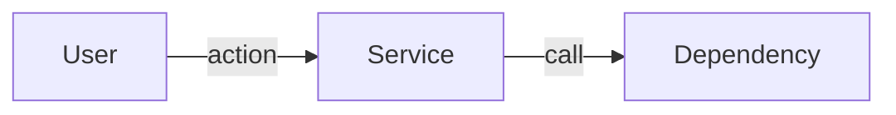
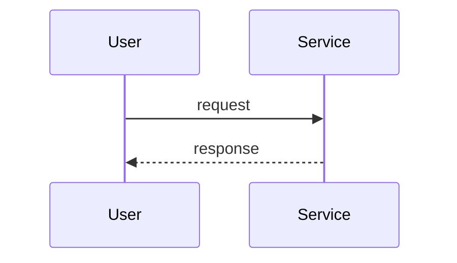

# PRD scaffolds: TOC, Terminologies, Architecture & flows, story-type labels, Mermaid diagrams

**Date:** 2026-05-13
**Owner:** @ashwinimanoj
**Status:** Draft (v2 — scope expanded after PR #41 milestones merged)
**Scope:** shield plugin — PRD authoring (`/prd`), PRD scaffolds, HTML renderer

## Problem

Shield's PRD scaffolds are functional but miss five affordances that hurt review velocity and authoring quality:

1. **No navigation aid** — `prd.html` is a flat scroll; reviewers can't jump to a section.
2. **No glossary** — PRDs introduce acronyms and product-specific terms without a single place to define them.
3. **No architecture surface** — system topology, user flows, and state machines are hard to convey in prose alone. There's no canonical home for diagrams.
4. **No story provenance** — when a PRD describes a rewrite of an existing service, every story reads the same. Reviewers can't tell which stories represent net-new behavior, which are enhancements of existing flows, and which document pre-existing behavior carried forward (for regression-risk surface).
5. **No diagram rendering** — even when authors add ascii or mermaid syntax, `prd.html` renders it as a plain code block, defeating the point.

The five fixes are tightly coupled to the scaffold itself, so they land together. This spec captures all five.

## Context — what already exists on main

The parallel PR #41 ("agent-proposed milestones to PRDs and plans") merged into `origin/main` and shipped:

- Milestones table as a **sub-section of §13 (Rollout plan)** in the standard scaffold, and a separate **§6 (Milestones)** in lean. Standard stays at 18 numbered sections; lean grew from 7 to 8.
- A new `shield:milestone-coverage` skill, invoked from `/prd` step 7a (after stories for standard, after metrics for lean) and from `/plan` as a fallback.
- `prd.meta.json.rubric_version` bumped to `1.1` to mark scaffold-version awareness.
- Plugin version `shield` bumped to `2.15.0`.

This spec **builds on top** of that work. It does not change the Milestones placement or the milestone-coverage skill. The version bump in this work is `2.15.0 → 2.16.0`.

## Goals

1. Every PRD authored via `/prd` after this change has a **Terminologies** section as Section 2 (right after Header) in both standard and lean scaffolds.
2. Every PRD has an **Architecture & flows** section as Section 5 (after Personas, before Goals) in both standard and lean scaffolds. Content is optional — authors leave it empty when there's nothing to diagram.
3. Each user story in the standard scaffold's stories section carries a **Type** label: `new | enhancement | existing`. When type is `enhancement` or `existing`, the story also names the existing behavior being modified or carried forward.
4. Every `prd.html` rendered after this change displays an auto-generated **Table of Contents** linking to every h2 (and nested h3) heading.
5. **Mermaid code blocks** (` ```mermaid `) in `prd.md` render as actual SVG diagrams in `prd.html` (via `mermaid.js`). Image-based diagrams (PNG/SVG files alongside `prd.md`) keep working via standard markdown image syntax.
6. The Terminologies section is auto-populated when possible (research-transcript glossary + LLM scan of drafted body), confirmed by the user before write.

## Non-goals

- **No retroactive backfill** of existing `prd.md` files in this or customer repos. Re-running `/prd` in a folder with an existing PRD creates a new `{N+1}-{slug}/` run using the new scaffold.
- **No re-render** of existing `prd.html` files. New affordances appear only in HTML rendered after this change.
- **No new top-level skill** for diagrams, story-types, or terminologies — all behavior lives inside the existing `prd-docs` skill.
- **No TOC in `prd.md`** beyond what authors write. TOC is HTML-only at render time.
- **No sticky-sidebar TOC.** Static block under the meta-banner.
- **No type detection for stories.** Story Type is user-authored; never auto-inferred.
- **No new scored rubric dimension in `prd-review`** for any of these additions. (The milestone-coverage merge bumped `rubric_version` to 1.1 without a new dimension; this work bumps to 1.2 for the same reason.)

## Design

### Section ordering after this work

Standard grows 18 → 20. Lean grows 8 → 10.

```
Standard                                Lean
─────────                               ─────
1. Header                               1. Header
2. Terminologies     ← NEW              2. Terminologies   ← NEW
3. Problem & context (was 2)            3. Problem & context (was 2)
4. Target users / personas (was 3)      4. Target users / personas (was 3)
5. Architecture & flows   ← NEW         5. Architecture & flows   ← NEW
6. Goals & non-goals (was 4)            6. Goals & non-goals (was 4)
7. Success metrics (was 5)              7. Success metrics (was 5)
8. User stories & scenarios (was 6) +   8. Milestones (was 6)
   Type field per story                 9. Open questions (was 7)
9. Functional requirements (was 7)      10. Out of scope / Non-goals (was 8)
10. Non-functional requirements (was 8)
11. RBAC & permissions matrix (was 9)
12. Dependencies (was 10)
13. Risks & mitigations (was 11)
14. Assumptions (was 12)
15. Rollout plan (was 13) — still
    contains Milestones + Rollout
    mechanics sub-sections
16. Cost & resource impact (was 14)
17. GTM & customer-comms (was 15)
18. Support / CX impact (was 16)
19. Open questions (was 17)
20. Out of scope / Non-goals (was 18)
```

### New section templates

**Section 2 — Terminologies** (identical in both scaffolds):

```markdown
## 2. Terminologies
| Term | Definition |
|---|---|
| <term> | <one-line definition; link to deeper doc if needed> |
```

**Section 5 — Architecture & flows** (identical in both scaffolds; content optional):

````markdown
## 5. Architecture & flows

Optional. If this feature has non-trivial system topology, user flows, or
state machines, capture them here as Mermaid diagrams (preferred — render
in prd.html) or linked images alongside prd.md. Leave empty if all flows
are simple enough to describe in prose elsewhere.

### System overview


### Key flows

````

### Section 8 — Story template change

The story template (used inside Section 8 of standard; lean has no Stories section) gains a Type field and a conditional Existing-behavior field:

```markdown
### Story <ID>: <name>
- **Type:** new | enhancement | existing
- **Existing behavior:** <path / link / one-line description, or "N/A">
  *(required when Type is enhancement or existing; "N/A" for new)*
- **Persona:** <P-id>
- **Goal:** <user-language goal>
- **Happy path:** <numbered steps>
- **Error / timeout / abandon paths:** <branches>
- **Edge cases:** <enumeration>
- **State transitions:** <if applicable>
- **Cross-functional handoffs:** <who/when downstream teams pulled in>
- **Acceptance criteria (Given/When/Then):**
  - Given <pre>, When <action>, Then <outcome>
```

**Type semantics:**

| Value | Meaning | When to use |
|---|---|---|
| `new` | Behavior does not exist in any form today | Net-new feature, fresh codebase, brand-new endpoint |
| `enhancement` | Modifies existing behavior in a user-visible way | Adding a field to an existing API; changing UX of an existing flow; tightening validation; performance change at user-visible threshold |
| `existing` | Behavior already exists, documented here for context | Rewrites — carries forward unchanged flows so reviewers see the regression-risk surface. Also: stories that capture today's state before a planned change |

`shield:story-coverage` scaffolds stories with `Type: new` as the default placeholder; the user overrides during the walk.

### Walk order (`prd-docs/SKILL.md` step skeleton)

```
1. Read .shield.json
2. Resolve feature folder
3. Detect prior lean PRD → upgrade flow if found
4. Ask PRD type (standard / lean)
5. Pre-populate Problem/Personas/Dependencies from research if present
   (section refs shift to 3, 4, 12)
6. Walk Section 1 (Header)
6a. NEW: Defer Section 2 (Terminologies) — insert empty placeholder; filled at step 16
7. Walk Sections 3, 4 (Problem, Personas)
7a. NEW: Walk Section 5 (Architecture & flows) — optional; user adds Mermaid blocks or
    image links, or leaves empty
8. Walk Section 6 (Goals)
9. Invoke shield:story-coverage between Sections 6 and 8
   (CHANGED: was between Sections 4 and 6 pre-rebase)
10. Walk Section 7 (Success metrics)
11. Walk Section 8 (User stories — scaffolded by step 9). NEW: each story prompts for
    Type (new | enhancement | existing). If type is enhancement or existing, also
    prompts for Existing-behavior reference.
12. Walk Sections 9..14 (Functional through Assumptions)
13. Invoke shield:milestone-coverage between Sections 8 and 15
    (CHANGED: was between Section 6 and §13 pre-rebase)
14. Walk Section 15 (Rollout plan — Milestones is pre-populated by step 13; walk only
    the Rollout-mechanics sub-section)
15. Walk Sections 16..20 (standard) — for lean, walk Sections 7 (Metrics), 8 (Milestones
    via step 13), 9 (Open questions), 10 (Out of scope) only
16. NEW: Build Section 2 (Terminologies) — research-glossary copy + LLM scan of drafted
    body, user confirms before write
17. Apply custom-template merging if .shield.json.prd_template is set
18. Write prd.md, prd.html, prd.meta.json
19. Update manifest, regenerate index.html
```

### TOC generation (server-side in `render-markdown.py`)

1. Walk the markdown-it token stream after parse. Collect h2/h3 `heading_open` tokens with their text and the anchor id emitted by `anchors_plugin`. Skip h1 (document title).
2. Build `<nav class="toc">` with nested `<ul>` (h3 nests under preceding h2).
3. Substitute into a new `{{TOC}}` placeholder in `prd.shell.html`. If the placeholder is absent, skip silently (backwards-compat).
4. CSS for `.toc`, `.toc-title`, `.toc ul`, etc. lives in the shell template in `templates.md`.

### Mermaid rendering

**Renderer change (markdown-it-py fence rule override):**

Currently ` ```mermaid blocks ` render as `<pre><code class="language-mermaid">…</code></pre>`. Override the renderer's `fence` rule so blocks with info string `mermaid` emit `<pre class="mermaid">…</pre>` instead — no inner `<code>`, source preserved literally as text content. Mermaid v10+ recognizes `<pre class="mermaid">` for automatic rendering.

Non-mermaid fences (` ```python `, ` ```bash `, etc.) keep current rendering.

**Shell template change:**

`prd.shell.html` gains a module-script tag in `<head>` that loads mermaid.js from a CDN and renders all `<pre class="mermaid">` elements:

```html
<script type="module">
  import mermaid from "https://cdn.jsdelivr.net/npm/mermaid@10/dist/mermaid.esm.min.mjs";
  mermaid.initialize({ startOnLoad: false, theme: "default" });
  mermaid.run({ querySelector: "pre.mermaid" });
</script>
```

When JavaScript is disabled or the CDN is unreachable, the diagram source remains visible as plain text inside the `<pre>` — readable but not graphical.

### Auto-fill behavior for Terminologies (step 16 detail)

- **Source A:** parse `## Glossary` / `## Terminology` / `## Terms` section in the research transcript if present; copy rows verbatim into the Terminologies table.
- **Source B:** Claude scans Sections 3..20 for:
  - ALL-CAPS acronyms used 2+ times
  - Capitalized multi-word phrases used as named concepts
  - Domain nouns in Personas / NFR / Dependencies without prior definition
  - Internal product / service names in Dependencies / GTM / Rollout
  Proposes 5–15 rows with one-line definitions.
- Merge by lowercased term; Source A wins on conflict.
- User confirms / edits before write; default action is accept-all.

### Files changed

| File | Change |
|---|---|
| `shield/skills/general/prd-docs/templates.md` | Rewrite both scaffolds for new 20/10 numbering. Add Terminologies (§2) and Architecture & flows (§5) templates. Update story template with Type + Existing-behavior fields. Add `{{TOC}}` placeholder + TOC CSS to HTML shell. Add mermaid.js script-tag to the shell. Update doc copy "18-section" → "20-section", "8-section" → "10-section". |
| `shield/skills/general/prd-docs/SKILL.md` | Rewrite walk order to defer Section 2, walk Section 5 (Architecture & flows), shift all section-number references, prompt for story Type, update milestone-coverage trigger position to Sections 8↔15, add step 16 terminologies-build. Update frontmatter description. |
| `shield/skills/general/prd-docs/meta-schema.md` | `sections_present` example `[1..18]` → `[1..20]`. `rubric_version` `1.1` → `1.2`. Add 1.2 note covering Terminologies + Architecture & flows + story Type. Counts in `type` description: 18 → 20, 8 → 10. |
| `shield/skills/general/prd-docs/type-detection.md` | Add Terminologies + Architecture & flows to lean section list (now 10). Adjust standard threshold. Load-bearing standard-only range becomes Sections 8..18 (Stories through Support); the rest appear in both lean and standard. |
| `shield/skills/general/prd-docs/test-fixtures/new-from-scratch-expected.md` | Regenerate with new numbering. Add Terminologies, Architecture & flows (with a small Mermaid example), and Type fields on stories. |
| `shield/skills/general/prd-docs/test-fixtures/with-research-transcript-expected.md` | Regenerate with new numbering. Terminologies pre-populated from research-glossary; Architecture & flows populated with mermaid; Type fields on stories. |
| `shield/skills/general/prd-docs/test-fixtures/with-research-transcript.md` | Add Glossary section to exercise the research-transcript Terminologies pre-pop path. |
| `shield/skills/general/prd-docs/test-fixtures/lean-upgrade-prior-prd.md` | Renumber EXPECTED note. |
| `shield/skills/general/prd-docs/test-fixtures/with-milestones-standard.md` (PR #41 fixture) | Renumber to new 20-section numbering. Add Terminologies row, empty Architecture & flows, and Type fields on stories. |
| `shield/skills/general/prd-docs/test-fixtures/with-milestones-lean.md` (PR #41 fixture) | Renumber to new 10-section lean numbering. Same additions. |
| `shield/skills/general/prd-docs/test-fixtures/without-milestones.md` (PR #41 fixture) | Renumber to new 20-section numbering. Same additions. |
| `shield/skills/general/prd-review/personas.md` | Story-coverage gap reference: "Section 6" → "Section 8". |
| `shield/skills/general/milestone-coverage/SKILL.md` | Update section-number references in the trigger description: "after Section 6 (standard) / after Section 5 (lean)" → "after Section 8 (standard) / after Section 7 (lean)". |
| `shield/skills/general/story-coverage/SKILL.md` (if it has section refs) | Update any section-number references. Add note that scaffolded stories default to `Type: new`. |
| `shield/commands/prd.md` | Frontmatter description: "18-section" → "20-section", "8-section" → "10-section". Update step list (Architecture & flows step, story-type step, terminologies-build step). |
| `shield/scripts/render-markdown.py` | Implement TOC token-walk + `{{TOC}}` substitution. Override `fence` rule for mermaid blocks. Tolerate missing `{{TOC}}`. |
| `shield/scripts/test_render_markdown_toc.py` | NEW — pytest tests for TOC generation, mermaid fence override, and backwards-compat. |
| `.claude-plugin/marketplace.json` | Shield version `2.15.0` → `2.16.0`. |

### Testing

Per CLAUDE.md, RED-GREEN testing is mandatory for skill changes.

1. **Renderer unit tests** (`test_render_markdown_toc.py`):
   - Basic TOC: h2 + h3 produces nav with nested ul; h1 excluded.
   - Backwards-compat: shell without `{{TOC}}` renders body unchanged.
   - Empty doc: no h2/h3 produces no `<nav>` block.
   - Orphan h3 before any h2: emitted at top level.
   - Mermaid fence: ` ```mermaid `…` ``` ` produces `<pre class="mermaid">…</pre>` (no `<code>` inner; source preserved literally).
   - Non-mermaid fences (` ```python `, etc.) unchanged from current behavior.

2. **Fixture regeneration**: every fixture under `prd-docs/test-fixtures/` refreshed to new numbering + Terminologies + Architecture & flows + Type fields. The `with-research-transcript-expected.md` fixture exercises the research-glossary Terminologies pre-pop.

3. **RED-GREEN skill test**:
   - **RED**: dispatch a subagent on `origin/main` (which has milestones but not this work) to author a sample PRD. Verify: no Terminologies, no Architecture & flows, no Type per story, no TOC in prd.html, mermaid blocks render as code.
   - **GREEN**: dispatch a subagent in this worktree against the same prompt. Verify: Section 2 = Terminologies (populated); Section 5 = Architecture & flows; stories have Type fields; `prd.html` contains `<nav class="toc">`; ` ```mermaid ` block renders as `<pre class="mermaid">` (mermaid.js renders it in a browser).

### Versioning

Per CLAUDE.md, bump `shield` version in `.claude-plugin/marketplace.json` only. PR #41 just bumped to `2.15.0`; this work bumps to `2.16.0`.

## Risks

| Risk | Mitigation |
|---|---|
| Renderer change breaks non-PRD callers of `render-markdown.sh` | `{{TOC}}` is optional; mermaid fence override triggers only on info string `mermaid`. Both behaviors covered by unit tests. |
| mermaid.js CDN unavailable | Diagram source falls back to readable plain text. Acceptable. |
| Subagent skips the new Architecture & flows / Type / Terminologies-build steps | RED-GREEN catches it; SKILL.md walk order explicitly enumerates each step. |
| Section-number drift between this branch and other in-flight work | Project-memory note `project-shield-parallel-dev-gap` tracks the underlying gap (no automated invariants tests for shield markdown skills). Bounded mitigation in this PR: every renumber is listed in "Files changed"; the renderer unit test asserts exact TOC anchors for the 20-section scaffold so a future renumber-conflict is caught. |
| Story Type values drift over time (people add custom values) | Document the three values + their semantics in templates.md. Type is user-authored prose — no enforcement at write time. `prd-review` could later enforce. |
| Mermaid syntax errors in `prd.md` | Mermaid renders an error inline in the SVG; `prd.md` write succeeds regardless. |

## Open questions

None at time of writing.

## Out of scope

- Sidebar / sticky / collapsible TOC.
- Inline linking from a term's first PRD usage to its Terminologies row.
- Shared `terminologies.yaml` per feature folder.
- Mermaid rendering inside `prd.md` itself (editor preview is the editor's concern).
- Type detection for stories (always user-authored).
- A new scored `prd-review` rubric dimension for diagrams / story-type completeness.
- Migrating existing `prd.md` / `prd.html` files.
- A `/diagram` slash command or any diagram authoring helper.
