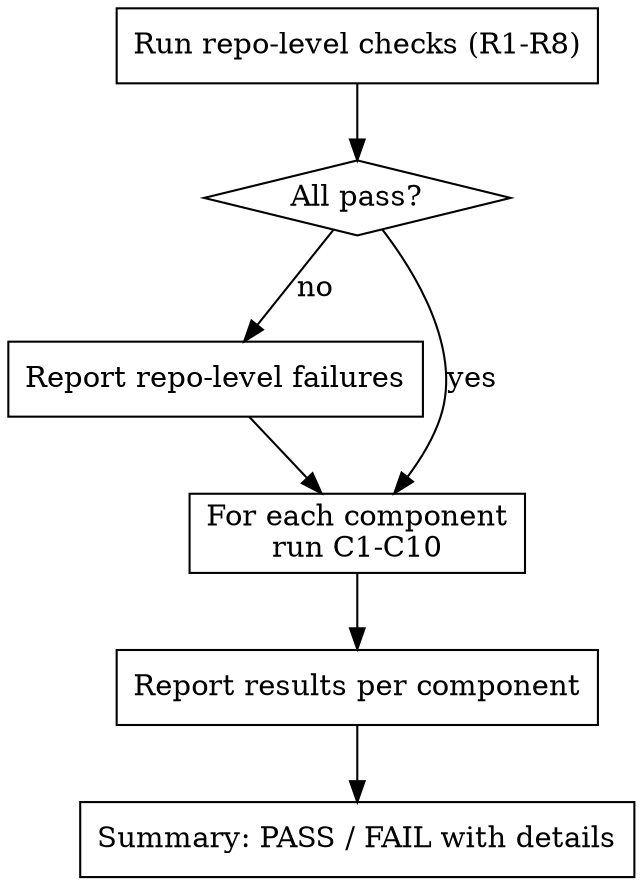

# Atmos Component Hygiene Check

## Overview

Automated checklist for validating Atmos Terraform components against common mistakes. Run this after adding or modifying a component to catch issues before they reach PR review.

## When to Use

- After creating a new Terraform component
- After modifying an existing component's variables, outputs, or resources
- Before committing component changes
- During PR review of component changes

## Checks

Run each check against every component discovered via Repo Layout Detection above.

## Repo Layout Detection

- **Multi-component repo:** Components at `components/terraform/*/` — run per-component checks on each
- **Single-component repo (template-based):** Component at `src/` — run per-component checks once against `src/`

Detect which layout by checking:
1. If `src/versions.tf` exists → single-component repo, component root = `src/`
2. If `components/terraform/` exists → multi-component repo, iterate each subdirectory
3. Neither → warn user this doesn't appear to be an Atmos component repo

### Repository-Level Checks

| # | Check | How to Verify | Severity |
|---|-------|--------------|----------|
| R1 | `provider.tf` is gitignored | Grep `.gitignore` for `provider.tf` | Critical |
| R2 | `backend.tf` is gitignored | Grep `.gitignore` for `backend.tf` | Critical |
| R3 | `.tflint.hcl` exists at repo root | Glob for `.tflint.hcl` | Critical |
| R4 | `terraform_docs` hook in `.pre-commit-config.yaml` | Grep pre-commit config for `terraform_docs` | Important |
| R5 | `.terraform-docs.yml` config exists | Glob for `.terraform-docs.yml` | Important |
| R6 | tflint in CI pipeline | Grep CI workflow for `tflint` | Important |
| R7 | State files gitignored (`*.tfstate*`) | Grep `.gitignore` for `tfstate` | Critical |
| R8 | Lock files gitignored (`.terraform.lock.hcl`) | Grep `.gitignore` for `.terraform.lock.hcl` | Important |

### Per-Component Checks

| # | Check | How to Verify | Severity |
|---|-------|--------------|----------|
| C1 | No `provider.tf` committed | Glob for `provider.tf` in component dir | Critical |
| C2 | No `backend.tf` committed | Glob for `backend.tf` in component dir | Critical |
| C3 | `versions.tf` exists with constraints | Read `versions.tf`, check `required_version` and `required_providers` | Critical |
| C4 | `variables.tf` has baseline variables | Grep for `aws_region`, `environment`, `tags`, `stage` | Important |
| C5 | `README.md` with terraform-docs markers | Grep for `BEGIN_TF_DOCS` in component README | Important |
| C6 | `main.tf` is not empty | Check file has content (WIP components may be exempt) | Warning |
| C7 | `outputs.tf` exists | Glob for `outputs.tf` | Warning |
| C8 | No hardcoded regions | Grep for `region = "` patterns in `.tf` files | Critical |
| C9 | No hardcoded account IDs | Grep for 12-digit number patterns in `.tf` files | Critical |
| C10 | Tags variable used on resources | Grep for `tags` in `main.tf` | Warning |

> **Note on C1 (providers.tf) for single-component repos:** In template-based single-component repos, `providers.tf` IS committed with base provider config (e.g., `region = var.aws_region`). Atmos overrides this via `providers_override.tf.json` at deploy time. The check becomes: "providers.tf exists with only base config, not full provider configuration with assume_role/profile."

## Running the Check



## Output Format

Report results as a table:

```
## Hygiene Check Results

### Repository Level
| Check | Status | Details |
|-------|--------|---------|
| R1 provider.tf gitignored | PASS | |
| R2 backend.tf gitignored | PASS | |
| ...

### Component: vpc
| Check | Status | Details |
|-------|--------|---------|
| C1 No provider.tf | PASS | |
| C2 No backend.tf | PASS | |
| ...

**Result: X/Y checks passed**
```

## Common Mistakes

| Mistake | Why It's Wrong | Fix |
|---------|---------------|-----|
| Committing `provider.tf` | Atmos generates provider config from stack YAML. Committed provider blocks conflict with Atmos-generated ones and prevent cross-account assume_role | Delete file, add to `.gitignore` |
| Committing `backend.tf` | Atmos generates backend config per stack. Committed backends override stack-specific state paths | Delete file, add to `.gitignore` |
| Missing baseline variables | Atmos expects `aws_region`, `environment`, `tags`, `stage` on every component for consistent stack config | Add to `variables.tf` |
| No terraform-docs markers | Component consumers can't discover inputs/outputs without reading `.tf` files | Add `README.md` with `<!-- BEGIN_TF_DOCS -->` / `<!-- END_TF_DOCS -->` |
| Hardcoded regions/account IDs | Breaks multi-region and multi-account deployments | Use variables instead |
