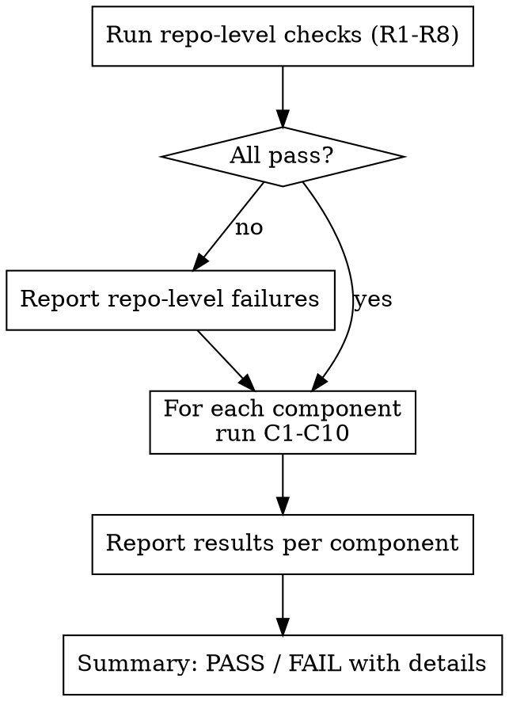

# Atmos Component Hygiene Check

## Overview

Automated checklist for validating Atmos Terraform components against common mistakes. Run this after adding or modifying a component to catch issues before they reach PR review.

## When to Use

- After creating a new Terraform component
- After modifying an existing component's variables, outputs, or resources
- Before committing component changes
- During PR review of component changes

## When NOT to Use

- Reviewing non-Atmos Terraform repos (standard modules without Atmos stack config)
- Pure Atmos stack YAML changes that don't touch component code
- Third-party module reviews where you don't control the component structure
- Cost optimization reviews (use terraform-cost-review instead)

## Checks

First detect repo layout, then run checks against every component. Full check definitions and verification steps are in `check-tables.md`.

**Repository-level (R1-R8):** Verify gitignore rules for `provider.tf`, `backend.tf`, state files, and lock files. Confirm `.tflint.hcl` exists, terraform-docs is configured in pre-commit, and tflint runs in CI.

**Per-component (C1-C10):** Verify no committed `provider.tf` or `backend.tf`, `versions.tf` has constraints, baseline variables exist (`aws_region`, `environment`, `tags`, `stage`), README has terraform-docs markers, no hardcoded regions or account IDs, and tags are applied to resources.

**Severity levels:** Critical (blocks deployment or causes conflicts), Important (causes maintenance pain), Warning (best practice).

## Running the Check

## Common Mistakes

| Mistake | Why It's Wrong | Fix |
|---------|---------------|-----|
| Committing `provider.tf` | Conflicts with Atmos-generated provider config, breaks cross-account assume_role | Delete file, add to `.gitignore` |
| Committing `backend.tf` | Overrides Atmos stack-specific state paths | Delete file, add to `.gitignore` |
| Missing baseline variables | Atmos expects `aws_region`, `environment`, `tags`, `stage` on every component | Add to `variables.tf` |
| No terraform-docs markers | Consumers can't discover inputs/outputs without reading `.tf` files | Add README with `<!-- BEGIN_TF_DOCS -->` / `<!-- END_TF_DOCS -->` |
| Hardcoded regions/account IDs | Breaks multi-region and multi-account deployments | Use variables instead |

## Supporting Files

- **`check-tables.md`** -- Full check definitions (R1-R8, C1-C10) with verification steps, repo layout detection, and output format template
