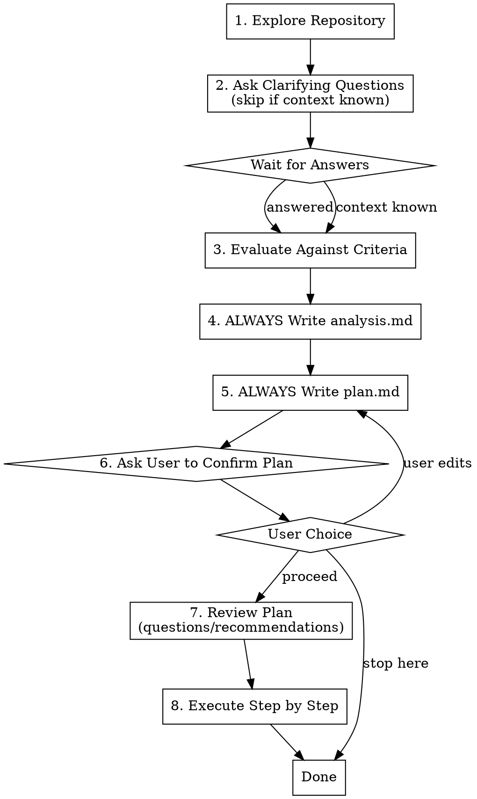

# Atmos Repository Review

## Overview

Structured review of Atmos infrastructure repositories with file-based analysis and implementation planning.

**Core principle:** Analysis and plans are ALWAYS persisted to files, even on re-reviews. Never skip writing files.

## When to Use

- Reviewing an Atmos components or stacks repository
- Evaluating Terraform/OpenTofu infrastructure organization
- Assessing IaC repository for Atmos best practices
- Onboarding to understand existing Atmos setup
- Re-grading after improvements (creates fresh analysis.md and plan.md)

## Workflow



## CRITICAL RULES

1. **ALWAYS write analysis.md** - Even on re-reviews, create fresh analysis
2. **ALWAYS write plan.md** - Even if no P0 issues, document P1/P2 improvements
3. **ALWAYS ask user before executing** - Never auto-proceed to execution
4. **Show the user what was written** - Summarize key findings after writing files

## Output Locations

All outputs written to **target repository** (not skill directory):

```
<repo-root>/
  claude/
    atmos-repo-review/
      analysis.md    # Review findings and grade (ALWAYS created)
      plan.md        # Implementation plan (ALWAYS created)
```

## Phase 1: Explore Repository

Use Glob, Read, and file exploration tools to understand structure.

**Check for:**
- `atmos.yaml` or `atmos.yml` (Atmos config)
- `stacks/` directory (stack definitions)
- `components/terraform/` or `components/helmfile/` (components)
- `catalog/` directory (shared configs)
- CI/CD configuration (`.github/`, `.gitlab-ci.yml`)
- Documentation (`README.md`, `CLAUDE.md`, `docs/`)
- Version constraints (`versions.tf`, provider versions)
- Provider configuration (`providers.tf` committed with base config, `providers_override.tf.json` gitignored)
- Backend configuration (`backend.tf` and `backend.tf.json` gitignored, not committed)
- Pre-commit hooks, linting configs
- terraform-docs setup (pre-commit hook, CI step, or per-component README with `<!-- BEGIN_TF_DOCS -->` markers)
- Release tooling config — either release-please (`release-please-config.json`, `.release-please-manifest.json`) or semantic-release (`.releaserc.json`, `.releaserc.yml`, `release.config.js`)
- Release workflow structure (validation gates, reusable workflows)
- Per-component versioning strategy (VERSION files, release-please manifest, or mono-repo semantic-release)

**Identify repo type:**
- Components-only (consumed via source pinning)
- Stacks-only (references external components)
- Monorepo (both stacks and components)

## Phase 2: Ask Clarifying Questions

**On first review:** Ask 10-15 questions grouped by category.
**On re-review:** Skip if context already known from conversation.

| Category | Example Questions |
|----------|------------------|
| **Architecture** | Consumer repo count, repo type intent, multi-repo strategy |
| **Scale** | AWS accounts, account strategy, multi-region needs |
| **Operations** | State backend, secrets management, version pinning |
| **Development** | Local testing, breaking change communication, target component count |
| **Governance** | Approval process, compliance requirements |

## Phase 3: Evaluate Against Criteria

Score each dimension (1-5 scale):

| Criterion | What to Evaluate |
|-----------|-----------------|
| **Atmos-native structure** | Separation of stacks/components, catalog usage, naming |
| **Environment strategy** | Dev/stage/prod separation, region/account patterns |
| **Reuse & DRY** | Imports, globals, context variables, minimal duplication |
| **Naming conventions** | Component, stack, stage, path consistency |
| **Layering & overrides** | Precedence order, explicit patterns, minimal magic |
| **Security & governance** | Secrets handling, IAM boundaries, cross-account |
| **Operability** | Discoverability, documentation, guardrails, terraform-docs automation |
| **Scalability** | Can add stacks/regions/accounts without restructuring |
| **CI/CD fit** | Validation, formatting, drift detection, promotions |
| **Blast-radius control** | State isolation, stack boundaries, safe defaults |

## Phase 4: Write analysis.md (ALWAYS)

**ALWAYS create this file, even on re-reviews.**

```markdown
# Atmos Repository Analysis

**Repository:** [repo name]
**Date:** [date]
**Repo Type:** [components-only | stacks-only | monorepo]

## Context
[User-provided context from clarifying questions]

## Findings

### The Good
- [What's well-structured and why]

### The Bad
- [Structural issues, risks, anti-patterns]

### Improvements

**P0 (Critical):**
- [Must fix - blocks safe operation]

**P1 (Important):**
- [Should fix soon - affects scale/maintenance]

**P2 (Nice to have):**
- [Improvements for polish/optimization]

## Scores

| Criterion | Score | Notes |
|-----------|-------|-------|
| Atmos-native structure | X/5 | ... |
| Environment strategy | X/5 | ... |
| ... | | |

## Grade: [A-F]

**Justification:**
- [3-6 bullets tied to evaluation criteria]

**What would move to next grade:**
1. [Top change]
2. [Second change]
3. [Third change]
```

## Phase 5: Write plan.md (ALWAYS)

**ALWAYS create this file, even if grade is A.**

If no improvements needed, write:
```markdown
# Implementation Plan

**Based on:** analysis.md
**Current Grade:** A

## Status

No improvements required. Repository meets all best practices.

## Optional Enhancements
- [Any nice-to-have items]
```

Otherwise, write actionable steps:

```markdown
# Implementation Plan

**Based on:** analysis.md
**Target Grade:** [current] -> [target]

## Steps

### Step 1: [Title]
**Priority:** P0/P1/P2
**Files affected:**
- `path/to/file1`
- `path/to/file2`

**Actions:**
1. [Specific action]
2. [Specific action]

**Verification:**
- [ ] [How to verify this step is complete]

---

### Step 2: [Title]
...

## Execution Order
[Any dependencies between steps]

## Notes for Review
[Questions or alternatives for user consideration]
```

## Phase 6: Ask User to Confirm

**ALWAYS ask before proceeding. Never auto-execute.**

After writing both files, ask:

> "I've written the analysis (Grade: X) and plan (Y steps) to `claude/atmos-repo-review/`.
>
> Would you like me to:
> 1. **Proceed** with executing the plan
> 2. **Stop here** (you can review/edit files and resume later)
> 3. **Wait** while you edit plan.md, then continue"

## Phase 7: Review Plan and Clarify

After user confirms:

1. **Re-read plan.md** to catch any user modifications
2. **Ask clarifying questions** if any steps are ambiguous
3. **Make recommendations** if you see issues or better approaches
4. **Confirm understanding** before proceeding

## Phase 8: Execute Step by Step

For each step in plan.md:

1. **Announce** which step you're starting
2. **Execute** the actions
3. **Show detailed output** of what changed
4. **Update verification checkboxes** in plan.md
5. **Confirm completion** before moving to next step

If a step fails or needs adjustment:
- Stop and explain the issue
- Propose alternatives
- Wait for user input before continuing

## Grading Scale

| Grade | Meaning |
|-------|---------|
| **A** | Production-ready, follows all best practices, scales well |
| **B** | Solid foundation, minor improvements needed, operational |
| **C** | Functional but has structural issues affecting scale/safety |
| **D** | Significant problems, needs refactoring before scaling |
| **F** | Fundamentally broken or missing critical Atmos patterns |

## Red Flags

**Immediate concerns:**
- Secrets in code or variables
- No `.gitignore` for state files
- Hardcoded environments/regions in components
- No version pinning
- Missing provider version constraints

**CI/CD consistency:**
- Terraform version inconsistency across CI workflows, `versions.tf`, and local tooling — verify all sources agree on the same version constraint
- Semantic release plugins installed in workflow (`extra_plugins`) but not configured in release config (`.releaserc.json`) — plugins are loaded but unused, or cause unexpected behavior
- Release workflow creates version tags without a validation gate. Best practice: reuse the validation workflow via `workflow_call` as a prerequisite job (`needs: [validate]`) rather than duplicating logic
- Duplicate CI logic across workflows instead of using reusable workflows (`workflow_call` trigger)

**Per-component versioning:**
- Components-only repos with multiple components should use per-component versioning (e.g., release-please manifest mode with `include-component-in-tag: true`) rather than a single repo-wide version
- Tags should follow `<component>/v<version>` format (e.g., `vpc/v1.0.0`) to enable independent version pinning from stacks repos
- If using release-please, check that `release-please-config.json` lists all components in `packages` and `.release-please-manifest.json` tracks their current versions
- If using semantic-release in a monorepo, verify the `semantic-release-monorepo` plugin is configured to filter commits by directory path

**Provider/backend configuration:**
- Missing `providers.tf` in components — Atmos expects a committed base provider config and overrides it via `providers_override.tf.json` at deploy time ([ref](https://atmos.tools/components/terraform/providers))
- `backend.tf` committed in a components-only repo — Atmos generates `backend.tf.json` at deploy time from stack configuration ([ref](https://atmos.tools/components/terraform/backends))
- `.gitignore` missing `backend.tf.json` or `*_override.tf.json` — these are Atmos runtime artifacts that must not be committed
- Provider blocks in child modules instead of root modules — Terraform recommends provider config only in root modules ([ref](https://developer.hashicorp.com/terraform/language/modules/develop/providers)). Atmos components are root modules, so provider blocks are correct here.

**Structural issues:**
- Flat component structure at scale (30+ components)
- Stack duplication instead of imports
- Mixing stack config in component directories
- No separation of globals/catalog

**Documentation gaps:**
- No terraform-docs automation in a components-only repo (consumers need auto-generated input/output docs to understand component interfaces without reading .tf files directly)
- Missing per-component README with `<!-- BEGIN_TF_DOCS -->` / `<!-- END_TF_DOCS -->` markers
- No terraform-docs pre-commit hook or CI step to keep docs in sync with code
- README contradicts `.gitignore` — e.g., listing files as part of component structure that are actually gitignored. Cross-check README guidance against `.gitignore`

## Quick Reference

**Minimum viable Atmos components repo:**
```
components/terraform/<name>/
  main.tf, variables.tf, outputs.tf, versions.tf, providers.tf, data.tf, README.md (with terraform-docs markers)
```

**Provider and backend file handling ([Atmos providers docs](https://atmos.tools/components/terraform/providers), [Atmos backends docs](https://atmos.tools/components/terraform/backends)):**

| File | Commit? | Why |
|------|---------|-----|
| `providers.tf` | **Yes** | Commit with base provider config (e.g., `region = var.aws_region`). Atmos generates `providers_override.tf.json` at deploy time to override with account-specific settings (assume role, etc.). This is correct per [Terraform docs](https://developer.hashicorp.com/terraform/language/providers/configuration) since Atmos components are root modules, not child modules. |
| `backend.tf` | **No** | Atmos generates `backend.tf.json` at deploy time from stack configuration. Each consuming stacks repo supplies its own state backend config (bucket, key, region). |
| `providers_override.tf.json` | **No** | Runtime artifact generated by Atmos. Ensure `.gitignore` has `*_override.tf.json`. |
| `backend.tf.json` | **No** | Runtime artifact generated by Atmos. Ensure `.gitignore` has `backend.tf.json`. |

Pre-commit should include `terraform_docs` hook to auto-generate component README content from .tf files.

**Minimum viable Atmos stacks repo:**
```
atmos.yaml
stacks/
  catalog/
  orgs/<org>/<region>/<env>.yaml
```
