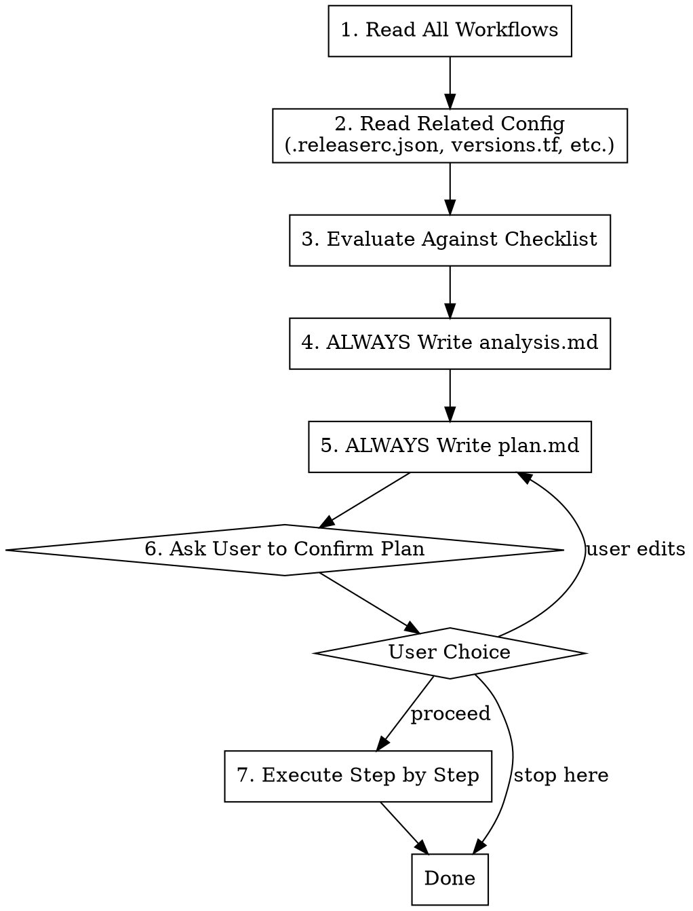

# GitHub Actions Reviewer

## Overview

Structured review of GitHub Actions workflows for consistency, security, and operational best practices.

**Core principle:** Workflows in the same repo form a system. Review them as a group, not individually — inconsistencies between workflows cause the hardest-to-debug CI failures.

**Analysis and plans are ALWAYS persisted to files, even on re-reviews. Never skip writing files.**

## When to Use

- Reviewing CI/CD workflows in any repository
- Auditing workflow permissions and security posture
- Checking for version drift across workflows
- After adding a new workflow to verify it's consistent with existing ones
- Periodic hygiene check on GitHub Actions setup
- Re-grading after improvements (creates fresh analysis.md and plan.md)

## Workflow



## CRITICAL RULES

1. **ALWAYS write analysis.md** — Even on re-reviews, create fresh analysis
2. **ALWAYS write plan.md** — Even if no issues, document what was checked
3. **ALWAYS ask user before executing** — Never auto-proceed to execution
4. **Show the user what was written** — Summarize key findings after writing files

## Output Locations

All outputs written to **target repository** (not skill directory):

```
<repo-root>/
  claude/
    github-actions-review/
      analysis.md    # Review findings and grade (ALWAYS created)
      plan.md        # Implementation plan (ALWAYS created)
```

## Phase 1: Read All Workflows and Config

Read every file in `.github/workflows/` plus related config:

- Release tooling config — either release-please (`release-please-config.json`, `.release-please-manifest.json`) or semantic-release (`.releaserc.json`, `.releaserc.yml`, `release.config.js`)
- `versions.tf` (Terraform version constraints, if Terraform workflows exist)
- `.tflint.hcl` (if tflint is used in workflows)
- `package.json` (if Node.js dependencies are managed)

## Phase 2: Evaluate Against Checklist

### 1. Cross-Workflow Version Consistency

Check that shared tools use the same version everywhere:

| What to Check | Where to Look |
|----------------|---------------|
| **Release tooling version** | All workflows using release-please (`googleapis/release-please-action@v4`) or semantic-release (action `semantic_version`, npx `--package` version) |
| **Node.js version** | `actions/setup-node`, env vars, action defaults |
| **Terraform version** | `hashicorp/setup-terraform`, `versions.tf` constraint |
| **Action versions** | Same action should use same version tag across workflows |

**Red flag:** Preview workflow uses a different release tool version than the actual release workflow — version prediction may differ from actual release.

### 2. Plugin and Config Alignment

**For release-please repos:**
- Verify `release-please-config.json` and `.release-please-manifest.json` exist and are consistent (same set of components)
- Check that the release workflow and preview workflow reference the same config/manifest files
- Ensure all components under `components/terraform/` are registered in the config — missing components won't get versioned

**For semantic-release repos:**
- Verify both install the **same set of plugins** that `.releaserc.json` (or equivalent config) expects
- Check that plugin versions are consistent between `extra_plugins` and npx `--package` flags
- If config file exists (`.releaserc.json`), both workflows should respect it — not override with CLI flags unless intentional

**Red flag:** A component directory exists under `components/terraform/` but is not listed in `release-please-config.json` packages — it will never get a version tag.

### 3. Permissions (Least Privilege)

Every workflow and job should declare only the permissions it needs:

| Operation | Minimum Permission |
|-----------|-------------------|
| Read code | `contents: read` |
| Push commits/tags | `contents: write` |
| Comment on PR | `pull-requests: write` |
| Update check status | `statuses: write` |
| Read PR metadata | `pull-requests: read` |

**Checks:**
- Prefer job-level `permissions` over workflow-level (narrower scope)
- Dry-run / read-only workflows should NOT have `contents: write` unless the tool requires it for auth
- Never use `permissions: write-all` — always enumerate

### 4. Concurrency Control

**PR workflows — cancel superseded runs:**

```yaml
concurrency:
  group: ${{ github.workflow }}-${{ github.event.pull_request.number || github.ref }}
  cancel-in-progress: true
```

Apply to all `pull_request` triggered workflows — rapid pushes shouldn't queue up.

**Release/deploy workflows — queue, never cancel:**

```yaml
concurrency:
  group: release
```

Without `cancel-in-progress` (defaults to `false`), subsequent runs **wait in queue** until the current run finishes. This prevents:
- Two parallel runs racing to create the same version tag
- Conflicting changelog commits from `@semantic-release/git`
- Lost releases from cancelled mid-run workflows

**Red flag:** Release workflow on `main` with no `concurrency` group — runs execute in parallel by default, creating race conditions on tag creation and changelog commits.

**When NOT to apply `cancel-in-progress: true`:**
- Release/deploy workflows on `main`/`production` — cancelling mid-release is dangerous
- Workflows that perform destructive operations

### 5. Path Filters

Check that workflows only trigger when relevant files change:

| Workflow Type | Suggested Paths |
|---------------|-----------------|
| Terraform validation | `components/**`, `.github/workflows/**` |
| Release (actual) | `components/**` |
| Release preview | `components/**` (skip for docs-only PRs) |
| PR title check | No path filter needed (all PRs need valid titles) |
| Docs generation | `docs/**`, `*.md` |

**Red flag:** Release preview runs on ALL PRs including docs-only changes — wastes CI minutes on PRs that won't trigger a release.

### 6. Reusable Workflow Patterns

Check for DRY violations:

- If the same logic (validation, linting) appears in multiple workflows, extract to a reusable workflow with `workflow_call` trigger
- Caller workflows should use `needs:` to gate dependent jobs
- Reusable workflows should NOT have hardcoded triggers — let callers decide when to run

### 7. Action Pinning

| Strategy | Security | Maintenance | Recommended For |
|----------|----------|-------------|-----------------|
| SHA pin (`@abc123`) | Best | Hardest | High-security repos, supply chain concerns |
| Version tag (`@v4.1.2`) | Good | Medium | Repos that want reproducibility |
| Major tag (`@v4`) | OK | Easiest | Most repos (default GitHub convention) |

**Minimum:** Major tag pinning (`@v4`). For third-party actions from less-known publishers, prefer version tag or SHA.

### 8. Environment and Secrets

- `GITHUB_TOKEN` should be passed via `env:` not `with:` for most actions (check action docs)
- Don't use `secrets.GITHUB_TOKEN` where the default `github.token` suffices
- Avoid hardcoding bot names/emails if they can be derived from the action

## Phase 3: Write analysis.md (ALWAYS)

**ALWAYS create this file, even on re-reviews.**

```markdown
# GitHub Actions Review

**Repository:** [repo name]
**Date:** [date]
**Workflows reviewed:** [count]

## Workflow Inventory

| Workflow | Trigger | Purpose |
|----------|---------|---------|
| `name.yaml` | PR / push / workflow_call | Brief description |

## Findings

### Must Fix
- [Issues causing incorrect behavior, security risks, or CI failures]

### Should Fix
- [Inconsistencies that increase maintenance burden]

### Nice to Have
- [Polish items for developer experience]

## Checklist Results

| Check | Status | Notes |
|-------|--------|-------|
| Version consistency | Pass/Fail | ... |
| Plugin alignment | Pass/Fail | ... |
| Permissions | Pass/Fail | ... |
| Concurrency control | Pass/Fail | ... |
| Path filters | Pass/Fail | ... |
| Reusable workflows | Pass/Fail | ... |
| Action pinning | Pass/Fail | ... |
| Secrets handling | Pass/Fail | ... |

## Grade: [A-F]

**Justification:**
- [Bullets tied to checklist results]

**What would move to next grade:**
1. [Top improvement]
2. [Second improvement]
```

## Phase 4: Write plan.md (ALWAYS)

**ALWAYS create this file, even if grade is A.**

If no improvements needed:
```markdown
# Implementation Plan

**Based on:** analysis.md
**Current Grade:** A

## Status

No improvements required. All workflows pass review checklist.

## Optional Enhancements
- [Any nice-to-have items]
```

Otherwise, write actionable steps:

```markdown
# Implementation Plan

**Based on:** analysis.md
**Target Grade:** [current] -> [target]

## Steps

### Step 1: [Title]
**Severity:** Must Fix / Should Fix / Nice to Have
**Files affected:**
- `.github/workflows/file.yaml`

**Actions:**
1. [Specific action]
2. [Specific action]

**Verification:**
- [ ] [How to verify this step is complete]

---

### Step 2: [Title]
...

## Notes
[Context for user, questions, or alternatives]
```

## Phase 5: Ask User to Confirm

**ALWAYS ask before proceeding. Never auto-execute.**

After writing both files, ask:

> "I've written the analysis (Grade: X) and plan (Y steps) to `claude/github-actions-review/`.
>
> Would you like me to:
> 1. **Proceed** with executing the plan
> 2. **Stop here** (you can review/edit files and resume later)
> 3. **Wait** while you edit plan.md, then continue"

## Phase 6: Execute Step by Step

For each step in plan.md:

1. **Announce** which step you're starting
2. **Execute** the actions
3. **Show detailed output** of what changed
4. **Update verification checkboxes** in plan.md
5. **Confirm completion** before moving to next step

If a step fails or needs adjustment:
- Stop and explain the issue
- Propose alternatives
- Wait for user input before continuing

## Grading Scale

| Grade | Meaning |
|-------|---------|
| **A** | All checks pass, consistent versions, least-privilege permissions, concurrency controls |
| **B** | Minor inconsistencies, missing concurrency or path filters, but functionally correct |
| **C** | Version drift or plugin mismatches that could cause different behavior between workflows |
| **D** | Security issues (overly broad permissions), missing validation gates, broken plugin configs |
| **F** | Workflows contradict each other, missing critical permissions, or fundamentally broken |
