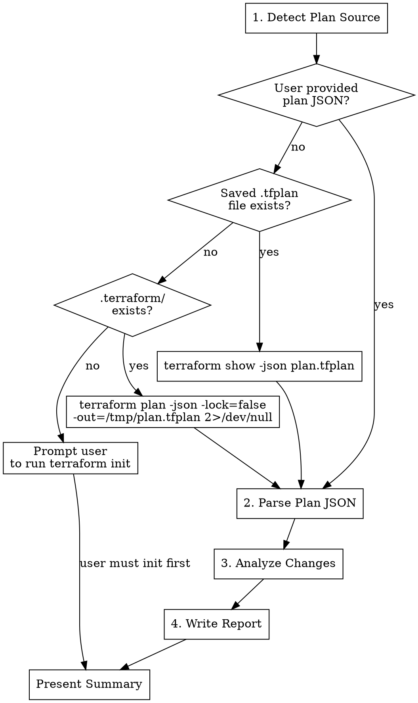

# Terraform Plan Analyzer

## Overview

Analyzes `terraform plan -json` output to surface security-sensitive changes, cost-impacting resources, destructive actions, and drift before `terraform apply`. Complements static code review by showing what will actually change.

**Core principle:** Review the plan, not just the code. Static analysis catches bad patterns; plan analysis catches bad outcomes.

## When to Use

- Before running `terraform apply` on any environment
- After modifying Terraform code, to preview impact
- When reviewing CI/CD plan output from a pull request
- To validate that a code change produces the expected resource changes
- After importing or moving resources, to verify no unintended drift

## Prerequisites

Plan analysis requires one of:

1. **Local plan generation** — `terraform init` has been run (`.terraform/` directory exists)
2. **Existing plan JSON** — User provides a file from CI output or a prior run
3. **Saved plan file** — User ran `terraform plan -out=plan.tfplan` and we convert with `terraform show -json`

## Workflow



## CRITICAL RULES

1. **NEVER run `terraform apply`** — This skill is read-only. Only `plan` and `show` commands.
2. **Use `-lock=false`** — Don't acquire state lock for analysis. Other operations may be running.
3. **ALWAYS write report** — Even if no changes detected, document that fact.
4. **Flag destructive actions prominently** — Destroy and replace actions on stateful resources get top billing.
5. **Ask before generating plan** — If no plan JSON is provided, confirm with user before running `terraform plan`.

## Phase 1: Detect Plan Source

Check in this order:

1. **User provided a path** — Read the JSON file directly
2. **`plan.tfplan` exists in component dir** — Convert: `terraform show -json plan.tfplan`
3. **`.terraform/` exists** — Offer to generate: `terraform plan -json -lock=false`
4. **None of the above** — Tell user to run `terraform init` first, or provide plan JSON from CI

## Phase 2: Parse Plan JSON

The `terraform plan -json` output is a stream of JSON lines. Each line has a `@level` and `type` field.

Key message types to extract:

| Type | What It Contains |
|------|-----------------|
| `planned_change` | Resource address, action (create/update/delete/replace), reason |
| `change_summary` | Counts: add, change, remove |
| `diagnostic` | Warnings and errors from the plan |
| `resource_drift` | Changes detected outside Terraform |
| `outputs` | Output value changes |

For `terraform show -json plan.tfplan`, the structure is different — a single JSON object with:
- `resource_changes[]` — Array of planned resource changes
- `output_changes` — Map of output changes
- `prior_state` — Current state before changes

### Extracting Resource Changes

For each resource change, extract:
- `address` — Full resource address (e.g., `aws_iam_role.flow_log`)
- `type` — Resource type (e.g., `aws_iam_role`)
- `change.actions` — Array: `["create"]`, `["update"]`, `["delete"]`, `["delete", "create"]` (replace)
- `change.before` / `change.after` — Attribute values before and after

## Phase 3: Analyze Changes

### 3a. Change Summary

Categorize all resource changes:

| Action | Resources | Count |
|--------|-----------|-------|
| Create | list of resource addresses | N |
| Update | list of resource addresses | N |
| Replace | list of resource addresses | N |
| Destroy | list of resource addresses | N |

### 3b. Destructive Action Warnings

Flag any destroy or replace action on stateful resources:

| Resource Type | Risk Level | Why |
|---------------|-----------|-----|
| `aws_rds_instance`, `aws_rds_cluster` | CRITICAL | Data loss |
| `aws_dynamodb_table` | CRITICAL | Data loss |
| `aws_s3_bucket` | CRITICAL | Data loss (if not empty) |
| `aws_kms_key` | CRITICAL | Encryption key loss — dependent resources become inaccessible |
| `aws_efs_file_system` | HIGH | Data loss |
| `aws_elasticache_cluster` | HIGH | Cache data loss, connection disruption |
| `aws_vpc` | HIGH | All resources inside destroyed |
| `aws_subnet` | HIGH | Resources in subnet destroyed |
| `aws_db_subnet_group` | HIGH | Database connectivity impact |
| `aws_iam_role` | MEDIUM | Service disruption if role is in use |
| `aws_security_group` | MEDIUM | Network connectivity impact |
| `aws_route_table` | MEDIUM | Network routing disruption |
| `aws_nat_gateway` | MEDIUM | Outbound connectivity loss for private subnets |
| `aws_eip` | LOW | IP address change |

For replace actions (`["delete", "create"]`), also flag the reason — is it a force-new attribute change?

### 3c. Security-Sensitive Changes

Flag changes to these resource types and inspect their attributes:

**IAM Changes:**
- `aws_iam_role` — Check trust policy changes (`assume_role_policy`)
- `aws_iam_policy` / `aws_iam_role_policy` — Check policy document for `*` actions or resources
- `aws_iam_policy_attachment` / `aws_iam_role_policy_attachment` — Who is getting new permissions?
- `aws_iam_user` — User creation or modification

**Network Changes:**
- `aws_security_group` / `aws_security_group_rule` — Check for `0.0.0.0/0` or `::/0` ingress
- `aws_network_acl` / `aws_network_acl_rule` — Check rule changes
- `aws_route` — New routes to internet gateway?
- `aws_vpc_endpoint` — Endpoint policy changes

**Encryption Changes:**
- `aws_kms_key` — Key policy changes, deletion scheduling
- Resources losing `kms_key_id` — Downgrade from CMK to AWS-managed
- `aws_s3_bucket_server_side_encryption_configuration` — Encryption config changes

**Public Access Changes:**
- `aws_s3_bucket_public_access_block` — Any block being set to `false`
- `aws_db_instance` with `publicly_accessible` changing to `true`
- `aws_lb` changing scheme to `internet-facing`

### 3d. Cost-Impacting Changes

Flag creation or destruction of expensive resources:

| Resource Type | Approximate Cost | Direction |
|---------------|-----------------|-----------|
| `aws_nat_gateway` | $32/month + data transfer | Create = cost increase |
| `aws_vpc_endpoint` (Interface) | $7.30/month/AZ | Create = cost increase |
| `aws_eip` | $3.60/month | Create = cost increase |
| `aws_rds_instance` | Varies by instance type | Check `instance_class` in after |
| `aws_elasticache_cluster` | Varies by node type | Check `node_type` in after |
| `aws_instance` | Varies by instance type | Check `instance_type` in after |
| `aws_cloudwatch_log_group` | $0.50/GB ingestion | Check `retention_in_days` |
| `aws_kms_key` | $1/month | Create = cost increase |

For updates, compare before/after values of sizing attributes (`instance_type`, `instance_class`, `node_type`, `allocated_storage`).

### 3e. Drift Detection

If the plan shows `resource_drift` entries or unexpected update actions on resources that weren't modified in code, flag them:

- **Configuration drift** — Someone changed the resource outside Terraform
- **Provider behavior change** — Provider upgrade changed default values
- **State inconsistency** — State file doesn't match reality

## Phase 4: Write Report

Write to `claude/infra-review/plan-analysis.md` in the repository root.

```markdown
# Terraform Plan Analysis

**Component:** [name]
**Date:** [date]
**Plan source:** [generated locally | provided file | converted from .tfplan]

## Change Summary

| Action | Count | Resources |
|--------|-------|-----------|
| Create | N | `resource.name`, ... |
| Update | N | `resource.name`, ... |
| Replace | N | `resource.name`, ... |
| Destroy | N | `resource.name`, ... |
| **Total** | **N** | |

## Destructive Action Warnings

| Resource | Action | Risk | Impact |
|----------|--------|------|--------|
| `aws_rds_instance.main` | destroy | CRITICAL | Data loss |

*None* — if no destructive actions.

## Security-Sensitive Changes

### IAM
| Resource | Change | Concern |
|----------|--------|---------|
| ... | ... | ... |

### Network
| Resource | Change | Concern |
|----------|--------|---------|
| ... | ... | ... |

### Encryption
| Resource | Change | Concern |
|----------|--------|---------|
| ... | ... | ... |

*None* — if no security-sensitive changes.

## Cost Impact

| Resource | Action | Est. Monthly Impact |
|----------|--------|-------------------|
| `aws_nat_gateway.main` | create | +$32/month |
| `aws_eip.nat` | create | +$3.60/month |

**Estimated net change:** +$X/month

*None* — if no cost-impacting changes.

## Drift Detected

| Resource | Expected | Actual | Likely Cause |
|----------|----------|--------|-------------|
| ... | ... | ... | Manual change / provider update |

*None* — if no drift detected.

## Output Changes

| Output | Action | Value |
|--------|--------|-------|
| `vpc_id` | create | (known after apply) |

## Verdict: [Safe to Apply | Review Required | Do Not Apply]

**Rationale:**
- [Key observations driving the verdict]

**Recommendations before applying:**
1. [Any actions to take first]
```

## Verdict Criteria

| Verdict | When |
|---------|------|
| **Safe to Apply** | No destructive actions, no security concerns, changes match expectations |
| **Review Required** | Has security-sensitive changes, cost increases, or replace actions that need human review |
| **Do Not Apply** | Destructive actions on stateful resources without `prevent_destroy`, security downgrades, or unexpected drift |
