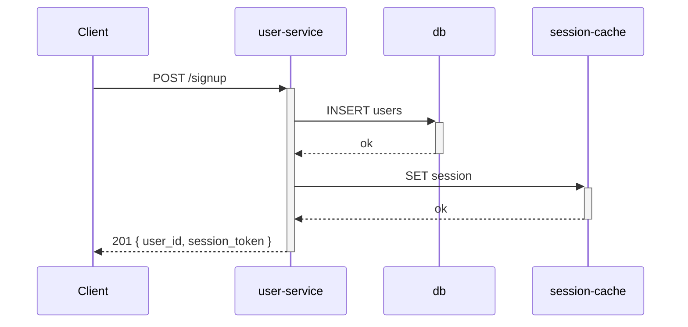
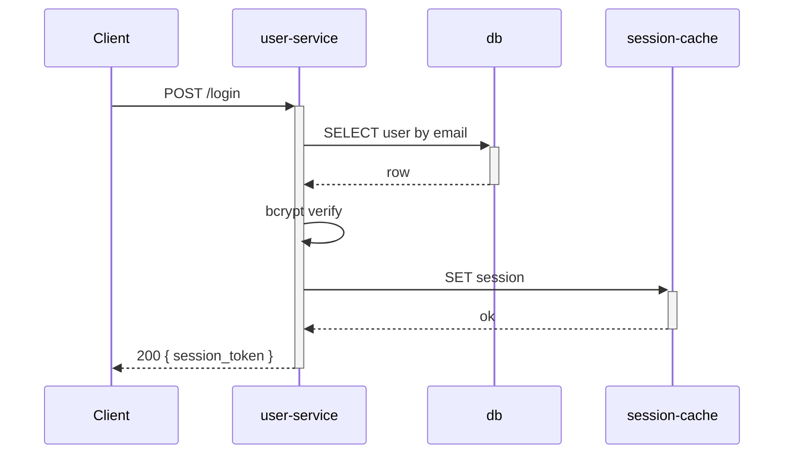

<!-- generated by /lld v2.20.0 on 2026-05-28 -->

# LLD — user-service

**Feature:** `manual`
**Owner:** test@example.com
**Status:** draft
**Linked PRD:** n/a
**Linked plans:** []
**Version:** 0.1.0
**Last updated:** 2026-05-28

## §1 Overview {#overview}

`user-service` is the HTTP service that owns user registration, authentication
sessions, and profile reads. It serves the `/signup`, `/login`, and `/users/:id`
endpoints. Runtime: Python FastAPI; deployed as a single replica set behind
the API gateway.

## §2 Scope & non-goals {#scope-and-non-goals}

**In scope:** signup, login, profile-read, password-reset request emission.

**Out of scope:** password-reset confirmation (handled by `notification-service`);
admin user management (handled by `admin-service`); session storage (handled by
`session-cache`).

## §3 Module layout {#module-layout}

```
services/user-service/                 [new]
├── app/
│   ├── routes/
│   │   ├── signup.py                  [new]
│   │   ├── login.py                   [new]
│   │   └── users.py                   [new]
│   ├── domain/
│   │   ├── user.py                    [new]
│   │   └── password.py                [new]
│   └── infra/
│       ├── db.py                      [new]
│       └── session.py                 [new]
├── tests/                              [new]
└── pyproject.toml                     [new]
```

## §4 Data model {#data-model}

**Table: `users`**

| Column | Type | Nullable | Default | Index | Notes |
|---|---|---|---|---|---|
| `id` | uuid | no | uuid_generate_v4() | PK | |
| `email` | citext | no | — | unique | RFC 5321 validated |
| `password_hash` | text | no | — | — | bcrypt cost 12 |
| `created_at` | timestamptz | no | now() | btree | |

**Cache: `session-cache`** (Redis)
- Key: `session:<session_id>`
- Value: `{user_id, issued_at, expires_at}` (JSON)
- TTL: 14 days

## §5 API contracts {#api-contracts}

### POST /signup {#api-signup}

Request:
```json
{ "email": "user@example.com", "password": "<plaintext>" }
```

Response 201:
```json
{ "user_id": "<uuid>", "session_token": "<opaque>" }
```

Error 409: `{ "error": "email_taken" }`

### POST /login {#api-login}

Request: `{ "email": "...", "password": "..." }`. Response 200 = `{ session_token }`; error 401 = `{ error: "invalid_credentials" }`.

### GET /users/:id {#api-get-user}

Response 200 = `{ id, email, created_at }`. Error 404 = `{ error: "not_found" }`.

## §6 Sequence flows {#sequence-flows}

### Signup flow {#flow-signup}



### Login flow {#flow-login}



## §8 Concurrency & state {#concurrency-and-state}

Race: concurrent signup of the same email — resolved by the unique index on
`users.email` (the second insert fails with 23505 → returned as `email_taken`).

Race: concurrent login of the same user — both succeed; sessions are append-only.

State transitions: none (users are immutable post-signup except for password
which is handled by a separate password-reset flow not in scope).

## §9 Configuration {#configuration}

<details>
<summary>§9 Configuration</summary>

(promote-on-demand — lifted)

| Variable | Default | Range | Hot-reloadable | Notes |
|---|---|---|---|---|
| `BCRYPT_COST` | 12 | 10–14 | no | Restart required. |
| `SESSION_TTL_DAYS` | 14 | 1–30 | yes | Read at SET-time. |
| `RATE_LIMIT_PER_MIN` | 100 | 10–1000 | yes | |

</details>

## §10 Observability {#observability}

**Logs:** structured JSON. Fields: `level`, `ts`, `request_id`, `user_id` (if
authenticated), `path`, `status`, `duration_ms`.

**Metrics:**
- `user_service_signups_total` (counter)
- `user_service_logins_total{outcome="success|failure"}` (counter)
- `user_service_request_duration_seconds` (histogram, by route)

**Traces:** OpenTelemetry; span per route + per downstream call.

## §11 Security & privacy {#security-and-privacy}

<details>
<summary>§11 Security & privacy</summary>

(promote-on-demand — lifted; component handles PII + AuthN)

**AuthN:** caller identifies via session token in `Authorization: Bearer <token>`.

**AuthZ:** profile-read requires `user_id` in the token to match the requested
`:id`, OR the token's `roles` includes `admin`.

**Data classification:** PII (email). Encrypted at rest via DB-level TDE.

**Threat model:** brute-force login → rate limit + bcrypt cost; password
hash exfiltration → bcrypt cost 12 mitigates offline crack to ~10ms/guess.

</details>

## §12 Performance & scaling {#performance-and-scaling}

### §12.1 Load {#load}

Steady: ~50 req/s signup, ~500 req/s login, ~2000 req/s profile-read at
production peak. Spiky: 5× peak during marketing campaigns.

### §12.2 SLO {#slo}

p50 latency: signup 100ms, login 150ms, profile-read 30ms.
p99: signup 500ms, login 750ms, profile-read 150ms.
Availability: 99.9% rolling 30-day.
Error budget: 43m22s/month.

### §12.3 Bottleneck {#bottleneck}

Expected CPU-bound on login due to bcrypt cost-12 verify (~10ms per request
single-threaded). Signup also bcrypt-bound. Profile-read is IO-bound on
session-cache GET.

### §12.4 Latency breakdown {#latency-breakdown}

Login p50 = bcrypt 10ms + DB roundtrip 5ms + session-cache SET 2ms + network
RTT 3ms + serialization ~5ms = ~25ms (well under target; padding for cold cache).

### §12.5 Capacity {#capacity}

Per-pod: 2 CPU, 1GB RAM, 100 concurrent requests. Pool: 10 pods steady-state,
50 burst.

### §12.6 Scale-out lever {#scale-out-lever}

Stateless replication. HPA target: 70% CPU. Max replicas: 100 (limited by
DB connection pool, not application).

### §12.7 Caches {#caches}

Session-cache (Redis) — write-through; invalidation via TTL only.
No application-level cache for users (DB is fast enough at projected scale).

### §12.8 Degradation {#degradation}

If `session-cache` is unavailable, fall back to issuing a stateless signed
JWT. Sessions issued during the degradation window cannot be revoked
server-side until the cache recovers. Alert: PagerDuty P2.

## §13 Open questions {#open-questions}

| Q# | Question | Options | Owner | Resolve-by |
|---|---|---|---|---|

(none open)

## §14 Changelog {#changelog}

| Touch | Date | Summary | Story IDs |
|---|---|---|---|
| manual | 2026-05-28 | Initial reference fixture | n/a |
