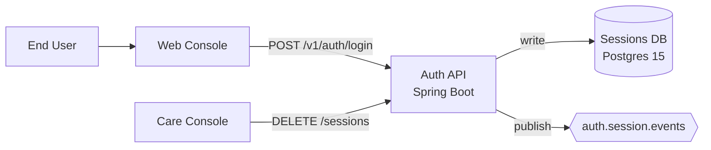
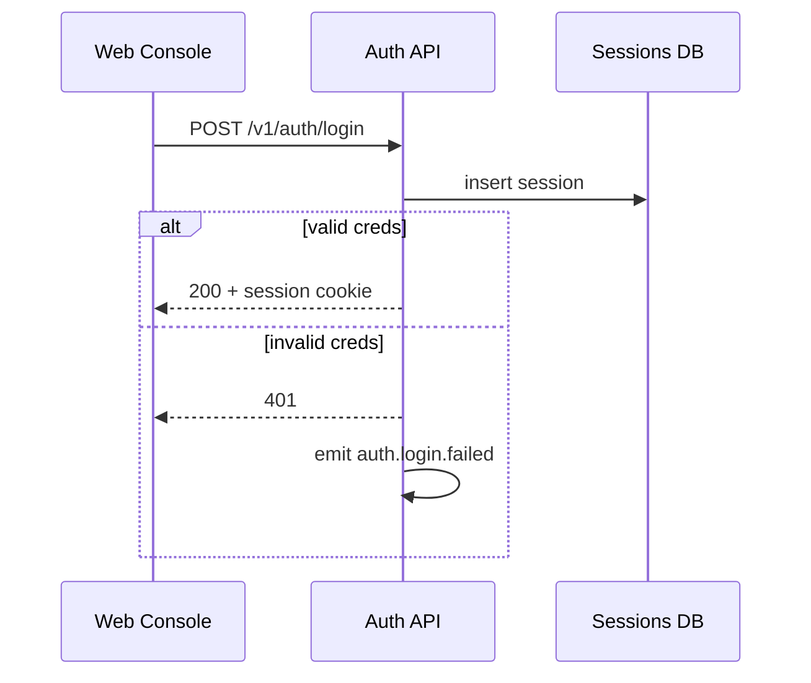
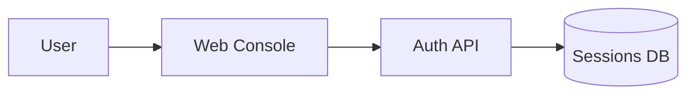
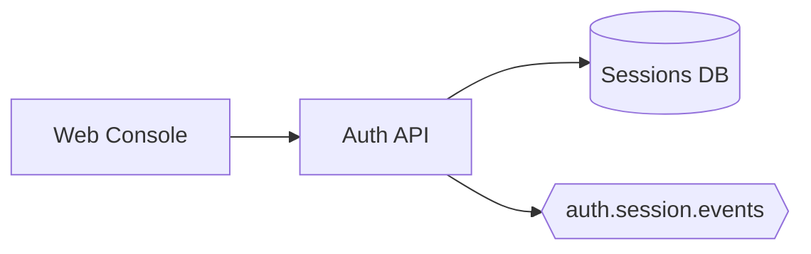

<!-- generated by /plan v2.26.0 on 2026-06-01 -->

# Bytebite Auth Revamp TRD

## §1 Document Overview {#document-overview}

This TRD covers the v1 auth revamp for Bytebite. Owners: Identity backend team.
Linked PRD: [`./prd.md`](./prd.md). Linked plan: [`./plan.md`](./plan.md).

## §2 Problem Statement {#problem-statement}

The legacy auth stack uses opaque session cookies with no refresh primitive and
no central revocation list. Care-tooling tickets carrying "log this user out
everywhere" cannot be honored without bouncing the entire fleet.

## §3 Objective & Scope {#objective-scope}

Ship a `/v1/auth` surface with login, refresh, and revoke semantics backed by a
sessions store that supports per-session revocation.

**In scope:** login, refresh, revoke, audit emit.
**Out of scope:** SSO/IdP federation; admin impersonation.

## §4 Product Journey {#product-journey}

1. User opens the web console and submits credentials.
2. Auth API validates the credentials and persists a session.
3. The web console refreshes the access token periodically.
4. A care agent can revoke any session from the support console.

## §5 Functional Requirements {#functional-requirements}

1. `POST /v1/auth/login` returns 200 on valid creds and 401 otherwise.
2. `POST /v1/auth/refresh` rotates the refresh token; reuse revokes the family.
3. `DELETE /v1/auth/sessions/:id` revokes the named session.

## §6 Non-Functional Requirements {#non-functional-requirements}

- p99 latency under 150 ms at 200 RPS per pod.
- Revocation propagation < 60 s across all Auth API pods.
- Audit log: at-least-once delivery to `auth.session.events`.

## §7 High-Level Design {#high-level-design}

`AuthController` (Spring MVC) owns request shaping; `SessionStore` owns persistence.
Detailed component shape lives in the LLD.

## §8 Alternatives Considered {#alternatives-considered}

1. **JWT-only with no server-side store.** Rejected — no revocation primitive.
2. **External IdP federation.** Deferred — out of scope for v1.
3. **Redis-backed sessions.** Rejected — durability gap; Postgres meets latency.

## §9 Cross-Cutting Concerns {#cross-cutting-concerns}

- AuthN: mTLS service-to-service via the Istio mesh.
- Observability: `auth.login.{count,failed,duration}` metrics + OTEL traces.
- Feature flag: `feature.auth.v1.enabled` per-tenant.

## §10 Milestones {#milestones}

<!-- BEGIN rendered:milestones — do not edit, regenerated by /plan from plan.json -->

### M1 — Login core  *(no deps)*

**Outcome:** Users can sign in via email + password

**Exit criteria:**
- POST /v1/auth/login returns 200 on valid creds
- Failed attempts emit auth.login.failed metric

**Architecture:**

### M2 — Refresh + revoke  *(deps M1)*

**Outcome:** Sessions can be refreshed and revoked

**Exit criteria:**
- POST /v1/auth/refresh rotates the refresh token
- DELETE /v1/auth/sessions/:id invalidates the session

**Architecture:**

<!-- END rendered:milestones -->

## §11 APIs Involved {#apis-involved}

- `POST /v1/auth/login` — described in §5.
- `POST /v1/auth/refresh` — rotates token pair; reuse revokes family.
- `DELETE /v1/auth/sessions/:id` — revokes a single session.
- Kafka topic `auth.session.events` (new).

## §12 Open Questions {#open-questions}

1. Should care-tooling carry a "revoke all for user" affordance, or only
   per-session? Pending UX input — target resolution at M2 exit.

## §13 References {#references}

- PRD: [`./prd.md`](./prd.md)
- Architecture authoring standard:
  `shield/skills/general/architecture-authoring.md`

## §14 Rollback Strategy {#rollback-strategy}

1. Flip `feature.auth.v1.enabled` off per-tenant.
2. Revert the Helm chart bump in `prod-eu-west-1`.
3. Sessions DB rows persist; legacy session-cookie path takes over.
