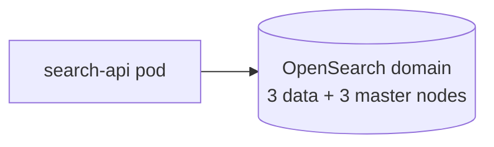

<!-- generated by /plan v2.20.0 on 2026-05-25 -->

# Search Service + Index Topology TRD

## §1 Document Overview {#document-overview}

This TRD covers a new internal search service for the Tesseract monorepo: a Go
backend that fronts an OpenSearch cluster. The change spans a backend
microservice (`search-api`) AND a Terraform topology (`search-index` module). It
is read by the Search platform team and SRE. Linked PRD: [`./prd.md`](./prd.md).
Author: Search team; first version 2026-05-25.

## §2 Problem Statement {#problem-statement}

Tesseract's product catalogue search runs through a shared Elasticsearch cluster
that backs three other services. The cluster is at 78% CPU steady-state and a
single noisy-neighbour incident has knocked all four products offline twice in
2026. We need an isolated index for the catalogue with a dedicated read/write
service in front of it.

## §3 Objective & Scope {#objective-scope}

Stand up a dedicated `search-api` service and a `search-index` OpenSearch cluster
that catalogue search migrates to.

**In scope**
- New `search-api` Go service deployed via Helm
- New `search-index` Terraform module provisioning OpenSearch
- Migration plan for catalogue index documents
- Dual-read fallback during cutover

**Out of scope**
- Migration of the other three services (separate TRDs)
- Search ranking changes (handled by an offline experimentation track)

## §4 Product Journey {#product-journey}

### [backend]
1. Catalogue client issues `GET /v1/search?q=...` to `search-api`.
2. `search-api` parses, validates, and forwards to the OpenSearch cluster.
3. Results are scored, paginated, and returned with timing headers.

### [infra]
1. Operator applies `search-index` via the `infra/search/` workspace.
2. Terraform provisions the OpenSearch domain, security groups, IAM roles for
   `search-api` to assume, and Route53 records.
3. State file lives in the standard `terraform-state-bytebite` bucket.

## §5 Functional Requirements {#functional-requirements}

### [backend]
1. `GET /v1/search` with `?q=` returns 200 with a JSON document
   `{results: [...], total, took_ms}`.
2. Missing `q` parameter returns 400 with `error_code: missing_query`.
3. The service exposes a `/healthz` endpoint suitable for Kubernetes liveness.

### [infra]
1. The `search-index` module provisions one OpenSearch domain with three data nodes
   across distinct AZs and dedicated master nodes.
2. The module exports `endpoint`, `domain_arn`, and `service_role_arn` for the
   `search-api` Helm release to consume.
3. The module restricts the domain to a private VPC endpoint; no public access.

## §6 Non-Functional Requirements {#non-functional-requirements}

### [backend]
- p99 query latency < 120 ms at 200 RPS on a `c6i.large` pod.
- 0-result fallback latency < 200 ms.
- Structured logging via Zap; OTEL trace context propagated to OpenSearch.

### [infra]
- Index storage: 200 GiB headroom over current catalogue size.
- Backup retention: 14 days; restoration tested quarterly.
- Blast radius: domain failure must not page Search team within business hours
  unless query error rate > 1% sustained for 10 minutes.

## §7 High-Level Design {#high-level-design}

### [backend]
The `search-api` Go service is a thin façade over OpenSearch's Go client. It owns
request shaping, response trimming, and structured logging. Persistence is the
OpenSearch domain itself; the service is stateless.

### [infra]
The `search-index` Terraform module composes `aws_opensearch_domain`,
`aws_iam_role` for the service-account assume-role, and VPC endpoint resources.
DNS records are managed in the `bytebite-dns` workspace via remote-state lookup.

## §8 Alternatives Considered {#alternatives-considered}

1. **Shared Elasticsearch cluster with QoS.** Rejected — Elasticsearch QoS at our
   version requires Enterprise licensing we don't carry, and the noisy-neighbour
   pattern would persist.
2. **Self-hosted OpenSearch on EC2.** Rejected — operational toil of cluster
   patching/upgrades isn't justified by cost savings at our scale.
3. **Use the shared cluster with a routing alias.** Rejected — does not fix
   noisy-neighbour; only papers over the namespace problem.

## §9 Cross-Cutting Concerns {#cross-cutting-concerns}

- **AuthN/AuthZ**: `search-api` assumes a service role via IRSA;
  OpenSearch fine-grained access policies pin the role.
- **Observability**: metrics exported in Prometheus format; trace context flows
  to OpenSearch via the X-Ray plugin.
- **Drift detection**: nightly `terraform plan` on the `search-index` workspace.
- **Secrets**: no static credentials; all IAM.

## §10 Milestones {#milestones}

| ID | Outcome | Exit criteria |
|---|---|---|
| M1 | Module + service compile | `helm template` clean; `terraform plan` clean |
| M2 | Applied to staging with synthetic load | p99 < 120 ms over 24h |
| M3 | Catalogue dual-read in prod | 100% query parity vs. shared cluster |
| M4 | Catalogue cutover complete | Shared-cluster catalogue index decommissioned |

## §11 APIs Involved {#apis-involved}

### [backend] HTTP API contracts
- `GET /v1/search?q={query}` — JSON response with `results[]`, `total`, `took_ms`.
- `GET /healthz` — 200 OK / 503.

### [infra] Module interfaces & cloud-API surface
- Terraform provider resources: `aws_opensearch_domain`, `aws_iam_role`,
  `aws_security_group`, `aws_vpc_endpoint`.
- Module exports: `endpoint`, `domain_arn`, `service_role_arn`.
- Remote state read: `bytebite-dns` for the public-zone ID.

## §12 Open Questions {#open-questions}

1. Should `search-api` cache zero-result queries? Pending product input — target
   resolution by M2 exit.
2. Backup encryption key per environment or shared? Pending Security review —
   target resolution by M1 exit.

## §13 References {#references}

- PRD: [`./prd.md`](./prd.md)
- AWS OpenSearch service documentation
- Noisy-neighbour incident timeline (internal postmortem)

## §14 Rollback Strategy {#rollback-strategy}

### [backend]
1. Flip the `search.dual_read.enabled` flag in the catalogue client off.
2. Catalogue traffic returns to the shared Elasticsearch cluster.
3. Roll back the `search-api` Helm release via `helm rollback`.

### [infra]
1. `terraform destroy -target=module.search_index` removes the OpenSearch domain
   after confirming no in-flight queries via the service's `/metrics` endpoint.
2. IAM role and VPC endpoint resources remain in place for forensic review.

**Rollback triggers (observable):**
- Query error rate > 1% over 10 minutes.
- `search-api` p99 > 250 ms over 30 minutes.
- OpenSearch cluster health red for > 5 minutes.
