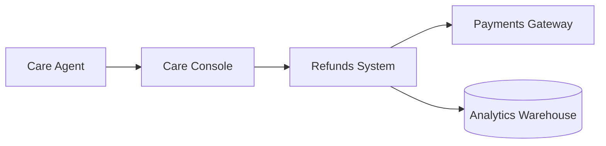
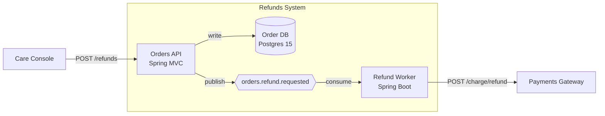
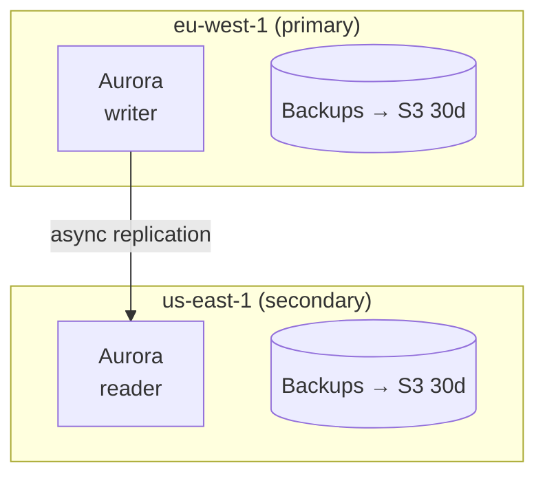
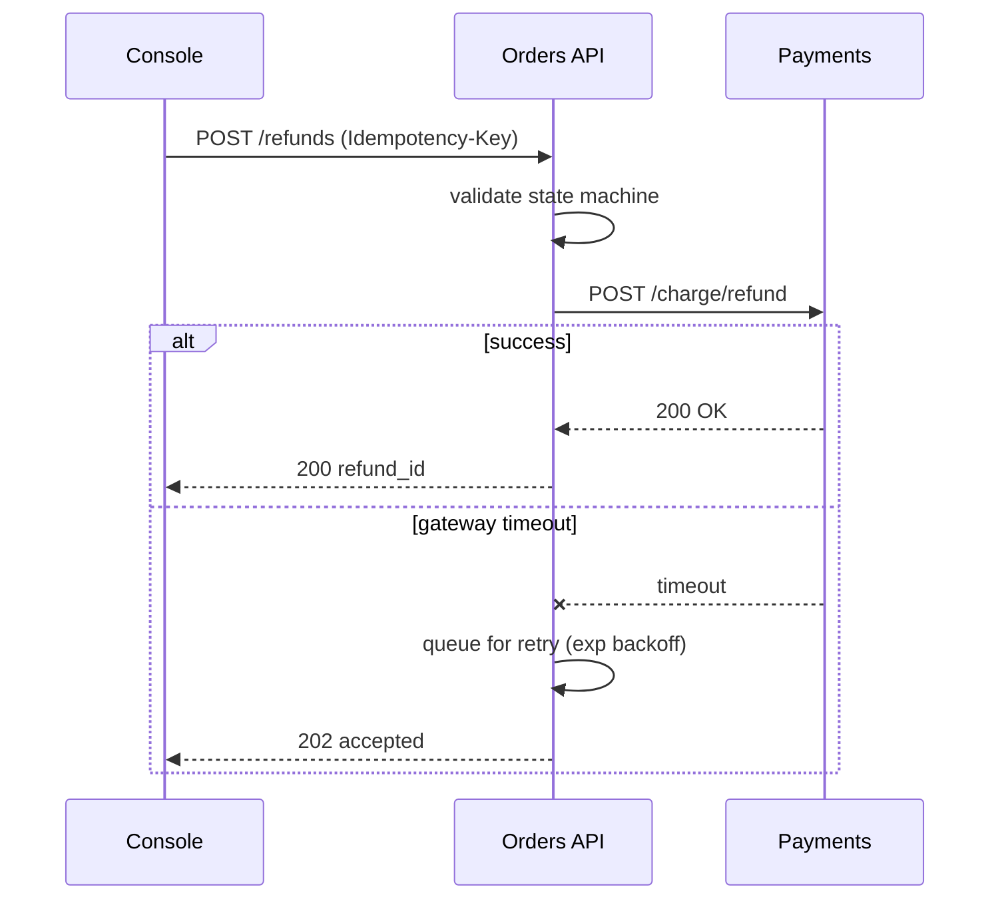

# Architecture authoring — the Shield standard

How to author high-level architecture in Shield. This standard governs PRD §5
(System Context) and TRD §7 (Container). Component- and code-level detail
belongs in the LLD, never in a high-level section.

Apply `shield:writing-style` to all author-written prose before writing.
Diagrams are Mermaid; never ASCII box-art.

## 1. C4 → Shield mapping

| C4 level | Shield home | What lives here |
|---|---|---|
| **L1 — System Context** | PRD §5 | The system as one box, its users/personas, the external systems it integrates with, and the 1–2 primary product flows. Product-readable. |
| **L2 — Container** | TRD §7 | The deployable/runtime units inside the system boundary (services, jobs, datastores, queues), their responsibilities + tech, the interfaces/contracts between them, data flow, persistence boundary, trust/network/residency boundaries, and the core lifecycle including failure and recovery. |
| **L3 — Component** | LLD | Modules/classes inside a single container — `service.Auth.signIn(...)`, repository interfaces, internal state machines. |
| **L4 — Code** | LLD | Field shapes, SQL, function signatures, package layout. |

Component- or code-level detail (class names, function signatures, field lists,
SQL, file paths) inside PRD §5 or TRD §7 is a defect. Route it to the LLD.

## 2. Required content

### PRD §5 — System Context

| Required | What good looks like |
|---|---|
| System boundary | A single box labelled with the system name. |
| Users / personas | Each named role that triggers a flow. |
| External systems | Each upstream/downstream you depend on (auth provider, payment gateway, analytics warehouse). |
| Primary flows | 1–2 end-to-end product journeys, one sentence each. |

### TRD §7 — Container

| Required | What good looks like |
|---|---|
| Container inventory | Each runtime unit lists its responsibility *and* the tech that runs it. |
| Interfaces / contracts | Each edge between containers names its protocol (HTTP, gRPC, Kafka topic, S3 prefix) and sync-vs-async. |
| Data flow | The path a request/event takes through containers, including the persistence write. |
| Persistence boundary | Which container owns each store; no shared write paths. |
| Trust / network / residency boundaries | Zones, accounts, VPCs, regions — when more than one exists. |
| Core lifecycle + failure path | Happy path and at least one named failure (timeout, retry, fallback, replay). |

If a required item genuinely doesn't apply, write `n/a — <reason>`. If it
*might* apply but you don't know yet, send it to Open Questions (§3.6) — never
fabricate.

## 3. Diagram conventions (Mermaid)

Diagrams are mandatory at both levels. Validators enforce Mermaid:
`validate_trd.py` fails `hld_missing_diagram` / `hld_ascii_art`;
`validate_plan.py` fails `milestone_no_diagram` / `milestone_ascii_diagram`.

| Level | Diagram type | Direction | Notes |
|---|---|---|---|
| Context | `flowchart` (system centered) | `LR` | The system box in the middle; users left, externals right. |
| Container | `flowchart` with one `subgraph` for the system boundary | `LR` | Datastore shapes (`[(name)]`), labeled edges, sync-vs-async on the edge label. |
| Boundary | `flowchart` with one `subgraph` per zone | `TB` | Region/account/VPC partitioning. |
| Core flow | `sequenceDiagram` | n/a | Include at least one failure/retry path. |

Rules:

- **Node id + human label**: `API[Orders API]`, never bare `OrdersAPI`.
- **Labeled edges**: `A -- POST /refunds --> B`. Bare arrows for trivial edges only.
- **Datastore shape**: `[(Order DB)]` for stores; `{{Kafka}}` or similar for queues/topics.
- **Ceiling**: ≈15 nodes per diagram. Split rather than crowd.
- **No ASCII box-art**: the characters `┌ ┐ └ ┘ ├ ┤ ┬ ┴ ┼ │ ─` and the `+--` run are gates.
- Mermaid source is **not** counted as a code block by the >20-line plan-review rule.

## 4. Canonical examples

### Context (PRD §5)

### Container (TRD §7)

### Boundary

### Sequence (core flow + failure)

## 5. Elicitation Q&A (required walk)

Before drafting PRD §5 or TRD §7, walk the eight C4 questions below. Each is
answerable with `n/a — <reason>` when it genuinely does not apply.

**Hybrid skip rule:** first scan the research transcript and any earlier PRD
sections. Auto-fill the answers already present and ask the user to confirm.
Ask only the gaps. Never silently invent structure.

**Unknowns go to Open Questions** — TRD §12 / PRD §19. Do not fabricate a
plausible answer.

1. **Actors / externals** — Who triggers the system, and which external systems does it depend on?
2. **Containers + new-vs-existing + tech** — What runtime units exist? Which are new? What runs each one (language, framework, managed service)?
3. **Interfaces (sync vs async)** — How do containers talk? HTTP, gRPC, queue, file drop? Sync request/response or async fire-and-forget?
4. **State / persistence boundary** — Where does state live? Who owns each store? Any shared write paths?
5. **Trust / network / region boundaries** — Multiple accounts, VPCs, or regions? Where do trust boundaries fall?
6. **Core flow + failure** — Walk one primary flow end-to-end. What's the happiest path; what happens on the named failure (timeout, dependency down)?
7. **Architecture-shaping NFRs** — Which NFRs change the topology — p99 latency, RTO/RPO, data residency, throughput peaks, blast-radius bounds?
8. **Major build-vs-buy decisions** — Anything significant we're buying (auth, search, payments, queue) vs. building?

## 6. Milestone diagrams

Every milestone carries a `diagram` (Mermaid string in `plan.json`
`milestones[i].diagram`) of the architecture slice it delivers. This is the
per-milestone delta or end-state of the container picture from §7.

- Authored in `/plan`'s milestone walk, same C4 + Mermaid conventions as §7.
- `validate_plan.py` enforces presence (`milestone_no_diagram`) and Mermaid-only (`milestone_ascii_diagram`) at sidecar 1.6+; older sidecars are grandfathered.
- `render_trd_section.py` renders each diagram as an **Architecture:** block under its milestone heading in §10.

## 7. Quality bar (reviewer checklist)

A high-level design is ready when:

- **Right C4 level.** PRD §5 is Context; TRD §7 is Container. No L3/L4 leak (class, function, field, SQL).
- **Every container** names a responsibility *and* an interface.
- **Required diagrams present.** Container `flowchart` + core `sequenceDiagram` in §7; boundary diagram when zones exist; one `diagram` per milestone.
- **No ASCII box-art** anywhere. Mermaid only.
- **Genuine unknowns** sit in §12 Open Questions (TRD) / §19 (PRD), not fabricated as confident structure.
