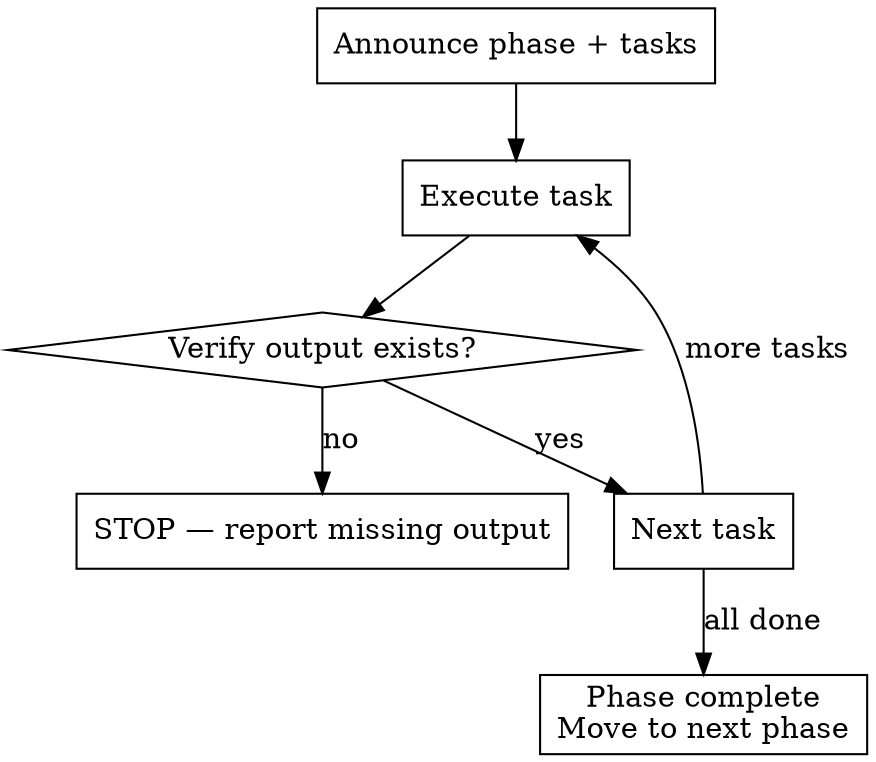

# Execute Steps

Step-by-step pipeline executor. Breaks each phase into concrete tasks, executes them, and verifies outputs before proceeding.

## When to Use

- Running the full Shield SDLC pipeline or a subset of phases
- User says "run the pipeline", "start with research and go through implementation"
- Any time multiple Shield phases need to run in sequence

## When NOT to Use

- Running a single phase — invoke that skill directly
- Implementation only — use `shield:implement-feature`

## Step 1: Initialize Run Directory

**This step is mandatory. Do it before anything else.**

```bash
RUN_DIR="shield/$(date +%Y%m%d-%H%M%S)"
mkdir -p "$RUN_DIR/docs"
ln -sfn "$(basename "$RUN_DIR")" "shield/latest"
```

**Verify:** `shield/latest/docs/` exists.

## Step 2: Break Down Phases into Tasks

Read `.tesseract.json` for project context, then build the task list. Each task has:
- **Action**: what to do
- **Output**: exact file path expected
- **Verify**: how to confirm it worked

### Research Tasks

| # | Action | Output | Verify |
|---|--------|--------|--------|
| 1 | Launch 3 parallel research agents (official docs, industry voices, community) | Agent results | Agents return quotes + URLs |
| 2 | Synthesize into document with: decision, alternatives, 4-8 sourced quotes, migration path | `shield/latest/docs/research.md` | File exists, contains `## Decision` and `## References` |

### Planning Tasks

| # | Action | Output | Verify |
|---|--------|--------|--------|
| 1 | Read `shield/latest/docs/research.md` for context | — | File was read |
| 2 | Generate plan.json with epics, stories, tasks, acceptance criteria | `shield/latest/plan.json` | Valid JSON, has epics with stories, each story has AC |
| 3 | Generate architecture doc: problem, context, solution, decisions, rollback | `shield/latest/docs/architecture.html` | File exists, contains `<html>` |
| 4 | Generate execution plan rendered from plan.json | `shield/latest/docs/plan.html` | File exists, contains `<meta name="sidecar"` |

### Plan Review Tasks

| # | Action | Output | Verify |
|---|--------|--------|--------|
| 1 | Read `shield/latest/plan.json` and docs | — | Files were read |
| 2 | Select reviewer agents (min 3) based on plan content | — | Agents announced to user |
| 3 | Dispatch agents in parallel, collect grades | Agent results | Each agent returned a grade |
| 4 | Write scored analysis | `shield/latest/docs/analysis.md` | File exists, contains grades A-F |

### Implementation Tasks

| # | Action | Output | Verify |
|---|--------|--------|--------|
| 1 | Read `shield/latest/plan.json`, extract stories | — | Stories loaded |
| 2 | For each story: confirm AC with user | — | User confirmed |
| 3 | TDD: write failing test → implement → verify | Code + tests | Tests pass |
| 4 | Commit each step | Git commits | `git log` shows new commits |
| 5 | Update plan.json story status to "in-review" | `shield/latest/plan.json` | Status field updated |

### Code Review Tasks

| # | Action | Output | Verify |
|---|--------|--------|--------|
| 1 | Read plan.json for AC, check git diff for changes | — | Context loaded |
| 2 | Dispatch reviewer agents | Agent results | Findings returned |
| 3 | Verify acceptance criteria against implementation | AC report | Each AC marked met/not met |
| 4 | Write review summary | `shield/latest/docs/review.md` | File exists with severity ratings |

## Step 3: Execute Tasks

For each phase:

1. **Announce** the phase and its tasks to the user
2. **Execute** each task in order
3. **Verify** each output exists at the expected path
4. **Stop if verification fails** — report what's missing, don't continue



## Step 4: Write All Outputs to shield/latest/

**Every artifact goes to `shield/latest/` or `shield/latest/docs/`. No exceptions.**

| File | Location |
|------|----------|
| `plan.json` | `shield/latest/plan.json` |
| `research.md` | `shield/latest/docs/research.md` |
| `architecture.html` | `shield/latest/docs/architecture.html` |
| `plan.html` | `shield/latest/docs/plan.html` |
| `analysis.md` | `shield/latest/docs/analysis.md` |
| `review.md` | `shield/latest/docs/review.md` |
| Phase summaries | `shield/latest/docs/<phase>-summary.md` |

## Common Mistakes

| Mistake | Fix |
|---------|-----|
| Writing artifacts outside `shield/latest/` | Every file goes to `shield/latest/` or `shield/latest/docs/` |
| Skipping verification between phases | Always check output files exist before moving on |
| Continuing after a failed verification | STOP and report — don't silently skip |
| Not creating `shield/` directory first | Step 1 is mandatory — always run it before anything else |
| Producing markdown instead of HTML for plan docs | `architecture.html` and `plan.html` must be HTML |
| Skipping phases without telling the user | Announce every phase, even if skipping |
