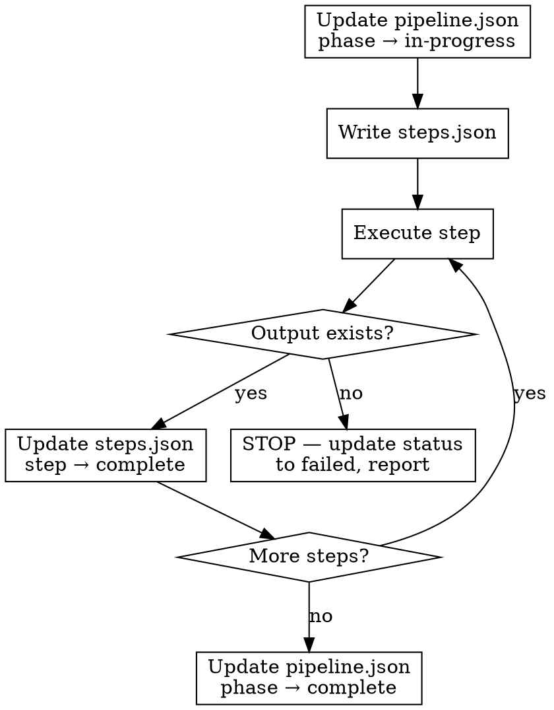

# Execute Steps

Step-by-step pipeline executor. Breaks each phase into concrete tasks, executes them, and verifies outputs before proceeding. Tracks progress in `~/.tesseract/shield/<project>/<date>/` for resume support.

## When to Use

- Running the full Shield SDLC pipeline or a subset of phases
- User says "run the pipeline", "start with research and go through implementation"
- Any time multiple Shield phases need to run in sequence

## When NOT to Use

- Running a single phase — invoke that skill directly
- Implementation only — use `shield:implement-feature`

## Step 1: Initialize

**Do both before anything else.**

### 1a. Create run directory for artifacts

```bash
RUN_DIR="shield/$(date +%Y%m%d-%H%M%S)"
mkdir -p "$RUN_DIR/docs"
ln -sfn "$(basename "$RUN_DIR")" "shield/latest"
```

### 1b. Create execution state directory

Read `.tesseract.json` for project name, then:

```bash
PROJECT=$(python3 -c "import json; print(json.load(open('.tesseract.json'))['project'])")
STATE_DIR="$HOME/.tesseract/shield/$PROJECT/$(date +%Y%m%d-%H%M%S)"
mkdir -p "$STATE_DIR"
```

Write `pipeline.json` with all phases set to `"pending"`:

```json
{
  "project": "<project name>",
  "started_at": "<ISO timestamp>",
  "artifact_dir": "shield/latest",
  "phases": [
    {"name": "research", "status": "pending", "outputs": []},
    {"name": "planning", "status": "pending", "outputs": []},
    {"name": "plan-review", "status": "pending", "outputs": []},
    {"name": "implementation", "status": "pending", "outputs": []},
    {"name": "review", "status": "pending", "outputs": []}
  ]
}
```

**Verify:** `shield/latest/docs/` exists and `pipeline.json` written.

### 1c. Check for resume

If `~/.tesseract/shield/<project>/` already has a run directory, check its `pipeline.json`. If phases are incomplete, ask the user: **resume or start fresh?**

## Step 2: Break Down Phase into Steps

Before executing each phase, write `steps.json` to the state directory:

```json
{
  "phase": "planning",
  "status": "in-progress",
  "steps": [
    {"id": 1, "action": "Read shield/latest/docs/research.md", "status": "pending"},
    {"id": 2, "action": "Generate plan.json", "output": "shield/latest/plan.json", "status": "pending"},
    {"id": 3, "action": "Generate architecture.html", "output": "shield/latest/docs/architecture.html", "status": "pending"},
    {"id": 4, "action": "Generate plan.html", "output": "shield/latest/docs/plan.html", "status": "pending"}
  ]
}
```

### Phase Task Reference

**Research** — invoke `shield:research`

| # | Action | Output | Verify |
|---|--------|--------|--------|
| 1 | Launch 3 parallel research agents (official docs, industry, community) | Agent results | Agents return quotes + URLs |
| 2 | Synthesize into document with decision, alternatives, 4-8 sourced quotes | `shield/latest/docs/research.md` | File exists, contains `## Decision` and `## References` |

**Planning** — invoke `shield:plan-docs`

| # | Action | Output | Verify |
|---|--------|--------|--------|
| 1 | Read `shield/latest/docs/research.md` for context | — | File was read |
| 2 | Generate plan.json with epics, stories, tasks, AC | `shield/latest/plan.json` | Valid JSON, epics with stories, each story has AC |
| 3 | Generate architecture doc (HTML) | `shield/latest/docs/architecture.html` | File exists, contains `<html>` |
| 4 | Generate execution plan (HTML) from plan.json | `shield/latest/docs/plan.html` | File exists, contains `<meta name="sidecar"` |

**Plan Review** — invoke `shield:plan-review`

| # | Action | Output | Verify |
|---|--------|--------|--------|
| 1 | Read `shield/latest/plan.json` and docs | — | Files were read |
| 2 | Select and dispatch reviewer agents (min 3) | Agent results | Each agent returned a grade |
| 3 | Write scored analysis | `shield/latest/docs/analysis.md` | File exists, contains grades A-F |

**Implementation** — invoke `shield:implement-feature`

| # | Action | Output | Verify |
|---|--------|--------|--------|
| 1 | Read `shield/latest/plan.json`, extract stories | — | Stories loaded |
| 2 | TDD: write failing test, implement, verify | Code + tests | Tests pass |
| 3 | Commit each step | Git commits | `git log` shows new commits |
| 4 | Update plan.json story status to "in-review" | `shield/latest/plan.json` | Status field updated |

**Code Review** — invoke `shield:review`

| # | Action | Output | Verify |
|---|--------|--------|--------|
| 1 | Read plan.json for AC, check git diff | — | Context loaded |
| 2 | Dispatch reviewer agents | Agent results | Findings returned |
| 3 | Verify AC against implementation | AC report | Each AC marked met/not met |
| 4 | Write review summary | `shield/latest/docs/review.md` | File exists with severity ratings |

## Step 3: Execute and Track

For each phase:

1. **Update** `pipeline.json` — set phase status to `"in-progress"`
2. **Write** `steps.json` with the phase's tasks
3. **Execute** each step, updating `steps.json` status (`"pending"` → `"complete"`)
4. **Verify** each output exists at the expected path
5. **Stop if verification fails** — update status to `"failed"`, report what's missing
6. **On phase complete** — update `pipeline.json` with status `"complete"` and output paths



## Red Flags — STOP

- "I'll verify at the end" — verify EACH step, not just the phase
- "The file is probably there" — check with `ls`, don't assume
- "Markdown is fine instead of HTML" — `architecture.html` and `plan.html` must be HTML
- "I'll create shield/ later" — Step 1 is FIRST, no exceptions
- "I don't need to update pipeline.json" — always update state for resume support

## Common Mistakes

| Mistake | Fix |
|---------|-----|
| Writing artifacts outside `shield/latest/` | Every file goes to `shield/latest/` or `shield/latest/docs/` |
| Not updating pipeline.json/steps.json | Update status after every step for resume support |
| Continuing after a failed verification | STOP and report — don't silently skip |
| Not creating directories first | Step 1 is mandatory — run before anything else |
| Producing markdown instead of HTML for plan docs | `architecture.html` and `plan.html` must be HTML |
| Skipping phases without telling the user | Announce every phase, even if skipping |
| Not checking for resume on init | Always check for existing incomplete runs |
