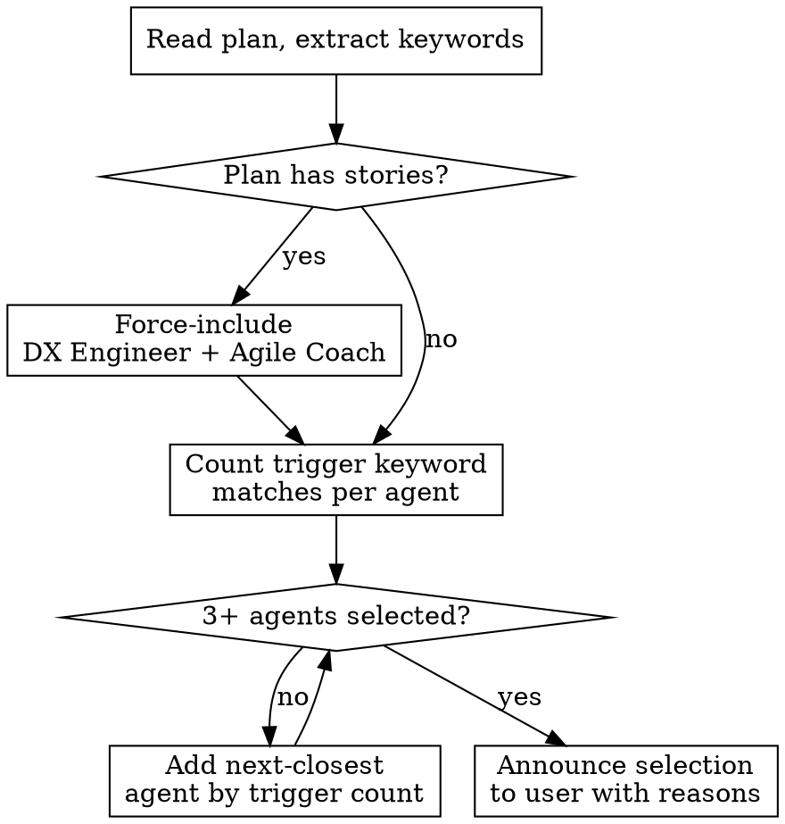

# Plan Review

Dispatch parallel expert reviewer agents against a plan document to produce a scored analysis with prioritized recommendations and an enhanced plan.

## When to Use

- User asks to review a plan, architecture doc, or execution plan
- After plan-docs skill generates a plan
- User mentions "plan review", "review my plan", "review this document"
- User invokes `/plan-review`

## When NOT to Use

- **Code review** — use `/review` instead (dispatches agents in infra-code/app-code mode)
- **Single-page design docs** without stories or infrastructure — overkill
- **Non-plan documents** (READMEs, changelogs, runbooks) — wrong tool

## Plan Input

The skill reads plan data from (in priority order):
1. **Plan sidecar JSON** (`plan-sidecar.json`) — if present, use stories and AC from the sidecar
2. **HTML plan document** — if only HTML exists, parse it for story content
3. **Markdown plan document** — path provided by user or auto-detected
4. **User-provided path** — explicit path argument

## Persona Catalog

All agents are dispatched in **plan review mode** — lightweight checks focused on plan quality.

| Agent | Weight | Focus |
|-------|--------|-------|
| `shield:architecture-reviewer` | 1.0 | Service topology, scalability, HA, network design |
| `shield:security-reviewer` | 1.0 | Security posture, threat modeling, access control, testability |
| `shield:dx-engineer-reviewer` | 1.0 | Plan clarity, actionability, software architecture |
| `shield:cost-reviewer` | 0.7 | Cost awareness, right-sizing, environment tiering |
| `shield:agile-coach-reviewer` | 0.7 | Sprint-readiness, story quality, dependencies |
| `shield:operations-reviewer` | 0.7 | Monitoring, failure modes, backup, on-call readiness |

## Dynamic Persona Selection

**Selection rules:**
- **Always include** DX Engineer + Agile Coach when plan contains stories
- **Include** any agent with 2+ trigger keyword matches
- **Minimum 3** agents — backfill by trigger count if needed
- Announce which reviewers were selected and why before dispatching

## Dispatch

Read each selected agent's markdown file from `agents/` and `scoring.md`, then launch all agents in parallel using the Agent tool. See `templates.md` for the dispatch prompt structure.

Use `subagent_type` matching the agent name (e.g., `shield:architecture-reviewer`) when available, otherwise `general-purpose`.

## Collection & Scoring

After all agents return:

1. **Parse grades** — extract grade per evaluation point from each agent's output
2. **Per-persona grade** — average numeric grades (A=4, B=3, C=2, D=1, F=0), round using ranges in `scoring.md`
3. **Composite score** — weighted average using persona weights, convert to verdict per `scoring.md` thresholds
4. **Classify recommendations** — P0/P1/P2 per severity rules in `scoring.md`

## Output

Write to `review/<YYYY-MM-DD>-<topic-slug>/`:
- `analysis.md` — scored evaluation with consolidated recommendations
- `plan.md` — enhanced version of original plan with feedback applied

See `templates.md` for output formats and enhanced plan rules.

## User Review Gate

**Do NOT proceed until the user explicitly confirms.**

After writing output files, present the user with three options:
1. **Apply as-is** — replace original plan with enhanced `plan.md`
2. **Apply with edits** — user modifies `plan.md` first, re-read before applying
3. **Skip** — keep original plan unchanged

The user may also edit `analysis.md`, ask for changes to specific recommendations, or reject recommendations. Wait for explicit confirmation before overwriting anything.

## Common Mistakes

| Mistake | Fix |
|---------|-----|
| Dispatching all 5 agents for a simple app plan with no infra | Follow trigger keyword matching — skip Cloud Architect and Cost/FinOps if no infra keywords |
| Grading infra points F on a non-infrastructure plan | Only activated personas grade — don't penalize for out-of-scope concerns |
| Applying enhanced plan without user review | Always wait for Step 5 confirmation — never auto-apply |
| Repeating scoring logic instead of referencing scoring.md | All grade math lives in `scoring.md` — reference it, don't inline it |
| Generating plan.md in different format than original | HTML in → HTML out, markdown in → markdown out |
| Softening grades because the user is under time pressure | Grade what the plan SAYS — missing info is F regardless of deadline |
| Giving partial credit for implied or assumed information | Grade only what is explicitly documented — "they probably meant X" is not in the plan |
