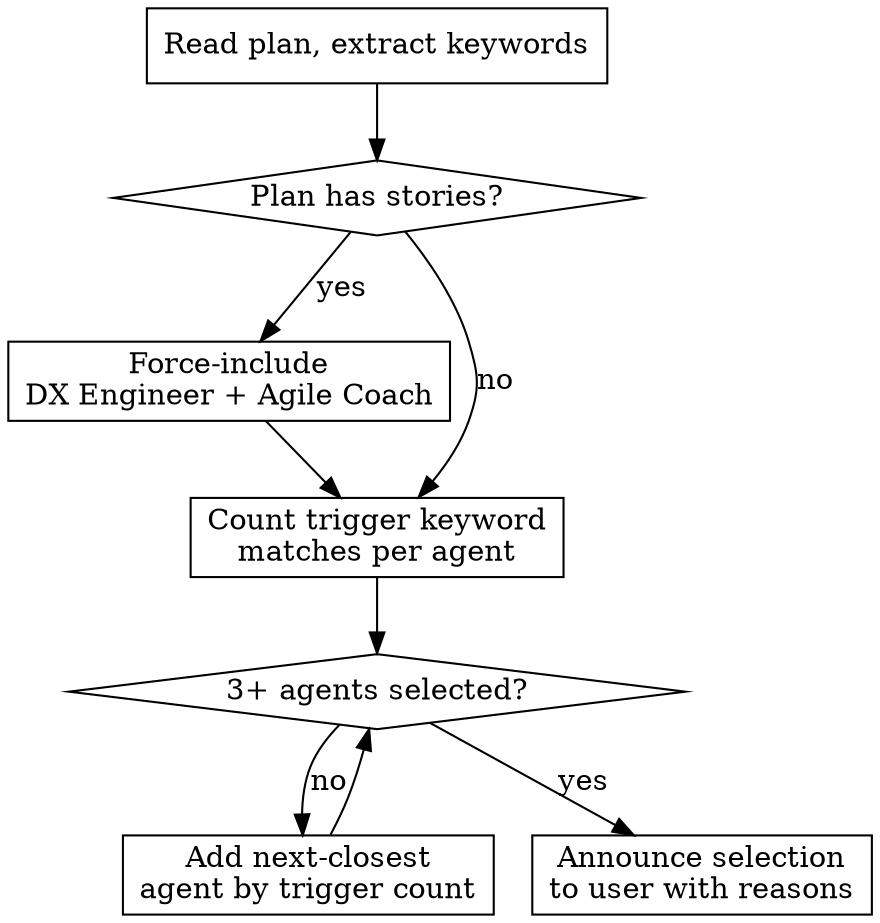

# Plan Review Persona Catalog

All agents are dispatched in **plan review mode** — lightweight checks focused on plan quality.

| Agent | Weight | Focus |
|-------|--------|-------|
| `shield:architecture-reviewer` | 1.0 | Service topology, scalability, HA, network design |
| `shield:security-reviewer` | 1.0 | Security posture, threat modeling, access control, testability |
| `shield:dx-engineer-reviewer` | 1.0 | Plan clarity, actionability, software architecture |
| `shield:cost-reviewer` | 0.7 | Cost awareness, right-sizing, environment tiering |
| `shield:agile-coach-reviewer` | 0.7 | Sprint-readiness, story quality, dependencies |
| `shield:operations-reviewer` | 0.7 | Monitoring, failure modes, backup, on-call readiness |
| `shield:product-manager-reviewer` | 0.7 | User impact, scope discipline, prioritization, business value |

## Dynamic Persona Selection

## Selection Rules

- **Always include** DX Engineer + Agile Coach when plan contains stories
- **Include** any agent with 2+ trigger keyword matches
- **Minimum 3** agents — backfill by trigger count if needed
- **Include** product-manager-reviewer when plan contains user-facing features, product decisions, or scope trade-offs (matched via trigger keywords)
- Announce which reviewers were selected and why before dispatching
