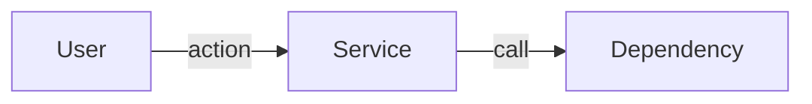
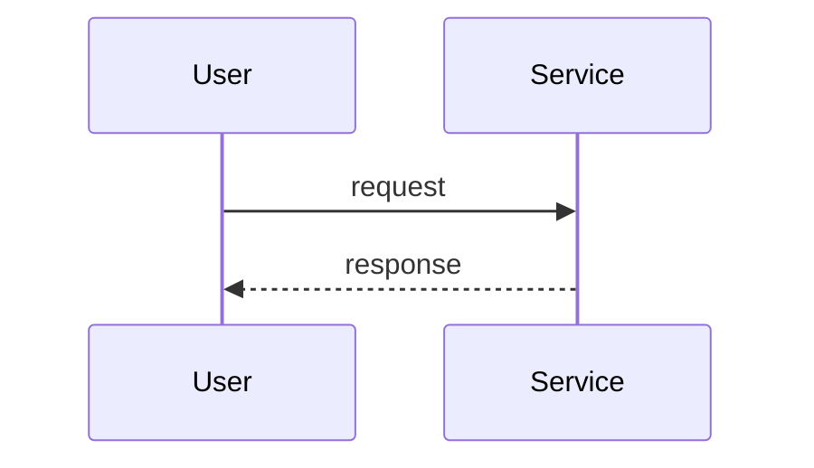

# PRD Templates

The 20-section problem-first scaffold (standard) and 10-section lean variant. Plus the HTML render template that mirrors prd.md.

## Standard scaffold (20 sections)

````markdown
# <Feature name>

## 1. Header
| Field | Value |
|---|---|
| Owner | @<handle> |
| Status | Draft |
| PRD type | Standard |
| Date created | YYYY-MM-DD |
| Last updated | YYYY-MM-DD |
| Linked design spec | <path or null> |
| Linked research | <path or null> |
| Decision-maker | @<handle> |
| Sign-off contacts | Legal: @<handle>, Security: @<handle>, Support: @<handle> |
| Linked plans | _(auto-populated by /plan)_ |

## 2. Terminologies
| Term | Definition |
|---|---|
| <term> | <one-line definition; link to deeper doc if needed> |

## 3. Problem & context
What's broken, who hurts, baseline data, why now (cost-of-inaction).

## 4. Target users / personas
| ID | Persona | Goals | Frictions today |
|---|---|---|---|
| P1 | <name> | <user-language goals> | <current pain> |

## 5. Architecture & flows

Author per the shared standard — see `shield/skills/general/architecture-authoring.md`.
**PRD §5 is the C4 *System Context* level:** the system as one box, its users,
the external systems it integrates with, and the 1–2 primary flows. Keep it
product-readable; container/component internals belong in TRD §7 / the LLD.
Diagrams are Mermaid (conventions in the standard).

### System overview


### Key flows


## 6. Goals & non-goals
### Goals
1. <goal 1>
2. <goal 2>
### Non-goals
- <explicitly NOT trying to do>

## 7. Success metrics
| Metric | Type | Target | Counter |
|---|---|---|---|
| <metric> | Leading / Lagging | <numeric threshold> | <counter-metric> |
**Dashboard plan:** <where will this be tracked>

## 8. User stories & scenarios

### Story <ID>: <name>
- **Type:** new | enhancement | existing
- **Existing behavior:** <path / link / one-line description, or "N/A">
  *(required when Type is enhancement or existing; "N/A" for new)*
- **Persona:** <P-id>
- **Goal:** <user-language goal>
- **Happy path:** <numbered steps>
- **Error / timeout / abandon paths:** <branches>
- **Edge cases:** <enumeration>
- **State transitions:** <if applicable>
- **Cross-functional handoffs:** <who/when downstream teams pulled in>
- **Acceptance criteria (Given/When/Then):**
  - Given <pre>, When <action>, Then <outcome>

#### Type semantics
- **new** — behavior does not exist in any form today (net-new feature)
- **enhancement** — modifies existing behavior in a user-visible way
- **existing** — already exists, documented for context (regression-risk surface in rewrites)

## 9. Functional requirements
System-level + cross-cutting rules NOT captured in §8 story AC. Default syntax: EARS or "shall" statements. Avoid Given/When/Then in §9 — that syntax belongs in §8 AC and encourages story-mirroring. Each FR must say something §8 doesn't.

## 10. Non-functional requirements
| NFR | Requirement |
|---|---|
| Performance | <budget> |
| Security | <auth model + threat model> |
| Accessibility | <WCAG level> |
| Privacy | <data classification + retention> |
| Telemetry / event taxonomy | <named events> |
| i18n / l10n | <RTL, encoding, formats, translation pipeline — or N/A> |

## 11. RBAC & permissions matrix
| Role | Can do |
|---|---|
| <role> | <permissions> |

## 12. Dependencies
Internal services, third parties, integration contracts.

## 13. Risks & mitigations
| # | Risk | Likelihood | Impact | Mitigation | Owner |
|---|---|---|---|---|---|
| R1 | <risk> | L/M/H | L/M/H | <mitigation> | @<handle> |

## 14. Assumptions
| # | Assumption | Status | If wrong |
|---|---|---|---|
| A1 | <assumption> | Validated / Unvalidated | <consequence> |

## 15. Rollout plan

### Milestones
| ID | Name | Outcome | Exit criteria | Depends on |
|---|---|---|---|---|
| M1 | <short user-language name> | <what ships, in user language> | <testable list — what facts must be true to declare done> | — |
| M2 | … | … | … | M1 |

### Rollout mechanics
- Flag plan: <feature flag>
- Canary: <staged rollout slices>
- Kill-switch: <criteria>
- Abort thresholds: <specific metric values>
- Data migration: <plan if touching existing data>
- Backward compatibility: <commitments>

## 16. Cost & resource impact
| Component | Cost dimension | Estimate |
|---|---|---|
| Build cost | Engineering time | <estimate> |
| Run cost | LLM / compute / storage / bandwidth | <$X/month at projected scale> |
| Counter-metric | <should not exceed $Y/user/month> | |

## 17. GTM & customer-comms
- Pricing / packaging implications: <description>
- In-app messaging plan: <description>
- Release notes: <description>
- CS / sales enablement: <description>
- Beta / early-access plan: <description or N/A>

## 18. Support / CX impact
- Day-1 ticket owner: @<handle>
- Runbook: <link or description>
- Escalation path: <description>
- Sales enablement: <description>
- Training plan: <description>

## 19. Open questions
| # | Question | Owner | Target resolution |
|---|---|---|---|

## 20. Out of scope / Non-goals
- <named item with one-line rationale>
````

## Lean variant (10 sections)

````markdown
# <Feature name>

## 1. Header
(Same Header table as standard)

## 2. Terminologies
| Term | Definition |
|---|---|
| <term> | <one-line definition; link to deeper doc if needed> |

## 3. Problem & context
What's broken, who hurts, baseline data, why now.

## 4. Target users / personas
| ID | Persona | Goals | Frictions today |

## 5. Architecture & flows

Optional. Same content guidance as standard scaffold's §5.


## 6. Goals & non-goals
### Goals
### Non-goals

## 7. Success metrics
| Metric | Type | Target | Counter |

## 8. Milestones
| ID | Name | Outcome | Exit criteria | Depends on |

## 9. Open questions

## 10. Out of scope / Non-goals

---

> **This is a lean PRD.** It intentionally omits the following standard sections:
> - Section 8 — User stories & scenarios
> - Section 9 — Functional requirements
> - Section 10 — Non-functional requirements
> - Section 11 — RBAC & permissions matrix
> - Section 12 — Dependencies
> - Section 13 — Risks & mitigations
> - Section 14 — Assumptions
> - Section 15 — Rollout plan (full — lean has its own §8 Milestones)
> - Section 16 — Cost & resource impact
> - Section 17 — GTM & customer-comms
> - Section 18 — Support / CX impact
>
> If scope grows or stakeholders need more detail, run `/prd` again — Shield
> will offer to add specific sections or upgrade to `standard`.
````

## Story template (used inside Section 8 of standard scaffold)

```markdown
### Story <ID>: <name>
- **Type:** new | enhancement | existing
- **Existing behavior:** <path / link / one-line description, or "N/A">
  *(required when Type is enhancement or existing; "N/A" for new)*
- **Persona:** <P-id>
- **Goal:** <user-language goal>
- **Happy path:** <numbered steps>
- **Error / timeout / abandon paths:** <branches>
- **Edge cases:** <enumeration>
- **State transitions:** <if applicable>
- **Cross-functional handoffs:** <who/when downstream teams pulled in>
- **Acceptance criteria (Given/When/Then):**
  - Given <pre>, When <action>, Then <outcome>
```

## HTML render template

> The HTML shell is now shared — see `shield/templates/shell.html` and `shield/templates/shield.css`. Skills render via `render-markdown.sh --shell $CLAUDE_PLUGIN_ROOT/templates/shell.html`. Do not inline HTML/CSS here.

`prd.html` is produced by feeding `prd.md` through Shield's CommonMark renderer (`shield/scripts/render-markdown.sh`) into the shared shell. **Do not hand-render the body** — hand-rendering has historically broken nested numbered lists inside bullets, lists that immediately follow an emphasised paragraph, and loose/tight list spacing.

### Render

From the feature directory, render `prd.md` into the shared shell, then refresh the manifest-derived page assets:

```bash
cd "{output_dir}/{feature}"
mkdir -p outputs
"$CLAUDE_PLUGIN_ROOT/scripts/render-markdown.sh" \
  --md    prd.md \
  --shell "$CLAUDE_PLUGIN_ROOT/templates/shell.html" \
  --out   outputs/prd.html \
  --assets-root "{output_dir}" \
  --title "PRD — {feature}"

uv run "$CLAUDE_PLUGIN_ROOT/scripts/write_shield_assets.py" --output-dir "{output_dir}"
```

**Why this helper and not pandoc / inline conversion / python-markdown:** the helper uses `markdown-it-py`, which implements the CommonMark spec strictly. Three patterns common in PRDs require strict CommonMark handling: (a) numbered sub-lists nested inside bulleted parents at 2-space indent, (b) lists immediately following an emphasised paragraph without a blank-line separator, (c) consistent loose/tight `<li>` wrapping. Hand-rendering and `python-markdown`'s default extensions get all three wrong; pandoc is not always installed.
