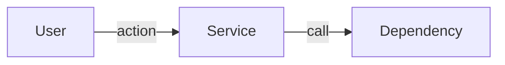
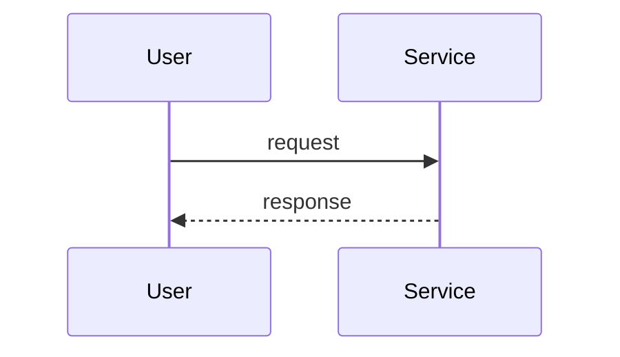

# PRD Templates

The 20-section problem-first scaffold (standard) and 10-section lean variant. Plus the HTML render template that mirrors prd.md.

## Standard scaffold (20 sections)

````markdown
# <Feature name>

## 1. Header
| Field | Value |
|---|---|
| Owner | @<handle> |
| Status | Draft |
| PRD type | Standard |
| Date created | YYYY-MM-DD |
| Last updated | YYYY-MM-DD |
| Linked design spec | <path or null> |
| Linked research | <path or null> |
| Decision-maker | @<handle> |
| Sign-off contacts | Legal: @<handle>, Security: @<handle>, Support: @<handle> |
| Linked plans | _(auto-populated by /plan)_ |

## 2. Terminologies
| Term | Definition |
|---|---|
| <term> | <one-line definition; link to deeper doc if needed> |

## 3. Problem & context
What's broken, who hurts, baseline data, why now (cost-of-inaction).

## 4. Target users / personas
| ID | Persona | Goals | Frictions today |
|---|---|---|---|
| P1 | <name> | <user-language goals> | <current pain> |

## 5. Architecture & flows

Optional. If this feature has non-trivial system topology, user flows, or
state machines, capture them here as Mermaid diagrams (preferred — render
in prd.html) or linked images alongside prd.md. Leave empty if all flows
are simple enough to describe in prose elsewhere.

### System overview


### Key flows


## 6. Goals & non-goals
### Goals
1. <goal 1>
2. <goal 2>
### Non-goals
- <explicitly NOT trying to do>

## 7. Success metrics
| Metric | Type | Target | Counter |
|---|---|---|---|
| <metric> | Leading / Lagging | <numeric threshold> | <counter-metric> |
**Dashboard plan:** <where will this be tracked>

## 8. User stories & scenarios

### Story <ID>: <name>
- **Type:** new | enhancement | existing
- **Existing behavior:** <path / link / one-line description, or "N/A">
  *(required when Type is enhancement or existing; "N/A" for new)*
- **Persona:** <P-id>
- **Goal:** <user-language goal>
- **Happy path:** <numbered steps>
- **Error / timeout / abandon paths:** <branches>
- **Edge cases:** <enumeration>
- **State transitions:** <if applicable>
- **Cross-functional handoffs:** <who/when downstream teams pulled in>
- **Acceptance criteria (Given/When/Then):**
  - Given <pre>, When <action>, Then <outcome>

#### Type semantics
- **new** — behavior does not exist in any form today (net-new feature)
- **enhancement** — modifies existing behavior in a user-visible way
- **existing** — already exists, documented for context (regression-risk surface in rewrites)

## 9. Functional requirements
Per-story or per-feature; uses Given/When/Then. May reference Section 8 stories.

## 10. Non-functional requirements
| NFR | Requirement |
|---|---|
| Performance | <budget> |
| Security | <auth model + threat model> |
| Accessibility | <WCAG level> |
| Privacy | <data classification + retention> |
| Telemetry / event taxonomy | <named events> |
| i18n / l10n | <RTL, encoding, formats, translation pipeline — or N/A> |

## 11. RBAC & permissions matrix
| Role | Can do |
|---|---|
| <role> | <permissions> |

## 12. Dependencies
Internal services, third parties, integration contracts.

## 13. Risks & mitigations
| # | Risk | Likelihood | Impact | Mitigation | Owner |
|---|---|---|---|---|---|
| R1 | <risk> | L/M/H | L/M/H | <mitigation> | @<handle> |

## 14. Assumptions
| # | Assumption | Status | If wrong |
|---|---|---|---|
| A1 | <assumption> | Validated / Unvalidated | <consequence> |

## 15. Rollout plan

### Milestones
| ID | Name | Outcome | Exit criteria | Depends on |
|---|---|---|---|---|
| M1 | <short user-language name> | <what ships, in user language> | <testable list — what facts must be true to declare done> | — |
| M2 | … | … | … | M1 |

### Rollout mechanics
- Flag plan: <feature flag>
- Canary: <staged rollout slices>
- Kill-switch: <criteria>
- Abort thresholds: <specific metric values>
- Data migration: <plan if touching existing data>
- Backward compatibility: <commitments>

## 16. Cost & resource impact
| Component | Cost dimension | Estimate |
|---|---|---|
| Build cost | Engineering time | <estimate> |
| Run cost | LLM / compute / storage / bandwidth | <$X/month at projected scale> |
| Counter-metric | <should not exceed $Y/user/month> | |

## 17. GTM & customer-comms
- Pricing / packaging implications: <description>
- In-app messaging plan: <description>
- Release notes: <description>
- CS / sales enablement: <description>
- Beta / early-access plan: <description or N/A>

## 18. Support / CX impact
- Day-1 ticket owner: @<handle>
- Runbook: <link or description>
- Escalation path: <description>
- Sales enablement: <description>
- Training plan: <description>

## 19. Open questions
| # | Question | Owner | Target resolution |
|---|---|---|---|

## 20. Out of scope / Non-goals
- <named item with one-line rationale>
````

## Lean variant (10 sections)

````markdown
# <Feature name>

## 1. Header
(Same Header table as standard)

## 2. Terminologies
| Term | Definition |
|---|---|
| <term> | <one-line definition; link to deeper doc if needed> |

## 3. Problem & context
What's broken, who hurts, baseline data, why now.

## 4. Target users / personas
| ID | Persona | Goals | Frictions today |

## 5. Architecture & flows

Optional. Same content guidance as standard scaffold's §5.


## 6. Goals & non-goals
### Goals
### Non-goals

## 7. Success metrics
| Metric | Type | Target | Counter |

## 8. Milestones
| ID | Name | Outcome | Exit criteria | Depends on |

## 9. Open questions

## 10. Out of scope / Non-goals

---

> **This is a lean PRD.** It intentionally omits the following standard sections:
> - Section 8 — User stories & scenarios
> - Section 9 — Functional requirements
> - Section 10 — Non-functional requirements
> - Section 11 — RBAC & permissions matrix
> - Section 12 — Dependencies
> - Section 13 — Risks & mitigations
> - Section 14 — Assumptions
> - Section 15 — Rollout plan (full — lean has its own §8 Milestones)
> - Section 16 — Cost & resource impact
> - Section 17 — GTM & customer-comms
> - Section 18 — Support / CX impact
>
> If scope grows or stakeholders need more detail, run `/prd` again — Shield
> will offer to add specific sections or upgrade to `standard`.
````

## Story template (used inside Section 8 of standard scaffold)

```markdown
### Story <ID>: <name>
- **Persona:** <P-id>
- **Goal:** <user-language goal>
- **Happy path:** <numbered steps>
- **Error / timeout / abandon paths:** <branches>
- **Edge cases:** <enumeration>
- **State transitions:** <if applicable>
- **Cross-functional handoffs:** <who/when downstream teams pulled in>
- **Acceptance criteria (Given/When/Then):**
  - Given <pre>, When <action>, Then <outcome>
```

## HTML render template

`prd.html` is produced by feeding `prd.md` through Shield's CommonMark renderer (`shield/scripts/render-markdown.sh`) into the HTML shell below. **Do not hand-render the body** — hand-rendering has historically broken nested numbered lists inside bullets, lists that immediately follow an emphasised paragraph, and loose/tight list spacing.

### Step 1 — Write the HTML shell next to `prd.md`

Write the file `prd.shell.html` in the same directory as `prd.md`. The shell contains the full document scaffold (DOCTYPE, head, CSS, mermaid script, body open, meta-banner, body close) with two literal placeholders: `{{TOC}}` (optional — replaced by an auto-generated Table of Contents built from h2/h3 headings) and `{{BODY}}` (mandatory — replaced by the rendered markdown body). Fill in `<title>`, the meta-banner content (owner, status, sidecar/research links), and any feature-specific metadata directly when writing the shell — those are not placeholders.

```html
<!DOCTYPE html>
<html lang="en">
<head>
  <meta charset="UTF-8" />
  <meta name="viewport" content="width=device-width, initial-scale=1.0" />
  <title>PRD — {feature name}</title>
  <meta name="sidecar" content="prd.meta.json" />
  <style>
    :root {
      --accent: #1a73e8;
      --bg: #ffffff;
      --panel: #f7f9fc;
      --text: #1f1f1f;
      --muted: #5a6370;
      --border: #e4e8ee;
    }
    * { box-sizing: border-box; }
    body {
      max-width: 960px;
      margin: 0 auto;
      padding: 48px 28px 96px;
      font-family: -apple-system, BlinkMacSystemFont, "Segoe UI", system-ui, sans-serif;
      line-height: 1.6;
      color: var(--text);
      background: var(--bg);
    }
    h1, h2, h3, h4 { color: var(--accent); line-height: 1.25; }
    h1 { font-size: 2rem; border-bottom: 2px solid var(--accent); padding-bottom: 8px; margin-bottom: 24px; }
    h2 { font-size: 1.45rem; margin-top: 40px; padding-top: 12px; border-top: 1px solid var(--border); }
    h3 { font-size: 1.15rem; margin-top: 28px; }
    h4 { font-size: 1rem; color: var(--text); margin-top: 20px; }
    p, ul, ol { margin: 12px 0; }
    li { margin: 4px 0; }
    table { border-collapse: collapse; width: 100%; margin: 16px 0; font-size: 0.94rem; }
    th, td { padding: 8px 12px; border: 1px solid var(--border); text-align: left; vertical-align: top; }
    th { background: var(--panel); font-weight: 600; }
    tr:nth-child(even) td { background: #fbfcfd; }
    blockquote { border-left: 3px solid var(--accent); margin: 16px 0; padding: 4px 16px; color: var(--muted); background: var(--panel); }
    code { background: #f1f3f6; padding: 2px 6px; border-radius: 3px; font-family: "JetBrains Mono", "SF Mono", Consolas, monospace; font-size: 0.9em; }
    pre { background: var(--panel); padding: 12px 16px; border-radius: 6px; overflow-x: auto; border: 1px solid var(--border); }
    pre code { background: transparent; padding: 0; }
    a { color: var(--accent); }
    a:hover { text-decoration: underline; }
    hr { border: none; border-top: 1px solid var(--border); margin: 32px 0; }
    .meta-banner {
      background: var(--panel);
      border: 1px solid var(--border);
      border-left: 3px solid var(--accent);
      padding: 12px 16px;
      border-radius: 6px;
      margin-bottom: 24px;
      font-size: 0.92rem;
      color: var(--muted);
    }
    .meta-banner strong { color: var(--text); }
    .toc {
      background: var(--panel);
      border: 1px solid var(--border);
      border-left: 3px solid var(--accent);
      border-radius: 6px;
      padding: 16px 20px;
      margin-bottom: 32px;
      font-size: 0.94rem;
    }
    .toc-title { font-weight: 600; color: var(--text); margin-bottom: 8px; }
    .toc ul { margin: 0; padding-left: 22px; }
    .toc > ul { list-style: decimal; }
    .toc ul ul { list-style: disc; margin-top: 4px; }
    .toc li { margin: 2px 0; }
    .toc a { color: var(--accent); text-decoration: none; }
    .toc a:hover { text-decoration: underline; }
    pre.mermaid { background: transparent; border: none; padding: 0; text-align: center; }
  </style>
  <script type="module">
    import mermaid from "https://cdn.jsdelivr.net/npm/mermaid@10/dist/mermaid.esm.min.mjs";
    mermaid.initialize({ startOnLoad: false, theme: "default" });
    document.addEventListener("DOMContentLoaded", () => {
      mermaid.run({ querySelector: "pre.mermaid" });
    });
  </script>
</head>
<body>
  <div class="meta-banner">
    <strong>PRD</strong> · {feature name} · {Standard|Lean} scaffold · Owner: @{owner} · Status: {status} · {YYYY-MM-DD}<br/>
    Sidecar: <a href="prd.meta.json">prd.meta.json</a>
    <!-- Append research/product-note links here if present -->
  </div>
{{TOC}}
{{BODY}}
</body>
</html>
```

### Step 2 — Render

Call the helper (it shells out to `uv run` and pulls `markdown-it-py` + `mdit-py-plugins` ephemerally — no global install needed):

```bash
"$CLAUDE_PLUGIN_ROOT/scripts/render-markdown.sh" \
  --md   "{output_dir}/{feature}/prd/{N}-{slug}/prd.md" \
  --shell "{output_dir}/{feature}/prd/{N}-{slug}/prd.shell.html" \
  --out  "{output_dir}/{feature}/prd/{N}-{slug}/prd.html"
```

After the helper writes `prd.html`, delete `prd.shell.html` — it is a build artifact, not part of the PRD record.

**Why this helper and not pandoc / inline conversion / python-markdown:** the helper uses `markdown-it-py`, which implements the CommonMark spec strictly. Three patterns common in PRDs require strict CommonMark handling: (a) numbered sub-lists nested inside bulleted parents at 2-space indent, (b) lists immediately following an emphasised paragraph without a blank-line separator, (c) consistent loose/tight `<li>` wrapping. Hand-rendering and `python-markdown`'s default extensions get all three wrong; pandoc is not always installed.
