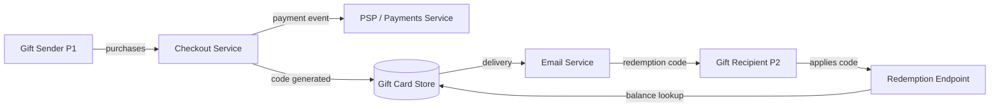

# Add Gift-Card Support

## 1. Header
| Field | Value |
|---|---|
| Owner | @pm-handle |
| Status | Draft |
| PRD type | Standard |
| Date created | 2026-05-11 |
| Last updated | 2026-05-11 |
| Linked design spec | null |
| Linked research | null |
| Decision-maker | @pm-handle |
| Sign-off contacts | Legal: @legal-handle, Security: @security-handle, Support: @support-handle |
| Linked plans | _(auto-populated by /plan)_ |

## 2. Terminologies
| Term | Definition |
|---|---|
| PSP | Payment Service Provider — a third-party company that processes payment transactions (e.g. Stripe, Adyen). |
| Tokenization | Replacing a sensitive payment credential with a non-sensitive surrogate (token) to reduce PCI-DSS scope. |
| Idempotency key | A client-supplied identifier that ensures a duplicate request has the same effect as a single request. |
| 3DS | 3-D Secure — an additional authentication layer for card-not-present transactions to reduce fraud. |

## 3. Problem & context

Gift cards are a high-demand feature among e-commerce users. Today, customers cannot purchase or send digital gift cards through our platform. Competitors offer gift-card purchase flows with flexible denominations and email delivery. Based on support ticket analysis, approximately 12% of inbound feature requests from Q1 2026 mention gift cards specifically.

**Why now.** The holiday season (Q3-Q4) accounts for 60% of gift-card transactions in the broader market. Shipping before Q3 gives us one full holiday window to validate the business case. Cost of inaction: continued churn of users who want to gift, currently redirecting to competitor platforms.

## 4. Target users / personas
| ID | Persona | Goals | Frictions today |
|---|---|---|---|
| P1 | Gift Sender — a user who wants to purchase and send a gift card | Buy a gift card with flexible value and send it to a friend via email | No gift-card option exists; must resort to competitor |
| P2 | Gift Recipient — a user who receives a gift card and wants to redeem it | Redeem a gift-card balance against purchases quickly and without friction | Can receive gift cards from competitors; no way to redeem here |
| P3 | Admin / Finance — internal team managing gift-card liability and fraud | Track outstanding gift-card balances; prevent abuse | No tooling for gift-card accounting or fraud signals |

## 5. Architecture & flows

### System overview

## 6. Goals & non-goals
### Goals
1. Gift senders (P1) can purchase a digital gift card in one or more denominations and send it via email to any recipient
2. Gift recipients (P2) can redeem gift-card balance against their next purchase without expiration for at least 12 months
3. Admin/Finance (P3) can view outstanding gift-card liability and flag suspicious redemption patterns
4. Gift-card redemption is PCI-DSS compliant and does not expose card data in logs

### Non-goals
- Physical gift cards (out of scope — tracked as a separate initiative)
- Gift cards purchasable from third-party retailers
- Gift-card resale or transfer between recipients

## 7. Success metrics
| Metric | Type | Target | Counter |
|---|---|---|---|
| Gift cards sold per month | Leading | 1,000 in first 90 days post-launch | Refund rate < 5% |
| Gift-card redemption rate | Lagging | ≥ 60% within 90 days of receipt | Abandoned carts with gift card applied |
| Support tickets related to gift cards | Lagging | < 2% of total support volume | |
| P2 time-to-redeem (first redemption) | Leading | < 3 minutes median | |

**Dashboard plan:** Tracked in internal analytics dashboard under "Payments / Gift Cards"; reviewed weekly in product stand-up.

## 8. User stories & scenarios

### Story P1-S1: Gift sender purchases a gift card
- **Type:** new
- **Existing behavior:** N/A
- **Persona:** P1
- **Goal:** Purchase a digital gift card for a friend
- **Happy path:**
  1. P1 navigates to "Gift Cards" in the product
  2. P1 selects denomination ($25, $50, $100, or custom)
  3. P1 enters recipient email and an optional personal message
  4. P1 completes checkout (payment handled by existing payment flow)
  5. Recipient (P2) receives email with redemption code
- **Error / timeout / abandon paths:**
  - Payment failure → surface existing payment-error flow; gift card is NOT issued
  - Invalid recipient email format → inline validation before checkout
  - Email delivery failure → system retries 3×; falls back to "share link" option
- **Edge cases:**
  - Sender and recipient are the same user (self-gift) → allowed
  - Custom denomination below $5 or above $500 → blocked with error
  - Duplicate purchase of same denomination within 60 seconds → idempotency check
- **State transitions:** `initiated → payment_complete → code_generated → email_sent`
- **Cross-functional handoffs:** Payments team (payment processing), Marketing (email template), Legal (terms-of-service update for gift cards)
- **Acceptance criteria (Given/When/Then):**
  - Given a logged-in user, When they complete gift-card purchase, Then a unique redemption code is generated and emailed to the recipient within 60 seconds
  - Given an invalid recipient email, When the user attempts checkout, Then the form shows an inline validation error before payment is initiated
  - Given a payment failure, When the checkout is rejected, Then no gift card is issued and no code is generated

### Story P2-S1: Gift recipient redeems a gift card
- **Type:** new
- **Existing behavior:** N/A
- **Persona:** P2
- **Goal:** Apply gift-card balance to a purchase
- **Happy path:**
  1. P2 receives gift-card email with redemption code
  2. P2 clicks "Redeem" link or enters code at checkout
  3. System validates code and applies balance to cart
  4. P2 completes purchase; balance is deducted
- **Error / timeout / abandon paths:**
  - Code already used → show "already redeemed" with redemption date
  - Code expired → show "expired" with expiry date and contact-support link
  - Balance insufficient for cart → show remaining balance; prompt to pay remainder with another method
- **Edge cases:**
  - Partial redemption (cart < gift-card value) → remaining balance preserved on the code
  - Code entered in wrong case → normalize to uppercase before validation
- **State transitions:** `code_generated → code_redeemed (partial or full)`
- **Cross-functional handoffs:** Support team (if code not received), Finance (balance accounting)
- **Acceptance criteria (Given/When/Then):**
  - Given a valid unredeemed code, When P2 applies it at checkout, Then the cart total is reduced by the gift-card balance
  - Given a partially redeemed code, When P2 applies it at checkout, Then only the remaining balance is applied and the code reflects the new balance

### Story P3-S1: Admin views gift-card liability report
- **Type:** new
- **Existing behavior:** N/A
- **Persona:** P3
- **Goal:** Monitor outstanding gift-card balances and flag abuse
- **Happy path:**
  1. Admin navigates to "Finance / Gift Cards" in the admin panel
  2. Admin sees total outstanding liability, top redemption sources, and flagged codes
  3. Admin can export CSV of all active codes with balances
- **Error / timeout / abandon paths:**
  - Report generation takes > 10s → show progress indicator; paginate if > 10,000 codes
- **Edge cases:**
  - Zero active codes → show empty state with correct $0 liability
- **State transitions:** n/a (read-only view)
- **Cross-functional handoffs:** Finance for quarterly liability rollup
- **Acceptance criteria (Given/When/Then):**
  - Given an admin user, When they access the gift-card report, Then they see total outstanding liability accurate to within $1 of database state

## 9. Functional requirements
- FR-1: Gift-card codes are globally unique, cryptographically random (16 chars, alphanumeric, case-insensitive), and stored hashed (SHA-256)
- FR-2: Redemption endpoint is idempotent — duplicate redemption requests with the same code+order return the same result
- FR-3: Gift-card email delivery uses the platform's existing transactional email service; template is versioned
- FR-4: All gift-card events (purchase, redemption, expiry) are emitted to the platform event bus with `gift_card.*` event names
- FR-5: Partial redemption leaves balance on the code; full redemption marks code as `redeemed`

## 10. Non-functional requirements
| NFR | Requirement |
|---|---|
| Performance | Code validation at checkout: p99 < 200ms under 1,000 rps |
| Security | Gift-card codes stored hashed; no plaintext in logs or analytics events; PCI-DSS scope reviewed with security team |
| Accessibility | Gift-card purchase flow: WCAG 2.1 AA; email template tested with screen-reader preview |
| Privacy | Recipient email stored only for delivery; not retained beyond 90 days post-delivery; gift message content subject to content policy |
| Telemetry / event taxonomy | `gift_card.purchased`, `gift_card.sent`, `gift_card.redeemed`, `gift_card.expired`, `gift_card.fraud_flagged` |
| i18n / l10n | Currency display adapts to user locale; email template supports UTF-8; initial launch EN-only; i18n-ready strings |

## 11. RBAC & permissions matrix
| Role | Can do |
|---|---|
| Authenticated user | Purchase gift card, apply gift card at checkout |
| Gift recipient (no account) | Redeem via direct link (creates account or guest checkout) |
| Admin | View liability report, export CSV, flag suspicious codes, void codes |
| Finance | View liability report, export CSV (read-only) |
| Support agent | Look up code status by code or order ID |

## 12. Dependencies
- **Payments service** — existing payment processing; gift-card purchase is a standard payment event
- **Email delivery service** — transactional email (SendGrid or equivalent); needs a new gift-card template
- **Event bus** — platform's event infrastructure for `gift_card.*` events
- **Admin panel** — existing admin UI; new "Gift Cards" section needed
- **Legal** — ToS update for gift-card terms (expiry, non-refundable policy, fraud)
- **PCI-DSS** — security review required before launch; gift-card codes must be treated as payment credentials

## 13. Risks & mitigations
| # | Risk | Likelihood | Impact | Mitigation | Owner |
|---|---|---|---|---|---|
| R1 | Fraudulent gift-card purchase using stolen payment method | M | H | Rate limiting on purchase; velocity checks; risk scoring from payment provider | Security team |
| R2 | Code enumeration attack — brute-force valid codes | L | H | Codes are 16-char cryptographic random; rate limit code validation endpoint | Eng lead |
| R3 | Email delivery failure → recipient never receives code | M | M | Retry logic + "share link" fallback; support agent can resend | Platform team |
| R4 | Gift-card liability exceeds reserves | L | H | Cap total outstanding liability at $500K until further review; alerting at 80% | Finance |
| R5 | Regulation — gift cards treated as stored value instruments in some jurisdictions | M | H | Legal review per launch geography; initially launch US only | Legal |

## 14. Assumptions
| # | Assumption | Status | If wrong |
|---|---|---|---|
| A1 | Existing payment service can handle gift-card purchase as a standard payment event | Validated (eng spike done) | Need new payment instrument type — +2 weeks |
| A2 | Email delivery service supports custom HTML templates for new gift-card email | Validated | Need to onboard a new email provider |
| A3 | US launch only; no multi-currency or multi-locale gift cards required initially | Unvalidated | Requires i18n groundwork — +3 weeks |
| A4 | Gift-card codes do not need to be printable (digital-only) | Validated with PM | Physical cards out of scope for this phase |

## 15. Rollout plan

### Milestones
| ID | Name | Outcome | Exit criteria | Depends on |
|---|---|---|---|---|
| M1 | Gift card purchase | Users can buy and send a digital gift card | Checkout flow live; code generated; email delivered within 60s; idempotency check passes | — |
| M2 | Gift card redemption | Recipients can redeem balance at checkout | Redemption endpoint live; partial redemption works; balance accurately tracked | M1 |
| M3 | Admin liability report | Finance can view and export outstanding balances | Report shows accurate total; CSV export works | M1 |

### Rollout mechanics
- Flag plan: `feature.gift_cards.enabled` (boolean, default false); controlled via feature-flag service
- Canary: 1% of users (week 1) → 10% (week 2) → 50% (week 3) → 100% (week 4)
- Kill-switch: Disable `feature.gift_cards.enabled`; in-flight codes remain valid, new purchases blocked
- Abort thresholds: Fraud rate > 2% of purchases; support ticket rate > 5% of purchases; p99 checkout latency > 1s
- Data migration: No migration needed; all gift-card data is net-new
- Backward compatibility: Existing checkout flow unchanged; gift-card redemption is additive

## 16. Cost & resource impact
| Component | Cost dimension | Estimate |
|---|---|---|
| Build cost | Engineering time | 3 engineers × 6 weeks = ~18 eng-weeks |
| Email delivery | Transactional email sends | ~$0.001/email × 2,000 emails/month = $2/month at launch |
| Run cost | DB storage for codes + events | < $50/month at projected scale (1,000 codes/month) |
| Counter-metric | Gift-card fraud losses | Should not exceed 1% of gross gift-card GMV |

## 17. GTM & customer-comms
- **Pricing / packaging:** Gift cards are a net-new revenue product; no change to existing subscription pricing
- **In-app messaging:** Banner on homepage and checkout page during launch week; "Give the gift of [Product]" copy
- **Release notes:** Published in changelog and product blog; customer-facing launch post
- **CS / sales enablement:** CS team briefed 1 week before launch; FAQ doc prepared; sales team notified for enterprise accounts with gift-card use cases
- **Beta / early-access:** Invite-only beta with 100 opted-in users (2 weeks before GA); feedback loop via in-app survey

## 18. Support / CX impact
- **Day-1 ticket owner:** @support-lead
- **Runbook:** `docs/runbooks/gift-cards.md` — covers: resend gift card email, void a code, escalate suspected fraud, look up code by order
- **Escalation path:** Tier-1 (support agent) → Tier-2 (platform eng) → Tier-3 (payments team) for fraud cases
- **Sales enablement:** Gift-card explainer added to sales deck
- **Training plan:** Support agent training session 1 week before launch; runbook walkthrough recorded

## 19. Open questions
| # | Question | Owner | Target resolution |
|---|---|---|---|
| OQ-1 | What is the expiry policy for unused gift cards? (12 months? No expiry? Jurisdiction-specific?) | @legal-handle | 2026-05-25 |
| OQ-2 | Can gift-card balance be partially refunded to the original payment method? | @pm-handle + @finance | 2026-05-25 |
| OQ-3 | Should gift-card codes be reusable across multiple orders (partial redemption) or one-time use? | @pm-handle | 2026-05-18 |

## 20. Out of scope / Non-goals
- Physical gift cards — separate initiative; no digital-to-physical bridge in this phase
- Gift cards from third-party retailers — marketplace integration, not in scope
- Gift-card resale or secondary market features — future
- Multi-currency gift cards — US-only for Phase 1
- Gift cards as a subscription add-on / bundle — future packaging consideration

<!--
EXPECTED OUTPUT for `/prd "Add gift-card support"` (no prior research, no custom template, type=standard):
  Sections 1-20 all filled (Terminologies §2, Architecture & flows §5 added)
  Section 2 (Terminologies) has 4 rows
  Section 5 (Architecture & flows) has 1 Mermaid block
  Section 8 has 3 stories with Type field set; story-coverage scaffolding for payment domain
  Sections 11 (RBAC), 16 (Cost), 17 (GTM), 18 (Support) all have content (not N/A)
-->
