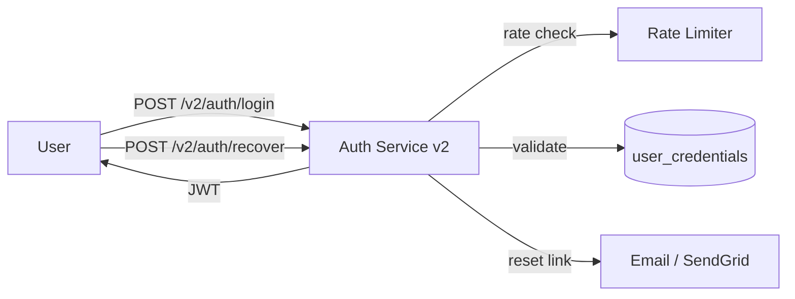

# User Authentication v2 (Lean)

## 1. Header
| Field | Value |
|---|---|
| Owner | @anika.dev |
| Status | Draft |
| PRD type | Lean |
| Date created | 2026-05-13 |
| Last updated | 2026-05-13 |
| Linked design spec | null |
| Linked research | null |
| Decision-maker | @eng-lead |
| Sign-off contacts | Security: @sec-review |
| Linked plans | _(auto-populated by /plan)_ |

## 2. Terminologies
| Term | Definition |
|---|---|
| JWT | JSON Web Token — a compact, self-contained token used to transmit authentication state between client and server. |
| Credential stuffing | An automated attack using leaked username/password pairs from other breaches against this service. |
| Rate limiting | Restricting requests per time window per client; used here to block brute-force login attempts. |

## 3. Problem & context
The legacy `/auth/login` endpoint has no rate limiting and no self-serve password reset. This has caused 3 credential-stuffing incidents in 90 days and ~200 support tickets/week from locked-out users.

## 4. Target users / personas
| ID | Persona | Goals | Frictions today |
|---|---|---|---|
| P1 | Anika — security-conscious user | Sign in quickly; recover access without support | Session drops; no self-serve reset |

## 5. Architecture & flows

## 6. Goals & non-goals
### Goals
1. Replace the legacy login endpoint with a rate-limited v2 endpoint.
2. Provide a self-serve email-based password-reset flow.

### Non-goals
- SSO / SAML, OAuth social login, MFA — separate workstreams.

## 7. Success metrics
| Metric | Type | Target | Counter |
|---|---|---|---|
| "Locked out" support tickets | Lagging | < 50/week within 4 weeks of GA | — |
| Login success rate | Leading | ≥ 98% of valid-credential attempts | Login error rate |

## 8. Milestones
| ID | Name | Outcome | Exit criteria | Depends on |
|---|---|---|---|---|
| M1 | Login core | Users can log in with email + password | Login endpoint returns 200 + JWT session token on valid credentials; 401 on invalid; 11th login attempt within 60s from the same IP returns 429 with Retry-After header; failed-login telemetry emitted | — |
| M2 | Password recovery | Users can reset a forgotten password without contacting support | Recovery email delivered within 60s; reset link single-use and 15-min TTL; password-reset telemetry emitted | M1 |

## 9. Open questions
| # | Question | Owner | Target resolution |
|---|---|---|---|
| OQ-1 | Rate limiting per-IP, per-account, or both? | @sec-review | 2026-05-20 |

## 10. Out of scope / Non-goals
- SSO / SAML integration.
- OAuth social login.
- MFA / 2FA.

---

> **This is a lean PRD.** It intentionally omits the following standard sections:
> - Section 8 — User stories & scenarios
> - Section 9 — Functional requirements
> - Section 10 — Non-functional requirements
> - Section 11 — RBAC & permissions matrix
> - Section 12 — Dependencies
> - Section 13 — Risks & mitigations
> - Section 14 — Assumptions
> - Section 15 — Rollout plan (rollout mechanics; lean keeps only the Milestones half as §8)
> - Section 16 — Cost & resource impact
> - Section 17 — GTM & customer-comms
> - Section 18 — Support / CX impact
>
> If scope grows or stakeholders need more detail, run `/prd` again — Shield
> will offer to add specific sections or upgrade to `standard`.
