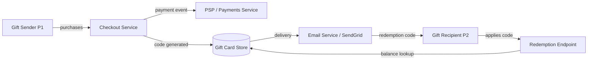

# Add Gift-Card Support

## 1. Header
| Field | Value |
|---|---|
| Owner | @pm-handle |
| Status | Draft |
| PRD type | Standard |
| Date created | 2026-05-11 |
| Last updated | 2026-05-11 |
| Linked design spec | null |
| Linked research | research/1-gift-card-research/findings.md |
| Decision-maker | @pm-handle |
| Sign-off contacts | Legal: @legal-handle, Security: @security-handle, Support: @support-handle |
| Linked plans | _(auto-populated by /plan)_ |

## 2. Terminologies
| Term | Definition |
|---|---|
| ICP | Ideal Customer Profile — the company size and shape we win at most. |
| PLG | Product-led growth — self-serve activation without a sales call. |
| PCI-DSS | Payment Card Industry Data Security Standard — compliance framework governing storage and handling of payment credentials. |
| Idempotency key | A client-supplied identifier ensuring a duplicate request (e.g. double-click on purchase) has the same effect as a single request. |
| Partial redemption | Applying only part of a gift-card balance to an order; the remainder stays on the code for future use. |

## 3. Problem & context
<!-- pre-populated from research -->

Digital gift cards are a table-stakes e-commerce feature. We are losing gifting occasions (holiday, birthdays, milestones) to competitors who have had digital gift cards for years. About 12% of inbound support and feature requests from Q1 2026 mention gift cards specifically. The biggest pain point is losing gift-driven purchase occasions to competitors.

**Why now.** The holiday season (Q3-Q4) accounts for 60% of gift-card transactions in the broader market. Shipping before Q3 gives us one full holiday window to validate the business case. Cost of inaction: continued churn of users who want to gift, currently redirecting to competitor platforms.

## 4. Target users / personas
<!-- pre-populated from research -->

| ID | Persona | Goals | Frictions today |
|---|---|---|---|
| P1 | Gift Sender — existing customer | Purchase and send a digital gift card via email to a friend or family member | No gift-card option; must go to competitor |
| P2 | Gift Recipient — may be new to platform | Redeem gift card balance against a purchase quickly and without friction | Can receive gift cards from competitors; no way to redeem here |
| P3 | Admin / Finance — internal | Track outstanding gift-card liability; flag fraudulent redemptions | No tooling for gift-card accounting or fraud signals |

## 5. Architecture & flows

### System overview

## 6. Goals & non-goals
### Goals
1. Gift senders (P1) can purchase a digital gift card in one or more denominations and send it via email to any recipient
2. Gift recipients (P2) can redeem gift-card balance against their next purchase without expiration for at least 12 months
3. Admin/Finance (P3) can view outstanding gift-card liability and flag suspicious redemption patterns
4. Gift-card redemption is PCI-DSS compliant and does not expose card data in logs

### Non-goals
- Physical gift cards (out of scope — tracked as a separate initiative)
- Gift cards purchasable from third-party retailers
- Gift-card resale or transfer between recipients
- Multi-jurisdiction launch (US-only for Phase 1)

## 7. Success metrics
| Metric | Type | Target | Counter |
|---|---|---|---|
| Gift cards sold per month | Leading | 1,000 in first 90 days post-launch | Refund rate < 5% |
| Gift-card redemption rate | Lagging | ≥ 60% within 90 days of receipt | Abandoned carts with gift card applied |
| Support tickets related to gift cards | Lagging | < 2% of total support volume | |
| Fraud loss rate | Lagging | < 1% of gross gift-card GMV | |

**Dashboard plan:** Tracked in internal analytics dashboard under "Payments / Gift Cards"; reviewed weekly in product stand-up.

## 8. User stories & scenarios

### Story P1-S1: Gift sender purchases a gift card
- **Type:** new
- **Existing behavior:** N/A
- **Persona:** P1
- **Goal:** Purchase a digital gift card for a friend
- **Happy path:**
  1. P1 navigates to "Gift Cards" in the product
  2. P1 selects denomination ($25, $50, $100, or custom)
  3. P1 enters recipient email and an optional personal message
  4. P1 completes checkout (payment handled by existing payment flow)
  5. Recipient (P2) receives email with redemption code
- **Error / timeout / abandon paths:**
  - Payment failure → surface existing payment-error flow; gift card is NOT issued
  - Invalid recipient email → inline validation before checkout
  - Email delivery failure → system retries 3×; falls back to "share link" option
- **Edge cases:**
  - Sender and recipient are same user (self-gift) → allowed
  - Custom denomination below $5 or above $500 → blocked with error
  - Duplicate purchase within 60 seconds → idempotency check
- **State transitions:** `initiated → payment_complete → code_generated → email_sent`
- **Cross-functional handoffs:** Payments team, Marketing (email template), Legal (ToS update)
- **Acceptance criteria (Given/When/Then):**
  - Given a logged-in user, When they complete gift-card purchase, Then a unique redemption code is emailed to the recipient within 60 seconds
  - Given a payment failure, When the checkout is rejected, Then no gift card is issued

### Story P2-S1: Gift recipient redeems a gift card
- **Type:** new
- **Existing behavior:** N/A
- **Persona:** P2
- **Goal:** Apply gift-card balance to a purchase
- **Happy path:**
  1. P2 receives gift-card email with redemption code
  2. P2 clicks "Redeem" link or enters code at checkout
  3. System validates code and applies balance to cart
  4. P2 completes purchase; balance is deducted
- **Error / timeout / abandon paths:**
  - Code already used → show "already redeemed" with redemption date
  - Code expired → show "expired" with expiry date
  - Balance insufficient for cart → show remaining balance; prompt for additional payment
- **Edge cases:**
  - Partial redemption → remaining balance preserved on the code
  - Code entered in wrong case → normalize to uppercase before validation
- **State transitions:** `code_generated → code_redeemed (partial or full)`
- **Cross-functional handoffs:** Support team, Finance (balance accounting)
- **Acceptance criteria (Given/When/Then):**
  - Given a valid unredeemed code, When P2 applies it at checkout, Then the cart total is reduced by the gift-card balance
  - Given a partially redeemed code, When applied again, Then only remaining balance is applied

### Story P3-S1: Admin views gift-card liability report
- **Type:** new
- **Existing behavior:** N/A
- **Persona:** P3
- **Goal:** Monitor outstanding gift-card balances and flag abuse
- **Happy path:**
  1. Admin navigates to "Finance / Gift Cards" in admin panel
  2. Admin sees total outstanding liability, top redemption sources, and flagged codes
  3. Admin can export CSV of all active codes with balances
- **Error / timeout / abandon paths:**
  - Report > 10s → progress indicator; paginate if > 10,000 codes
- **Acceptance criteria (Given/When/Then):**
  - Given an admin user, When they access the gift-card report, Then they see total outstanding liability accurate to within $1 of database state

## 9. Functional requirements
- FR-1: Gift-card codes are globally unique, cryptographically random (16 chars, alphanumeric, case-insensitive), stored hashed (SHA-256)
- FR-2: Redemption endpoint is idempotent — duplicate requests return the same result
- FR-3: Gift-card email uses existing transactional email service with versioned template
- FR-4: All gift-card events emitted to event bus with `gift_card.*` namespace
- FR-5: Partial redemption preserves remaining balance; full redemption marks code as `redeemed`

## 10. Non-functional requirements
| NFR | Requirement |
|---|---|
| Performance | Code validation at checkout: p99 < 200ms under 1,000 rps |
| Security | Codes stored hashed; no plaintext in logs or analytics events; PCI-DSS scope reviewed |
| Accessibility | Purchase flow: WCAG 2.1 AA; email template tested with screen-reader preview |
| Privacy | Recipient email retained ≤ 90 days post-delivery; gift message subject to content policy |
| Telemetry / event taxonomy | `gift_card.purchased`, `gift_card.sent`, `gift_card.redeemed`, `gift_card.expired`, `gift_card.fraud_flagged` |
| i18n / l10n | Currency display adapts to locale; email UTF-8; initial launch EN/US only |

## 11. RBAC & permissions matrix
| Role | Can do |
|---|---|
| Authenticated user | Purchase gift card, apply gift card at checkout |
| Gift recipient (no account) | Redeem via direct link |
| Admin | View liability report, export CSV, flag/void codes |
| Finance | View liability report, export CSV (read-only) |
| Support agent | Look up code status by code or order ID |

## 12. Dependencies
<!-- pre-populated from research -->

- **Payments service** — existing; gift-card purchase is a standard payment event (spike confirmed compatible)
- **Email delivery service (SendGrid)** — existing; supports custom HTML templates (validated); new gift-card template needed
- **Event bus** — existing platform event infrastructure for `gift_card.*` events
- **Admin panel** — existing admin UI; new "Gift Cards" section required
- **Legal** — ToS update for gift-card terms (expiry, non-refundable policy, fraud)
- **PCI-DSS** — security review required; gift-card codes treated as payment credentials (codes stored hashed, no plaintext in logs, rate-limited validation)

## 13. Risks & mitigations
| # | Risk | Likelihood | Impact | Mitigation | Owner |
|---|---|---|---|---|---|
| R1 | Fraudulent gift-card purchase using stolen payment method | M | H | Rate limiting; velocity checks; payment provider risk scoring | Security |
| R2 | Code enumeration attack | L | H | 16-char cryptographic random codes; rate-limit code validation | Eng lead |
| R3 | Email delivery failure | M | M | Retry 3×; share-link fallback; support agent resend | Platform |
| R4 | Gift-card liability exceeds reserves | L | H | Cap total outstanding at $500K; alert at 80% | Finance |
| R5 | Regulatory stored-value classification | M | H | Legal review; US-only initial launch | Legal |

## 14. Assumptions
| # | Assumption | Status | If wrong |
|---|---|---|---|
| A1 | Existing payment service handles gift-card purchase as standard payment event | Validated (spike) | New payment instrument type — +2 weeks |
| A2 | SendGrid supports new HTML template for gift-card email | Validated | New email provider onboarding needed |
| A3 | US-only launch; no multi-currency required initially | Unvalidated | i18n groundwork — +3 weeks |
| A4 | Digital-only gift cards (no print/physical) | Validated with PM | Physical cards out of scope |

## 15. Rollout plan

### Milestones
| ID | Name | Outcome | Exit criteria | Depends on |
|---|---|---|---|---|
| M1 | Gift card purchase | Users can buy and send a digital gift card | Checkout live; code generated; email delivered within 60s | — |
| M2 | Gift card redemption | Recipients can redeem balance at checkout | Redemption endpoint live; partial redemption works | M1 |
| M3 | Admin liability report | Finance can view and export outstanding balances | Report shows accurate total; CSV export works | M1 |

### Rollout mechanics
- Flag plan: `feature.gift_cards.enabled` (boolean, default false)
- Canary: 1% (week 1) → 10% (week 2) → 50% (week 3) → 100% (week 4)
- Kill-switch: Disable flag; in-flight codes remain valid, new purchases blocked
- Abort thresholds: Fraud rate > 2%; support ticket rate > 5%; p99 checkout latency > 1s
- Data migration: No migration needed — net-new data
- Backward compatibility: Existing checkout flow unchanged; gift card is additive

## 16. Cost & resource impact
| Component | Cost dimension | Estimate |
|---|---|---|
| Build cost | Engineering time | 3 engineers × 6 weeks = ~18 eng-weeks |
| Email delivery | Transactional email sends | ~$2/month at launch volume |
| Run cost | DB storage for codes + events | < $50/month at projected scale |
| Counter-metric | Gift-card fraud losses | Should not exceed 1% of gross gift-card GMV |

## 17. GTM & customer-comms
- **Pricing / packaging:** Net-new revenue product; no change to existing subscription pricing
- **In-app messaging:** Banner on homepage and checkout during launch week
- **Release notes:** Changelog and product blog launch post
- **CS / sales enablement:** CS team briefed 1 week before launch; FAQ doc prepared
- **Beta / early-access:** Invite-only beta with 100 opted-in users 2 weeks before GA

## 18. Support / CX impact
- **Day-1 ticket owner:** @support-lead
- **Runbook:** `docs/runbooks/gift-cards.md` — resend email, void code, escalate fraud
- **Escalation path:** Tier-1 (support) → Tier-2 (platform eng) → Tier-3 (payments) for fraud
- **Sales enablement:** Gift-card explainer in sales deck
- **Training plan:** Support agent session 1 week before launch; runbook walkthrough recorded

## 19. Open questions
| # | Question | Owner | Target resolution |
|---|---|---|---|
| OQ-1 | What is the expiry policy for unused gift cards? | @legal-handle | 2026-05-25 |
| OQ-2 | Can gift-card balance be partially refunded to original payment method? | @pm-handle + @finance | 2026-05-25 |
| OQ-3 | Single-use or partial-redemption codes? | @pm-handle | 2026-05-18 |

## 20. Out of scope / Non-goals
- Physical gift cards — separate initiative
- Third-party retailer gift cards — marketplace integration, not in scope
- Gift-card resale or secondary market — future
- Multi-currency / multi-jurisdiction — US Phase 1 only

<!--
EXPECTED OUTPUT for `/prd "Add gift-card support"` (with research transcript pre-populating):
  Sections 3, 4, and 12 are marked with `<!-- pre-populated from research -->` comments
  Section 2 (Terminologies) shows research-glossary rows first (ICP, PLG), then LLM-scanned terms
  Research-sourced data is accurate to the transcript (personas, constraints, PCI-DSS note)
  Sections 8+ are user-completed (not pre-populated)
  prd.meta.json.linked_research = "research/1-gift-card-research/findings.md"
-->
